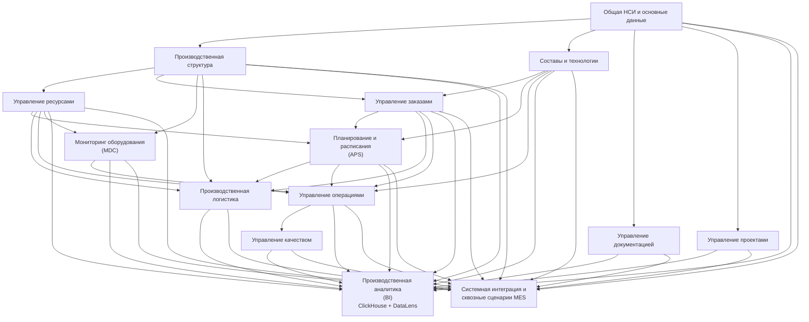

Конечно, дружище. Я бы немного уточнил связи, чтобы граф отражал не только разработку отдельных модулей, но и **сквозную интеграцию и аналитический контур**.

Особенно важно, что **BI получает данные практически от всех производственных подсистем**, а «Системная интеграция и сквозные сценарии MES» должна проверять работу MES как единого решения, а не быть обычной зависимостью одного модуля.

### 1. Обновлённый граф функциональных зависимостей



### 2. Как я предлагаю читать этот граф

Здесь есть три разных типа зависимостей.

**Первый уровень — функциональные зависимости:**

> НСИ → Производственная структура → Ресурсы → Операции

и

> НСИ → Составы и технологии → Операции

Это реальные зависимости реализации.

**Второй уровень — APS.**

APS зависит от нескольких доменов одновременно:

> **Производственная структура + Ресурсы + Составы и технологии + Заказы → APS**

Но, как мы договорились ранее, это **не означает последовательную разработку**. APS начинает проектироваться и реализовываться уже после появления минимально необходимых контрактов.

**Третий уровень — интеграционный и аналитический.**

Практически все функциональные модули:

> **→ BI**

и:

> **→ Системная интеграция и сквозные сценарии MES**

При этом я бы не интерпретировал эти стрелки как требование «сначала закончить все модули, потом начать BI/интеграцию».

Например, для BI можно заранее создавать **событийную модель, контракты аналитических данных и ClickHouse-витрины** по мере появления функциональности.

А системную интеграцию тоже можно начинать постепенно, строя сквозные сценарии по мере готовности доменов.

---

### 3. Что особенно важно для нашего календарного плана

Из этого графа получается очень полезный вывод:

**критический путь нельзя определять простой последовательностью модулей.**

Нужно вести минимум три параллельных потока:

```text
Поток 1 — Основной MES
НСИ → Структура → Ресурсы/Технологии → Заказы
                         ↓
                    Операции/Логистика
                         ↓
                      Качество


Поток 2 — APS
НСИ/Структура
      ↓
Ресурсы + Технологии
      ↓
APS ───────────────────────────────→


Поток 3 — Интеграция
События / API / контракты
      ↓
Сквозные сценарии
      ↓
Интеграционное тестирование
```

Именно поэтому предложенная ранее дата начала APS **01.02.2027** выглядит обоснованной: ждать завершения всей цепочки MES до начала APS было бы слишком дорого по времени.

А **«Системная интеграция и сквозные сценарии MES»** я бы оставил отдельным финальным этапом в календарном плане, но начинал бы подготовительные работы значительно раньше — иначе последние два месяца могут превратиться в интеграционный «пожар».
