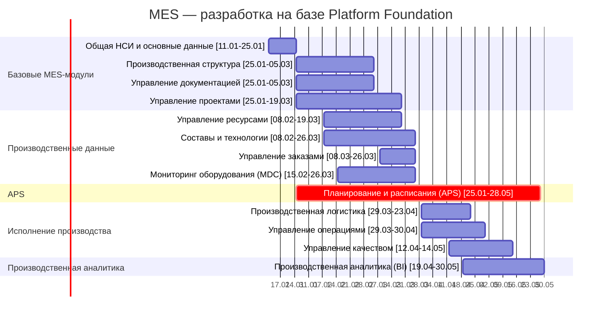

|  № | Модуль                              | Дата начала    | Дата завершения | Ключевые зависимости                                    |
| -: | ----------------------------------- | -------------- | --------------- | ------------------------------------------------------- |
|  1 | **Общая НСИ и основные данные**     | **11.01.2027** | **25.01.2027**  | Platform Foundation                                     |
|  2 | **Производственная структура**      | **25.01.2027** | **05.03.2027**  | Общая НСИ                                               |
|  3 | **Управление ресурсами**            | **08.02.2027** | **19.03.2027**  | НСИ, Производственная структура                         |
|  4 | **Составы и технологии**            | **08.02.2027** | **26.03.2027**  | НСИ                                                     |
|  5 | **Управление документацией**        | **25.01.2027** | **05.03.2027**  | НСИ                                                     |
|  6 | **Управление проектами**            | **25.01.2027** | **19.03.2027**  | НСИ                                                     |
|  7 | **Управление заказами**             | **08.03.2027** | **26.03.2027**  | Производственная структура, Составы и технологии        |
|  8 | **Планирование и расписания (APS)** | **25.01.2027** | **28.05.2027**  | Базовые контракты НСИ, структуры, ресурсов и технологий |
|  9 | **Мониторинг оборудования (MDC)**   | **15.02.2027** | **26.03.2027**  | Производственная структура, Ресурсы                     |
| 10 | **Производственная логистика**      | **29.03.2027** | **23.04.2027**  | Структура, Ресурсы, Заказы                              |
| 11 | **Управление операциями**           | **29.03.2027** | **30.04.2027**  | Технологии, Ресурсы, Заказы                             |
| 12 | **Управление качеством**            | **12.04.2027** | **14.05.2027**  | Технологии, Операции                                    |
| 13 | **Производственная аналитика (BI)** | **19.04.2027** | **30.05.2027**  | Данные MES, MDC, Заказы, Операции                       |

