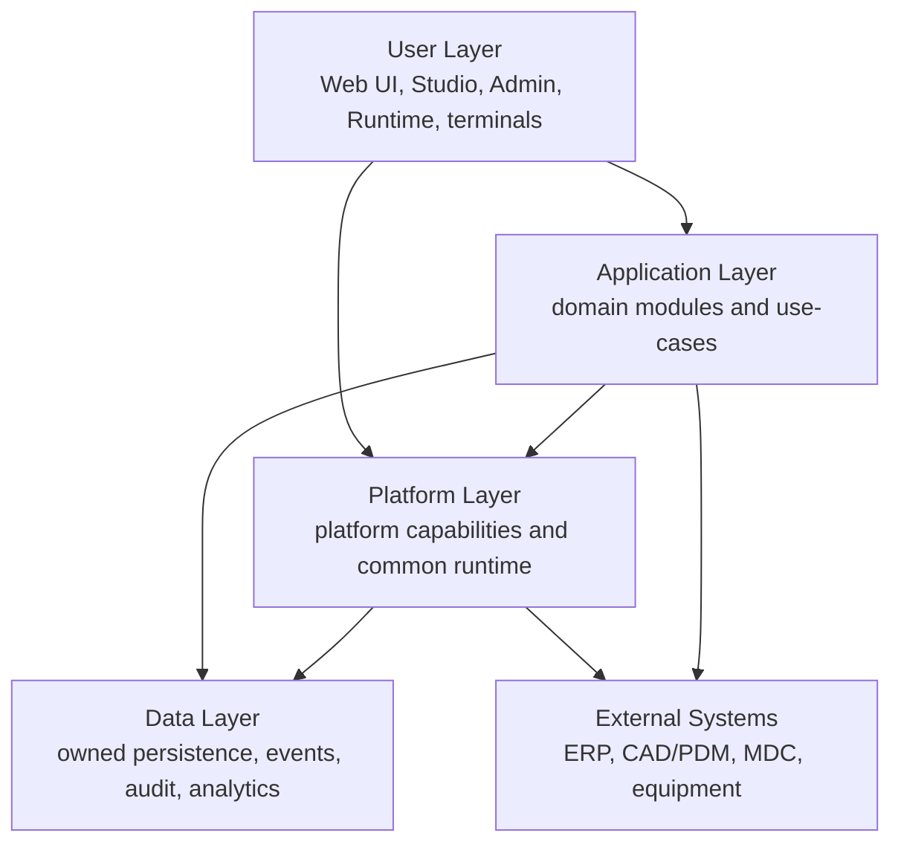

# Логическая архитектура DMP

## 1. Назначение

Документ описывает логические слои DMP и границы ответственности между ними. Он не фиксирует физическое развёртывание и не заменяет сервисную архитектуру.

## 2. Логические слои

## 3. User Layer

User Layer включает пользовательские приложения, рабочие терминалы и frontend-представления.

Верхний слой фиксирует только наличие пользовательского слоя. Общие frontend-механизмы, shell, bootstrap, shared packages и runtime contracts принадлежат `03_platform/12_frontend_platform`. UI конкретного прикладного модуля описывается в документах этого модуля.

## 4. Application Layer

Application Layer содержит прикладные use-cases и предметную бизнес-логику производственных областей.

Прикладной модуль:

- владеет своими domain entities и operational data;
- использует Platform Core через контракты;
- не реализует собственный альтернативный workflow/rules/object runtime/security механизм;
- описывает свои предметные ограничения в `04_domain_modules`.

## 5. Platform Layer

Platform Layer содержит общие платформенные области:

- Foundation;
- Tenant and Security;
- Configuration;
- Object Runtime;
- Workflow;
- Rules;
- Value Sets;
- Settings;
- Numbering;
- Audit History;
- Integration Events;
- Reporting and Output;
- Frontend Platform.
- Content Storage.

Каждая платформенная область документируется в `03_platform/<area>` по единому шаблону.

## 6. Data Layer

Data Layer включает хранилища данных областей, event/outbox storage, audit/history storage и analytical storage. Данные разделяются по владельцам и области действия.

Детальные правила описаны в [архитектуре данных](05_data_architecture.md).

## 7. External Systems

Внешние контуры не входят в DMP, но являются частью системного ландшафта. Интеграции с ними описываются через контракты и сценарии обмена.

Сквозная карта взаимодействий находится в [интеграционной архитектуре](07_integration_architecture.md).

## История изменений

| Версия | Дата и время | Автор | Раздел | Изменение | Коммит/PR |
|---|---|---|---|---|---|
| 1.0 | 2026-09-03 14:49 +03:00 | Олег Юрьев (@axelprosoft) | YAML-шапка: review_status, status | Утверждение после merge PR #61: изменения в проектной документации ядра - новый модуль работы с файлами | [PR #61](https://github.com/axelprosoft/DMP.PlatformFoundation/pull/61) |
| 0.2 | 2026-09-03 13:00 +03:00 | Олег Юрьев (@axelprosoft) | Platform Layer | изменения в проектной документации ядра. основание - новый модуль по хранению и работе с файлами | [0f415f89](https://github.com/axelprosoft/DMP.PlatformFoundation/commit/0f415f89b977fa123e52411717a66f94c2d327a3) |
| 0.1 | 2026-08-27 16:54 +03:00 | Олег Юрьев (@axelprosoft) | Создание документа | docs-new: выровнять ID документов по структуре | [662557dd](https://github.com/axelprosoft/DMP.PlatformFoundation/commit/662557dde131463f26ae995734181bc295e22a34) |
