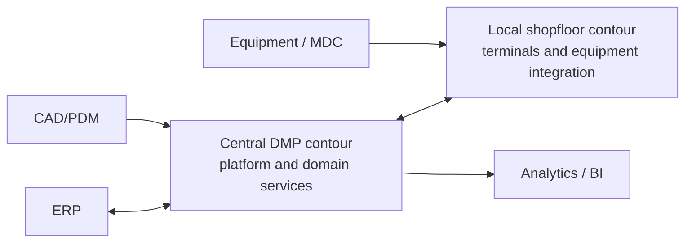

# Deployment-архитектура DMP

## 1. Назначение

Документ фиксирует верхнеуровневый подход к развёртыванию DMP. Он не заменяет эксплуатационные runbook, инфраструктурные схемы окружений и инструкции по конкретным сервисам.

## 2. Целевая модель

DMP должна поддерживать гибридную модель:

- центральный контур платформы для общих сервисов, конфигурации, интеграций, управления и аналитики;
- локальный производственный контур для shopfloor-сценариев, оборудования и контуров, где требуется работа рядом с производством;
- интеграционные каналы между центральным и локальным контурами.

## 3. Логическая схема

## 4. Центральный контур

Центральный контур отвечает за:

- общие platform capabilities;
- основную host-композицию DMP;
- управление конфигурацией и публикацией;
- интеграции с ERP/CAD/PDM и внешними системами;
- хранение и обработку данных, которые принадлежат центральному уровню;
- отчётность и аналитику, если они развернуты в центральном контуре.

## 5. Локальный производственный контур

Локальный контур нужен для сценариев, которые должны выполняться рядом с производственной площадкой:

- рабочие терминалы;
- взаимодействие с оборудованием;
- сбор телеметрии и статусов;
- локальные сценарии shopfloor execution;
- буферизация или адаптация интеграции с оборудованием, если она требуется целевой архитектурой.

Подробная граница локального контура должна уточняться в эксплуатационной и интеграционной документации.

## 6. MVP-ограничения

На уровне MVP документ фиксирует целевое направление, а не полный промышленный deployment blueprint. Для каждого компонента нужно отдельно подтвердить:

- фактический host и окружение;
- persistence provider;
- требования к отказоустойчивости;
- требования к observability;
- порядок миграций и восстановления;
- сетевые и security constraints.

Эти сведения принадлежат `03_platform/*/08_operations.md` и инфраструктурным
материалам; сквозной `07_operations` создаётся только при появлении общего
operations policy или platform-wide runbooks.

## 7. Связанные документы

- [Обзор архитектуры](01_architecture_overview.md)
- [Сервисная архитектура](04_service_architecture.md)
- [Интеграционная архитектура](07_integration_architecture.md)
- [Архитектура безопасности](08_security_architecture.md)

## История изменений

| Версия | Дата и время | Автор | Раздел | Изменение | Коммит/PR |
|---|---|---|---|---|---|
| 0.1 | 2026-08-27 16:54 +03:00 | Олег Юрьев (@axelprosoft) | Создание документа | docs-new: выровнять ID документов по структуре | [662557dd](https://github.com/axelprosoft/DMP.PlatformFoundation/commit/662557dde131463f26ae995734181bc295e22a34) |
