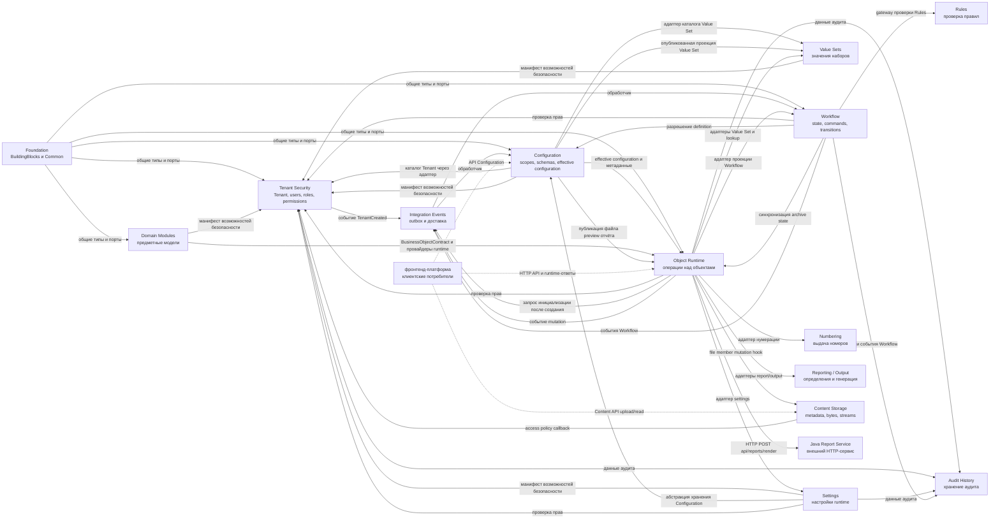

# Интеграционная архитектура DMP

## 1. Назначение и границы

Документ описывает, как платформенные области и прикладные модули
взаимодействуют через публичные контракты. Он отвечает на четыре вопроса:

1. кто инициирует взаимодействие и кто его получает;
2. каким каналом передаётся запрос или факт изменения;
3. что является результатом и какие ограничения действуют;
4. где находится подробное описание контракта и поведения.

Документ является верхнеуровневой картой системы. Он не заменяет документы
платформенных областей, не описывает внутренние методы и не является каталогом
всех классов. Подробные HTTP DTO и payload принадлежат владельцам контрактов;
алгоритмы обработки принадлежат `04_runtime.md` соответствующей области;
основное описание каждого публичного контракта находится в `03_contracts.md`
соответствующей области. Отдельные машинно-читаемые OpenAPI, AsyncAPI или JSON
Schema добавляются рядом с документом-владельцем только после их фактической
подготовки.

## 2. Архитектурная модель взаимодействия

Каждая граница между модулями классифицируется одним из следующих способов:

| Канал | Когда используется | Что считается контрактом |
| --- | --- | --- |
| HTTP API | Потребителю нужен немедленный ответ через host или внешний endpoint | route, request, response, HTTP status и сопоставление ошибок |
| Application port / gateway | Компонент в текущей host-композиции вызывает capability через интерфейс | C# interface, входные параметры, результат и поведение при недоступной реализации |
| Integration event | Нужно передать факт изменения без ожидания завершения обработки потребителем | `IntegrationEventEnvelope`, event type code, payload, доставка, повторы и версия |
| Extension point | Модуль подключает собственную реализацию к общему runtime-механизму | интерфейс, правило регистрации, область ответственности и fallback |

В текущем коде есть также прямые зависимости через persistence abstractions,
например `IConfigurationDbContext` и `ITenantSecurityDbContext`. Они отражают
реальную связность текущей host-композиции, но не являются публичными API и не
должны рассматриваться как целевой способ взаимодействия отдельных сервисов.

Термин «API» в этом документе не означает автоматически HTTP. Если вызов
проходит через C# interface внутри host, он обозначается как application port
или gateway.

### 2.1. Карта основных связей

Сплошная стрелка означает связь, подтверждённую кодом или host-композицией:
вызов, публикацию, регистрацию или зависимость. Пунктирная стрелка означает
границу, зарегистрированный порт или внешнего потребителя, для которого отдельный
сквозной сценарий в текущей host-композиции не подтверждён.

## 3. Матрица подтверждённых взаимодействий

| Инициатор | Получатель | Канал и контракт | Триггер | Результат | Статус сведения | Документ-подробность |
| --- | --- | --- | --- | --- | --- | --- |
| Tenant Security | Configuration | `TenantCreated` через `IntegrationEventEnvelope` | Tenant сохранён | Создан или найден `ConfigurationScopeType.Tenant` под `Corporate` | Подтверждено MVP | [Configuration runtime](../03_platform/02_configuration/04_runtime.md), [Tenant Security service][tenant-service] |
| Object Runtime | Workflow | `Workflow.InstanceInitializationRequested` через `IIntegrationEventPublisher` | Объект успешно создан | Обработчик host передаёт payload в runtime projection; создаётся initial state | Подтверждено, но ограничено | [Workflow runtime](../03_platform/04_workflow/04_runtime.md), [initialization handler][workflow-init-handler] |
| Workflow | Configuration | `IWorkflowDefinitionResolver` | Инициализация или команда Workflow | Workflow получает effective definition и revision | Подтверждено, но ограничено | [Workflow contracts](../03_platform/04_workflow/03_contracts.md), [definition resolver][definition-resolver] |
| Configuration | Tenant Security | `IConfigurationTenantCatalog` через host adapter и `ITenantSecurityDbContext` | Bootstrap, reconcile или запрос, которому нужны Tenant identifiers/descriptors | Configuration получает список Tenant и их descriptors | Подтверждено, но ограничено | [Configuration tenant catalog][configuration-tenant-catalog], [host composition][host-composition] |
| Configuration | Tenant Security | `ITenantSecurityCapabilityCatalogManifest` | Инициализация или проверка каталога capabilities | Tenant Security регистрирует permissions и capability metadata Configuration | Подтверждено, но ограничено | [Configuration capability manifest][configuration-capability-manifest], [Tenant Security registration][tenant-security-registration] |
| Value Sets | Tenant Security | `ITenantSecurityCapabilityCatalogManifest` | Инициализация или проверка каталога capabilities | Tenant Security регистрирует permissions и capability metadata Value Sets | Подтверждено, но ограничено | [Value Sets capability manifest][value-sets-capability-manifest], [Tenant Security registration][tenant-security-registration], [Value Sets security](../03_platform/06_value_sets/05_security_and_audit.md) |
| Settings | Tenant Security | `ITenantSecurityCapabilityCatalogManifest` | Инициализация или проверка каталога capabilities | Tenant Security регистрирует permissions и capability metadata Settings | Подтверждено, но ограничено | [Settings capability manifest][settings-capability-manifest], [Tenant Security registration][tenant-security-registration] |
| Configuration | Value Sets | `IConfigurationValueSetCatalog` через host adapter | Validation или upgrade compatibility check ссылается на Value Set | Configuration получает признак существования Value Set | Подтверждено, но ограничено | [Configuration value-set catalog][configuration-value-set-catalog], [host composition][host-composition], [Value Sets contracts](../03_platform/06_value_sets/03_contracts.md) |
| Configuration | Value Sets | `IConfigurationPublishedValueSetProjectionService` и host writer | Публикация `Corporate` или `SystemBaseline` configuration version | Опубликованное описание Value Set передаётся в хранилище Value Sets; в текущем модуле Configuration зарегистрирован `NoOp` writer, рабочий host подключает `ConfigurationPublishedValueSetProjectionWriter` | Подтверждено, но ограничено | [Configuration runtime](../03_platform/02_configuration/04_runtime.md), [Value Sets architecture](../03_platform/06_value_sets/02_architecture.md), [Value Sets runtime](../03_platform/06_value_sets/04_runtime.md), [value-set projection service][value-set-projection-service], [value-set projection writer][value-set-projection-writer] |
| Configuration | Object Runtime | `IReportFilePublisher.PublishPreviewSessionAsync` | Создание preview-сессии для Report.Design | Runtime публикует design, schema и sample files во временную preview-сессию | Подтверждено, но ограничено | [Configuration report design service][configuration-report-design-service], [report file publisher][report-file-publisher] |
| Workflow | Rules | `IRuleEvaluationGateway` | Проверка guard transition | Возвращается результат доступности перехода | Подтверждено, но ограничено | [Workflow architecture](../03_platform/04_workflow/02_architecture.md), [rules gateway][rules-gateway] |
| Object Runtime | Workflow | `IRuntimeWorkflowProjectionService` и `IWorkflowRuntimeService` через host adapter | Чтение view, details или list для объекта с Workflow | Runtime получает state, commands, history и state policies для ответа клиенту | Подтверждено, но ограничено | [Runtime workflow projection][runtime-workflow-projection], [Object Runtime architecture](../03_platform/03_object_runtime/02_architecture.md) |
| Workflow | Tenant Security | `IWorkflowPermissionAuthorizer` через host adapter и `ITenantSecurityService` | Выполнение команды или другого защищённого Workflow-операции | Команда разрешена или отклонена | Подтверждено, но ограничено | [Workflow permission authorizer][workflow-permission-authorizer], [Workflow contracts](../03_platform/04_workflow/03_contracts.md) |
| Workflow | Object Runtime | `IWorkflowArchiveStateSynchronizer` | Workflow вошёл в archive state или вышел из него | Состояние архивирования объекта синхронизируется | Подтверждено, но ограничено | [Workflow runtime](../03_platform/04_workflow/04_runtime.md), [archive synchronizer][archive-synchronizer] |
| Object Runtime | Configuration | `IRuntimeConfigurationResolver` и host adapter | Чтение или выполнение runtime-операции | Получена опубликованная effective configuration | Подтверждено MVP | [Object Runtime architecture](../03_platform/03_object_runtime/02_architecture.md), [runtime resolver][runtime-resolver] |
| Object Runtime | Content Storage | `IContentStore` и generic mutation validator/lifecycle hook | File member или file action требует attach/detach и проверки `ContentRef` | Runtime сохраняет только ref, а Content Storage меняет ownership и lifecycle resource | Подтверждено MVP | [Content Storage architecture](../03_platform/13_content_storage/02_architecture.md), [Content Storage runtime](../03_platform/13_content_storage/04_runtime.md) |
| Frontend | Content Storage | Content API для initiate/upload/finalize и защищённого stream read | File picker, download или descriptor refresh | Получен descriptor либо binary response без раскрытия provider details | Подтверждено MVP | [Content Storage contracts](../03_platform/13_content_storage/03_contracts.md), [Content Storage UX](../03_platform/13_content_storage/06_user_experience.md) |
| Object Runtime | Tenant Security | `IRuntimePermissionAuthorizer` через host adapter и `ITenantSecurityService` | Runtime-операция или lookup требует permission check | Операция разрешена или отклонена | Подтверждено, но ограничено | [Object Runtime security](../03_platform/03_object_runtime/05_security_and_audit.md), [runtime permission authorizer][runtime-permission-authorizer] |
| Object Runtime | Value Sets | `IRuntimeValueSetResolver` | Lookup или материализация значения | Получены допустимые и отображаемые значения | Подтверждено, но ограничено | [Object Runtime contracts](../03_platform/03_object_runtime/03_contracts.md), [Value Sets contracts](../03_platform/06_value_sets/03_contracts.md), [Value Sets runtime](../03_platform/06_value_sets/04_runtime.md), [host composition][host-composition] |
| Object Runtime | Settings | `IPlatformRuntimeServicesGateway.Configuration` и `IModuleSettingsAccessor` | Runtime-компоненту нужна настройка модуля | Возвращено значение настройки из наиболее специфичного доступного scope | Подтверждено, но ограничено | [Foundation contracts](../03_platform/00_foundation/03_contracts.md), [host composition][host-composition] |
| Object Runtime | Numbering | `INumberingRuleResolver` | Операция, которой нужен номер | Получено правило нумерации через host adapter | Подтверждено, но ограничено | [Object Runtime contracts](../03_platform/03_object_runtime/03_contracts.md), [Numbering contracts](../03_platform/08_numbering/03_contracts.md), [Numbering runtime](../03_platform/08_numbering/04_runtime.md), [host composition][host-composition] |
| Object Runtime | Reporting / Output | `IRuntimeReportDefinitionProvider`, `IOutputParameterMappingResolver`, `IReportFilePublisher` | Runtime-запрос генерации report/output | Получено определение, параметры сопоставлены, файл передан publisher | Подтверждено, но ограничено | [host composition][host-composition], отдельная область Reporting / Output |
| Object Runtime | Java Report Service | HTTP `POST api/reports/render` через `IReportServiceClient` | Генерация output после подготовки design, schema и data files | Сервис возвращает бинарный PDF или Excel и `X-Report-RequestId`; ошибки HTTP преобразуются в runtime error codes | Подтверждено, но ограничено | [Object Runtime report client][report-service-client], [Object Runtime runtime](../03_platform/03_object_runtime/04_runtime.md) |
| Domain Modules | Object Runtime | `BusinessObjectContract<T>` и object runtime providers | Модуль регистрирует объект и его расширения | Runtime получает descriptor, storage и providers предметного объекта | Подтверждено, но ограничено | [Object Runtime architecture](../03_platform/03_object_runtime/02_architecture.md), [Object Runtime contracts](../03_platform/03_object_runtime/03_contracts.md) |
| Domain Modules | Tenant Security | `ITenantSecurityCapabilityCatalogManifest` | Инициализация host и регистрация capabilities прикладного модуля | Tenant Security регистрирует permissions прикладного модуля | Подтверждено, но ограничено | [General Master Data capability manifest][gmd-capability-manifest], [Tenant Security registration][tenant-security-registration] |
| Tenant Security | Audit History | `IAuditHistoryWriter` | Изменение Tenant, пользователя, роли, права или назначения | Передана запись аудита операции | Подтверждено, но ограничено | [Tenant Security service][tenant-service], [audit writer][audit-writer] |
| Object Runtime | Audit History | `IAuditHistoryWriter` через mutation sink | Успешная mutation-операция | Передана запись аудита | Подтверждено, но ограничено | [Object Runtime security](../03_platform/03_object_runtime/05_security_and_audit.md), [audit writer][audit-writer] |
| Object Runtime | Integration Events | `ObjectRuntime.MutationCompleted` | Завершена mutation-операция | Сформирован payload изменения и передан publisher | Подтверждено, но ограничено | [Object Runtime runtime](../03_platform/03_object_runtime/04_runtime.md), [mutation event sink][mutation-event-sink] |
| Settings | Configuration | `IConfigurationDbContext` в settings services | Чтение scope, effective definition или иерархии scope | Settings получает данные Configuration для разрешения setting value | Подтверждено, но ограничено | [Settings value service][settings-value-service], [Configuration runtime](../03_platform/02_configuration/04_runtime.md) |
| Settings | Tenant Security | `ISettingsPermissionAuthorizer` через host adapter и `ITenantSecurityService` | Открытие или изменение защищённого runtime setting | Операция разрешена или отклонена | Подтверждено, но ограничено | [Settings permission authorizer][settings-permission-authorizer], [Settings value service][settings-value-service] |
| Settings | Audit History | `IAuditHistoryWriter` | Создание, изменение или сброс runtime setting override | Передана запись аудита операции настройки | Подтверждено, но ограничено | [Settings value service][settings-value-service], [audit writer][audit-writer] |
| Workflow | Audit History | `IAuditHistoryWriter` | Успешное выполнение команды или переназначение | Передана запись аудита Workflow | Подтверждено, но ограничено | [Workflow contracts](../03_platform/04_workflow/03_contracts.md), [audit writer][audit-writer] |

`Подтверждено, но ограничено` означает, что направление и кодовая граница
подтверждены, но общая гарантия доставки, промышленная конфигурация или
политика повторной обработки не закреплены этим документом.

## 4. Сквозные сценарии

### 4.1. Создание Tenant и configuration scope

Tenant Security сохраняет Tenant и публикует `TenantCreated`. Configuration
обрабатывает событие и создаёт или находит `ConfigurationScopeType.Tenant` под
`Corporate`. Этот поток создаёт configuration scope, но не публикует
автоматически новую configuration version. Подробный порядок обработки и
ограничение при отсутствии `Corporate` scope описаны в
[Configuration runtime](../03_platform/02_configuration/04_runtime.md).

### 4.2. Создание объекта и инициализация Workflow

Object Runtime публикует `Workflow.InstanceInitializationRequested` только
после успешного создания объекта. Host handler передаёт payload в
`RuntimeWorkflowProjectionService`, который вызывает Workflow runtime для
идемпотентного создания initial state. Транспорт, outbox и повторы принадлежат
Integration Events, а подробная sequence diagram находится в
[Workflow runtime](../03_platform/04_workflow/04_runtime.md).

## 5. Публикуемые события без подтверждённого внутреннего consumer

В текущей host-композиции зарегистрированы обработчики только для
`TenantCreated` и `Workflow.InstanceInitializationRequested`. Остальные
публикации считаются исходящими событиями, пока отдельный consumer не найден
в коде.

| Producer | Event type code | Текущая форма payload | Внутренний handler найден | Интерпретация |
| --- | --- | --- | --- | --- |
| Tenant Security | `TenantUpdated` | Формируется общим helper с payload операции | Нет | Опубликованное событие; потребитель внутри текущего host не подтверждён |
| Tenant Security | `TenantStatusChanged` | Формируется общим helper с payload операции | Нет | Опубликованное событие; потребитель внутри текущего host не подтверждён |
| Tenant Security | `UserUpdated`, `UserStatusChanged` | Формируется общим helper с payload операции | Нет | Опубликованные события изменений пользователя |
| Tenant Security | `PermissionChanged` | Формируется общим helper с payload операции | Нет | Опубликованное событие изменения каталога/права |
| Tenant Security | `UserRoleAssigned`, `UserRoleAssignmentActivated`, `UserRoleAssignmentDeactivated`, `UserRoleAssignmentRemoved` | Формируется общим helper с payload операции | Нет | Опубликованные события жизненного цикла назначения роли |
| Object Runtime | `ObjectRuntime.MutationCompleted` | Типизированный `ObjectMutationCompletedIntegrationEventPayload` | Нет | Обобщённое событие завершения mutation для внешних или будущих потребителей |
| Workflow | `Workflow.CommandExecuted` | Payload формируется в runtime publisher | Нет | Событие результата команды Workflow |
| Workflow | `Workflow.InstanceReassigned` | Payload формируется в runtime publisher | Нет | Событие переназначения Workflow |

Отсутствие внутреннего handler не доказывает отсутствие внешнего потребителя.
В этой карте зафиксирована только публикация события. Стабильная внешняя
схема, гарантия доставки и возможность повторного воспроизведения (`replay`) требуют отдельного подтверждения
в документации Integration Events и в документации владельца события.

## 6. Общие порты и host composition

`IPlatformRuntimeServicesGateway` группирует application-порты
`Authorization`, `Workflow`, `Rules`, `Configuration`, `ReferenceData`,
`Audit` и `Events`. Foundation владеет формой общего gateway, но не гарантирует
подключение каждого вложенного порта в каждой среде.

В текущей host-композиции фактически подключены отдельные adapters:

| Порт или adapter | Реализация в host | Состояние |
| --- | --- | --- |
| `IWorkflowDefinitionResolver` | `WorkflowConfigurationDefinitionResolver` | Подключён |
| `IWorkflowArchiveStateSynchronizer` | `WorkflowArchiveStateSynchronizer` | Подключён |
| `IRuleEvaluationGateway` | `RuntimeRuleEvaluationGateway` | Подключён, поведение ограничено текущей реализацией Rules |
| `IRuntimeConfigurationResolver` | `RuntimeConfigurationResolver` | Подключён |
| `IRuntimeWorkflowProjectionService` | `RuntimeWorkflowProjectionService` | Подключён |
| `IPlatformRuntimeServicesGateway.Workflow` | `WorkflowGateway` | Подключён |
| `IPlatformRuntimeServicesGateway.Configuration` | `ConfigurationGateway` | Подключён для settings |
| `IPlatformRuntimeServicesGateway.Authorization`, `.ReferenceData`, `.Audit`, `.Events` | `NoOp` fallback в общем gateway | Не считать активным межмодульным сценарием без отдельного consumer |

Таким образом, объявленный интерфейс и рабочая интеграция имеют разные статусы.
В общей карте нельзя превращать каждый вложенный gateway в подтверждённый
сквозной поток только на основании его наличия в `BuildingBlocks`.

## 7. Ограничения текущего описания

- Текущая карта покрывает подтверждённые связи подготовленных областей и
  найденные в коде adapters; она не заменяет подробную документацию самих
  областей. Подробности механизма outbox и локальной обработки событий
  находятся в `03_platform/10_integration_events`.
- Полная Integration Capability для обмена с внешними системами, connectors,
  integration flows, mappings, sync state и manual reprocess не считается
  реализованной областью этой картой. Её будущий scope ведётся в
  [backlog Integration Capability](../10_backlog/platform_capabilities/integration_capability_backlog.md).
- Для событий Tenant Security, Workflow и Object Runtime карта подтверждает
  публикацию, но не описывает полный сценарий: кто инициирует событие, как оно
  доставляется, кто его обрабатывает и какой результат получается.
- Карта не подтверждает наличие следующих гарантий: сохранение состояния и
  события в одной транзакции, повторная доставка, воспроизведение события,
  совместимость версий и полный набор метрик и трассировки. Текущее состояние
  этих свойств и найденные пробелы зафиксированы в документации Integration
  Events и должны подтверждаться кодом или тестами.
- Domain Modules показаны как потребители Object Runtime и Foundation. Их
  предметные сценарии и дополнительные связи описываются в документах
  соответствующих модулей.

## 8. Связанные документы

- [Обзор Foundation](../03_platform/00_foundation/00_platform_overview.md)
- [Обзор Tenant Security](../03_platform/01_tenant_and_security/00_platform_overview.md)
- [Обзор Configuration](../03_platform/02_configuration/00_platform_overview.md)
- [Обзор Object Runtime](../03_platform/03_object_runtime/00_platform_overview.md)
- [Обзор Value Sets](../03_platform/06_value_sets/00_platform_overview.md)
- [Архитектура Value Sets](../03_platform/06_value_sets/02_architecture.md)
- [Контракты Value Sets](../03_platform/06_value_sets/03_contracts.md)
- [Выполнение Value Sets](../03_platform/06_value_sets/04_runtime.md)
- [Обзор Workflow](../03_platform/04_workflow/00_platform_overview.md)
- [Обзор Rules](../03_platform/05_rules/00_platform_overview.md)
- [Обзор Settings](../03_platform/07_settings/00_platform_overview.md)
- [Обзор Numbering](../03_platform/08_numbering/00_platform_overview.md)
- [Обзор Audit History](../03_platform/09_audit_history/00_platform_overview.md)
- [Обзор Integration Events](../03_platform/10_integration_events/00_platform_overview.md)
- [Обзор Reporting и Output](../03_platform/11_reporting_output/00_platform_overview.md)
- [Обзор фронтенд-платформы](../03_platform/12_frontend_platform/00_platform_overview.md)
- [Backlog будущей Integration Capability](../10_backlog/platform_capabilities/integration_capability_backlog.md)
- [Стратегия документации](../00_governance/00_documentation_strategy.md)

[tenant-service]: ../../src/Platform/DMP.Platform.TenantSecurity/Application/Services/TenantSecurityService.cs
[workflow-init-handler]: ../../src/Hosts/DMP.Platform.Api/Composition/WorkflowInstanceInitializationRequestedEventHandler.cs
[definition-resolver]: ../../src/Hosts/DMP.Platform.Api/Composition/WorkflowConfigurationDefinitionResolver.cs
[rules-gateway]: ../../src/Platform/DMP.Platform.Rules/Abstractions/IRuleEvaluationGateway.cs
[archive-synchronizer]: ../../src/Platform/DMP.Platform.Workflow/Application/Abstractions/IWorkflowArchiveStateSynchronizer.cs
[runtime-resolver]: ../../src/Platform/DMP.Platform.Runtime/Application/Abstractions/Core/IRuntimeConfigurationResolver.cs
[host-composition]: ../../src/Hosts/DMP.Platform.Api/Composition/PlatformApiCompositionExtensions.cs
[report-service-client]: ../../src/Platform/DMP.Platform.Runtime/Application/Services/Reports/ReportServiceClient.cs
[runtime-permission-authorizer]: ../../src/Hosts/DMP.Platform.Api/Composition/RuntimePermissionAuthorizer.cs
[configuration-tenant-catalog]: ../../src/Hosts/DMP.Platform.Api/Composition/ConfigurationTenantCatalog.cs
[configuration-value-set-catalog]: ../../src/Hosts/DMP.Platform.Api/Composition/ConfigurationValueSetCatalog.cs
[configuration-report-design-service]: ../../src/Platform/DMP.Platform.Configuration/Application/Services/Reports/ReportDesignOperationsApplicationService.cs
[report-file-publisher]: ../../src/Platform/DMP.Platform.Runtime/Application/Abstractions/Reports/IReportFilePublisher.cs
[configuration-capability-manifest]: ../../src/Platform/DMP.Platform.Configuration/Infrastructure/Security/ConfigurationCapabilityCatalogManifest.cs
[value-sets-capability-manifest]: ../../src/Platform/DMP.Platform.ValueSets/Infrastructure/Security/ValueSetsCapabilityCatalogManifest.cs
[settings-capability-manifest]: ../../src/Platform/DMP.Platform.Settings/Infrastructure/Security/SettingsCapabilityCatalogManifest.cs
[gmd-capability-manifest]: ../../src/Modules/DMP.Modules.GeneralMasterData/Infrastructure/Security/GeneralMasterDataSecurityConfiguration.cs
[tenant-security-registration]: ../../src/Platform/DMP.Platform.TenantSecurity/Infrastructure/Persistence/TenantSecurityDatabaseInitializer.cs
[runtime-workflow-projection]: ../../src/Hosts/DMP.Platform.Api/Composition/RuntimeWorkflowProjectionService.cs
[workflow-permission-authorizer]: ../../src/Hosts/DMP.Platform.Api/Composition/WorkflowPermissionAuthorizer.cs
[settings-permission-authorizer]: ../../src/Hosts/DMP.Platform.Api/Composition/SettingsPermissionAuthorizer.cs
[value-set-projection-service]: ../../src/Platform/DMP.Platform.Configuration/Application/Services/Catalog/ConfigurationPublishedValueSetProjectionService.cs
[value-set-projection-writer]: ../../src/Hosts/DMP.Platform.Api/Composition/ConfigurationPublishedValueSetProjectionWriter.cs
[settings-value-service]: ../../src/Platform/DMP.Platform.Settings/Application/Services/SettingsValueService.cs
[audit-writer]: ../../src/Platform/DMP.Platform.AuditHistory/Abstractions/IAuditHistoryWriter.cs
[mutation-event-sink]: ../../src/Platform/DMP.Platform.Runtime/Application/Services/Core/ObjectRuntimeIntegrationEventOutboxSink.cs

## История изменений

| Версия | Дата и время | Автор | Раздел | Изменение | Коммит/PR |
|---|---|---|---|---|---|
| 1.0 | 2026-09-03 14:49 +03:00 | Олег Юрьев (@axelprosoft) | YAML-шапка: review_status, status | Утверждение после merge PR #61: изменения в проектной документации ядра - новый модуль работы с файлами | [PR #61](https://github.com/axelprosoft/DMP.PlatformFoundation/pull/61) |
| 0.2 | 2026-09-03 13:00 +03:00 | Олег Юрьев (@axelprosoft) | 1. Карта основных связей; Матрица подтверждённых взаимодействий | изменения в проектной документации ядра. основание - новый модуль по хранению и работе с файлами | [0f415f89](https://github.com/axelprosoft/DMP.PlatformFoundation/commit/0f415f89b977fa123e52411717a66f94c2d327a3) |
| 0.1 | 2026-08-27 16:54 +03:00 | Олег Юрьев (@axelprosoft) | Создание документа | docs-new: выровнять ID документов по структуре | [662557dd](https://github.com/axelprosoft/DMP.PlatformFoundation/commit/662557dde131463f26ae995734181bc295e22a34) |
