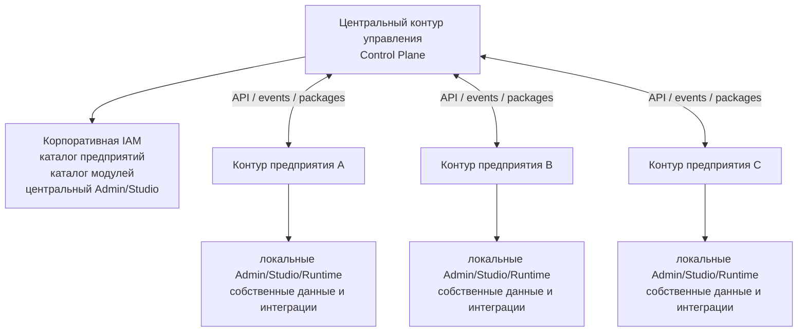
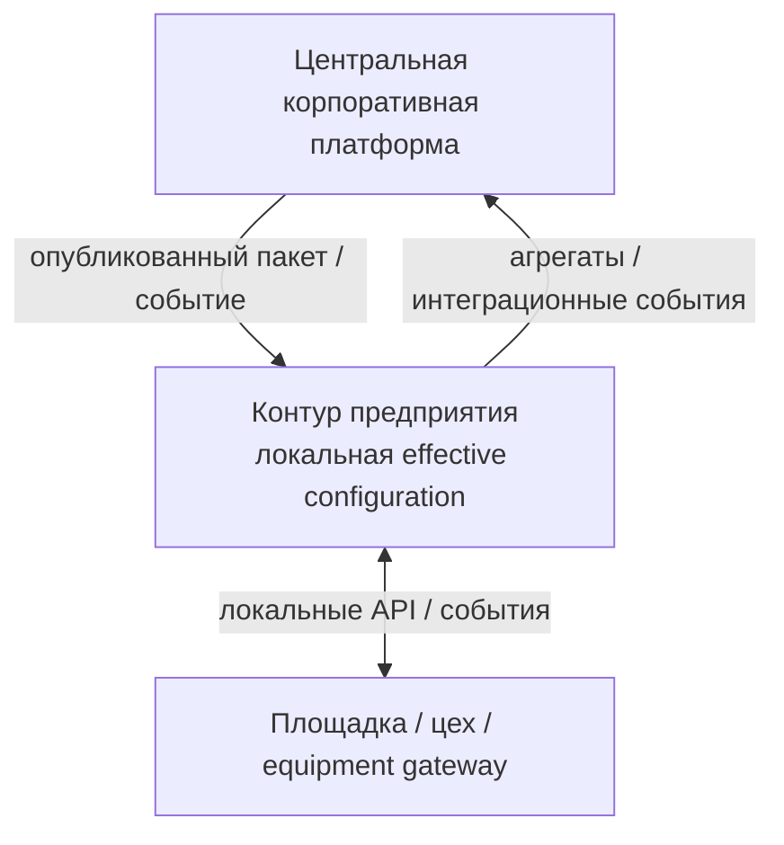
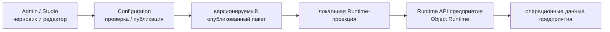
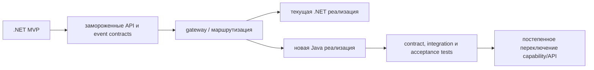

# Целевая распределённая архитектура Java/PostgreSQL

## 1. Назначение

Документ фиксирует предложение по целевой архитектуре перехода с MVP на
`.NET/SQL Server` к распределённой платформе на `Java/PostgreSQL`.

Документ является черновиком для архитектурного ревью. Он не заменяет документы
владельцев платформенных областей и не утверждает детали, которые перечислены
в разделе открытых решений.

Основание: [двухнедельные требования к архитектурному результату][outcome],
[обзор архитектуры DMP][overview], [архитектура развёртывания][deployment],
[интеграционная архитектура][integration] и [ADR-008 о границах API][adr-008].

## 2. Предлагаемая модель

Целевая модель — **центральный контур управления и независимые контуры
предприятий**.

Центральный контур управляет корпоративными возможностями и распространяет
опубликованные контракты и конфигурацию. Контур предприятия самостоятельно
исполняет локальные операции, хранит операционные данные и взаимодействует с
локальными системами.

### Единое ядро и варианты контуров

Все контуры предприятий используют общий код платформы и единые версии
публичных контрактов. Различия между предприятиями задаются конфигурацией,
включёнными модулями, локальными данными, переопределениями, интеграциями и
параметрами развёртывания.

Отдельные fork-версии платформенного ядра для предприятий не допускаются.
Допустимы разные составы включённых возможностей и разные параметры
масштабирования, если они совместимы с общей версией контрактов.



Каждый контур предприятия должен иметь независимые:

- развёртывание и жизненный цикл обновления;
- Runtime API и выполнение Runtime;
- PostgreSQL-хранилища или подтверждённо изолированные базы;
- контекст tenant/site и права доступа;
- операционные данные, состояние и историю Workflow, audit и локальные интеграции;
- кэш и Runtime-проекцию опубликованной конфигурации.

Независимость контуров не требует немедленного выделения каждой логической
области в отдельный процесс. Внутри контура предприятия на первом этапе может
использоваться modular monolith, если его внешние границы уже соответствуют
целевой модели.

## 3. Границы центрального и локального контуров

| Контур | Основная ответственность | Что не должен делать |
|---|---|---|
| Центральный | Корпоративная IAM, реестр предприятий, корпоративный каталог модулей, публикация и доставка пакетов конфигурации, центральное администрирование, агрегированная аналитика | Не читать таблицы предприятия напрямую и не быть обязательным синхронным источником для каждой Runtime-операции |
| Предприятие | Локальный Runtime, операционные данные, локальные overrides, экземпляры Workflow, audit/history, локальные интеграции и работа при недоступности центра | Не обращаться к таблицам другого предприятия и не изменять корпоративные данные в обход API/events |
| Площадка или shopfloor-контур | Работа рядом с производством, оборудование, MDC, локальная буферизация и адаптация интеграций | Не становиться источником корпоративной конфигурации без опубликованного контракта |



Центр не должен напрямую подключаться к базе предприятия. Для закрытых
производственных сетей предпочтительным вариантом является исходящее
соединение, инициируемое контуром предприятия.

## 4. API и приложения

`Admin`, `Studio` и `Runtime` сохраняются как три пользовательских приложения.
Это не означает, что сервер обязан состоять ровно из трёх процессов.

На уровне API предлагается разделить четыре класса:

| Класс API | Назначение |
|---|---|
| `Admin API` | Администрирование, безопасность, черновики, версии и редакторские операции Studio |
| `Runtime API` | Экраны, списки, карточки, действия и Workflow пользовательского приложения |
| `Integration API` | Внешние системы и интеграционные сценарии |
| `Platform Internal API` | Внутренние технические операции, не являющиеся публичным контрактом |

```text
/api/admin/...
/api/runtime/...
/api/integration/v1/...
/api/platform/internal/...
```

Runtime API не должен предоставлять операции Admin/Studio, читать черновики и
сессии редактора, использовать DTO редактора как Runtime contract или обходить
Object Runtime, authorization, Workflow и Rules.

## 5. Конфигурация и Runtime

Configuration и Studio владеют черновиками, сессиями редактора, версиями и
публикацией. Runtime получает только опубликованную эффективную конфигурацию
(`effective configuration`).

Рекомендуемый путь доставки: Configuration формирует версионируемый пакет
(`versioned package`), событие сообщает о доступности новой версии, а контур предприятия получает пакет,
проверяет его совместимость, сохраняет локально и активирует только после
успешной проверки. Событие не является единственным источником полного
состояния конфигурации.



Для каждого предприятия должны быть определены:

- корпоративная конфигурация;
- конфигурация предприятия и площадки;
- локальные overrides;
- версия и совместимость опубликованного пакета;
- rollback и повторная доставка;
- поведение при недоступности центрального контура.

### Автономность предприятия

При временной недоступности центрального контура контур предприятия продолжает
работать с последней принятой effective version. В этот период должны оставаться
доступными Runtime, необходимые локальные проверки прав, операционные операции и
локальные интеграции.

Публикация новой корпоративной конфигурации, централизованное администрирование,
доставка новых пакетов и централизованная аналитика могут быть временно
недоступны.

Новая модель артефактов для Java не создаётся только из-за смены языка.
Переносу подлежат канонические `ArtifactDocument`, `ArtifactNode`,
`ArtifactValue` и `EffectiveArtifactDocument`, если отдельным решением не
подтверждена необходимость изменения их семантики.

## 6. Данные, владение и обмен

### 6.1. Хранение и владение данными

Рекомендуемое правило: **операционные данные предприятия не покидают его
контур без отдельного контракта и политики безопасности**.

Минимально необходимо разделить владельцев и доступы для:

- корпоративного IAM и реестра предприятий;
- черновики, опубликованные версии и effective configuration;
- Runtime-проекции;
- операционные данные;
- состояние и история Workflow;
- audit/history;
- Inbox/Outbox и состояние интеграций;
- телеметрия и аналитические read-модели;
- файлов и крупных объектов;
- кэшей и производных проекций.

Обязательное требование — предприятие не должно использовать общую с другим
предприятием или центральным контуром область доступа к данным. Отдельно нужно
выбрать, реализуется ли это через одну PostgreSQL database с разными schemas,
несколько database или комбинацию. Разные schemas без разных учётных данных и
сетевых правил не считаются достаточной гарантией изоляции.

Для требований ИБ предпочтительно использовать отдельные базы или иные явно
изолированные хранилища для центрального контура и каждого предприятия.

### 6.2. Обмен платформенными данными

Обмен между контурами включает не только конфигурационные артефакты. Для
каждого типа данных заранее определяется источник истины и локальное состояние
предприятия.

| Данные | Где создаются и изменяются | Что получает предприятие |
|---|---|---|
| `ValueSet` и корпоративные значения | Центральный контур или владелец области | Локальную effective projection |
| Значения `ValueSet` уровня `Tenant/Site` | Контур предприятия | Не передаются другим предприятиям без отдельного решения |
| Каталог и корпоративные значения `Settings` | Центральный контур | Локальный snapshot и разрешённые overrides |
| User preferences | Пользователь или контур предприятия | По умолчанию остаются локальными |
| `NumberingRule` | Configuration | Локальную effective rule |
| Счётчики нумерации | Контур, который выдаёт номера | Не реплицируются |
| Workflow и Rule definitions | Configuration | Локальную effective projection |
| Workflow instances, operational data и audit | Контур предприятия | В центр могут передаваться только согласованные события или агрегаты |

Корпоративные definitions и значения могут распространяться из центрального
контура как versioned package. Event сообщает о новой версии, но не заменяет
сам пакет. Контур предприятия проверяет пакет, сохраняет его локально и только
после этого активирует новую effective version.

Прямое копирование таблиц между контурами не допускается. Если требуется единая
нумерация нескольких предприятий, это отдельное решение о центральном владельце
последовательности; обычные счётчики остаются локальными.

## 7. Взаимодействие и отказоустойчивость

Обмен между центральным контуром и контурами предприятий выполняется только через
версионируемые API, packages или events. Нужно обеспечить:

- идемпотентность и повторную доставку;
- Inbox/Outbox и обработку неразобранных сообщений;
- контроль версии и совместимости package/API;
- наблюдаемость доставки;
- ручной повтор после исправления ошибки;
- локальную работу Runtime при временной недоступности центра.

Публикация конфигурации не должна требовать распределённой transaction между
центральной и базой предприятия. Контур предприятия принимает package,
проверяет совместимость, сохраняет его локально и только затем активирует
effective version.

## 8. Стратегия перехода

Переход выполняется поэтапно:



До начала переноса необходимо:

1. Зафиксировать API и event contracts.
2. Определить первый вертикальный срез.
3. Запустить .NET и Java параллельно хотя бы для выбранного среза.
4. Переключать клиентов на уровне gateway или маршрутизации.
5. Сравнивать поведение по contract и acceptance tests.
6. Не считать автоматический перенос данных MVP обязательным.

## 9. Решения, которые нужно принять

| ID решения | Решение | Предлагаемый вариант |
|---:|---|---|
| R-01 | Целевая топология | Центральный контур управления и независимый контур предприятия для каждого предприятия |
| R-02 | Граница предприятия | Предприятие является отдельным tenant и отдельным контуром развёртывания; связь терминов нужно подтвердить |
| R-03 | API | Четыре класса: Admin, Runtime, Integration, Platform Internal |
| R-04 | Изоляция Runtime | Runtime не имеет доступа к Admin/Studio API, черновикам и хранилищу редактора |
| R-05 | Доставка конфигурации | Версионируемый опубликованный пакет; event сообщает о доступности версии; в предприятии создаётся локальная Runtime projection |
| R-06 | Работа без центра | Runtime продолжает локальную работу с последней принятой effective version |
| R-07 | Топология данных | Отдельно утвердить топологию database/schema, учётные записи и сетевую изоляцию; для ИБ предпочтительны отдельные базы |
| R-08 | Межконтурный транспорт | Утвердить REST/events/broker и предпочтительный исходящий канал предприятия |
| R-09 | Базовый Java-стек | Версия Java, framework, build tool, ORM и database migration tool |
| R-10 | Управление API | OpenAPI, JSON Schema, event schema, versioning, errors и deprecation policy |
| R-11 | Безопасность | OIDC/OAuth2/JWT, service-to-service trust, tenant/site context и secret rotation |
| R-12 | Платформенные контракты | Object Runtime, Workflow, Rules, Dataset, Value Sets, Settings, Numbering и Audit contracts |
| R-13 | Интеграция | Inbox/Outbox, broker, retries, idempotency, replay и dead-letter policy |
| R-14 | Эксплуатация | SLO, tracing, metrics, backup/restore, RPO/RTO, readiness и rollback |
| R-15 | Политика миграции | Порядок переноса capabilities, совместная работа .NET/Java и критерии остановки |
| R-16 | Фронтенд | Сохранить три приложения и не требовать их переписывания из-за смены серверного стека |
| R-17 | Размещение приложений | Утвердить, где находятся Admin и Studio: в центре, в каждом предприятии или в комбинированной модели |
| R-18 | Обмен платформенными данными | Утвердить источник истины, локальное состояние и направление обмена для Value Sets, Settings, Numbering, Workflow, Rules, Audit и Dataset |
| R-19 | Общие и локальные значения | Утвердить, какие значения распространяются из центра, а какие создаются только в контуре предприятия |
| R-20 | Уникальность нумерации | Утвердить локальную или центральную уникальность последовательностей |

До начала реализации должны быть закрыты решения `R-01`–`R-08`, `R-10`, `R-11`
и `R-15`. Решение `R-17`
может быть закрыто вместе с детализацией пользовательских сценариев, но способ
доступа Runtime к конфигурации не должен от него зависеть. Решения
`R-12`–`R-14` могут закрываться по мере подготовки соответствующего вертикального
среза, но не должны противоречить базовой топологии.

## 10. Границы текущего черновика

Документ не утверждает:

- конкретный Java framework;
- конкретный брокер сообщений;
- точное число Java-компонентов развёртывания внутри контура предприятия;
- окончательную PostgreSQL topology;
- состав первой очереди миграции;
- перенос данных из SQL Server.

Эти темы являются решениями архитектурного review и должны быть отражены в
реестре решений, backlog или отдельных ADR после согласования.

[outcome]: ../10_backlog/roadmap/preparation/09_two_week_platform_architecture_outcome_requirements.md
[overview]: 01_architecture_overview.md
[deployment]: 06_deployment_architecture.md
[integration]: 07_integration_architecture.md
[adr-008]: ../../docs/adr/drafts/ADR-008-admin-runtime-integration-api-boundaries.md
