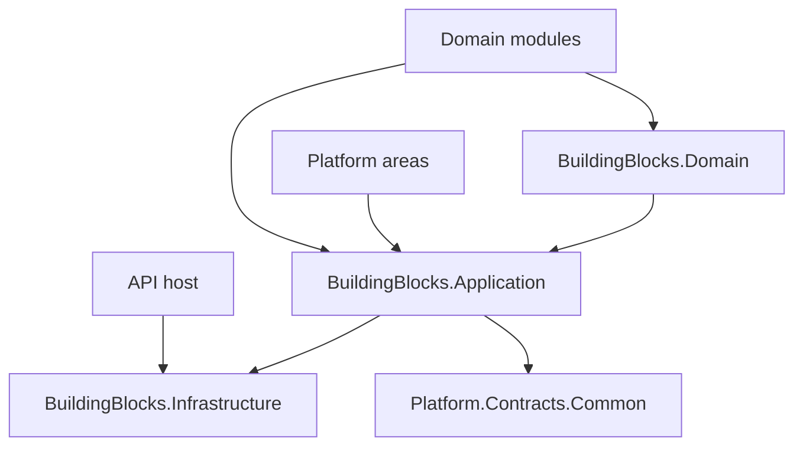

# Архитектура — Foundation

[domain-project]: ../../../src/BuildingBlocks/DMP.BuildingBlocks.Domain/
[application-project]: ../../../src/BuildingBlocks/DMP.BuildingBlocks.Application/
[infrastructure-project]: ../../../src/BuildingBlocks/DMP.BuildingBlocks.Infrastructure/
[domain-csproj]: ../../../src/BuildingBlocks/DMP.BuildingBlocks.Domain/DMP.BuildingBlocks.Domain.csproj
[application-csproj]: ../../../src/BuildingBlocks/DMP.BuildingBlocks.Application/DMP.BuildingBlocks.Application.csproj
[infrastructure-csproj]: ../../../src/BuildingBlocks/DMP.BuildingBlocks.Infrastructure/DMP.BuildingBlocks.Infrastructure.csproj
[platform-contracts]: ../../../src/Platform/DMP.Platform.Contracts/
[architecture-tests]: ../../../tests/DMP.Platform.ArchTests/Architecture/

## 1. Назначение документа

Документ описывает техническую архитектуру общего слоя Foundation: его
компоненты, направление зависимостей, архитектурные типы и границу между
общим портом и реализацией capability. Полный каталог классов и методов сюда
не входит.

## 2. Граница и компоненты



| Компонент | Ответственность | Зависимости | Подтверждение |
| --- | --- | --- | --- |
| `DMP.BuildingBlocks.Domain` | Минимальные доменные примитивы и абстракции, не содержащие бизнес-смысла конкретного модуля. | Нет project reference к Application или Platform area. | [Domain project][domain-project], [project file][domain-csproj] |
| `DMP.BuildingBlocks.Application` | Контексты, use-case contracts, результаты, общие порты и универсальные application helpers. | `BuildingBlocks.Domain`, `DMP.Platform.Contracts`. | [Application project][application-project], [project file][application-csproj] |
| `DMP.BuildingBlocks.Infrastructure` | Точка подключения инфраструктурных зависимостей на уровне проекта. | `BuildingBlocks.Domain`, `BuildingBlocks.Application`. | [Infrastructure project][infrastructure-project], [project file][infrastructure-csproj] |
| Потребляющие области и модули | Реализуют свои capability, бизнес-смысл, storage и concrete adapters. | Foundation и контракты конкретных областей. | [Архитектурные тесты][architecture-tests] |

Foundation — библиотечный слой, а не набор deployable services. Логические
gateway не означают физическое выделение сервисов и не меняют владельца данных.

## 3. Архитектурная модель и инварианты

### 3.1. Доменный базовый слой

```text
Entity
└── TenantEntity
    └── AuditableTenantEntity
        └── AggregateRoot
```

| Понятие или архитектурный тип | Техническое имя | Владелец | Связи | Инвариант | Подтверждение |
| --- | --- | --- | --- | --- | --- |
| Минимальная сущность | `Entity` | Foundation | Базовый тип для сущностей потребителей | `Id` задаётся при создании и доступен только для чтения извне. | [Entity.cs][entity] |
| Tenant-aware сущность | `TenantEntity`, `ITenantOwnedEntity` | Foundation | Расширяет `Entity`; используется tenant-owned моделями | Сущность имеет обязательный `TenantId`. | [TenantEntity.cs][tenant-entity], [ITenantOwnedEntity.cs][tenant-owned] |
| Tenant-aware сущность с аудитом | `AuditableTenantEntity` | Foundation | Расширяет `TenantEntity` | Времена хранятся в UTC; инициаторы представлены идентификаторами пользователей. | [AuditableTenantEntity.cs][auditable-entity] |
| Корень агрегата | `AggregateRoot` | Foundation | Расширяет `AuditableTenantEntity`; накапливает `IDomainEvent` | Доменное событие регистрируется внутри агрегата и очищается после обработки владельцем. | [AggregateRoot.cs][aggregate-root] |
| Scope-bound контракт | `IScopeBoundEntity` | Foundation | Может представлять global, tenant или site scope | `SiteId` не допускается без `TenantId`. | [ScopeCoordinateRules.cs][scope-rules] |
| Доменное событие | `IDomainEvent` | Foundation | Реализуется доменным модулем или capability | Событие содержит tenant-контекст и время возникновения в UTC. | [IDomainEvent.cs][domain-event] |

Эти типы задают техническую основу. Они не определяют, является ли сущность
заказом, номенклатурой, конфигурацией или пользователем, и не заменяют
инварианты владельца бизнес-модели.

### 3.2. Application-модель

Application-слой соединяет общий контекст и порты с конкретными сценариями.
`ModuleExecutionContext` является переносимым описанием текущего сценария; он
не является persistence-моделью и не должен превращаться в локальный аналог в
каждом модуле. `IPlatformRuntimeServicesGateway` задаёт порты, а не реализации
Workflow, Rules, Configuration, Audit или Events.

К той же application-границе относятся общие контракты сообщений и проблем.
Foundation задаёт `IPlatformMessageResolver`,
`IPlatformMessageTemplateProvider` и типы `DMP.Platform.Contracts.Common.Messages`.
Текущая реализация `DefaultPlatformMessageResolver` и встроенные шаблоны находятся
в Object Runtime, потому что Runtime регистрирует их в composition root. Это не
делает Runtime владельцем общей формы контракта: смысл кода проблемы и шаблона
остаётся у модуля, который его сформировал.

### 3.3. Архитектурные инварианты

- Foundation не ссылается на `DMP.Modules.Common` или другой конкретный доменный модуль.
- Доменный слой не зависит от application- или HTTP-контрактов.
- Application-порты не переносят бизнес-инварианты доменных сущностей.
- Потребитель описывает своё наследование и использование Foundation, но не копирует общие определения.
- Физическая project reference не превращает capability-потребителя во владельца Foundation-типа.

## 4. Persistence-модель и хранение

| Данные | Техническое представление | Владелец | Хранение | Ключ или ограничение | Подтверждение |
| --- | --- | --- | --- | --- | --- |
| Общие свойства сущности | Свойства базовых классов `Entity` и наследников | Потребляющий модуль | Таблица или document storage потребителя | Маппинг и индексы задаёт владелец сущности | [Domain project][domain-project] |
| Контекст выполнения | `ModuleExecutionContext` и request context interfaces | Текущий application/runtime consumer | Не является самостоятельным хранилищем | Живёт в рамках запроса или операции | [Application project][application-project] |
| Реестр стабильных кодов | `IModuleContractRegistry` и `ModuleContractCode` | Foundation задаёт контракт; модуль регистрирует свои значения | Обычно registry composition/runtime | Код не должен быть свободной строкой без владельца | [ModuleContracts.cs][module-contracts] |
| Foundation persistence | Самостоятельная схема отсутствует | Не применяется | `DMP.BuildingBlocks.Infrastructure` не содержит текущей persistence-модели | Не создавать миграции только для Foundation | [Infrastructure project][infrastructure-project] |

Foundation не владеет таблицами и миграциями Tenant Security, Configuration,
Object Runtime или доменных модулей.

## 5. Зависимости и точки расширения

| Точка | Назначение | Кто расширяет | Ограничение |
| --- | --- | --- | --- |
| `IDomainModule` | Представить модуль и его `ModuleCode`. | Domain Modules и platform modules. | Модуль регистрирует только свои stable codes. |
| `IModuleContractRegistry` | Зарегистрировать и проверить тип и значение стабильного кода. | Composition/runtime registry. | Не заменяется локальным ad-hoc registry без решения. |
| `IPlatformRuntimeServicesGateway` | Обратиться к platform services через application-порт. | Composition root и владельцы capability. | Foundation не гарантирует подключение каждого nested gateway. |
| `IReferenceDisplayResolverRegistry` | Разрешить отображаемые значения references. | Platform/domain providers. | Источник данных и язык определяет provider/его владелец. |
| `IClock`, `ICorrelationContext`, request contexts | Дать тестируемые источники времени и контекста. | Host, middleware и tests. | Реализация не должна скрывать tenant/access boundary. |

## 6. Технические ограничения

- Текущая реализация — .NET 9 library layer.
- `BuildingBlocks.Application` имеет прямую зависимость от `DMP.Platform.Contracts`; это зафиксированная текущая связь, а не утверждение целевой Java-архитектуры.
- `AggregateRoot` в текущем коде наследует `AuditableTenantEntity`; global-модели не следует объявлять через него без проверки смысла.
- Интерфейсы gateway могут иметь no-op реализацию, но её production-допустимость не следует считать гарантированной.
- Foundation не предоставляет HTTP routes, рендерер фронтенда или самостоятельный persistence lifecycle.
[entity]: ../../../src/BuildingBlocks/DMP.BuildingBlocks.Domain/Primitives/Entity.cs
[tenant-entity]: ../../../src/BuildingBlocks/DMP.BuildingBlocks.Domain/Primitives/TenantEntity.cs
[auditable-entity]: ../../../src/BuildingBlocks/DMP.BuildingBlocks.Domain/Primitives/AuditableTenantEntity.cs
[aggregate-root]: ../../../src/BuildingBlocks/DMP.BuildingBlocks.Domain/Primitives/AggregateRoot.cs
[scope-rules]: ../../../src/BuildingBlocks/DMP.BuildingBlocks.Domain/Primitives/ScopeCoordinateRules.cs
[tenant-owned]: ../../../src/BuildingBlocks/DMP.BuildingBlocks.Domain/Abstractions/ITenantOwnedEntity.cs
[domain-event]: ../../../src/BuildingBlocks/DMP.BuildingBlocks.Domain/Abstractions/IDomainEvent.cs
[module-contracts]: ../../../src/BuildingBlocks/DMP.BuildingBlocks.Application/Abstractions/ModuleContracts.cs

## История изменений

| Версия | Дата и время | Автор | Раздел | Изменение | Коммит/PR |
|---|---|---|---|---|---|
| 0.1 | 2026-08-27 15:04 +03:00 | Олег Юрьев (@axelprosoft) | Создание документа | подготовлен драфт новой проектной документации на ядро, прикладные модули, а так же термины и общие концептуальные документы | [5ecb26b1](https://github.com/axelprosoft/DMP.PlatformFoundation/commit/5ecb26b1c3ff3cfcdc13018e59526ae684ca6007) |
