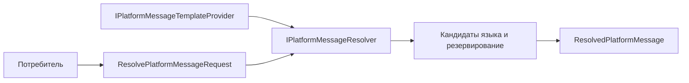

# Исполнение — Foundation

[application-project]: ../../../src/BuildingBlocks/DMP.BuildingBlocks.Application/
[context]: ../../../src/BuildingBlocks/DMP.BuildingBlocks.Application/Abstractions/ModuleExecutionContext.cs
[context-create]: ../../../src/BuildingBlocks/DMP.BuildingBlocks.Application/Abstractions/ModuleExecutionContext.cs
[query-normalization]: ../../../src/BuildingBlocks/DMP.BuildingBlocks.Application/Common/ListQueryNormalization.cs
[ordering]: ../../../src/BuildingBlocks/DMP.BuildingBlocks.Application/Ordering/ListOrdering.cs
[localization]: ../../../src/BuildingBlocks/DMP.BuildingBlocks.Application/Localization/LocalizedTextResolver.cs
[reference-registry]: ../../../src/BuildingBlocks/DMP.BuildingBlocks.Application/Common/ReferenceDisplayResolverRegistry.cs
[gateway-fallback]: ../../../src/BuildingBlocks/DMP.BuildingBlocks.Application/Abstractions/AllowAllPlatformRuntimeServicesGateway.cs
[results]: ../../../src/BuildingBlocks/DMP.BuildingBlocks.Application/Abstractions/UseCaseResult.cs
[bulk-results]: ../../../src/BuildingBlocks/DMP.BuildingBlocks.Application/Abstractions/BulkUseCaseResult.cs
[unit-of-work]: ../../../src/BuildingBlocks/DMP.BuildingBlocks.Application/Abstractions/IUnitOfWork.cs
[message-resolver]: ../../../src/BuildingBlocks/DMP.BuildingBlocks.Application/Abstractions/IPlatformMessageResolver.cs
[message-provider]: ../../../src/BuildingBlocks/DMP.BuildingBlocks.Application/Abstractions/IPlatformMessageTemplateProvider.cs
[message-implementation]: ../../../src/Platform/DMP.Platform.Runtime/Application/Services/Core/DefaultPlatformMessageResolver.cs

## 1. Назначение документа

Документ описывает исполняемые правила общего слоя Foundation. Здесь находятся
только алгоритмы и последовательности, которые имеют общий смысл для нескольких
потребителей. Runtime-поведение Tenant Security, Configuration, Object Runtime,
Workflow и доменных модулей описывается в документах их владельцев.

## 2. Основные сценарии

| Сценарий | Предусловия | Последовательность | Результат | Подтверждение |
| --- | --- | --- | --- | --- |
| Создание контекста модуля | Доступны tenant context, correlation context и clock | Считать координаты запроса, добавить коды модуля/объекта/action и `UtcNow` | `ModuleExecutionContext` | [ModuleExecutionContext][context-create] |
| Выполнение use-case | Определены request и result type | Вызвать `ExecuteAsync` соответствующего application service | Результат use-case | [IUseCase][use-case] |
| Формирование результата | Сценарий завершился успешно или с issues | Собрать payload и проблемы; для bulk сохранить item-level outcome | `UseCaseResult<T>` или `BulkUseCaseResult<TItem>` | [results][results], [bulk results][bulk-results] |
| Нормализация запроса списка | Потребитель передал поля сортировки, группировки или фильтрации | Удалить пустые значения, нормализовать форму и проверить допустимые поля на стороне потребителя | Нормализованные параметры или ошибка | [ListQueryNormalization][query-normalization] |
| Разрешение локализованного текста | Есть язык, значения и технический код | Проверить exact language, neutral language, invariant value и fallback на technical code | `ResolvedLocalizedText` | [LocalizedTextResolver][localization] |
| Подготовка сообщения платформы | Переданы код шаблона, аргументы, язык и резервный текст | Найти шаблон у зарегистрированных поставщиков, выбрать текст по правилам резервирования языка, подставить аргументы или вернуть резервный текст | `ResolvedPlatformMessage` | [IPlatformMessageResolver][message-resolver], текущая реализация — [DefaultPlatformMessageResolver][message-implementation] |

### 2.1. Подготовка сообщения

Общий поток подготовки сообщения выглядит так:



Потребитель формирует запрос, а поставщик предоставляет шаблоны. Средство разрешения
сообщений проверяет зарегистрированные поставщики по порядку, выбирает
локализованный текст, затем
подставляет именованные аргументы. При отсутствии шаблона или текста возвращается
`FallbackMessage`, если он передан; сам Foundation не создаёт HTTP-ответ.
Текущая реализация и встроенные шаблоны находятся в Object Runtime, а форма
контракта принадлежит Foundation. ([реализация][message-implementation];
[поставщик шаблонов][message-provider])
| Разрешение reference display | Зарегистрирован resolver и передан список идентификаторов | Найти resolver, нормализовать/уникализировать ids и запросить display values | Словарь `ReferenceDisplay` | [Registry][reference-registry] |

## 3. Операции и алгоритмы

| Операция | Вход | Алгоритм | Результат | Ошибки | Потребители |
| --- | --- | --- | --- | --- | --- |
| `ModuleExecutionContext.Create` | Context abstractions, module/object/action codes | Собирает неизменяемую запись из текущих context values и UTC clock | Context операции | Ошибка зависит от provider context | Platform areas и domain modules |
| `LocalizedTextResolver.Resolve` | language, localized values, technical code | Exact → neutral → invariant → technical code; пустые Name/Description пропускаются | Name и Description | Невалидный language или technical code | Runtime, Configuration и platform messages |
| `ReferenceDisplayResolverRegistry.ResolveByIdsAsync` | source code, ids, language | Проверяет source/ids, очищает пробелы, удаляет дубликаты и вызывает выбранный resolver | Empty dictionary или resolver result | Ошибка provider передаётся потребителю | Lookup и display adapters |
| `ListOrdering` validation | Query fields и allowed fields | Нормализует поля и отклоняет неизвестные поля через `PlatformInvalidRequestException` | Ordered query или ошибка | `LIST_ORDER_FIELD_NOT_MAPPED` и reason code владельца | Platform query services |
| `IPlatformMessageResolver.ResolveAsync` | `ResolvePlatformMessageRequest` | Разрешает шаблон, выбирает текст по правилам резервирования языка и подставляет значения аргументов | `ResolvedPlatformMessage` | При отсутствии текста используется `FallbackMessage` | Runtime и поставщики сообщений |

Эти helper-алгоритмы не являются публичным HTTP API. Их внешний эффект состоит
в форме результата и стабильных кодах ошибки, которые потребитель обязан
учитывать в своём контракте.

## 4. Правила

| Правило | Условие | Результат | Исключение | Подтверждение |
| --- | --- | --- | --- | --- |
| Контекст неизменяем | Контекст создан для операции | Consumer получает record с зафиксированными координатами | Новый сценарий создаёт новый контекст | [context][context] |
| Ошибка списка проверяется до выполнения запроса | Поле отсутствует в allow-list | Запрос отклоняется структурированной ошибкой | Потребитель может не поддерживать сортировку/группировку | [ordering][ordering] |
| Локализация использует последовательность fallback | Exact value отсутствует | Используется neutral, invariant или technical code | Пустой результат допускается только по правилам конкретного consumer | [localization][localization] |
| Сообщение использует резервный текст | Шаблон или локализованный текст отсутствует | Возвращается резервный текст, а `UsedFallback` получает значение `true` | Если резервный текст не передан, результат может быть пустым | [message-implementation][message-implementation] |
| Неизвестный reference source не вызывает произвольный provider | Source code не зарегистрирован | Возвращается пустой результат | Consumer может отдельно выдать собственную ошибку | [reference-registry][reference-registry] |
| Общие сервисы вызываются через порт | Application service обращается к platform capability | Используется gateway contract | Прямой concrete dependency требует отдельного решения | [gateway][gateway] |

## 5. Жизненные циклы

Foundation не владеет жизненным циклом бизнес-сущности, конфигурации или
workflow. Он участвует только в жизненном цикле application-сценария:

```text
создание контекста
  -> выполнение use-case
  -> формирование результата
  -> сохранение владельцем через IUnitOfWork
  -> завершение сценария
```

`IUnitOfWork.SaveChangesAsync` является application-портом сохранения. Он не
обещает сам по себе общую транзакцию между несколькими владельцами, retry или
outbox delivery. ([IUnitOfWork][unit-of-work])

## 6. Согласованность

| Изменение | Граница транзакции | Конкуренция | Идемпотентность | Побочные эффекты |
| --- | --- | --- | --- | --- |
| Application use-case потребителя | Определяется владельцем use-case и его storage | Определяется владельцем данных | Не задаётся Foundation автоматически | Возможны вызовы platform gateways |
| Регистрация стабильных кодов | Обычно composition/startup boundary | Проверка registry зависит от реализации | Повторная регистрация должна быть обработана registry | Влияет на configuration/runtime validation |
| Разрешение текста или reference display | Read-only операция | Определяется provider | Повторный read не меняет состояние | Нет записи в Foundation storage |

## 7. Сбои и восстановление

- Неизвестное поле списка приводит к `PlatformInvalidRequestException` с reason code.
- Пустой или незарегистрированный reference source возвращает пустой результат согласно текущей реализации registry.
- `AllowAllPlatformRuntimeServicesGateway` существует как no-op реализация для сценариев, где интеграция ещё не подключена. Код не доказывает её допустимость для production; потребитель и composition root должны явно определить это ограничение. ([fallback][gateway-fallback])
- Ошибка конкретного provider, gateway или storage не получает от Foundation единую retry-политику.
- Восстановление после сбоя, повтор операции и доставка событий принадлежат владельцу соответствующей capability.
- Полное хранение шаблонов сообщений через Configuration и общий каталог кодов
  ошибок не входят в текущую реализацию Foundation.
[use-case]: ../../../src/BuildingBlocks/DMP.BuildingBlocks.Application/Abstractions/IUseCase.cs
[ordering]: ../../../src/BuildingBlocks/DMP.BuildingBlocks.Application/Ordering/ListOrdering.cs
[gateway]: ../../../src/BuildingBlocks/DMP.BuildingBlocks.Application/Abstractions/IPlatformRuntimeServicesGateway.cs
[fallback]: ../../../src/BuildingBlocks/DMP.BuildingBlocks.Application/Abstractions/AllowAllPlatformRuntimeServicesGateway.cs

## История изменений

| Версия | Дата и время | Автор | Раздел | Изменение | Коммит/PR |
|---|---|---|---|---|---|
| 0.1 | 2026-08-27 15:04 +03:00 | Олег Юрьев (@axelprosoft) | Создание документа | подготовлен драфт новой проектной документации на ядро, прикладные модули, а так же термины и общие концептуальные документы | [5ecb26b1](https://github.com/axelprosoft/DMP.PlatformFoundation/commit/5ecb26b1c3ff3cfcdc13018e59526ae684ca6007) |
