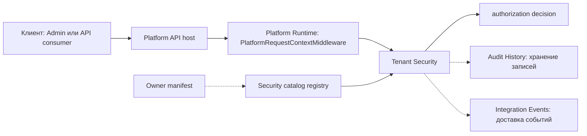

# Обзор платформенной области — Tenant Security

[baseline]: https://github.com/axelprosoft/DMP.PlatformFoundation/commit/3e2037ac37683eef331d70223c6babfc61aa0539
[project]: https://github.com/axelprosoft/DMP.PlatformFoundation/tree/3e2037ac37683eef331d70223c6babfc61aa0539/src/Platform/DMP.Platform.TenantSecurity
[contracts]: https://github.com/axelprosoft/DMP.PlatformFoundation/tree/3e2037ac37683eef331d70223c6babfc61aa0539/src/Platform/DMP.Platform.Contracts/TenantSecurity
[controllers]: https://github.com/axelprosoft/DMP.PlatformFoundation/tree/3e2037ac37683eef331d70223c6babfc61aa0539/src/Platform/DMP.Platform.TenantSecurity/Api/Controllers
[host]: https://github.com/axelprosoft/DMP.PlatformFoundation/blob/3e2037ac37683eef331d70223c6babfc61aa0539/src/Hosts/DMP.Platform.Api/Composition/PlatformApiCompositionExtensions.cs
[request-context]: https://github.com/axelprosoft/DMP.PlatformFoundation/blob/3e2037ac37683eef331d70223c6babfc61aa0539/src/Platform/DMP.Platform.Runtime/Context/PlatformRequestContext.cs
[platform-terms]: ../../11_glossary/platform_terms.md
[security-terms]: ../../11_glossary/security_terms.md
[foundation]: ../00_foundation/00_platform_overview.md
[frontend]: https://github.com/axelprosoft/DMP.PlatformFoundation/tree/3e2037ac37683eef331d70223c6babfc61aa0539/src/Frontend/apps/admin/src/features
[tests]: https://github.com/axelprosoft/DMP.PlatformFoundation/tree/3e2037ac37683eef331d70223c6babfc61aa0539/tests

## 1. Назначение области

Tenant Security владеет контекстом предприятия и площадки, данными пользователей, ролями, правами, назначениями и проверкой доступа. Другие платформенные области публикуют manifests каталога безопасности и используют adapters проверки доступа, не копируя эту модель. ([project][project]; [contracts][contracts])

## 2. Место в платформе

Платформенная область работает внутри общего Platform API host. HTTP API и C# contracts образуют внешнюю границу; domain, application services и persistence остаются внутренней реализацией. Admin frontend использует опубликованные контракты через собственный API package. ([host][host]; [controllers][controllers]; [contracts][contracts]; [frontend][frontend])

Связи Tenant Security с другими областями сведены в [интеграционной
архитектуре Platform Core](../../02_architecture/07_integration_architecture.md).
Здесь подробно описываются только собственные контракты, проверка доступа,
публикация событий и аудит.

Схема показывает место Tenant Security в платформе: Runtime передаёт контекст,
область принимает решение доступа и использует внешний registry, Audit History и
Integration Events. Пунктир означает внешнюю границу или использование чужой
capability; он не означает владение Tenant Security хранением аудита или доставкой
событий. ([host][host]; [request-context][request-context]; [contracts][contracts])

Локальная терминология пакета повторяет ключевые термины из [платформенного глоссария][platform-terms] и [глоссария безопасности][security-terms]. Источником истины для спорных русских/английских пар остаётся тематический глоссарий.

| Термин | Техническое имя | Значение | Источник |
| --- | --- | --- | --- |
| Платформенная область Tenant Security | `DMP.Platform.TenantSecurity`, `TenantSecurity` | Владелец модели предприятий, пользователей, ролей, прав и проверки доступа. | [security terms][security-terms]; [project][project] |
| Контекст запроса | `PlatformRequestContext` | Координаты tenant/user/site/role/correlation/language из platform middleware. | [platform terms][platform-terms]; [request context][request-context] |
| Проверка доступа | `authorization decision`, `AuthorizeAsync`, `AuthorizeResult` | Решение `ALLOW` или отказ с reason code. | [security terms][security-terms]; [исполнение](04_runtime.md) |
| Каталог безопасности | `security catalog`, `ITenantSecurityCapabilityCatalogManifest` | Описание ресурсов, операций, прав, ролей, политик и локализаций. | [security terms][security-terms]; [Контракты](03_contracts.md) |
| Интерфейсная часть Admin | Admin feature provider / flow | Раздел, сценарий или provider Admin, который вызывает Tenant Security API. | [platform terms][platform-terms]; [Пользовательский слой](06_user_experience.md) |

## 3. Основные возможности

| Возможность | Назначение | Статус | Основание |
| --- | --- | --- | --- |
| Tenant, Site и User | Хранение данных пользователей и координат tenant/site. | Реализовано с ограничениями | [Архитектура](02_architecture.md); [project][project] |
| Роли, права и назначения | Каталог безопасности, профили ролей, policies выдачи прав и назначения ролей. | Реализовано с ограничениями | [Безопасность и аудит](05_security_and_audit.md); [project][project] |
| Проверка доступа | Решение по permission code в tenant/site context и локальная проверка request session для обычных `[Authorize]` routes. | Реализовано с ограничениями: production token/trusted ingress и полная route policy coverage остаются открытыми. | [Исполнение](04_runtime.md); [трассировка](90_traceability.md) |
| Публичные контракты | C# contracts, HTTP API, события, manifest extension и конфигурация. | Частично | [Контракты](03_contracts.md) |
| Admin UI | Предприятия, пользователи, роли, права и назначения ролей. | Частично | [Пользовательский слой](06_user_experience.md); [frontend][frontend] |
| Инициализация и миграции | Bootstrap, регистрация каталога и expand/contract migration. | Реализовано с эксплуатационными ограничениями | [Эксплуатация](08_operations.md) |

## 4. Ключевые решения

| Решение | Суть | Документ-владелец |
| --- | --- | --- |
| Один tenant для пользователя | Модель хранит `User.TenantId`; расхождение с membership см. в [трассировке](90_traceability.md): `TS-DEC-02` — User membership. | [Архитектура](02_architecture.md); [трассировка](90_traceability.md) |
| Scope назначения задаёт роль | Coordinate assignment проверяется по `Role.ScopeType`. | [Исполнение](04_runtime.md) |
| Каталог собирается из manifests владельцев | Tenant Security хранит registry, а каждая платформенная область владеет своими codes и локализациями. | [Контракты](03_contracts.md) |
| Состояние сохраняется раньше вызовов аудита и событий | Подробный порядок описан в runtime; открытое решение см. в [трассировке](90_traceability.md): `TS-DEC-06` — audit/outbox. | [Исполнение](04_runtime.md); [трассировка](90_traceability.md) |
| Локальный вход не выдаёт token/cookie | Login возвращает данные для request context; обычный `[Authorize]` дополнительно проверяет active user, tenant и role assignment. Production token/trusted ingress остаются открытыми: `TS-DEC-01`. | [Контракты](03_contracts.md); [Исполнение](04_runtime.md); [трассировка](90_traceability.md) |
| Frontend и API выбирают язык раздельно | `Tenant.DefaultLanguage` уже используется Admin, Runtime и Studio для языка интерфейса, но не входит в серверный API resolver; унификация остаётся `TS-DEC-09`. | [Пользовательский слой](06_user_experience.md); [трассировка](90_traceability.md) |

## 5. Зависимости

| Зависимость | Использование | Владелец |
| --- | --- | --- |
| Foundation | Общие domain/application-примитивы, контексты запроса, общие результаты, локализация и transport-типы. | [`00_foundation`][foundation] |
| Platform Runtime | Request context и authorization adapters. | Runtime / API host. ([host][host]) |
| Audit History | Хранение сформированных audit records. | Audit History. ([project][project]) |
| Integration Events | Доставка опубликованных event envelopes. | Integration Events. ([project][project]) |
| Admin frontend | Разделы интерфейса и видимость по правам. | Frontend. ([frontend][frontend]) |
| Области-владельцы | Публикация manifests каталога безопасности. | Владелец каждой платформенной области. ([contracts][contracts]) |

## 6. Статус реализации

Помимо базовой модели, CRUD, правил управления, регистрации каталога,
Admin-разделов и миграций, в нём подтверждена локальная проверка request session
для обычных `[Authorize]` routes. Production authentication boundary и
непокрытые policy routes остаются открытыми решениями в [трассировке](90_traceability.md).
([baseline][baseline]; [project][project]; [tests][tests])

Логика вывода

Статус получен сопоставлением кода платформенной области, contracts, host composition, frontend и тестов. Возможность считается реализованной только при наличии исполняемой границы; требование или draft ADR без такой границы остаётся расхождением или будущей доработкой в трассировке. ([project][project]; [contracts][contracts]; [host][host]; [frontend][frontend]; [tests][tests])

## 7. Состав документов

| Документ | Ответственность |
| --- | --- |
| [`00_platform_overview.md`](00_platform_overview.md) | Роль, ключевые решения, статус и карта пакета. |
| [`01_scope.md`](01_scope.md) | Полная граница ответственности и владельцы соседних обязанностей. |
| [`02_architecture.md`](02_architecture.md) | Компоненты, модель, данные, зависимости и ограничения. |
| [`03_contracts.md`](03_contracts.md) | API, events, configuration, compatibility и integrations. |
| [`04_runtime.md`](04_runtime.md) | Сценарии, алгоритмы, правила, lifecycle и consistency. |
| [`05_security_and_audit.md`](05_security_and_audit.md) | Проверка доступа, контроли, риски и покрытие аудитом. |
| [`06_user_experience.md`](06_user_experience.md) | Frontend-контракты, разделы интерфейса Admin, навигация и локализация. |
| [`07_quality.md`](07_quality.md) | Надёжность, наблюдаемость, производительность и проверки. |
| [`08_operations.md`](08_operations.md) | Startup, migrations, diagnosis и recovery. |
| [`90_traceability.md`](90_traceability.md) | Источники, расхождения и открытые решения. |

## История изменений

| Версия | Дата и время | Автор | Раздел | Изменение | Коммит/PR |
|---|---|---|---|---|---|
| 0.1 | 2026-08-27 15:04 +03:00 | Олег Юрьев (@axelprosoft) | Создание документа | подготовлен драфт новой проектной документации на ядро, прикладные модули, а так же термины и общие концептуальные документы | [5ecb26b1](https://github.com/axelprosoft/DMP.PlatformFoundation/commit/5ecb26b1c3ff3cfcdc13018e59526ae684ca6007) |
