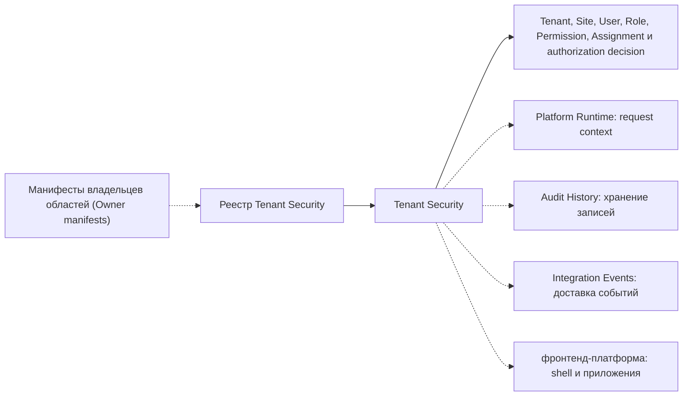

# Граница платформенной области — Tenant Security

[interface]: https://github.com/axelprosoft/DMP.PlatformFoundation/blob/3e2037ac37683eef331d70223c6babfc61aa0539/src/Platform/DMP.Platform.TenantSecurity/Application/Abstractions/ITenantSecurityService.cs
[service]: https://github.com/axelprosoft/DMP.PlatformFoundation/blob/3e2037ac37683eef331d70223c6babfc61aa0539/src/Platform/DMP.Platform.TenantSecurity/Application/Services/TenantSecurityService.cs
[entities]: https://github.com/axelprosoft/DMP.PlatformFoundation/tree/3e2037ac37683eef331d70223c6babfc61aa0539/src/Platform/DMP.Platform.TenantSecurity/Domain/Entities
[db]: https://github.com/axelprosoft/DMP.PlatformFoundation/blob/3e2037ac37683eef331d70223c6babfc61aa0539/src/Platform/DMP.Platform.TenantSecurity/Infrastructure/Persistence/TenantSecurityDbContext.cs
[controllers]: https://github.com/axelprosoft/DMP.PlatformFoundation/tree/3e2037ac37683eef331d70223c6babfc61aa0539/src/Platform/DMP.Platform.TenantSecurity/Api/Controllers
[sites]: https://github.com/axelprosoft/DMP.PlatformFoundation/blob/3e2037ac37683eef331d70223c6babfc61aa0539/src/Platform/DMP.Platform.TenantSecurity/Api/Controllers/TenantSecuritySitesController.cs
[manifest]: https://github.com/axelprosoft/DMP.PlatformFoundation/blob/3e2037ac37683eef331d70223c6babfc61aa0539/src/Platform/DMP.Platform.TenantSecurity/Infrastructure/Security/TenantSecuritySecurityCatalogManifest.cs
[registration]: https://github.com/axelprosoft/DMP.PlatformFoundation/blob/3e2037ac37683eef331d70223c6babfc61aa0539/src/Platform/DMP.Platform.TenantSecurity/Application/Services/TenantSecurityCapabilityRegistrationService.cs
[middleware]: https://github.com/axelprosoft/DMP.PlatformFoundation/blob/3e2037ac37683eef331d70223c6babfc61aa0539/src/Platform/DMP.Platform.Runtime/Context/PlatformRequestContextMiddleware.cs
[audit]: https://github.com/axelprosoft/DMP.PlatformFoundation/blob/3e2037ac37683eef331d70223c6babfc61aa0539/src/Platform/DMP.Platform.AuditHistory/Abstractions/IAuditHistoryWriter.cs
[events]: https://github.com/axelprosoft/DMP.PlatformFoundation/blob/3e2037ac37683eef331d70223c6babfc61aa0539/src/Platform/DMP.Platform.IntegrationEvents/Abstractions/IIntegrationEventPublisher.cs

## 1. Назначение документа

Документ отделяет обязанности Tenant Security от аутентификации, Platform Runtime, доставки аудита/событий и предметных manifests каталога безопасности. ([interface][interface]; [controllers][controllers])

## 2. Что входит

Схема фиксирует границу ответственности. Сплошная связь показывает собственную
семантику Tenant Security; пунктир показывает внешний контекст, потребляемую
capability или ограничение владельца. `Owner manifests` поставляют свои определения
каталога, а Tenant Security регистрирует и проверяет их, но не становится владельцем
чужих permission definitions. ([middleware][middleware]; [registration][registration]; [audit][audit]; [events][events])

| Обязанность | Входит | Не входит | Соседний владелец | Основание |
| --- | --- | --- | --- | --- |
| Tenant и Site | Tenant CRUD/status; Site read model и lookup. | Site mutation API и physical tenant database routing. | Tenant Security / hosting infrastructure | [interface][interface]; [Site API][sites]; [database][db] |
| User и локальные учётные данные | User CRUD/status, password set/reset, local verification и проверка request session на обычных `[Authorize]` routes. | Production token issuance/trusted ingress, external identity provider и SSO federation. | Tenant Security / authentication boundary | [interface][interface]; [service][service] |
| Роли и назначения | Профиль и статус роли, связи роль–право, политика выдачи права, назначения ролей и правила управления. | Multi-tenant user membership и organizational-unit model. | Tenant Security | [interface][interface]; [entities][entities] |
| Проверка доступа | Effective permissions и decision по permission code в user/tenant/site context. | ABAC/Rule Engine и resource-level evaluation через `ResourceContext`. | Tenant Security / Rules | [interface][interface]; [service][service] |
| Каталог безопасности (`security catalog`) | Resources, verbs, permissions, roles, policies и localizations из manifests. | Предметный состав permissions чужой платформенной области. | Область-владелец / Tenant Security registry | [manifest][manifest]; [registration][registration] |
| Аудит и события | Формирование отдельных records/messages как побочных действий команд. | Хранение audit и доставка events. | Audit History / Integration Events | [service][service]; [audit contract][audit]; [event contract][events] |

## 3. Что не входит

За границей остаются production token-аутентификация и trusted ingress, external identity federation, multi-tenant membership, physical tenant isolation, Site mutation API и resource-level ABAC. Локальная проверка request session уже реализована для обычной `[Authorize]` policy, но не заменяет production authentication и не означает полное покрытие маршрутов. ([entities][entities]; [interface][interface]; [controllers][controllers]; [db][db])

Логика вывода

Граница получена пересечением application interface, controllers, entities и persistence. Возможность отнесена за границу, если она заявлена в исходных материалах, но не имеет исполняемого владельца в этих слоях. ([interface][interface]; [controllers][controllers]; [entities][entities]; [db][db])

## 4. Граница с соседними областями и модулями

- Platform Runtime формирует контекст запроса; Tenant Security использует его для проверки доступа, но не владеет transport middleware. ([middleware][middleware]; [service][service])
- Audit History хранит audit records, Integration Events доставляет messages; Tenant Security только формирует вызов и payload. ([audit][audit]; [events][events]; [service][service])
- Другие capabilities владеют содержанием своих manifests; Tenant Security проверяет владение и синхронизирует общий registry. ([registration][registration])
- Будущая фронтенд-платформа владеет общим shell, приложениями Admin/Runtime/Studio и shared runtime packages; Tenant Security описывает только свои разделы Admin и server contracts проверки доступа. ([controllers][controllers])

## 5. Соответствие требованиям

| Требование | Покрытие | Решение | Документ-владелец |
| --- | --- | --- | --- |
| Tenant, Site и tenant context | Частично | Физическая изоляция и Site mutations остаются за границей текущего решения. | [Архитектура](02_architecture.md); [трассировка](90_traceability.md) |
| Пользователи, роли и назначения | Частично | Single-tenant user и scope-aware assignment подтверждены кодом; membership см. в [трассировке](90_traceability.md): `TS-DEC-02` — User membership. | [Архитектура](02_architecture.md); [трассировка](90_traceability.md) |
| Проверка доступа и правила управления | Частично | Действующий порядок проверки и route coverage раскрыты у владельцев. | [Безопасность и аудит](05_security_and_audit.md); [трассировка](90_traceability.md) |
| Authentication boundary | Открытый вопрос | Local session validation реализована; production token/trusted ingress и external identity federation не определены. См. [трассировку](90_traceability.md): `TS-DEC-01`. | [Трассировка](90_traceability.md) |
| Audit и integration events | Частично | Tenant Security формирует часть records/messages; хранение и доставка принадлежат соседним областям. | [Контракты](03_contracts.md); [безопасность и аудит](05_security_and_audit.md) |

## 6. Ограничения версии

Ограничения, которые требуют архитектурного решения после MVP, ведутся в [трассировке](90_traceability.md) как `TS-DEC-*`. Этот документ фиксирует только текущую границу ответственности. ([service][service]; [entities][entities]; [db][db])

## История изменений

| Версия | Дата и время | Автор | Раздел | Изменение | Коммит/PR |
|---|---|---|---|---|---|
| 0.1 | 2026-08-27 16:52 +03:00 | Олег Юрьев (@axelprosoft) | Создание документа | docs-new: синхронизировать типы документов со стандартом | [7c7ecbfb](https://github.com/axelprosoft/DMP.PlatformFoundation/commit/7c7ecbfb4036c9ce3c6304f9ee3e4a6e48f7828c) |
