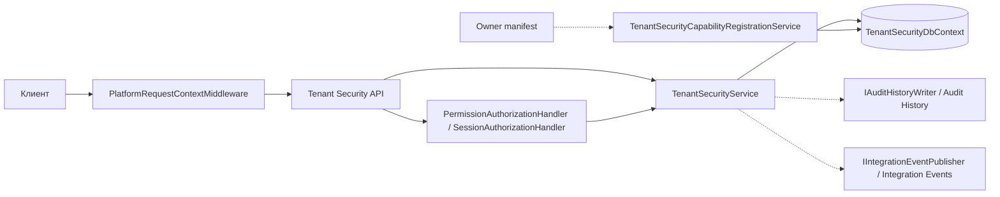
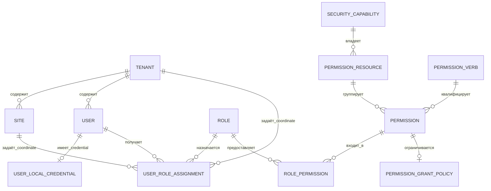
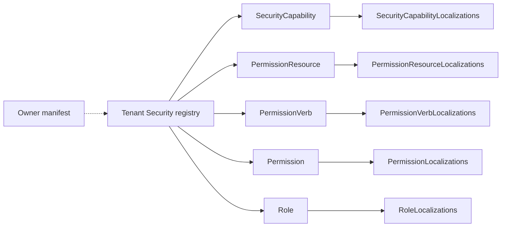

# Архитектура — Tenant Security

[contracts]: https://github.com/axelprosoft/DMP.PlatformFoundation/tree/3e2037ac37683eef331d70223c6babfc61aa0539/src/Platform/DMP.Platform.Contracts/TenantSecurity
[di]: https://github.com/axelprosoft/DMP.PlatformFoundation/blob/3e2037ac37683eef331d70223c6babfc61aa0539/src/Platform/DMP.Platform.TenantSecurity/DependencyInjection.cs
[host]: https://github.com/axelprosoft/DMP.PlatformFoundation/blob/3e2037ac37683eef331d70223c6babfc61aa0539/src/Hosts/DMP.Platform.Api/Composition/PlatformApiCompositionExtensions.cs
[controllers]: https://github.com/axelprosoft/DMP.PlatformFoundation/tree/3e2037ac37683eef331d70223c6babfc61aa0539/src/Platform/DMP.Platform.TenantSecurity/Api/Controllers
[session-handler]: https://github.com/axelprosoft/DMP.PlatformFoundation/blob/3e2037ac37683eef331d70223c6babfc61aa0539/src/Platform/DMP.Platform.TenantSecurity/Api/Controllers/SessionAuthorizationHandler.cs
[service]: https://github.com/axelprosoft/DMP.PlatformFoundation/blob/3e2037ac37683eef331d70223c6babfc61aa0539/src/Platform/DMP.Platform.TenantSecurity/Application/Services/TenantSecurityService.cs
[entities]: https://github.com/axelprosoft/DMP.PlatformFoundation/tree/3e2037ac37683eef331d70223c6babfc61aa0539/src/Platform/DMP.Platform.TenantSecurity/Domain/Entities
[db]: https://github.com/axelprosoft/DMP.PlatformFoundation/blob/3e2037ac37683eef331d70223c6babfc61aa0539/src/Platform/DMP.Platform.TenantSecurity/Infrastructure/Persistence/TenantSecurityDbContext.cs
[registration]: https://github.com/axelprosoft/DMP.PlatformFoundation/blob/3e2037ac37683eef331d70223c6babfc61aa0539/src/Platform/DMP.Platform.TenantSecurity/Application/Services/TenantSecurityCapabilityRegistrationService.cs
[initializer]: https://github.com/axelprosoft/DMP.PlatformFoundation/blob/3e2037ac37683eef331d70223c6babfc61aa0539/src/Platform/DMP.Platform.TenantSecurity/Infrastructure/Persistence/TenantSecurityDatabaseInitializer.cs
[middleware]: https://github.com/axelprosoft/DMP.PlatformFoundation/blob/3e2037ac37683eef331d70223c6babfc61aa0539/src/Platform/DMP.Platform.Runtime/Context/PlatformRequestContextMiddleware.cs
[audit]: https://github.com/axelprosoft/DMP.PlatformFoundation/blob/3e2037ac37683eef331d70223c6babfc61aa0539/src/Platform/DMP.Platform.AuditHistory/Abstractions/IAuditHistoryWriter.cs
[events]: https://github.com/axelprosoft/DMP.PlatformFoundation/blob/3e2037ac37683eef331d70223c6babfc61aa0539/src/Platform/DMP.Platform.IntegrationEvents/Abstractions/IIntegrationEventPublisher.cs
[hasher]: https://github.com/axelprosoft/DMP.PlatformFoundation/blob/3e2037ac37683eef331d70223c6babfc61aa0539/src/Platform/DMP.Platform.TenantSecurity/Application/Services/LocalPasswordHasher.cs
[domain-tests]: https://github.com/axelprosoft/DMP.PlatformFoundation/blob/3e2037ac37683eef331d70223c6babfc61aa0539/tests/DMP.Platform.ArchTests/Domain/TenantSecurityDomainInvariantsArchTests.cs
[foundation-architecture]: ../00_foundation/02_architecture.md

## 1. Назначение документа

Документ описывает статическое устройство Tenant Security: компоненты, доменную модель, persistence-модель и зависимости. Исполняемые последовательности принадлежат [`04_runtime.md`](04_runtime.md), внешние договоры — [`03_contracts.md`](03_contracts.md).

## 2. Граница и компоненты

Tenant Security работает внутри общего ASP.NET Core host. Публичную границу образуют C# contracts, HTTP controllers и host adapters, persistence остаётся внутренней реализацией платформенной области. ([host][host]; [contracts][contracts]; [controllers][controllers]; [di][di])

| Компонент | Ответственность | Зависимости | Подтверждение |
| --- | --- | --- | --- |
| Controllers | HTTP binding и permission attributes. | Application interface, ASP.NET Core filters. | [controllers][controllers] |
| Authorization provider/handler | Named dynamic policy `Permission:<code>` и default policy `SessionAuthorizationRequirement` для обычного `[Authorize]`. | Контекст запроса и Tenant Security service. | [controllers][controllers]; [session-handler][session-handler] |
| `TenantSecurityService` | Queries, commands и правила управления. | DbContext, clock, context, audit writer, event publisher. | [service][service] |
| Domain | Entities и локальные инварианты. | Общие domain primitives и contract enums. | [entities][entities] |
| `TenantSecurityDbContext` | Schema, mappings, indexes, relations и concurrency. | EF Core SQL Server/InMemory. | [db][db] |
| Registration service | Validation, upsert и reconcile manifests. | DbContext и public manifest contract. | [registration][registration] |
| Database initializer | Migrations, bootstrap, registration и derived assignments. | DbContext, options и все owner manifests. | [initializer][initializer] |
| Runtime context | Tenant/user/site/role/correlation/language context запроса. | Platform Runtime middleware. | [middleware][middleware] |

| Компонент Foundation | Как используется | Владелец определения | Семантика области |
| --- | --- | --- | --- |
| `Entity` | Базовый идентификатор используется сущностями Tenant Security. | Foundation | Значение и правила сущности задаёт Tenant Security; Foundation не владеет её предметными данными. |
| `TenantEntity`, `ITenantOwnedEntity` | `Site` наследует `TenantEntity`, `User` реализует `ITenantOwnedEntity`. | Foundation | Tenant Security применяет tenant-владение к своим сущностям и проверяет соответствие tenant. |
| `IScopeBoundEntity` | `UserRoleAssignment` использует tenant/site coordinate. | Foundation | Tenant Security задаёт смысл `Global`, `Corporate`, `Tenant` и `Site` для назначения роли. |
| `ITenantContext`, `IRequestAccessContext` | Контекст tenant используется service; контекст access используется authorization handler. | Foundation | Tenant Security принимает решение о доступе и не передаёт его ответственность Foundation. |
| `IClock`, `ICorrelationContext` | Сервис использует часы и correlation id при изменениях, аудите и событиях. | Foundation | Tenant Security задаёт смысл времени операции и correlation для своих записей. |

Общий `IUnitOfWork` в текущем Tenant Security напрямую не внедряется: область
использует собственный `ITenantSecurityDbContext` и его `SaveChangesAsync`. Поэтому
`IUnitOfWork` не включён в таблицу как фактическая зависимость. ([foundation-architecture][foundation-architecture]; [service][service]; [db][db])

Диаграмма показывает composition и runtime dependencies, подтверждённые host,
middleware и service. Пунктиром показаны используемые внешние capability: Tenant
Security формирует audit record и event envelope, но не владеет их хранением и
доставкой. Для обычного `[Authorize]` используется default
`SessionAuthorizationRequirement`; named `Permission:<code>` остаётся отдельной
permission policy и не должен считаться автоматически объединённым с default policy.
([host][host]; [middleware][middleware]; [service][service]; [session-handler][session-handler]; [audit][audit]; [events][events])

## 3. Архитектурная модель и инварианты

Этот раздел описывает предметные сущности Tenant Security и правила их
согласованности. Это не перечень таблиц и не описание HTTP-контрактов. Кодовые
классы из `Domain/Entities` являются подтверждённым источником текущей модели;
отдельные DDD aggregate boundaries не объявляются, если они прямо не следуют из
кода и сервисных правил. ([entities][entities]; [domain tests][domain-tests])

| Понятие или архитектурный тип | Техническое имя | Владелец | Связи | Инвариант | Подтверждение |
| --- | --- | --- | --- | --- | --- |
| Tenant | `Tenant` | Tenant Security | Владеет Site и User по `TenantId`. | Code обязателен; status `Active/Disabled`. | [entities][entities] |
| Site | `Site` | Tenant Security | Принадлежит Tenant; участвует в coordinate назначения. | TenantId, code и name обязательны. | [entities][entities] |
| User и credential | `User`, `UserLocalCredential` | Tenant Security | User принадлежит одному Tenant; credential один на User. | Login/email/display name/provider обязательны; credential хранит hash/salt. | [entities][entities]; [hasher][hasher] |
| Role | `Role` | Tenant Security / manifest owner | Связана с permissions и assignments по stable code. | Scope роли задаёт coordinate назначения. | [entities][entities] |
| Permission и policy | `Permission`, `PermissionGrantPolicy` | Manifest owner / Tenant Security registry | Permission входит в role и может иметь grant policy. | Stable code; policy содержит allowed scopes. | [entities][entities] |
| Assignment | `UserRoleAssignment` | Tenant Security | Обязательные `UserId` и `RoleCode`; optional `TenantId` и `SiteId` задают coordinate области назначения. | Global/Corporate не имеют tenant/site coordinate; Tenant требует `TenantId`; Site требует `TenantId` и `SiteId`; timestamp — UTC. | [entities][entities]; [domain tests][domain-tests] |
| Каталог безопасности (`security catalog`) | Capability, resource, verb и localizations | Owner manifest / Tenant Security registry | Capability → resources → permissions; verb квалифицирует permission. | Stable owner code и unique localization coordinate. | [entities][entities]; [registration][registration] |

Системные enums (`TenantStatus`, `UserStatus`, `RoleStatus`, `RoleCategory`, `ScopeType`, `PermissionCategory`, `GrantableByScope`) являются частью C# contract и не заменяются Value Sets. ([contract enums](https://github.com/axelprosoft/DMP.PlatformFoundation/tree/3e2037ac37683eef331d70223c6babfc61aa0539/src/Platform/DMP.Platform.Contracts/TenantSecurity/Enums))

| Enum | Закреплённые значения или назначение |
| --- | --- |
| `TenantStatus`, `UserStatus`, `RoleStatus` | `Active`, `Disabled` |
| `RoleCategory` | `System` — системная роль; `Custom` — пользовательская роль |
| `ScopeType` | `Global`, `Corporate`, `Tenant`, `Site` |
| `GrantableByScope` | `PlatformOnly`, `CorporateAdmin`, `TenantAdmin` |
| `PermissionCategory`, `RoleEditorMode`, `AssignmentGovernanceMode` | Категория permission и режимы управления role/assignment |

([contract enums](https://github.com/axelprosoft/DMP.PlatformFoundation/tree/3e2037ac37683eef331d70223c6babfc61aa0539/src/Platform/DMP.Platform.Contracts/TenantSecurity/Enums))

`UserRoleAssignment` логически ссылается на `User` через `UserId`, на `Role`
через `RoleCode`, а при scoped assignment — на `Tenant` через `TenantId` и на
`Site` через `SiteId`. `TenantId` и `SiteId` являются частью координаты
назначения, а не принадлежностью самой роли. В текущем MVP доменный класс
проверяет форму координаты, service проверяет существование и статус tenant и
совпадение tenant пользователя; отдельная проверка существования `SiteId` и
его принадлежности указанному tenant в assignment command не подтверждена.

Текущая EF-модель хранит эти связи как scalar ID/code fields и unique index,
но не настраивает для `UserRoleAssignment` явные foreign-key navigation
relations. Поэтому следующая ER-диаграмма показывает логические связи модели,
а не гарантию ссылочной целостности на уровне БД.

Диаграмма отражает логические relations из entities и запросов service; не все
показанные связи являются настроенными EF foreign keys. Полный состав полей
остаётся в исходном коде. ([entities][entities]; [db][db]; [service][service])

## 4. Persistence-модель и хранение

Этот раздел описывает persistence-представление доменной модели, а не вводит
новые предметные сущности. Все таблицы Tenant Security находятся в schema
`tenant_security`. Изменяемые entities имеют `ConcurrencyToken`; tenant code,
tenant/login, tenant/site code, stable security codes, role-permission и
assignment coordinates защищены unique indexes. ([db][db]; [entities][entities])

| Данные | Техническое представление | Владелец | Хранение | Ключ или ограничение | Подтверждение |
| --- | --- | --- | --- | --- | --- |
| Tenant и Site | `Tenant`, `Site` | Tenant Security | `tenant_security.Tenants`, `tenant_security.Sites` | Уникальные code и `(TenantId, Code)`; Global registry / Tenant | [db][db] |
| User и credential | `User`, `UserLocalCredential` | Tenant Security | `tenant_security.Users`, `tenant_security.UserLocalCredentials` | Уникальная пара `(TenantId, Login)`; одна credential на User | [db][db] |
| Role, Permission, Policy | `Role`, `Permission`, `PermissionGrantPolicy` | Tenant Security registry | `Roles`, `Permissions`, `PermissionGrantPolicies` | Уникальные стабильные коды; scope хранится отдельно | [db][db] |
| Role permission и assignment | `RolePermission`, `UserRoleAssignment` | Tenant Security | `RolePermissions`, `UserRoleAssignments` | Уникальная пара role/permission и уникальная координата назначения | [db][db] |
| Локализации каталога | Пять localization entities | Owner manifest / Tenant Security registry | `SecurityCapabilityLocalizations`, `PermissionResourceLocalizations`, `PermissionVerbLocalizations`, `PermissionLocalizations`, `RoleLocalizations` | Уникальность и invariant-правило различаются по типу; см. таблицу ниже | [db][db] |

Поле `Tenant.DefaultLanguage` хранится в `tenant_security.Tenants` как
обязательный строковый код длиной до 16 символов. Это настройка tenant, а не
строка перевода; текущий общий language resolver не использует её автоматически
при выборе языка каталога. ([db][db]; [service][service])

Local credentials используют PBKDF2-SHA256: 100 000 iterations, 16-byte salt и 32-byte hash, сохранённые в Base64. ([hasher][hasher])

### 4.1. Таблицы локализации каталога безопасности

Локализация каталога безопасности — это не одна общая таблица и не отдельная
сущность предметной области. Это пять persistence-сущностей, которые хранят
тексты для объектов каталога. Базовый объект сохраняет invariant-текст в своих
полях `Name`/`Description`, когда такие поля есть; дополнительные переводы
хранятся в таблице локализаций. Поле `LanguageCode = null` используется только
для invariant-записи роли или права.

Схема показывает поток владения и хранения. Она не означает, что локализация
становится отдельным правом или участвует в решении доступа: решение использует
технические коды, а тексты нужны для представления и фильтров. ([registration][registration]; [service][service])

| Persistence-сущность | Таблица | Связь с базовым объектом | Поля текста | `LanguageCode` и уникальность | Кто записывает |
| --- | --- | --- | --- | --- | --- |
| `SecurityCapabilityLocalization` | `tenant_security.SecurityCapabilityLocalizations` | `CapabilityCode` → `SecurityCapability.Code` | `Name` обязательно; `Description` необязательно | Обязателен; уникальная пара `(CapabilityCode, LanguageCode)` | Owner manifest через registration service |
| `PermissionResourceLocalization` | `tenant_security.PermissionResourceLocalizations` | `(CapabilityCode, ResourceCode)` → `PermissionResource` | `Name` обязательно; `Description` необязательно | Обязателен; уникальная тройка `(CapabilityCode, ResourceCode, LanguageCode)` | Owner manifest через registration service |
| `PermissionVerbLocalization` | `tenant_security.PermissionVerbLocalizations` | `VerbId` → `PermissionVerb.Id` | `Name` обязательно; `Description` необязательно | Обязателен; уникальная пара `(VerbId, LanguageCode)` | Owner manifest через registration service |
| `PermissionLocalization` | `tenant_security.PermissionLocalizations` | `PermissionCode` → `Permission.Code` | Только `Description`, необязательно; отдельного `Name` у `Permission` нет | `null` означает invariant; не более одной invariant-записи и одной записи на язык | Owner manifest через registration service |
| `RoleLocalization` | `tenant_security.RoleLocalizations` | `RoleCode` → `Role.Code` | `Name` обязательно; `Description` необязательно | `null` означает invariant; не более одной invariant-записи и одной записи на язык | System role: owner manifest; custom role: Tenant Security API |

Для `Capability`, `Resource` и `Verb` invariant-текст хранится также в
базовой записи (`SecurityCapabilities`, `PermissionResources`,
`PermissionVerbs`). Для `Permission` invariant- и языковые записи описывают
только `Description`; его отображаемые capability, resource и verb берутся из
связанных объектов. Для `Role` отображаемые `Name` и `Description` берутся
из `RoleLocalizations`; сама роль текстовые поля не хранит, а хранит
технический `Code` и параметры управления. ([entities][entities]; [db][db])

У всех пяти таблиц первичный ключ технический (`Id`), а `ConcurrencyToken`
защищает запись от параллельного изменения. Связи локализаций с базовыми
объектами настроены как foreign keys с каскадным удалением; связи role/permission
между собой и assignment-координаты описаны отдельно и не заменяются таблицами
локализаций. Для всех таблиц действуют ограничения схемы: кодовые поля имеют
максимум 128 символов, `LanguageCode` — 16, `Name` — 256,
`Description` — 512; `LanguageCode` необязателен только в таблицах
`PermissionLocalizations` и `RoleLocalizations`. ([db][db])

## 5. Зависимости и точки расширения

Owner capabilities подключаются через `ITenantSecurityCapabilityCatalogManifest`; registration service проверяет ownership и синхронизирует registry. Runtime, Workflow и Settings получают проверку доступа через adapters общего host. Audit History и Integration Events принимают вызовы аудита и событий через свои abstractions. ([manifest contract](https://github.com/axelprosoft/DMP.PlatformFoundation/blob/3e2037ac37683eef331d70223c6babfc61aa0539/src/Platform/DMP.Platform.Contracts/TenantSecurity/Policies/ITenantSecurityCapabilityCatalogManifest.cs); [registration][registration]; [host][host]; [service][service])

## 6. Технические ограничения

- Все tenants используют общую schema; database routing и global tenant query filters не заданы. Tenant predicates применяет service. ([db][db]; [service][service])
- `UserTenant` отсутствует; user принадлежит одному tenant. ([entities][entities])
- `ScopeType.Corporate` есть, но `Corporate` entity и `CorporateId` отсутствуют. ([contract enums](https://github.com/axelprosoft/DMP.PlatformFoundation/tree/3e2037ac37683eef331d70223c6babfc61aa0539/src/Platform/DMP.Platform.Contracts/TenantSecurity/Enums); [entities][entities])
 - `UserRoleAssignment` хранит `TenantId` и `SiteId` как scalar coordinate; отдельная проверка существования `SiteId` и его принадлежности tenant в assignment command не подтверждена. См. [трассировку](90_traceability.md): `TS-DEC-07` — site scope semantics. ([entities][entities]; [db][db]; [service][service])
- Allowed scopes policy хранятся сериализованными строками; часть integrity checks находится в domain/application, а не в database FK. ([db][db]; [entities][entities])
- `TenantSecurityService` совмещает queries, commands, localization и governance. ([service][service])

## История изменений

| Версия | Дата и время | Автор | Раздел | Изменение | Коммит/PR |
|---|---|---|---|---|---|
| 0.1 | 2026-08-26 23:30 +03:00 | Олег Юрьев (@axelprosoft) | Создание документа | предварително готовые модули ядра и связанные изменения | [ca13b19b](https://github.com/axelprosoft/DMP.PlatformFoundation/commit/ca13b19bd17dd297927c1e66a97f95c29735b971) |
