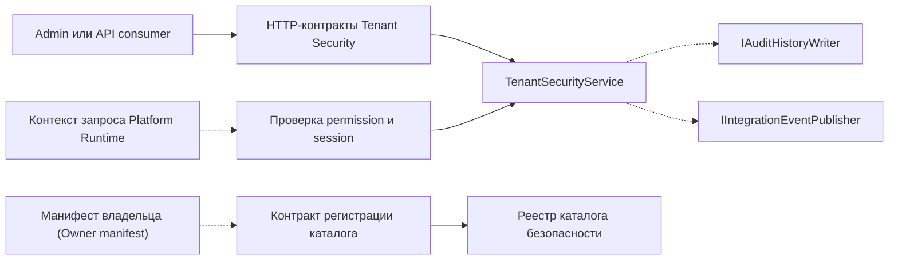

# Контракты — Tenant Security

[contracts]: https://github.com/axelprosoft/DMP.PlatformFoundation/tree/3e2037ac37683eef331d70223c6babfc61aa0539/src/Platform/DMP.Platform.Contracts/TenantSecurity
[interface]: https://github.com/axelprosoft/DMP.PlatformFoundation/blob/3e2037ac37683eef331d70223c6babfc61aa0539/src/Platform/DMP.Platform.TenantSecurity/Application/Abstractions/ITenantSecurityService.cs
[controller]: https://github.com/axelprosoft/DMP.PlatformFoundation/blob/3e2037ac37683eef331d70223c6babfc61aa0539/src/Platform/DMP.Platform.TenantSecurity/Api/Controllers/TenantSecurityController.cs
[session-handler]: https://github.com/axelprosoft/DMP.PlatformFoundation/blob/3e2037ac37683eef331d70223c6babfc61aa0539/src/Platform/DMP.Platform.TenantSecurity/Api/Controllers/SessionAuthorizationHandler.cs
[sites]: https://github.com/axelprosoft/DMP.PlatformFoundation/blob/3e2037ac37683eef331d70223c6babfc61aa0539/src/Platform/DMP.Platform.TenantSecurity/Api/Controllers/TenantSecuritySitesController.cs
[assignments]: https://github.com/axelprosoft/DMP.PlatformFoundation/blob/3e2037ac37683eef331d70223c6babfc61aa0539/src/Platform/DMP.Platform.TenantSecurity/Api/Controllers/TenantSecurityUserAssignmentsController.cs
[middleware]: https://github.com/axelprosoft/DMP.PlatformFoundation/blob/3e2037ac37683eef331d70223c6babfc61aa0539/src/Platform/DMP.Platform.Runtime/Context/PlatformRequestContextMiddleware.cs
[handler]: https://github.com/axelprosoft/DMP.PlatformFoundation/blob/3e2037ac37683eef331d70223c6babfc61aa0539/src/Platform/DMP.Platform.TenantSecurity/Api/Controllers/PermissionAuthorizationHandler.cs
[service]: https://github.com/axelprosoft/DMP.PlatformFoundation/blob/3e2037ac37683eef331d70223c6babfc61aa0539/src/Platform/DMP.Platform.TenantSecurity/Application/Services/TenantSecurityService.cs
[events]: https://github.com/axelprosoft/DMP.PlatformFoundation/blob/3e2037ac37683eef331d70223c6babfc61aa0539/src/Platform/DMP.Platform.IntegrationEvents/Abstractions/IIntegrationEventPublisher.cs
[envelope]: https://github.com/axelprosoft/DMP.PlatformFoundation/blob/3e2037ac37683eef331d70223c6babfc61aa0539/src/Platform/DMP.Platform.IntegrationEvents/Abstractions/IntegrationEventEnvelope.cs
[options]: https://github.com/axelprosoft/DMP.PlatformFoundation/blob/3e2037ac37683eef331d70223c6babfc61aa0539/src/Platform/DMP.Platform.TenantSecurity/Infrastructure/Persistence/TenantSecurityBootstrapOptions.cs
[di]: https://github.com/axelprosoft/DMP.PlatformFoundation/blob/3e2037ac37683eef331d70223c6babfc61aa0539/src/Platform/DMP.Platform.TenantSecurity/DependencyInjection.cs
[initializer]: https://github.com/axelprosoft/DMP.PlatformFoundation/blob/3e2037ac37683eef331d70223c6babfc61aa0539/src/Platform/DMP.Platform.TenantSecurity/Infrastructure/Persistence/TenantSecurityDatabaseInitializer.cs
[settings]: https://github.com/axelprosoft/DMP.PlatformFoundation/blob/3e2037ac37683eef331d70223c6babfc61aa0539/src/Hosts/DMP.Platform.Api/appsettings.Development.json
[enums]: https://github.com/axelprosoft/DMP.PlatformFoundation/tree/3e2037ac37683eef331d70223c6babfc61aa0539/src/Platform/DMP.Platform.Contracts/TenantSecurity/Enums
[codes]: https://github.com/axelprosoft/DMP.PlatformFoundation/blob/3e2037ac37683eef331d70223c6babfc61aa0539/src/Platform/DMP.Platform.TenantSecurity/Infrastructure/Persistence/TenantSecuritySystemCodes.cs
[manifest]: https://github.com/axelprosoft/DMP.PlatformFoundation/blob/3e2037ac37683eef331d70223c6babfc61aa0539/src/Platform/DMP.Platform.TenantSecurity/Infrastructure/Security/TenantSecuritySecurityCatalogManifest.cs
[registration]: https://github.com/axelprosoft/DMP.PlatformFoundation/blob/3e2037ac37683eef331d70223c6babfc61aa0539/src/Platform/DMP.Platform.TenantSecurity/Application/Services/TenantSecurityCapabilityRegistrationService.cs
[db]: https://github.com/axelprosoft/DMP.PlatformFoundation/blob/3e2037ac37683eef331d70223c6babfc61aa0539/src/Platform/DMP.Platform.TenantSecurity/Infrastructure/Persistence/TenantSecurityDbContext.cs
[frontend]: https://github.com/axelprosoft/DMP.PlatformFoundation/blob/3e2037ac37683eef331d70223c6babfc61aa0539/src/Frontend/packages/tenant-security-contracts/src/index.ts
[contract-tests]: https://github.com/axelprosoft/DMP.PlatformFoundation/blob/3e2037ac37683eef331d70223c6babfc61aa0539/tests/DMP.Platform.ArchTests/Contracts/TenantSecurityContractStabilityArchTests.cs
[audit]: https://github.com/axelprosoft/DMP.PlatformFoundation/blob/3e2037ac37683eef331d70223c6babfc61aa0539/src/Platform/DMP.Platform.AuditHistory/Abstractions/IAuditHistoryWriter.cs
[runtime-adapter]: https://github.com/axelprosoft/DMP.PlatformFoundation/blob/3e2037ac37683eef331d70223c6babfc61aa0539/src/Hosts/DMP.Platform.Api/Composition/RuntimePermissionAuthorizer.cs
[workflow-adapter]: https://github.com/axelprosoft/DMP.PlatformFoundation/blob/3e2037ac37683eef331d70223c6babfc61aa0539/src/Hosts/DMP.Platform.Api/Composition/WorkflowPermissionAuthorizer.cs
[settings-adapter]: https://github.com/axelprosoft/DMP.PlatformFoundation/blob/3e2037ac37683eef331d70223c6babfc61aa0539/src/Hosts/DMP.Platform.Api/Composition/SettingsPermissionAuthorizer.cs
[composition]: https://github.com/axelprosoft/DMP.PlatformFoundation/blob/3e2037ac37683eef331d70223c6babfc61aa0539/src/Hosts/DMP.Platform.Api/Composition/PlatformApiCompositionExtensions.cs
[manifest-contract]: https://github.com/axelprosoft/DMP.PlatformFoundation/blob/3e2037ac37683eef331d70223c6babfc61aa0539/src/Platform/DMP.Platform.Contracts/TenantSecurity/Policies/ITenantSecurityCapabilityCatalogManifest.cs
[foundation-contracts]: ../00_foundation/03_contracts.md

## 1. Назначение и границы

Документ фиксирует внешние договоры Tenant Security: HTTP API, request/response types,
локализованные представления, события, ошибки, конфигурационные параметры,
стабильные идентификаторы и связи с потребителями. Детали доменной модели,
хранения, runtime-поведения и пользовательского интерфейса описываются в
соответствующих документах области.

## 2. Источники истины и владельцы

| Источник или контрактный слой | Что подтверждает | Владелец |
| --- | --- | --- |
| `DMP.Platform.Contracts/TenantSecurity` | Публичные request/response types и enum | Tenant Security |
| Tenant Security controllers | Маршруты, HTTP verbs и границы доступа | Tenant Security / API host |
| `ITenantSecurityService` и service implementation | Фактические параметры и результаты операций | Tenant Security |
| Frontend `tenant-security-contracts` | Типы, используемые frontend-потребителями | фронтенд-платформа / Tenant Security |
| Integration event envelope и publisher | Форму доставки событий | Integration Events |

Общие domain/application-контракты, контексты запроса, результаты и типы
`DMP.Platform.Contracts.Common` предоставляются слоем Foundation и определены в
[контрактах Foundation][foundation-contracts]. Здесь они не
переписываются: Tenant Security описывает только своё использование, ограничения
и семантику решения доступа. Request/response и manifest-контракты
`TenantSecurity` остаются у этой области.

## 3. Карта контрактов

Схема разделяет четыре границы: HTTP-вызов, контекст запроса, регистрацию
каталога и побочные контракты аудита/событий. Пунктирные связи показывают
использование внешнего контракта; Tenant Security остаётся владельцем своих
permission-decision и catalog-registration semantics. ([service][service]; [handler][handler]; [registration][registration]; [audit][audit]; [events][events])

| Контракт | Вид | Владелец | Потребитель | Статус сведения | Подробное описание |
| --- | --- | --- | --- | --- | --- |
| Tenant, Site, User и Assignment API | HTTP | Tenant Security | Admin/API consumers | Подтверждено MVP | [HTTP-контракты](#4-http-контракты) |
| `permissions/filter-options` | HTTP lookup | Tenant Security | Admin frontend | Подтверждено MVP | [Варианты фильтра прав](#41-контракт-вариантов-фильтра-прав) |
| Локализованные тексты каталога и ролей | DTO/HTTP | Tenant Security | API и Admin frontend | Подтверждено MVP с ограничениями | [Общие типы и DTO](#5-общие-типы-и-dto) |
| `ITenantSecurityService` | Внутренний C# application interface | Tenant Security | Controllers | Внутренний тип, не extension point | [Граница C#](#6-c-контракты-и-точки-расширения) |
| Tenant/User/Assignment events | Integration event | Tenant Security | Integration Events и будущие consumers | Payload schema ограничена текущим MVP | [События](#7-контракты-событий) |

## 4. HTTP-контракты

Публичная HTTP-граница имеет базовый маршрут `/api/platform/tenant-security`.
Точные request/response types находятся в [контрактах Tenant Security][contracts],
а маршруты и атрибуты контроллеров — в [TenantSecurityController][controller].

| Интерфейс | Вход | Результат | Ошибка | Граница доступа | Источник контракта |
| --- | --- | --- | --- | --- | --- |
| `POST session/login` | Tenant code, login, password | Identity, tenant, roles и permissions | `401 INVALID_CREDENTIALS` | Anonymous; см. [трассировку](90_traceability.md): `TS-DEC-01` — production-аутентификация | [controller][controller]; [contracts][contracts]; [трассировка](90_traceability.md) |
| `GET session/probe` | Request context headers | `{ status: "ok" }` | 403 с reason code при неактивном или несоответствующем контексте | Обычный `[Authorize]`, использует default `SessionAuthorizationRequirement` | [controller][controller]; [session-handler][session-handler] |
| Tenant API | Create/list/get/update/status requests | Identifier, item/list или no-content | 400/403/404/409 | `Tenant.*` policies на опубликованных routes | [controller][controller]; [contracts][contracts] |
| Site API | Filters, paging и tenant/site criteria | `SitesResponse` | 400/403 | Read-only API с `TenantSecurity.User.View` | [sites][sites]; [contracts][contracts] |
| User API | Create/list/get/update/status/password requests | Identifier, item/list, password result или no-content | 400/403/404/409 | `User.*` policies | [controller][controller]; [contracts][contracts] |
| API ролей и прав | Профиль и статус роли, фильтры и permission code | Ответы по роли, списку ролей и праву | 400/403/404/409 | Read и часть mutations имеют policies | [controller][controller]; [contracts][contracts] |
| `GET permissions/filter-options` | Capability, role и exclusion filters | `PermissionFilterOptionsResponse` с кодами и локализованными titles | 400/403 | `TenantSecurity.Permission.View` | [controller][controller]; [contracts][contracts] |
| Assignment API | Role/user, assignment id или scope coordinate | Lists, governance response или no-content | 400/403/404/409 | Часть routes имеет `Role.Assign`, часть вызывает service governance | [assignments][assignments]; [contracts][contracts] |
| `POST /authorize`, `GET /effective-permissions` | `AuthorizeRequest` или identity/scope query | `AuthorizeResult` или `EffectivePermissionsResponse` | Deny reason либо request error | Decision endpoints не имеют собственного policy attribute; см. [трассировку](90_traceability.md): `TS-DEC-04` — route policy coverage | [controller][controller]; [contracts][contracts]; [трассировка](90_traceability.md) |

### 4.1. Контракт вариантов фильтра прав

`GET /api/platform/tenant-security/permissions/filter-options` возвращает данные
для select-фильтров Admin. Это read-only lookup-контракт: он не меняет права и не
заменяет `GET /permissions`. ([controller][controller]; [contracts][contracts])

| Часть | Поля | Назначение |
| --- | --- | --- |
| Запрос `GetPermissionFilterOptionsRequest` | `CapabilityCode`, `RoleId`, `ExcludeAssignedToRoleId` | Ограничить capability или получить права для роли, исключив уже назначенные |
| Ответ `PermissionFilterOptionsResponse` | `CapabilityCodes`, `Resources`, `Categories`, optional `Capabilities`, optional `Verbs` | Наборы значений для фильтров и lookup-контролов |
| Элемент `Resources` | `Resource`, `CapabilityCode`, optional `Title` | Технический ресурс, его capability и отображаемое название |
| Элемент `Capabilities` | `Code`, `Title` | Код capability и локализованное название |
| Элемент `Verbs` | `SourceModuleCode`, `Code`, `Title` | Владелец, код операции и локализованное название |

`Title` выбирается на стороне Tenant Security с учётом language resolver; `Code`,
`Resource` и `SourceModuleCode` остаются техническими значениями для фильтрации и
не заменяются переводом. ([service][service]; [composition][composition])

Обязательные `X-Tenant-Id` и `X-User-Id` формируют request context, но сами по себе
не подтверждают право на операцию. `AuthorizeRequest.ResourceContext` опубликован в
контракте, однако текущий `AuthorizeAsync` его не использует. ([middleware][middleware]; [contracts][contracts]; [service][service])

Login помечен `[AllowAnonymous]`. `session/probe` использует default `[Authorize]`
и проверяет активность user/tenant, переданные role codes и соответствие assignment
по tenant/site. Это не выдача token/cookie; coverage остальных sensitive routes см.
в [трассировке](90_traceability.md): `TS-DEC-04`. ([controller][controller]; [session-handler][session-handler]; [assignments][assignments])

Логика вывода

Controller показывает route attributes, middleware — только разбор context headers,
service — фактические параметры decision. Сопоставление этих слоёв отделяет
transport context от authorization и опубликованное поле от используемого алгоритма.
([controller][controller]; [middleware][middleware]; [service][service])

## 5. Общие типы и DTO

### 5.1. Контракт локализованных текстов

Локализованный текст в manifest описывается типом `LocalizedTextTemplate`:
`Invariant` содержит обязательный базовый текст для `Name` и необязательный базовый
текст для `Description`, а `Translations` содержит словарь `LanguageCode → text`.
Коды нормализуются как BCP 47; повторный код языка и некорректный код отклоняются.
Этот контракт используется для capability, resource, verb, role и permission
description. ([localized text](https://github.com/axelprosoft/DMP.PlatformFoundation/blob/3e2037ac37683eef331d70223c6babfc61aa0539/src/Platform/DMP.Platform.Contracts/Common/Localization/LocalizedTextTemplate.cs); [manifest-contract][manifest-contract])

| Контракт | Что передаёт | Где используется | Ограничение |
| --- | --- | --- | --- |
| `CapabilitySecurityCatalogManifestRequest` | Локализованные `Name`/`Description` capability, resources, verbs и roles; `Description` permission | Регистрация каталога при запуске | Invariant обязателен для `Name`; пустой обязательный перевод отклоняется |
| `RoleLocalizationRequest` | `LanguageCode`, `Name`, `Description` для одной роли | `CreateRoleRequest` и `UpdateRoleRequest` | При передаче массива после нормализации обязательна одна запись с `LanguageCode = null`; остальные языки не должны повторяться |
| `RoleLocalizationResponse` | Сохранённый набор локализаций роли | `RoleDetailsResponse.Localizations` | `null` в `LanguageCode` означает invariant-запись |
| `RoleListItemResponse` / `RoleDetailsResponse` / `PermissionItemResponse` | Выбранные для запроса `Name`, `Description`, `CapabilityTitle`, `ResourceTitle`, `VerbTitle` | Списки и карточки Admin/API | Клиент получает разрешённое представление, а не строки persistence-таблиц |

Локализации capability/resource/verb/permission не имеют отдельного CRUD HTTP
маршрута: их источником является manifest владельца и startup registration.
Локализации custom role передаются через общий create/update role contract.
Если массив локализаций передан, обновление набора заменяет переданные переводы и
удаляет отсутствующие языковые записи, сохраняя invariant-запись. Если массив не
передан, сервис использует legacy-поля `Name`/`Description` и не удаляет
существующие переводы. ([registration][registration]; [service][service]; [controller][controller])

Список доступных языков публикуется отдельно через `GET /api/platform/catalog/languages`.
Он читается из активных записей Configuration, а не из Tenant Security tables.
`Tenant.DefaultLanguage` является полем tenant и возвращается в tenant/login
responses. Серверный общий language resolver не использует его как отдельный
fallback для API-запроса; выбор языка frontend описан отдельно в
`06_user_experience.md`. ([contracts][contracts]; [composition][composition])

## 6. C#-контракты и точки расширения

`ITenantSecurityService` — application interface, используемый контроллерами внутри
Tenant Security. Текущий код не подтверждает его как публичную межмодульную точку
расширения, поэтому полный перечень его внутренних методов здесь не дублируется.
Публичными для потребителей остаются HTTP и DTO-контракты из разделов 4–5.
([interface][interface]; [controller][controller])

## 7. Контракты событий

| Событие или результат | Момент создания | Доставка | Потребители | Подтверждение |
| --- | --- | --- | --- | --- |
| `TenantCreated`, `TenantUpdated`, `TenantStatusChanged` | После сохранения tenant state | `IIntegrationEventPublisher`; см. [трассировку](90_traceability.md): `TS-DEC-06` — audit/outbox | Явный consumer в области не объявлен | [service][service]; [events][events]; [трассировка](90_traceability.md) |
| `UserUpdated`, `UserStatusChanged` | После сохранения user state | Та же publisher boundary | Явный consumer не объявлен | [service][service] |
| `UserRoleAssigned`, `UserRoleAssignmentActivated`, `UserRoleAssignmentDeactivated`, `UserRoleAssignmentRemoved` | После create/activate/deactivate/remove | Та же publisher boundary | Integration tests проверяют часть publications | [service][service]; [integration tests](https://github.com/axelprosoft/DMP.PlatformFoundation/blob/3e2037ac37683eef331d70223c6babfc61aa0539/tests/DMP.Platform.IntegrationTests/FoundationSlice/TenantSecurityIntegrationTests.cs) |
| `PermissionChanged` | После grant/remove role-permission | Та же publisher boundary | Schema-bound consumer не объявлен | [service][service]; [contracts][contracts] |

`IntegrationEventEnvelope` несёт `EventTypeCode`, `TenantId`, `CorrelationId`,
`OccurredAtUtc` и payload. Payload формируется внутри service, в том числе
анонимными объектами; отдельной AsyncAPI/JSON Schema для него нет. ([envelope][envelope]; [service][service]; [contracts][contracts])

Логика вывода

Service подтверждает фактический payload, а contract package — опубликованные типы.
Между ними нет отдельного schema artifact, поэтому стабильность payload не считается
закреплённым машинным контрактом. ([service][service]; [contracts][contracts])

Самостоятельный report/file output Tenant Security не формирует. ([interface][interface]; [contracts][contracts])

## 8. Ошибки и отказоустойчивость

| Условие | HTTP | Код или тело | Подтверждение |
| --- | ---: | --- | --- |
| Неверный login/password | 401 | `INVALID_CREDENTIALS` | [controller][controller] |
| Отказ permission policy | 403 | Reason из decision или `FORBIDDEN` | [controller][controller] |
| Запрещённая operation | 403 | Код исключения | [forbidden filter](https://github.com/axelprosoft/DMP.PlatformFoundation/blob/3e2037ac37683eef331d70223c6babfc61aa0539/src/Platform/DMP.Platform.TenantSecurity/Api/Controllers/TenantSecurityForbiddenExceptionFilter.cs) |
| Duplicate | 409 | `TENANT_CODE_ALREADY_EXISTS` или `TENANT_SECURITY_ALREADY_EXISTS` | [controller][controller]; [invalid filter](https://github.com/axelprosoft/DMP.PlatformFoundation/blob/3e2037ac37683eef331d70223c6babfc61aa0539/src/Platform/DMP.Platform.TenantSecurity/Api/Controllers/TenantSecurityInvalidOperationExceptionFilter.cs) |
| Entity не найдена | 404 | `TENANT_SECURITY_NOT_FOUND` | [invalid filter](https://github.com/axelprosoft/DMP.PlatformFoundation/blob/3e2037ac37683eef331d70223c6babfc61aa0539/src/Platform/DMP.Platform.TenantSecurity/Api/Controllers/TenantSecurityInvalidOperationExceptionFilter.cs) |
| Недопустимая операция | 400 | `TENANT_SECURITY_INVALID_OPERATION` | [invalid filter](https://github.com/axelprosoft/DMP.PlatformFoundation/blob/3e2037ac37683eef331d70223c6babfc61aa0539/src/Platform/DMP.Platform.TenantSecurity/Api/Controllers/TenantSecurityInvalidOperationExceptionFilter.cs) |
| Конкурентное изменение | 409 | `CONCURRENCY_CONFLICT` | [concurrency filter](https://github.com/axelprosoft/DMP.PlatformFoundation/blob/3e2037ac37683eef331d70223c6babfc61aa0539/src/Platform/DMP.Platform.TenantSecurity/Api/Controllers/ConcurrencyExceptionFilter.cs) |
| Нет или неверен context header | 400 | Поле `error` без `reasonCode` | [middleware][middleware] |

## 9. Совместимость и изменение контрактов

| Стабильный элемент | Допустимое изменение | Влияние | Правило миграции |
| --- | --- | --- | --- |
| Numeric enums | Добавление с сохранением существующих values | Persistence, C#/JSON и TypeScript consumers | Обновить contracts, frontend mapping и stability tests одним изменением. ([enums][enums]; [frontend][frontend]; [contract tests][contract-tests]) |
| Security codes | Добавление нового code; удаление из manifest через lifecycle | Policies, assignments, relations и UI visibility | Не переименовывать на месте; deactivate/reactivate по stable code. ([codes][codes]; [manifest][manifest]; [registration][registration]; [db][db]) |
| Request/response fields | Backward-compatible optional addition | C# и TypeScript callers | Проверить server/frontend parity и integration tests перед удалением. ([contracts][contracts]; [frontend][frontend]) |

Исчезнувший из owner manifest permission деактивируется; повторное появление того же
code реактивирует запись. ([registration][registration])

`PermissionGrantPolicy.AssignableToScope` сохраняет первый нормализованный assignment
scope для обратной совместимости, тогда как полные allowed assignment/target scopes
хранятся сериализованными значениями. ([db][db])

## 10. Границы с другими владельцами

| Стороны | Направление | Контракт | Владелец | Обработка сбоя |
| --- | --- | --- | --- | --- |
| Runtime → Tenant Security | Permission decision | Host adapter | Runtime / Tenant Security | Deny возвращается вызывающей области. ([runtime-adapter][runtime-adapter]) |
| Workflow → Tenant Security | Permission decision | Host adapter | Workflow / Tenant Security | Deny возвращается вызывающей области. ([workflow-adapter][workflow-adapter]) |
| Settings → Tenant Security | Permission decision | Host adapter | Settings / Tenant Security | Deny возвращается вызывающей области. ([settings-adapter][settings-adapter]) |
| Tenant Security → Audit History | Audit record для части команд | `IAuditHistoryWriter` | Tenant Security / Audit History | Сбой после state save см. в [трассировке](90_traceability.md): `TS-DEC-06` — audit/outbox. ([service][service]; [audit][audit]) |
| Tenant Security → Integration Events | Event envelope | `IIntegrationEventPublisher` | Tenant Security / Integration Events | Delivery принадлежит Integration Events; outbox-решение см. в [трассировке](90_traceability.md): `TS-DEC-06` — audit/outbox. ([service][service]; [events][events]) |
| Область-владелец → Tenant Security | Manifest каталога безопасности (`security catalog`) | `ITenantSecurityCapabilityCatalogManifest` | Owner / registry | Invalid или foreign-owned manifest останавливает registration. ([manifest-contract][manifest-contract]; [registration][registration]) |
| API host → Tenant Security | DI, policies, initializer и adapters | Composition extensions | API host / Tenant Security | Initialization failure не даёт host завершить startup. ([composition][composition]) |

## 11. Источники и тесты

Основные источники структуры и поведения перечислены в ссылках этого документа:
contract package, controllers, service, middleware, frontend package, composition
и persistence mapping. Стабильность публичных контрактов проверяется
`TenantSecurityContractStabilityArchTests`; сценарии публикации событий и API
проверяются интеграционными тестами Tenant Security. ([contract tests][contract-tests])

## История изменений

| Версия | Дата и время | Автор | Раздел | Изменение | Коммит/PR |
|---|---|---|---|---|---|
| 0.1 | 2026-08-27 15:04 +03:00 | Олег Юрьев (@axelprosoft) | Создание документа | подготовлен драфт новой проектной документации на ядро, прикладные модули, а так же термины и общие концептуальные документы | [5ecb26b1](https://github.com/axelprosoft/DMP.PlatformFoundation/commit/5ecb26b1c3ff3cfcdc13018e59526ae684ca6007) |
