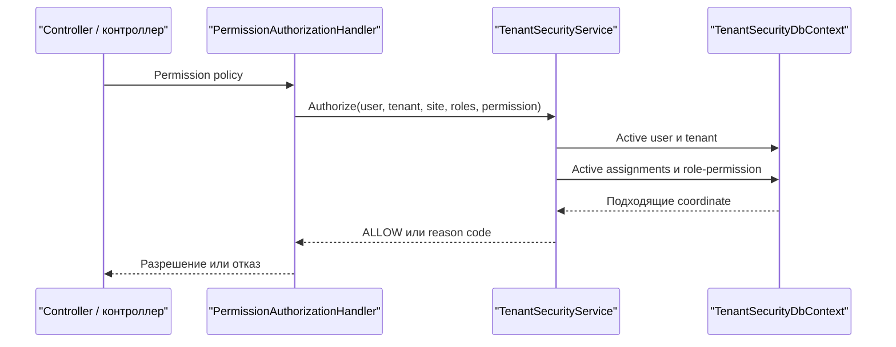

# Исполнение — Tenant Security

[middleware]: https://github.com/axelprosoft/DMP.PlatformFoundation/blob/3e2037ac37683eef331d70223c6babfc61aa0539/src/Platform/DMP.Platform.Runtime/Context/PlatformRequestContextMiddleware.cs
[controller]: https://github.com/axelprosoft/DMP.PlatformFoundation/blob/3e2037ac37683eef331d70223c6babfc61aa0539/src/Platform/DMP.Platform.TenantSecurity/Api/Controllers/TenantSecurityController.cs
[interface]: https://github.com/axelprosoft/DMP.PlatformFoundation/blob/3e2037ac37683eef331d70223c6babfc61aa0539/src/Platform/DMP.Platform.TenantSecurity/Application/Abstractions/ITenantSecurityService.cs
[service]: https://github.com/axelprosoft/DMP.PlatformFoundation/blob/3e2037ac37683eef331d70223c6babfc61aa0539/src/Platform/DMP.Platform.TenantSecurity/Application/Services/TenantSecurityService.cs
[handler]: https://github.com/axelprosoft/DMP.PlatformFoundation/blob/3e2037ac37683eef331d70223c6babfc61aa0539/src/Platform/DMP.Platform.TenantSecurity/Api/Controllers/PermissionAuthorizationHandler.cs
[session-handler]: https://github.com/axelprosoft/DMP.PlatformFoundation/blob/3e2037ac37683eef331d70223c6babfc61aa0539/src/Platform/DMP.Platform.TenantSecurity/Api/Controllers/SessionAuthorizationHandler.cs
[login-response]: https://github.com/axelprosoft/DMP.PlatformFoundation/blob/3e2037ac37683eef331d70223c6babfc61aa0539/src/Platform/DMP.Platform.Contracts/TenantSecurity/Responses/LoginResponse.cs
[entities]: https://github.com/axelprosoft/DMP.PlatformFoundation/tree/3e2037ac37683eef331d70223c6babfc61aa0539/src/Platform/DMP.Platform.TenantSecurity/Domain/Entities
[assignment]: https://github.com/axelprosoft/DMP.PlatformFoundation/blob/3e2037ac37683eef331d70223c6babfc61aa0539/src/Platform/DMP.Platform.TenantSecurity/Domain/Entities/UserRoleAssignment.cs
[registration]: https://github.com/axelprosoft/DMP.PlatformFoundation/blob/3e2037ac37683eef331d70223c6babfc61aa0539/src/Platform/DMP.Platform.TenantSecurity/Application/Services/TenantSecurityCapabilityRegistrationService.cs
[initializer]: https://github.com/axelprosoft/DMP.PlatformFoundation/blob/3e2037ac37683eef331d70223c6babfc61aa0539/src/Platform/DMP.Platform.TenantSecurity/Infrastructure/Persistence/TenantSecurityDatabaseInitializer.cs
[db]: https://github.com/axelprosoft/DMP.PlatformFoundation/blob/3e2037ac37683eef331d70223c6babfc61aa0539/src/Platform/DMP.Platform.TenantSecurity/Infrastructure/Persistence/TenantSecurityDbContext.cs
[concurrency]: https://github.com/axelprosoft/DMP.PlatformFoundation/blob/3e2037ac37683eef331d70223c6babfc61aa0539/src/Platform/DMP.Platform.TenantSecurity/Api/Controllers/ConcurrencyExceptionFilter.cs
[domain-tests]: https://github.com/axelprosoft/DMP.PlatformFoundation/blob/3e2037ac37683eef331d70223c6babfc61aa0539/tests/DMP.Platform.ArchTests/Domain/TenantSecurityDomainInvariantsArchTests.cs
[catalog-tests]: https://github.com/axelprosoft/DMP.PlatformFoundation/blob/3e2037ac37683eef331d70223c6babfc61aa0539/tests/DMP.Platform.IntegrationTests/FoundationSlice/TenantSecurityCatalogRegistrationIntegrationTests.cs
[foundation-runtime]: ../00_foundation/04_runtime.md

## 1. Назначение документа

Документ описывает исполняемое поведение Tenant Security: последовательности, операции, правила, жизненные циклы, согласованность и восстановление.

В этих сценариях Tenant Security фактически использует Foundation-типы
`ITenantContext`, `IRequestAccessContext`, `ICorrelationContext` и `IClock`.
Общая форма и назначение этих типов описаны в [runtime Foundation][foundation-runtime];
правила проверки tenant, роли, permission и assignment принадлежат Tenant Security.

## 2. Основные сценарии

| Сценарий | Предусловия | Последовательность | Результат | Подтверждение |
| --- | --- | --- | --- | --- |
| Вход по локальному паролю | Active tenant/user и local credential | Найти identity, проверить password, собрать assignments и permissions | `LoginResponse` либо `401 INVALID_CREDENTIALS` | [controller][controller]; [service][service] |
| Проверка права | Request context и permission code | Проверить user/tenant, assignments, optional role filter и role-permission | `ALLOW` либо reason code | [handler][handler]; [service][service] |
| Проверка request session | Request context headers на обычном `[Authorize]` route | Проверить active user, tenant, role codes и соответствующий tenant/site assignment | Разрешение route либо 403 с reason code | [session-handler][session-handler]; [service][service] |
| Назначение роли | Существующие user/role и допустимый caller scope | Проверить правила управления и coordinate, создать либо реактивировать assignment | Active assignment либо governance error | [service][service]; [assignment][assignment] |

Login не требует platform request context и не выдаёт token/cookie. Остальные routes получают tenant/user и optional site/role/correlation/language через middleware; обычный `[Authorize]` дополнительно запускает локальную проверку request session. Production token-аутентификация и trusted ingress остаются открытыми: `TS-DEC-01`. ([controller][controller]; [middleware][middleware]; [login response][login-response]; [session-handler][session-handler])

Проверка права выполняется в четыре шага:

1. Dynamic policy передаёт context и permission code в `AuthorizeAsync`. ([handler][handler])
2. Service проверяет active user и tenant. ([service][service])
3. Service выбирает active assignments подходящего scope; `X-Role-Codes` только сужает этот набор. ([service][service])
4. Active role и role-permission дают `ALLOW`; иначе возвращается reason code. ([service][service])

Диаграмма показывает отдельный permission-decision flow; production token/session issuance в нём отсутствует. Локальная проверка request session для обычного `[Authorize]` описана ниже. ([handler][handler]; [service][service])
Для обычного `[Authorize]` такой шаг существует: `SessionAuthorizationHandler` вызывает `ValidateSessionAsync`, который проверяет активность user/tenant, переданные role codes и соответствие assignment по tenant/site. Named `Permission:<code>` policy остаётся отдельной проверкой права. ([session-handler][session-handler]; [service][service])

## 3. Операции и алгоритмы

| Операция | Вход | Алгоритм | Результат | Ошибки | Потребители |
| --- | --- | --- | --- | --- | --- |
| Проверка доступа (`authorization decision`) | User, tenant, optional site/roles, permission | Active identity → assignments by scope → role filter → role-permission | `AuthorizeResult` | `USER_NOT_ACTIVE`, `USER_NOT_IN_TENANT`, `TENANT_NOT_ACTIVE`, `ROLE_NOT_ASSIGNED`, `PERMISSION_DENIED` | Dynamic handler и platform adapters. ([service][service]; [handler][handler]) |
| Локальный вход (`local login`) | Tenant code, login, password | Active identity → bootstrap/local credential → assignments → permissions | `LoginResponse` | `null`, преобразуемый в 401 | Login endpoint и Admin frontend. ([service][service]; [controller][controller]) |
| Tenant/User/Role commands | Contract fields и request context | Existence/status/scope/governance checks → entity change → save → побочные действия | Identifier, response или success | Not found, duplicate, forbidden, invalid, concurrency | HTTP controllers. ([interface][interface]; [service][service]) |
| Назначение роли (`role assignment`) | User, role и coordinate | Caller scope → assignability → normalized coordinate → create/reactivate | Active assignment | Scope mismatch, disabled identity/role, missing site, forbidden scope | Сценарии назначения ролей в Admin. ([service][service]; [assignment][assignment]) |
| Выдача права (`permission grant`) | Role, permission и caller scope | Role mutability → active status → grant policy → create relation if absent | Role-permission relation | Missing entity/policy или governance denial | Сценарий выдачи прав роли в Admin. ([service][service]) |
| Регистрация каталога | Owner manifest | Validate → upsert definitions и локализации → sync role permissions → reconcile removed items | Актуальный catalog | Duplicate/empty code, invalid language, foreign owner | Startup manifests. ([registration][registration]) |
| Database initialization | Configuration и manifests | Expand migration → bootstrap → registration/reconcile → contract migration → assignments → localization validation | Готовая schema и начальные данные | Migration/configuration/manifest/localization exception | API host startup. ([initializer][initializer]) |

### 3.1. Синхронизация и разрешение локализаций

| Этап | Источник | Что происходит | Результат или отказ | Владелец |
| --- | --- | --- | --- | --- |
| Регистрация capability/resource/verb | `CapabilitySecurityCatalogManifestRequest` | Invariant-текст обновляет базовую запись; каждый перевод upsert-ится в соответствующую таблицу локализации | Повторная регистрация не создаёт дубль; неверный BCP 47 или повторный язык останавливает registration; исчезнувший из manifest перевод автоматически не удаляется | Owner manifest / Tenant Security registration service |
| Регистрация permission | `CapabilityPermissionTemplateRequest.Description` | Invariant и переводы описания upsert-ятся в `PermissionLocalizations`; названия permission отдельно не создаются | В presentation используются код permission и тексты capability/resource/verb; исчезнувшее описание автоматически не очищается | Owner manifest / Tenant Security registration service |
| Регистрация системной роли | `CapabilityRoleTemplateRequest` | Invariant и переводы upsert-ятся в `RoleLocalizations` | Foreign manifest не синхронизирует профиль и локализации чужой системной роли; исчезнувший перевод автоматически не удаляется | Owner manifest |
| Создание или изменение custom role | `RoleLocalizationRequest[]` | Сервис нормализует языки, требует одну invariant-запись и заменяет переданный набор переводов | Дубликат языка, отсутствие invariant или пустое имя отклоняются | Tenant Security API |
| Чтение роли/permission | Request language → neutral language → invariant | Сервис выбирает текст по текущему языку, затем по нейтральному коду, затем по invariant; при отсутствии имени использует технический код | Список/карточка получает уже разрешённое представление | Tenant Security service |
| Проверка покрытия | Активные языки Configuration | Для standard verbs отсутствие `Name` даёт exception; для остальных catalog names пишется warning | Startup validation завершается или продолжается по правилу элемента | Tenant Security registration service |

Текущий порядок выбора языка: явный параметр resolver, затем `Accept-Language`
из request context, затем первый активный язык Configuration; `Tenant.DefaultLanguage`
в этот алгоритм отдельно не включён. Поэтому tenant default language сейчас
сохраняется как tenant metadata, но не является фактически применяемым fallback
для представления каталога. ([service][service]; [registration][registration]; [composition](https://github.com/axelprosoft/DMP.PlatformFoundation/blob/3e2037ac37683eef331d70223c6babfc61aa0539/src/Hosts/DMP.Platform.Api/Composition/PlatformLanguageCodeResolver.cs); [middleware][middleware])

## 4. Правила

| Правило | Условие | Результат | Исключение | Подтверждение |
| --- | --- | --- | --- | --- |
| Active identity | Authorization для user/tenant | Disabled или несовпадающая identity получает deny до role lookup | Нет | [service][service] |
| Tenant time zone | Создание или изменение tenant | Допустимы `UTC`, `Europe/Moscow`, `Europe/Berlin`, `America/New_York` | Другие значения отвергаются service | [service][service] |
| Assignment coordinate | Создание assignment | Global/Corporate имеют `TenantId=null`, `SiteId=null`; Tenant требует tenant; Site требует tenant и site; `AssignedAtUtc` имеет `DateTimeKind.Utc` | Форма coordinate проверяется domain-классом; отдельная проверка существования `SiteId` и его принадлежности tenant в assignment command не подтверждена | [assignment][assignment]; [domain tests][domain-tests]; [service][service] |
| Tenant ownership | Tenant/Site role назначается user | Target tenant совпадает с `User.TenantId`; disabled tenant отвергается | Global/Corporate без tenant coordinate | [service][service] |
| Изменяемость роли | Изменяется профиль или permissions роли | Системная роль (`System role`) и роль с `ManagedByPlatform = true` не редактируются как пользовательская роль (`Custom role`) | Platform scope управляет разрешёнными системными ролями | [service][service] |
| Protected administration | Деактивация защищённой identity/assignment | Последний active platform admin и последняя protected assignment сохраняются | Разрешено, если остаётся другой active admin | [service][service] |
| Permission grant governance | Permission добавляется в role | Caller, role и target scopes соответствуют policy | Повторный grant не создаёт дубль | [service][service]; [db][db] |
| Manifest ownership | Owner повторно публикует code | Foreign owner не переопределяет definition | Standard verbs принадлежат Platform | [registration][registration] |

Правила применяются последовательно в domain methods, application service, EF constraints и registration validation. Поля модели и индексы описаны в [архитектуре](02_architecture.md).

## 5. Жизненные циклы

| Объект | Состояния или переход | Условие | Запрет | Побочный эффект | Подтверждение |
| --- | --- | --- | --- | --- | --- |
| Tenant, User, Role | `Active ↔ Disabled` | Status command | Нельзя отключить bootstrap tenant, последнего platform admin или защищённую assignment | Для поддержанных commands — audit/event после save | [entities][entities]; [service][service] |
| Assignment | `IsActive=true/false` | Допустимый caller scope и правила управления | Последняя protected assignment не деактивируется | Audit и event после save | [assignment][assignment]; [service][service] |
| Assignment | Physical remove | Допустимый caller scope | Те же protected guards | Audit и event после save | [service][service] |
| Permission/роль владельца manifest | Active → inactive | Элемент исчез из owner manifest | Foreign owner не управляет записью | Reconcile меняет catalog state | [registration][registration] |
| Permission/роль владельца manifest | Inactive → active | Тот же stable code снова опубликован | Manifest validation и ownership обязательны | Definition обновляется, identity сохраняется | [registration][registration] |

`Site` не имеет status lifecycle; archive state для Tenant, User, Role и Permission в текущих enums не задан. ([entities][entities])

## 6. Согласованность

| Изменение | Граница транзакции | Конкуренция | Идемпотентность | Побочные эффекты |
| --- | --- | --- | --- | --- |
| Tenant/User/Role command | Один `SaveChangesAsync` для domain state | EF concurrency token; HTTP 409 | Общего command key нет | Event/audit после save, вне общей transaction. ([service][service]; [db][db]; [concurrency][concurrency]) |
| Role assignment | Один save для create/reactivate/deactivate/remove | Assignment concurrency token | Повторный assign реактивирует запись | Event/audit после save. ([service][service]; [assignment][assignment]) |
| Catalog manifest | EF transaction на один manifest для relational store | Unique codes и ownership checks | Upsert/reactivate по stable code | Reconcile деактивирует исчезнувшие items. ([registration][registration]; [catalog tests][catalog-tests]) |
| Startup migration/reconcile | Раздельные expand, reconcile и contract stages | Порядок закреплён initializer | Повторный запуск переиспользует records | Bootstrap, manifests и validation последовательны. ([initializer][initializer]) |

State change, event и audit не объединены одной transaction/outbox boundary; целевое решение см. в [трассировке](90_traceability.md): `TS-DEC-06` — audit/outbox. Automatic retry и общий idempotency key для HTTP commands не заданы. ([service][service])

## 7. Сбои и восстановление

| Условие отказа | Внешнее проявление | Восстановление | Подтверждение |
| --- | --- | --- | --- |
| Нет обязательных headers или неверен GUID | HTTP 400 | Исправить headers и повторить request | [middleware][middleware] |
| Tenant/user inactive либо credential неверен | HTTP 401 | Проверить status/credential штатной operation | [controller][controller]; [service][service] |
| Decision отклонил context/assignment/permission | HTTP 403 с reason code | Исправить status, assignment или permission штатной operation | [service][service] |
| Governance/scope/ownership guard | HTTP 400/403/404 | Устранить названную причину и повторить command | [service][service] |
| Optimistic concurrency conflict | HTTP 409 | Перечитать state и повторить намеренное изменение | [concurrency][concurrency] |
| Schema/data migration failure | Startup exception | Исправить configuration/migration и повторить initializer | [initializer][initializer] |
| Event/audit failure после state save | Command может завершиться ошибкой при сохранённом state | Local replay не подтверждён; диагностика по correlation и владельцу side effect | [service][service] |

Пошаговые операторские действия находятся в [эксплуатации](08_operations.md); здесь закреплено только поведение механизма при отказе.

Логика вывода

Последовательность service methods показывает `SaveChangesAsync`, затем независимые вызовы event publisher и audit writer. Это подтверждает порядок, но не атомарность и не частоту сбоя. ([service][service])

## История изменений

| Версия | Дата и время | Автор | Раздел | Изменение | Коммит/PR |
|---|---|---|---|---|---|
| 0.1 | 2026-08-26 23:30 +03:00 | Олег Юрьев (@axelprosoft) | Создание документа | предварително готовые модули ядра и связанные изменения | [ca13b19b](https://github.com/axelprosoft/DMP.PlatformFoundation/commit/ca13b19bd17dd297927c1e66a97f95c29735b971) |
