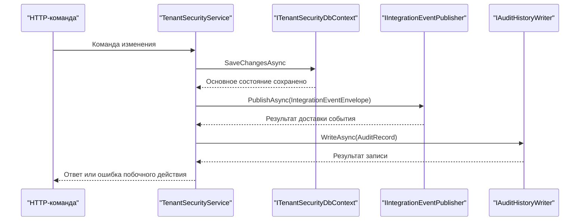

# Безопасность и аудит — Tenant Security

[codes]: https://github.com/axelprosoft/DMP.PlatformFoundation/blob/3e2037ac37683eef331d70223c6babfc61aa0539/src/Platform/DMP.Platform.TenantSecurity/Infrastructure/Persistence/TenantSecuritySystemCodes.cs
[manifest]: https://github.com/axelprosoft/DMP.PlatformFoundation/blob/3e2037ac37683eef331d70223c6babfc61aa0539/src/Platform/DMP.Platform.TenantSecurity/Infrastructure/Security/TenantSecuritySecurityCatalogManifest.cs
[provider]: https://github.com/axelprosoft/DMP.PlatformFoundation/blob/3e2037ac37683eef331d70223c6babfc61aa0539/src/Platform/DMP.Platform.TenantSecurity/Api/Controllers/PermissionAuthorizationPolicyProvider.cs
[handler]: https://github.com/axelprosoft/DMP.PlatformFoundation/blob/3e2037ac37683eef331d70223c6babfc61aa0539/src/Platform/DMP.Platform.TenantSecurity/Api/Controllers/PermissionAuthorizationHandler.cs
[session-handler]: https://github.com/axelprosoft/DMP.PlatformFoundation/blob/3e2037ac37683eef331d70223c6babfc61aa0539/src/Platform/DMP.Platform.TenantSecurity/Api/Controllers/SessionAuthorizationHandler.cs
[controller]: https://github.com/axelprosoft/DMP.PlatformFoundation/blob/3e2037ac37683eef331d70223c6babfc61aa0539/src/Platform/DMP.Platform.TenantSecurity/Api/Controllers/TenantSecurityController.cs
[service]: https://github.com/axelprosoft/DMP.PlatformFoundation/blob/3e2037ac37683eef331d70223c6babfc61aa0539/src/Platform/DMP.Platform.TenantSecurity/Application/Services/TenantSecurityService.cs
[assignment]: https://github.com/axelprosoft/DMP.PlatformFoundation/blob/3e2037ac37683eef331d70223c6babfc61aa0539/src/Platform/DMP.Platform.TenantSecurity/Domain/Entities/UserRoleAssignment.cs
[policy]: https://github.com/axelprosoft/DMP.PlatformFoundation/blob/3e2037ac37683eef331d70223c6babfc61aa0539/src/Platform/DMP.Platform.TenantSecurity/Domain/Entities/PermissionGrantPolicy.cs
[host]: https://github.com/axelprosoft/DMP.PlatformFoundation/blob/3e2037ac37683eef331d70223c6babfc61aa0539/src/Hosts/DMP.Platform.Api/Composition/PlatformApiCompositionExtensions.cs
[middleware]: https://github.com/axelprosoft/DMP.PlatformFoundation/blob/3e2037ac37683eef331d70223c6babfc61aa0539/src/Platform/DMP.Platform.Runtime/Context/PlatformRequestContextMiddleware.cs
[db]: https://github.com/axelprosoft/DMP.PlatformFoundation/blob/3e2037ac37683eef331d70223c6babfc61aa0539/src/Platform/DMP.Platform.TenantSecurity/Infrastructure/Persistence/TenantSecurityDbContext.cs
[hasher]: https://github.com/axelprosoft/DMP.PlatformFoundation/blob/3e2037ac37683eef331d70223c6babfc61aa0539/src/Platform/DMP.Platform.TenantSecurity/Application/Services/LocalPasswordHasher.cs
[options]: https://github.com/axelprosoft/DMP.PlatformFoundation/blob/3e2037ac37683eef331d70223c6babfc61aa0539/src/Platform/DMP.Platform.TenantSecurity/Infrastructure/Persistence/TenantSecurityBootstrapOptions.cs
[audit-record]: https://github.com/axelprosoft/DMP.PlatformFoundation/blob/3e2037ac37683eef331d70223c6babfc61aa0539/src/Platform/DMP.Platform.AuditHistory/Abstractions/AuditRecord.cs
[audit-writer]: https://github.com/axelprosoft/DMP.PlatformFoundation/blob/3e2037ac37683eef331d70223c6babfc61aa0539/src/Platform/DMP.Platform.AuditHistory/Abstractions/IAuditHistoryWriter.cs
[events]: https://github.com/axelprosoft/DMP.PlatformFoundation/blob/3e2037ac37683eef331d70223c6babfc61aa0539/src/Platform/DMP.Platform.IntegrationEvents/Abstractions/IIntegrationEventPublisher.cs

## 1. Назначение документа

Документ закрепляет каталог безопасности (`security catalog`), модель выдачи прав, действующие контроли, остаточные риски и фактическое покрытие audit records.

## 2. Ресурсы и права

Tenant Security публикует 21 stable permission code в пяти ресурсах. Полным
техническим владельцем кодов, системных ролей и локализованных описаний
каталога является manifest. Локализация не участвует в authorization decision:
решение использует технические permission/role codes, а локализованные тексты
нужны для списка, карточки, фильтров и сообщений Admin/API. ([codes][codes]; [manifest][manifest]; [service][service])

| Ресурс | Действие | Область действия | Политика или роль | Источник решения |
| --- | --- | --- | --- | --- |
| `TenantSecurity.Tenant` | View, Create, Edit, Activate, Disable, ScopeSwitch | По active assignment вызывающего пользователя | `Permission:<code>` и системные роли | [codes][codes]; [handler][handler]; [service][service] |
| `TenantSecurity.User` | View, Create, Edit, Enable, Disable, TenantAssign, TenantRemove | Global/Tenant/Site по assignment и правилам управления | `Permission:<code>` и системные роли | [codes][codes]; [service][service] |
| `TenantSecurity.Role` | View, Create, Edit, Delete, Assign | Область действия управляемой роли и назначение вызывающего пользователя | Dynamic policy + role mutability | [codes][codes]; [service][service] |
| `TenantSecurity.Permission` | View, Assign | Scope role и `PermissionGrantPolicy` | Dynamic policy + grant policy | [codes][codes]; [policy][policy]; [service][service] |
| `TenantSecurity.Audit` | View | По active assignment | `Permission:TenantSecurity.Audit.View` | Code опубликован, read endpoint области не опубликован. ([codes][codes]; [manifest][manifest]; [controller][controller]) |

| Системная роль | Scope | Назначение | Источник |
| --- | --- | --- | --- |
| `PlatformSuperAdmin` | Global | Все права Tenant Security | [manifest][manifest] |
| `PlatformTenantAdmin` | Global | Tenant metadata и lifecycle | [manifest][manifest] |
| `PlatformSecurityAdmin` | Global | Пользователи, роли, назначения, права и аудит across tenants | [manifest][manifest] |
| `TenantAdmin` | Tenant | Пользователи и роли назначенного tenant | [manifest][manifest] |
| `TenantSecurityAdmin` | Tenant | Security administration назначенного tenant | [manifest][manifest] |

## 3. Принятие решения и управление

Policy вида `Permission:<code>` создаётся dynamic provider. Для обычного `[Authorize]` действует default `SessionAuthorizationRequirement`: handler передаёт user, tenant, site и role codes в `ValidateSessionAsync`, который проверяет active user/tenant и соответствующий assignment. Это локальная проверка request context, а не production token authentication. ([provider][provider]; [handler][handler]; [service][service]; [session-handler][session-handler])

| Контекст роли | Coordinate assignment | Подтверждение |
| --- | --- | --- |
| Global/Corporate | Без tenant и site | [assignment][assignment] |
| Tenant | Tenant без site | [assignment][assignment] |
| Site | Tenant и site | [assignment][assignment] |

Если request не передал `SiteId`, текущий predicate не исключает site-scoped assignment. `ResourceContext` из authorize contract в decision не участвует. ([service][service]; [authorize request](https://github.com/axelprosoft/DMP.PlatformFoundation/blob/3e2037ac37683eef331d70223c6babfc61aa0539/src/Platform/DMP.Platform.Contracts/TenantSecurity/Requests/AuthorizeRequest.cs))

`PermissionGrantPolicy` ограничивает выдающего, области действия назначений и целевые области. Service дополнительно защищает системные роли и роли с признаком `ManagedByPlatform`, platform-only permissions, bootstrap tenant, последнего active platform administrator и последнее назначение `PlatformSuperAdmin`. ([policy][policy]; [service][service])

Manifest owner управляет только своими definitions: `SourceModuleCode` запрещает чужому владельцу переопределить `CapabilityCode`, permission или системную роль. Исчезнувшие permission и роли владельца manifest деактивируются при reconcile. ([manifest][manifest]; [registration service](https://github.com/axelprosoft/DMP.PlatformFoundation/blob/3e2037ac37683eef331d70223c6babfc61aa0539/src/Platform/DMP.Platform.TenantSecurity/Application/Services/TenantSecurityCapabilityRegistrationService.cs))

## 4. Контроли и риски

| Угроза | Контроль | Подтверждение | Остаточный риск |
| --- | --- | --- | --- |
| Компрометация local credential | PBKDF2-SHA256 с salt | [hasher][hasher] | Brute-force controls и default credentials см. в [трассировке](90_traceability.md): `TS-DEC-05` — bootstrap credentials. ([options][options]; [service][service]) |
| Выдача права без active identity | Dynamic policy проверяет identity, assignment, role и permission | [handler][handler]; [service][service] | Route coverage см. в [трассировке](90_traceability.md): `TS-DEC-04` — route policy coverage. ([controller][controller]) |
| Request context без подтверждённой session | Default `[Authorize]` проверяет active user/tenant, role codes и tenant/site assignment | [session-handler][session-handler]; [service][service] | Middleware по-прежнему только разбирает headers; production token/trusted ingress остаются открытыми: `TS-DEC-01`. |
| Межтенантный доступ | Service применяет tenant predicates; assignment проверяет coordinate | [service][service]; [assignment][assignment] | Общая schema не имеет global tenant query filters; полнота зависит от каждого query. ([db][db]) |
| Недопустимое административное изменение | Правила управления ограничивают системные роли, области действия и операции с последним администратором | [service][service] | Часть routes вызывает service governance без dynamic policy на route; см. [трассировку](90_traceability.md): `TS-DEC-04` — route policy coverage. ([controller][controller]; [service][service]) |
| Подмена HTTP identity context | Middleware валидирует наличие и формат headers | [middleware][middleware] | Trusted ingress см. в [трассировке](90_traceability.md): `TS-DEC-01` — production-аутентификация. ([host][host]; [controller][controller]) |
| Расширение site scope | При переданном `SiteId` decision фильтрует coordinate | [service][service] | Site semantics см. в [трассировке](90_traceability.md): `TS-DEC-07` — site scope semantics. ([service][service]; [assignment][assignment]) |

Логика вывода

Middleware подтверждает только формат заголовков и создаёт request context. Credential verification существует в login, а default `[Authorize]` может дополнительно сверить этот context с активной записью user/tenant/assignment. Host по-прежнему не связывает login с authentication scheme или principal, поэтому trusted HTTP identity boundary не реализована. ([middleware][middleware]; [service][service]; [host][host]; [session-handler][session-handler])

## 5. Аудит

Схема фиксирует фактический порядок для поддержанных команд: сначала сохраняется
состояние Tenant Security, затем отдельно вызываются Integration Events и Audit
History. Это не distributed transaction и не означает, что Tenant Security владеет
доставкой события или хранением audit record. ([service][service]; [audit-writer][audit-writer]; [events][events])

| Событие аудита | Инициатор | Контекст | Запись | Покрытие | Подтверждение |
| --- | --- | --- | --- | --- | --- |
| `Tenant.Create`, `Tenant.Update`, `Tenant.StatusChange` | User из request context | Optional tenant и correlation | Action, tenant/user, correlation, UTC и details | Create, update, status | [service][service]; [record][audit-record] |
| `User.Update`, `User.StatusChange`, password operations | User из request context | Tenant и correlation | Тот же record contract | Update, status, set/reset password; create user не покрыт | [service][service]; [record][audit-record] |
| `RolePermission.Grant`, `RolePermission.Remove` | User из request context | Tenant/caller scope и correlation | Action и details связи | Grant/remove | [service][service]; [record][audit-record] |
| Assignment operations | User из request context | Tenant/site coordinate и correlation | Action и assignment details | Assign/activate/deactivate/remove | [service][service]; [record][audit-record] |

`AuditRecord` содержит `ActionCode`, optional `TenantId` и `UserId`, `CorrelationId`, UTC timestamp и `Details`. Tenant Security формирует record и передаёт его в `IAuditHistoryWriter` через явные вызовы `WriteAuditAsync` после сохранения основного state. ([record][audit-record]; [writer][audit-writer]; [service][service])

## 6. Покрытие и пробелы

Общего audit interceptor для всех mutations и authorization decisions нет. Create user, login, authorization allow/deny, reads и catalog reconcile не имеют подтверждённого общего audit call. Permission `TenantSecurity.Audit.View` существует, но Tenant Security не публикует собственный read endpoint audit history. ([service][service]; [codes][codes]; [controller][controller])

Логика вывода

Покрытие получено по всем вызовам audit writer в service и сопоставлено с application/controller operations. Отсутствие interceptor не позволяет распространять найденные записи на методы без явного вызова. ([service][service]; [controller][controller])

Маршруты решений ведутся в [трассировке](90_traceability.md): `TS-DEC-01` — production-аутентификация; `TS-DEC-04` — route policy coverage; `TS-DEC-05` — bootstrap credentials; `TS-DEC-06` — audit/outbox; `TS-DEC-07` — site scope semantics.

## История изменений

| Версия | Дата и время | Автор | Раздел | Изменение | Коммит/PR |
|---|---|---|---|---|---|
| 0.1 | 2026-08-26 23:30 +03:00 | Олег Юрьев (@axelprosoft) | Создание документа | предварително готовые модули ядра и связанные изменения | [ca13b19b](https://github.com/axelprosoft/DMP.PlatformFoundation/commit/ca13b19bd17dd297927c1e66a97f95c29735b971) |
