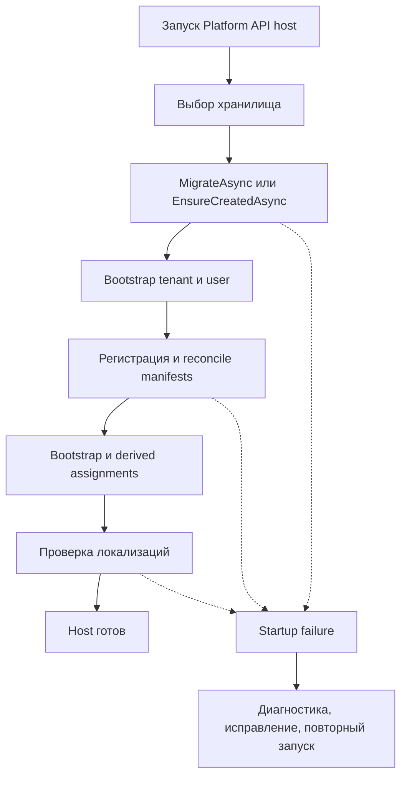

# Эксплуатация — Tenant Security

[host]: https://github.com/axelprosoft/DMP.PlatformFoundation/blob/3e2037ac37683eef331d70223c6babfc61aa0539/src/Hosts/DMP.Platform.Api/Composition/PlatformApiCompositionExtensions.cs
[initializer]: https://github.com/axelprosoft/DMP.PlatformFoundation/blob/3e2037ac37683eef331d70223c6babfc61aa0539/src/Platform/DMP.Platform.TenantSecurity/Infrastructure/Persistence/TenantSecurityDatabaseInitializer.cs
[options]: https://github.com/axelprosoft/DMP.PlatformFoundation/blob/3e2037ac37683eef331d70223c6babfc61aa0539/src/Platform/DMP.Platform.TenantSecurity/Infrastructure/Persistence/TenantSecurityBootstrapOptions.cs
[registration]: https://github.com/axelprosoft/DMP.PlatformFoundation/blob/3e2037ac37683eef331d70223c6babfc61aa0539/src/Platform/DMP.Platform.TenantSecurity/Application/Services/TenantSecurityCapabilityRegistrationService.cs
[di]: https://github.com/axelprosoft/DMP.PlatformFoundation/blob/3e2037ac37683eef331d70223c6babfc61aa0539/src/Platform/DMP.Platform.TenantSecurity/DependencyInjection.cs
[migrations]: https://github.com/axelprosoft/DMP.PlatformFoundation/tree/3e2037ac37683eef331d70223c6babfc61aa0539/src/Platform/DMP.Platform.TenantSecurity/Infrastructure/Persistence/Migrations
[migration-tests]: https://github.com/axelprosoft/DMP.PlatformFoundation/blob/3e2037ac37683eef331d70223c6babfc61aa0539/tests/DMP.Platform.IntegrationTests/FoundationSlice/TenantSecurityCatalogMigrationIntegrationTests.cs
[middleware]: https://github.com/axelprosoft/DMP.PlatformFoundation/blob/3e2037ac37683eef331d70223c6babfc61aa0539/src/Platform/DMP.Platform.Runtime/Context/PlatformRequestContextMiddleware.cs
[controllers]: https://github.com/axelprosoft/DMP.PlatformFoundation/tree/3e2037ac37683eef331d70223c6babfc61aa0539/src/Platform/DMP.Platform.TenantSecurity/Api/Controllers
[db]: https://github.com/axelprosoft/DMP.PlatformFoundation/blob/3e2037ac37683eef331d70223c6babfc61aa0539/src/Platform/DMP.Platform.TenantSecurity/Infrastructure/Persistence/TenantSecurityDbContext.cs

## 1. Назначение документа

Документ задаёт порядок запуска, миграции и безопасную диагностику подтверждённых отказов Tenant Security.

## 2. Запуск и готовность

Схема показывает порядок, необходимый для готовности Tenant Security. Пунктиром
показаны точки отказа; автоматический rollback и production recovery procedure
этим потоком не предполагаются. ([initializer][initializer]; [registration][registration]; [host][host])

| Шаг запуска | Условие | Идемпотентность | Критерий готовности | Откат |
| --- | --- | --- | --- | --- |
| Выбор хранилища | DI registration | Повторный выбор из той же configuration | Выбран TenantSecurity, fallback Platform или InMemory | Исправить configuration и перезапустить host. ([DI][di]) |
| Expand schema / InMemory create | Initializer | Applied migration не повторяется; InMemory использует `EnsureCreatedAsync` | Schema доступна | Автоматический rollback не задан. ([initializer][initializer]) |
| Bootstrap tenant/user | После schema | Existing records переиспользуются/активируются | Bootstrap identity существует | Штатное удаление не задано. ([initializer][initializer]) |
| Manifest registration/reconcile | После bootstrap | Stable codes обновляются, removed items деактивируются | Все manifests прошли validation | Исправить manifest и повторить startup. ([initializer][initializer]; [registration][registration]) |
| Cleanup и contract migration | После reconcile | Порядок учитывает applied migrations | Contract schema применена | Production rollback не подтверждён. ([initializer][initializer]) |
| Bootstrap/derived assignments | После catalog | Existing coordinate переиспользуется | Admin assignments active | Automatic removal не задан. ([initializer][initializer]) |
| Demo seed | `SeedDemoUsers=true` | Existing demo identities переиспользуются | Demo data создана | Выключение flag не удаляет data. ([initializer][initializer]; [options][options]) |
| Localization validation | После Tenant Security и Configuration | Read-only validation повторяема; активные языки берутся из Configuration | Для standard verb отсутствие `Name` останавливает startup validation; прочие отсутствующие catalog names дают warning | Исправить manifest/localization и повторить startup. ([host][host]; [registration][registration]) |

Host считается готовым после успешных migrations, bootstrap, catalog reconcile, assignments и localization validation. ([initializer][initializer]; [host][host])

## 3. Миграции

| Изменение | Порядок | Совместимость | Проверка | Откат |
| --- | --- | --- | --- | --- |
| `20260410125322_InitialTenantSecurity` | Первая migration | Создаёт исходную schema | EF migration chain | `Down` есть; production procedure не подтверждена. ([migrations][migrations]) |
| `20260804055820_AddTenantSecurityCatalogLocalization` | Expand до reconcile | Сохраняет legacy data | Migration integration test | `Down` есть; обратный data scenario не проверен. ([migrations][migrations]; [tests][migration-tests]) |
| Catalog registration/reconcile | Между expand и contract | Переносит и нормализует catalog data | Initializer и test | Повторяемый roll-forward; rollback ведётся как эксплуатационное ограничение. ([initializer][initializer]; [registration][registration]; [tests][migration-tests]) |
| `20260804060758_ContractTenantSecurityCatalog` | После reconcile | Удаляет legacy shape после переноса | Migration integration test | `Down` есть; сохранность обратного перехода не проверена. ([migrations][migrations]; [tests][migration-tests]) |
| `20260804114732_AddPermissionCatalogLifecycle` | После contract | Добавляет lifecycle fields | EF migration chain | `Down` есть; production procedure не подтверждена. ([migrations][migrations]) |

На базе до contract migration initializer выполняет expand, перенос/reconcile данных и затем contract; на уже contracted базе `MigrateAsync` выполняет обычный roll-forward. ([initializer][initializer]; [registration][registration])

Логика вывода

Migration classes подтверждают наличие `Down`, а test проверяет прямой expand/reconcile/contract. Поэтому техническая операция отката существует, но production procedure и сохранность данных при обратном переходе не подтверждены. ([migrations][migrations]; [migration tests][migration-tests])

## 4. Диагностика

| Ситуация | Технический код или сигнал | Что проверить | Безопасная интерпретация |
| --- | --- | --- | --- |
| Host не завершает инициализацию | Ошибка запуска host | Сохранить exception; проверить migration, bootstrap, manifest и localization stages | Причина находится в startup boundary, пока host не готов. ([host][host]; [initializer][initializer]) |
| Некорректный контекст запроса | HTTP 400 | Проверить tenant/user/site headers и GUID format | Request остановлен middleware. ([middleware][middleware]) |
| Учетные данные отклонены | HTTP 401; `INVALID_CREDENTIALS` | Проверить tenant/user status и credential | Login отклонён без раскрытия точной причины. ([controllers][controllers]) |
| Доступ запрещён | HTTP 403; reason code | Сопоставить status, assignment, site coordinate и permission | Decision или governance отклонили operation. ([controllers][controllers]) |
| Проверка `GET session/probe` отклонена | HTTP 403 | Сопоставить active user/tenant, переданные role codes и tenant/site assignment | Default session policy отклонила request context; production token boundary этим не подтверждается. ([controllers][controllers]; [трассировка](90_traceability.md): `TS-DEC-01`) |
| Обнаружен конфликт конкурентности | HTTP 409; `CONCURRENCY_CONFLICT` | Перечитать state и проверить параллельную запись | EF обнаружил изменение concurrency token. ([DbContext][db]; [controllers][controllers]) |
| Не найден элемент каталога или локализация | `—` | Найти owner manifest, language code и registration error | Manifest не зарегистрирован, не прошёл validation, перевод отсутствует или item деактивирован. Не исправлять localization tables вручную: исправляется manifest и повторяется registration. ([registration][registration]; [initializer][initializer]) |

## 5. Восстановление

| Сигнал | Диагностика | Действие | Критерий восстановления | Эскалация |
| --- | --- | --- | --- | --- |
| Startup migration failure | Connection string, applied migrations, initializer exception | Исправить configuration/error; повторить initializer | Host завершает initialization | Tenant Security persistence owner. ([initializer][initializer]) |
| Manifest/localization failure | Owner, codes, resources, verbs, policies, language | Исправить manifest; не менять catalog tables вручную. Повторный startup не удаляет перевод, исчезнувший из manifest; порядок очистки требует решения `TS-DEC-10` | Startup проходит registration/reconcile/validation | Manifest owner и Tenant Security. ([registration][registration]; [трассировка](90_traceability.md)) |
| Context 400 | Required headers и GUID format | Исправить trusted caller/proxy | Request доходит до controller | Ingress/authentication owner; см. [трассировку](90_traceability.md): `TS-DEC-01` — production-аутентификация. ([middleware][middleware]) |
| Authorization 403 | Reason code, status, assignment, coordinate, permission | Исправить данные штатной Admin/API operation | Decision возвращает `ALLOW` | Security owner. ([controllers][controllers]) |
| Concurrency 409 | Актуальное state и параллельное изменение | Повторить намеренное изменение на актуальном state | Command применён без lost update | Command owner. ([db][db]) |

Ручное изменение security tables не является штатным способом восстановления. Registration, Admin/API operations и initializer сохраняют ownership, invariants и побочные действия аудита. ([registration][registration]; [initializer][initializer]; [controllers][controllers])

## 6. Откат и эскалация

Автоматический rollback startup changes и replay побочных действий в платформенной области не заданы. Schema rollback и удаление bootstrap data требуют отдельной утверждённой процедуры; owner rotation, alert thresholds и сроки эскалации не определены. Открытые решения ведутся в [трассировке](90_traceability.md). ([initializer][initializer]; [migrations][migrations]; [registration][registration])

## История изменений

| Версия | Дата и время | Автор | Раздел | Изменение | Коммит/PR |
|---|---|---|---|---|---|
| 0.1 | 2026-08-27 16:52 +03:00 | Олег Юрьев (@axelprosoft) | Создание документа | docs-new: синхронизировать типы документов со стандартом | [7c7ecbfb](https://github.com/axelprosoft/DMP.PlatformFoundation/commit/7c7ecbfb4036c9ce3c6304f9ee3e4a6e48f7828c) |
