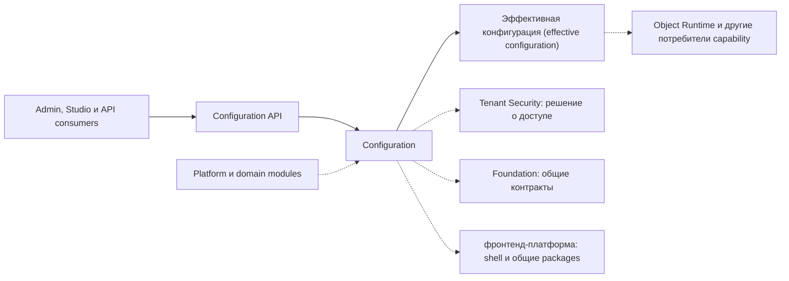

# Обзор платформенной области — Configuration

[project]: ../../../src/Platform/DMP.Platform.Configuration/
[contracts]: ../../../src/Platform/DMP.Platform.Contracts/Configuration/
[api]: ../../../src/Platform/DMP.Platform.Configuration/Api/Controllers/
[canonical]: ../../../src/Platform/DMP.Platform.Configuration/Domain/Canonical/
[schemas]: ../../../src/Platform/DMP.Platform.Configuration/Domain/Schemas/
[security]: ../../../src/Platform/DMP.Platform.Configuration/Infrastructure/Security/ConfigurationSecurityCatalogManifest.cs
[template]: ../00_platform_documentation_template.md
[playbook]: ../../00_governance/02_platform_area_documentation_playbook.md
[platform-terms]: ../../11_glossary/platform_terms.md
[configuration-terms]: ../../11_glossary/configuration_terms.md
[foundation]: ../00_foundation/00_platform_overview.md
[object-runtime]: ../03_object_runtime/00_platform_overview.md
[workflow]: ../04_workflow/00_platform_overview.md

## 1. Назначение области

Configuration владеет механизмом версионируемой конфигурации платформы: областями конфигурации, черновиками, публикацией, эффективной конфигурацией, канонической моделью артефактов, схемами артефактов, baseline-поставкой и серверными контрактами редактирования. ([project][project]; [contracts][contracts])

Configuration не является владельцем всего поведения, которое настраивается. Она хранит, проверяет, публикует и отдаёт конфигурационные артефакты; исполнение объектов, workflow, правил, отчётов, output, value sets, numbering и frontend shell принадлежит соседним платформенным областям. ([граница](01_scope.md))

## 2. Место в платформе

Configuration работает как platform capability внутри Platform API и предоставляет HTTP-контракты `api/platform/configuration`. Внутренняя модель использует канонический документ артефакта (`ArtifactDocument`, `ArtifactNode`, `ArtifactValue`, `EffectiveArtifactDocument`) и реестр схем для типов артефактов. ([api][api]; [canonical][canonical]; [schemas][schemas])

Межмодульные связи Configuration с Tenant Security, Object Runtime, Value Sets
и другими областями показаны в [интеграционной архитектуре Platform
Core](../../02_architecture/07_integration_architecture.md). Этот пакет
содержит подробности самой Configuration, а не общую карту взаимодействий.

Схема показывает контекст области и владельцев границ. Configuration принимает
запросы и поставки модулей, формирует эффективную конфигурацию и отдаёт её
потребителям; исполнение, общая авторизация, Foundation и frontend shell остаются
внешними владельцами. Пунктир означает внешнюю границу или использование capability,
а не передачу ей владения Configuration. ([api][api]; [security][security]; [project][project])

Переходная папка `03_platform/02_configuration_platform/` закрыта по `PCDOC-14.18`. Её исходные копии не входят в утверждённый комплект; старые исходные материалы в `docs/` сохранены отдельно.

Локальная таблица ниже повторяет ключевые термины для удобства чтения. Источник истины для терминологии Configuration — [тематический глоссарий][configuration-terms]; общие платформенные термины ведутся в [платформенном глоссарии][platform-terms].

| Термин | Техническое имя | Значение | Источник |
| --- | --- | --- | --- |
| Конфигурация | `Configuration` | Платформенный механизм хранения, редактирования, публикации и чтения конфигурационных артефактов. | [configuration terms][configuration-terms]; [project][project] |
| Область конфигурации | `ConfigurationScope` | Уровень применения конфигурации: `SystemBaseline`, `Corporate`, `Tenant`, `Site`. | [configuration terms][configuration-terms] |
| Версия конфигурации | `ConfigurationVersion` | Draft/published/archived версия внутри области конфигурации. | [configuration terms][configuration-terms] |
| Канонический документ артефакта | `ArtifactDocument` | Внутреннее представление конфигурационного артефакта для authoring/effective/projection pipeline. | [configuration terms][configuration-terms]; [canonical][canonical] |
| Эффективная конфигурация | `EffectiveArtifactDocument` | Результат композиции опубликованных слоёв конфигурации по точной цепочке областей. | [configuration terms][configuration-terms]; [canonical][canonical] |
| Тип конфигурационного артефакта | `ConfigurationArtifactTypeCodes` | Код типа артефакта и его дочерних узлов в реестре схем. | [configuration terms][configuration-terms]; [schemas][schemas] |
| Каталог типов артефактов | `artifact_types/` | Целевой каталог спецификаций артефактов Configuration. | [configuration terms][configuration-terms]; [template][template] |

### 2.1. Как читать каталог `artifact_types/`

`artifact_types/` состоит из отдельных спецификаций типов конфигурационных
артефактов. Каждый файл отвечает на вопрос: какие свойства, вложенные узлы,
допустимые значения и ограничения имеет один конкретный тип.

### 2.1.1. Какой файл какой тип описывает

| Тип конфигурационного артефакта | Файл спецификации | Что в нём описывается |
| --- | --- | --- |
| `ObjectType` | [`object_type.md`](artifact_types/object_type.md) | Тип объекта, его свойства, `ObjectMember` и правила типа объекта |
| `View` | [`view.md`](artifact_types/view.md) | Представление, формы, списки, фильтры и вложенные элементы представления |
| `Action` | [`action.md`](artifact_types/action.md) | Действие, параметры, результаты, сообщения и локальное поведение |
| `Workflow` | [`workflow.md`](artifact_types/workflow.md) | Состояния, команды, переходы и правила workflow |
| `Rule` | [`rule.md`](artifact_types/rule.md) | Правило и его параметры |
| `ValueSet` | [`value_set.md`](artifact_types/value_set.md) | Набор значений, элементы и правила его использования |
| `SystemEnum` | [`system_enum.md`](artifact_types/system_enum.md) | Системное перечисление и его значения |
| `Menu` | [`menu.md`](artifact_types/menu.md) | Меню и вложенные `NavigationItem` |
| `Report` | [`report.md`](artifact_types/report.md) | Описание отчёта и его design-time элементы |
| `Output` | [`output.md`](artifact_types/output.md) | Способ выдачи результата, параметры и настройки доставки |
| `NumberingRule` | [`numbering_rule.md`](artifact_types/numbering_rule.md) | Правило формирования номера и его условия |

Например, если нужно понять, какие поля разрешены у `View`, нужно открыть
[`view.md`](artifact_types/view.md). Если нужно понять, как `View` импортируется,
публикуется или используется в общей effective configuration, нужно дополнительно
открыть [04_runtime.md](04_runtime.md). Второй документ описывает общий процесс,
а не повторяет таблицу свойств `View`.

Вложенные типы не становятся отдельными файлами без отдельного решения. Например,
`ObjectMember` описывается внутри [`object_type.md`](artifact_types/object_type.md),
а `NavigationItem` внутри [`menu.md`](artifact_types/menu.md).

Остальные документы области нужны для общего контекста:

- [01_scope.md](01_scope.md) показывает границу Configuration;
- [02_architecture.md](02_architecture.md) показывает общую каноническую модель,
  хранение и реестр схем;
- [03_contracts.md](03_contracts.md) показывает HTTP, baseline и editor contracts;
- [05_security_and_audit.md](05_security_and_audit.md) — ограничения доступа и аудит;
- [06_user_experience.md](06_user_experience.md) — сценарии редактора;
- [07_quality.md](07_quality.md) — проверки;
- [08_operations.md](08_operations.md) — эксплуатацию.

Таким образом, `artifact_types/` отвечает только за структуру и schema-ограничения
артефактов. Общие API, runtime-процессы и frontend-исполнение в эти файлы не
переносятся. Исполнение `Workflow`, `Rule`, `ObjectType` и других capabilities
остаётся у соответствующих владельцев.

## 3. Основные возможности

| Возможность | Назначение | Статус | Основание |
| --- | --- | --- | --- |
| Области и версии конфигурации | Управлять `SystemBaseline`, `Corporate`, `Tenant`, `Site`, черновиками, публикацией и архивом. | Реализовано с ограничениями | [project][project]; [граница](01_scope.md) |
| Каноническая модель артефакта | Хранить и обрабатывать артефакты как `ArtifactDocument`/`ArtifactNode`/`ArtifactValue`. | Реализовано | [canonical][canonical] |
| Реестр схем артефактов | Описывать типы артефактов, свойства, коллекции, правила и value sources. | Реализовано; каталогизация `artifact_types/` продолжается по маршруту `90_traceability.md`. | [schemas][schemas]; [трассировка](90_traceability.md) |
| Baseline package и импорт | Принимать начальную конфигурацию модулей и переносить её в `SystemBaseline`. | Реализовано с ограничениями | [contracts][contracts]; [project][project] |
| Effective configuration | Собирать опубликованную конфигурацию по точной цепочке слоёв. | Реализовано с рисками промышленной эксплуатации | [project][project]; [трассировка](90_traceability.md) |
| Artifact editor contracts | Давать серверную модель чтения, редактирования, validation и сохранения артефакта. | Реализовано | [api][api]; [contracts][contracts] |
| Security catalog | Регистрировать ресурсы, permissions и роли `Configuration.*`. | Реализовано | [security][security] |

## 4. Ключевые решения

| Решение | Суть | Документ-владелец |
| --- | --- | --- |
| Configuration хранит конфигурационные артефакты, а не исполняет поведение | Исполнение принадлежит соседним областям; Configuration отвечает за модель, публикацию, validation и контракты чтения. | [Граница](01_scope.md) |
| `SystemBaseline` отделён от пользовательских слоёв | Baseline-поставка модулей не смешивается с `Corporate`, `Tenant` и `Site` override-слоями. | [Граница](01_scope.md); [трассировка](90_traceability.md) |
| Каноническая модель сохраняется как основа | Новый пакет не вводит вторую модель артефактов вместо `ArtifactDocument`/`ArtifactNode`/`ArtifactValue`. | [Граница](01_scope.md) |
| Каталог артефактов не склеивается в один документ | Спецификации типов артефактов переносятся в `artifact_types/` по одному типу после вычитки. | [Трассировка](90_traceability.md) |
| Переходная папка закрыта | Маршрут содержания проверен, активные Markdown-ссылки устранены, переходные копии удалены; старые исходники в `docs/` сохранены. | [Трассировка](90_traceability.md), `PCDOC-14.18` |

## 5. Зависимости

| Зависимость | Использование | Владелец |
| --- | --- | --- |
| Foundation | Общие domain/application-примитивы, контексты запроса, общие результаты, локализация и transport-типы. | [`00_foundation`][foundation] |
| Tenant Security | Permissions `Configuration.*`, роли и grant policies. | `01_tenant_and_security` |
| Object Runtime | Исполнение объектов, mutation pipeline и runtime-потребление опубликованной конфигурации. | [Object Runtime][object-runtime] |
| Workflow | Исполнение workflow definitions, states, commands и transitions. | [Workflow][workflow] |
| Rules | Исполнение правил и условий. | `05_rules` |
| Value Sets | Значения наборов и runtime-чтение вариантов выбора. | `06_value_sets` |
| Settings | Runtime settings и user preferences; Configuration хранит только snapshot/связанные артефакты, если это подтверждено кодом. | `07_settings` |
| Reporting и Output | Runtime выполнения отчётов и output; Configuration хранит design-time definitions и content refs. | `11_reporting_output` |
| фронтенд-платформа | Studio/Admin/Runtime shell, routing и shared runtime packages. | `12_frontend_platform` |

## 6. Статус реализации

Статусы возможностей Configuration приведены в таблице раздела 3. Текущая
реализация включает версионируемую конфигурацию, каноническую модель
артефактов, baseline-импорт и построение effective configuration; ограничения
указаны в [трассировке](90_traceability.md).

## 7. Состав документов

| Документ | Назначение | Состояние документа |
| --- | --- | --- |
| `00_platform_overview.md` | Карта области, граница, статус и состав пакета. | Создан |
| `01_scope.md` | Что принадлежит Configuration и что уходит соседним владельцам. | Создан |
| `02_architecture.md` | Компоненты, модель, данные, схемы и зависимости. | Создан |
| `03_contracts.md` | HTTP/C# contracts, baseline package, editor contracts и карта `artifact_types/`. | Создан |
| `04_runtime.md` | Публикация, effective resolution, import, validation, cache и failure behavior. | Создан |
| `05_security_and_audit.md` | Permissions `Configuration.*`, роли, локальные записи изменений и граница общего аудита. | Создан, требуется ревью |
| `06_user_experience.md` | Configuration-specific Studio сценарии; общий shell у фронтенд-платформа. | Создан, требуется ревью |
| `07_quality.md` | Тестовые свидетельства, инварианты, риски и known gaps. | Создан, требуется ревью |
| `08_operations.md` | Migrations, bootstrap, diagnostics, recovery и эксплуатационные ограничения. | Создан, требуется ревью |
| `90_traceability.md` | Маршрут source-материалов, расхождения и открытые решения. | Создан |
| `artifact_types/` | Спецификации типов конфигурационных артефактов после отдельной вычитки. | В работе; классификация согласована |

## История изменений

| Версия | Дата и время | Автор | Раздел | Изменение | Коммит/PR |
|---|---|---|---|---|---|
| 0.1 | 2026-08-27 15:04 +03:00 | Олег Юрьев (@axelprosoft) | Создание документа | подготовлен драфт новой проектной документации на ядро, прикладные модули, а так же термины и общие концептуальные документы | [5ecb26b1](https://github.com/axelprosoft/DMP.PlatformFoundation/commit/5ecb26b1c3ff3cfcdc13018e59526ae684ca6007) |
