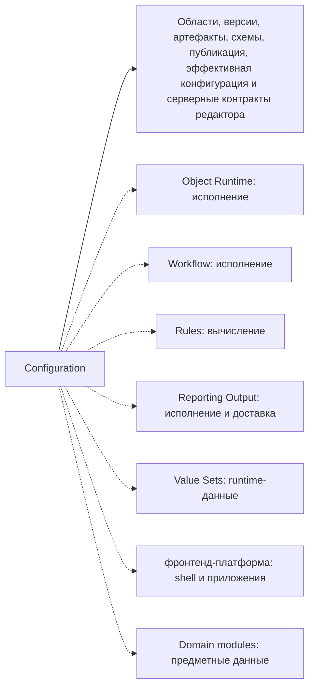

# Граница платформенной области — Configuration

[project]: ../../../src/Platform/DMP.Platform.Configuration/
[contracts]: ../../../src/Platform/DMP.Platform.Contracts/Configuration/
[api]: ../../../src/Platform/DMP.Platform.Configuration/Api/Controllers/
[canonical]: ../../../src/Platform/DMP.Platform.Configuration/Domain/Canonical/
[schemas]: ../../../src/Platform/DMP.Platform.Configuration/Domain/Schemas/
[security]: ../../../src/Platform/DMP.Platform.Configuration/Infrastructure/Security/ConfigurationSecurityCatalogManifest.cs

## 1. Назначение документа

Документ отделяет обязанности Configuration от исполнения объектов, workflow, правил, отчётов, output, value sets, settings, numbering и общей frontend-платформы. Он фиксирует границу первого целевого пакета `03_platform/02_configuration/`; подробная архитектура, контракты и runtime будут раскрыты в документах-владельцах. ([project][project]; [contracts][contracts])

## 2. Что входит

Схема отделяет собственное содержание Configuration от использования её
определений соседними областями. Сплошная связь показывает, чем владеет
Configuration; пунктир показывает внешнего владельца исполнения, приложения или
предметных данных. ([project][project]; [canonical][canonical]; [schemas][schemas])

| Обязанность | Входит | Не входит | Соседний владелец | Основание |
| --- | --- | --- | --- | --- |
| Области конфигурации | `SystemBaseline`, `Corporate`, `Tenant`, `Site`, parent chain и scope bootstrap. | Предметная иерархия предприятия или физическое размещение tenant data. | Tenant Security / Architecture | [project][project]; [api][api] |
| Версии конфигурации | Draft, published, archived, publish/archive, rebase/upgrade draft и validation перед публикацией. | Release management приложения и migration plan Java/PostgreSQL. | Architecture / Operations | [project][project]; [contracts][contracts] |
| Каноническая модель | `ArtifactDocument`, `ArtifactNode`, `ArtifactValue`, `EffectiveArtifactDocument`, source context и effective sources. | Исполняемая модель `BusinessObjectContract<T>` и `ObjectRuntimeDescriptor`. | Object Runtime | [canonical][canonical] |
| Реестр схем артефактов | Типы артефактов, свойства, дочерние коллекции, value sources, semantic roles и validation rules. | Runtime-семантика конкретного workflow, rule, report, output или frontend route. | Соседняя область по типу артефакта | [schemas][schemas] |
| Baseline package | Контракт начальной поставки конфигурации модуля и импорт в `SystemBaseline`. | Предметный lifecycle модуля и бизнес-данные. | Domain modules / Operations | [contracts][contracts]; [project][project] |
| Artifact editor | Серверная модель чтения/редактирования артефакта, session, validation, save/discard и node actions. | Общий frontend shell, routing и visual component library. | фронтенд-платформа | [api][api]; [contracts][contracts] |
| Effective configuration | Разрешение опубликованной конфигурации для потребителей по цепочке областей и версий. | Выполнение операций с объектами, отчётами, workflow и output. | Object Runtime / Reporting Output / Workflow | [project][project]; [contracts][contracts] |
| Security manifest | Ресурсы, permissions, роли и grant policies `Configuration.*`. | Общий каталог безопасности и проверка доступа как механизм. | Tenant Security | [security][security] |
| Каталог типов артефактов | Документированные спецификации `artifact_types/*` после вычитки старого каталога артефактов. | Склад исходных материалов без проверки. | Configuration | [Трассировка](90_traceability.md) |

## 3. Что не входит

За границей Configuration остаются:

- исполнение object CRUD/action/workflow-state-change и `Object Mutation Pipeline`;
- исполнение workflow, хранение workflow history и workflow runtime transaction;
- общий Rule Engine за пределами schema/definition/condition binding;
- фактические значения ValueSet и value set data editor runtime;
- runtime settings и user preferences как самостоятельная область Settings;
- numbering counters и момент присвоения номера в runtime;
- Report/Output execution, Java Report Service, delivery и background processing;
- общий Dataset / Read Query Capability;
- shell, routing, session/bootstrap, `@dmp/runtime-react`, `@dmp/runtime-contracts`, `@dmp/ui` и границы приложений Admin/Runtime/Studio.

Логика вывода

Граница получена пересечением текущего кода `DMP.Platform.Configuration`, contracts `DMP.Platform.Contracts/Configuration`, HTTP controllers и старых source-материалов. Если тема имеет собственный runtime project, API, storage или future capability owner, Configuration описывает только её конфигурационный артефакт и связи, а поведение оставляет соседнему владельцу.

## 4. Граница с соседними областями и модулями

| Соседний владелец | Что получает от Configuration | Что остаётся у соседа |
| --- | --- | --- |
| Tenant Security | Permission codes, системные роли и route policies `Configuration.*`. | Каталог безопасности, назначения ролей и authorization decisions. |
| Object Runtime | Published/effective configuration для views, object metadata и runtime materialization. | Исполнение операций, invariants, mutation pipeline, transaction, audit/outbox. |
| Workflow | Workflow definition как конфигурационный артефакт. | State machine execution, state store, transition history и workflow permissions. |
| Rules | Rule definition и condition bindings как конфигурационные артефакты. | Evaluation gateway, supported engines, runtime authority и result semantics. |
| Value Sets | `ValueSet` definition, published metadata и baseline seed для фактических значений. | Хранение значений, scoped overrides, runtime-чтение items и value set data editor. |
| Settings | Snapshot/связь с configuration version, если подтверждено кодом. | Каталог настроек, effective values, user preferences и runtime cache. |
| Reporting Output | Report/Output definitions и design-time content refs. | ExecuteReport, GenerateOutput, Java Report Service, delivery и output audit. |
| фронтенд-платформа | Server contracts редактора и published UI configuration. | Studio/Admin/Runtime apps, shell, routing, shared UI и runtime packages. |

### 4.1. Как читать переходные названия моделей

В старой переходной папке и исходных документах встречаются названия, которые
не являются отдельными корневыми типами текущей Configuration schema. Их нельзя
считать дополнительными артефактами только потому, что для них существует
отдельный исходный файл.

| Переходное название | Состояние в текущем контракте | Куда относится подтверждённое содержание |
| --- | --- | --- |
| `Navigation` | Не зарегистрирован как отдельный корневой тип. | Корневой `Menu` и его иерархическая коллекция `NavigationItems[]` с узлами `NavigationItem`; shell и маршрутизация принадлежат фронтенд-платформа. |
| `Lookup` | Не зарегистрирован как отдельный артефакт. | Возможность выбора значения внутри `View`, включая `LookupListView`, `LookupViewCode` и `LookupSourceCode`; данные источника принадлежат своему владельцу. |
| `GridUi` | Отдельный тип Configuration schema не подтверждён. | Подтверждённые элементы табличного и списочного представления описываются через `View`, `ViewColumn`, `ViewWidget` и `ViewLayoutNode`; группировка полей в редакторе относится к UX. |
| `EnumPresentation` | Отдельный тип Configuration schema не подтверждён. | Поддержанные текущим кодом настройки отображения описываются у фактического владельца (`SystemEnum` или `View`); неподтверждённые варианты остаются исходным материалом или будущим требованием. |

Переходные файлы не являются каноническими документами и не должны
использоваться как источник текущего контракта вместо документов области и
`artifact_types/*`. Переходная папка закрыта по `PCDOC-14.18`; исходные
материалы в старом `docs/` при этом не удалены.

## 5. Соответствие требованиям

| Требование | Покрытие | Решение | Документ-владелец |
| --- | --- | --- | --- |
| Версионируемая Configuration Platform | Частично | Код подтверждает scopes, versions, drafts, publish/archive, effective и editor contracts; пакет целевых документов создан, его отдельные артефакты и расхождения проходят финальную сверку. | [Обзор](00_platform_overview.md), [Архитектура](02_architecture.md), [Исполнение](04_runtime.md) |
| Не создавать новую модель артефактов | Покрыто | Целевой пакет закрепляет существующую canonical model и schema registry. | [Обзор](00_platform_overview.md), [Архитектура](02_architecture.md) |
| Каталог конфигурационных артефактов | В работе | Старый каталог артефактов используется только как материал для вычитки; целевой каталог формируется в `artifact_types/`. Маршрут переноса — `90_traceability.md`. | [Трассировка](90_traceability.md), `03_contracts.md` |
| Frontend/Studio сценарии конфигурации | Частично покрыто | В Configuration входят server contracts и сценарии редактирования артефактов; общий shell принадлежит фронтенд-платформа. См. [трассировку Configuration](90_traceability.md): `CFG-DEC-05` — Frontend Studio boundary. | [UX Configuration](06_user_experience.md), `12_frontend_platform` |
| Reporting/Output design-time | Частично покрыто | Configuration содержит design/content/contracts для report definitions; runtime исполнения принадлежит Reporting Output. См. [трассировку Configuration](90_traceability.md): `CFG-DEC-02` — Report design-time boundary. | [Трассировка](90_traceability.md), `11_reporting_output` |
| Dataset / Read Query Capability | Открытый вопрос | В contracts есть dataset registration, но общий read query owner ещё не выбран. См. [трассировку Configuration](90_traceability.md): `CFG-DEC-03` — Dataset / Read Query owner. | [Трассировка](90_traceability.md) |

## 6. Ограничения версии

Первый пакет `02_configuration/` был создан рядом со старой переходной папкой
`02_configuration_platform/`. Её содержание классифицировано в
`90_traceability.md`, актуальные факты перенесены в документы-владельцы,
будущие темы записаны в backlog, активные ссылки устранены, а переходные
копии удалены. Старые исходные материалы в `docs/` остаются архивом.

Документ фиксирует границу текущего MVP и ближайшего переноса документации. Java/PostgreSQL-решения, Dataset / Read Query Capability, полная фронтенд-платформа и промышленная эксплуатационная модель остаются отдельными результатами архитектурного этапа.

## История изменений

| Версия | Дата и время | Автор | Раздел | Изменение | Коммит/PR |
|---|---|---|---|---|---|
| 0.1 | 2026-08-27 16:52 +03:00 | Олег Юрьев (@axelprosoft) | Создание документа | docs-new: синхронизировать типы документов со стандартом | [7c7ecbfb](https://github.com/axelprosoft/DMP.PlatformFoundation/commit/7c7ecbfb4036c9ce3c6304f9ee3e4a6e48f7828c) |
