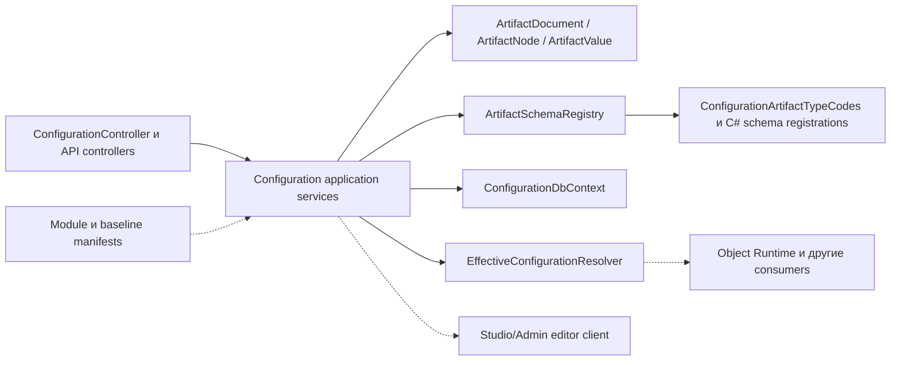
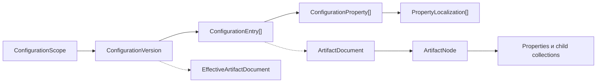
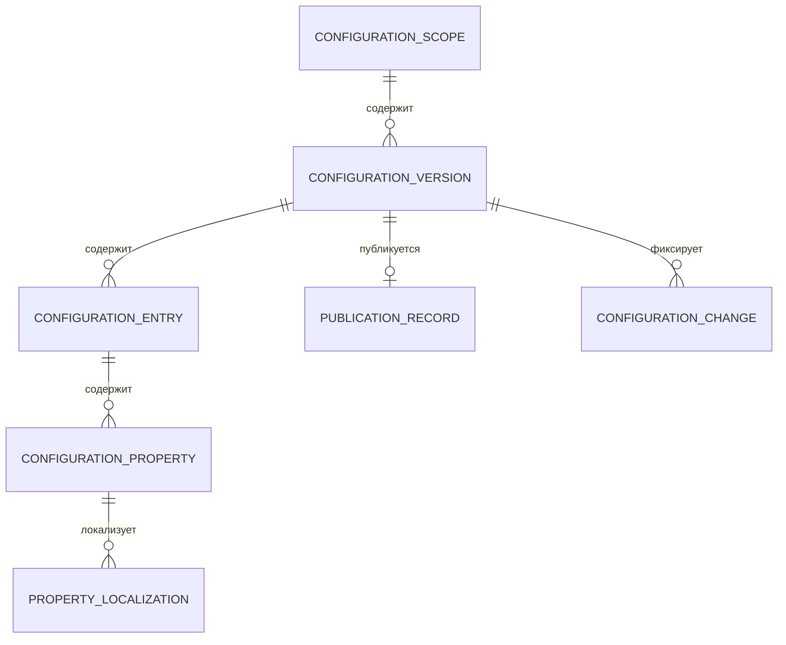

# Архитектура — Configuration

[di]: ../../../src/Platform/DMP.Platform.Configuration/DependencyInjection.cs
[controller]: ../../../src/Platform/DMP.Platform.Configuration/Api/Controllers/ConfigurationController.cs
[content-controller]: ../../../src/Platform/DMP.Platform.Configuration/Api/Controllers/ConfigurationContentController.cs
[report-contract-controller]: ../../../src/Platform/DMP.Platform.Configuration/Api/Controllers/ReportContractController.cs
[report-design-controller]: ../../../src/Platform/DMP.Platform.Configuration/Api/Controllers/ReportDesignOperationsController.cs
[authoring-service]: ../../../src/Platform/DMP.Platform.Configuration/Application/Services/Authoring/ConfigurationAuthoringService.cs
[publication-service]: ../../../src/Platform/DMP.Platform.Configuration/Application/Services/Core/ConfigurationPublicationService.cs
[effective-resolver]: ../../../src/Platform/DMP.Platform.Configuration/Application/Services/Effective/EffectiveConfigurationResolver.cs
[baseline-import]: ../../../src/Platform/DMP.Platform.Configuration/Application/Import/Services/ConfigurationBaselineImportService.cs
[bootstrap]: ../../../src/Platform/DMP.Platform.Configuration/Application/Bootstrap/Services/ConfigurationBootstrapOrchestrator.cs
[editor-query]: ../../../src/Platform/DMP.Platform.Configuration/Application/Services/Editor/ConfigurationArtifactEditorQueryService.cs
[editor-command]: ../../../src/Platform/DMP.Platform.Configuration/Application/Services/Editor/ConfigurationArtifactEditorCommandService.cs
[editor-session]: ../../../src/Platform/DMP.Platform.Configuration/Application/Services/Editor/ConfigurationRootArtifactEditorSessionService.cs
[catalog-service]: ../../../src/Platform/DMP.Platform.Configuration/Application/Services/Catalog/ConfigurationCatalogService.cs
[canonical]: ../../../src/Platform/DMP.Platform.Configuration/Domain/Canonical/
[artifact-document]: ../../../src/Platform/DMP.Platform.Configuration/Domain/Canonical/ArtifactDocument.cs
[artifact-node]: ../../../src/Platform/DMP.Platform.Configuration/Domain/Canonical/ArtifactNode.cs
[effective-document]: ../../../src/Platform/DMP.Platform.Configuration/Domain/Canonical/EffectiveArtifactDocument.cs
[schemas]: ../../../src/Platform/DMP.Platform.Configuration/Domain/Schemas/
[schema-registry]: ../../../src/Platform/DMP.Platform.Configuration/Domain/Schemas/ArtifactSchemaRegistry.cs
[schema-factory]: ../../../src/Platform/DMP.Platform.Configuration/Domain/Services/ConfigurationArtifactSchemaRegistryFactory.cs
[artifact-type-codes]: ../../../src/Platform/DMP.Platform.Configuration/Domain/Schemas/ConfigurationArtifactTypeCodes.cs
[property-codes]: ../../../src/Platform/DMP.Platform.Configuration/Domain/Schemas/ConfigurationSchemaPropertyCodes.cs
[collection-codes]: ../../../src/Platform/DMP.Platform.Configuration/Domain/Schemas/ConfigurationSchemaCollectionCodes.cs
[static-value-codes]: ../../../src/Platform/DMP.Platform.Contracts/Configuration/ConfigurationStaticValueCodes.cs
[static-options]: ../../../src/Platform/DMP.Platform.Configuration/Domain/Schemas/ArtifactStaticOptionCatalog.cs
[value-source-codes]: ../../../src/Platform/DMP.Platform.Configuration/Domain/Schemas/ArtifactValueSourceCodes.cs
[value-source-definition]: ../../../src/Platform/DMP.Platform.Configuration/Domain/Schemas/ArtifactValueSourceDefinition.cs
[metadata-catalog]: ../../../src/Platform/DMP.Platform.Configuration/Domain/Schemas/ConfigurationSchemaMetadataCatalog.cs
[schema-policies]: ../../../src/Platform/DMP.Platform.Configuration/Domain/Schemas/
[entities]: ../../../src/Platform/DMP.Platform.Configuration/Domain/Entities/
[scope-entity]: ../../../src/Platform/DMP.Platform.Configuration/Domain/Entities/ConfigurationScope.cs
[version-entity]: ../../../src/Platform/DMP.Platform.Configuration/Domain/Entities/ConfigurationVersion.cs
[entry-entity]: ../../../src/Platform/DMP.Platform.Configuration/Domain/Entities/ConfigurationEntry.cs
[property-entity]: ../../../src/Platform/DMP.Platform.Configuration/Domain/Entities/ConfigurationProperty.cs
[editor-session-entity]: ../../../src/Platform/DMP.Platform.Configuration/Domain/Entities/ConfigurationRootArtifactEditorSession.cs
[identity-strategy]: ../../../src/Platform/DMP.Platform.Configuration/Domain/Services/ArtifactIdentityStrategy.cs
[dbcontext]: ../../../src/Platform/DMP.Platform.Configuration/Infrastructure/Persistence/ConfigurationDbContext.cs
[migrations]: ../../../src/Platform/DMP.Platform.Configuration/Infrastructure/Persistence/Migrations/
[security]: ../../../src/Platform/DMP.Platform.Configuration/Infrastructure/Security/ConfigurationSecurityCatalogManifest.cs
[configuration-terms]: ../../11_glossary/configuration_terms.md
[foundation-architecture]: ../00_foundation/02_architecture.md

## 1. Назначение документа

Документ описывает устройство Configuration: компоненты, каноническую модель, persistence-модель, инварианты, зависимости и точки расширения. Runtime-сценарии публикации, import, effective resolution и failure behavior детализируются в `04_runtime.md`; внешние HTTP/C# contracts и карта `artifact_types/` детализируются в `03_contracts.md`.

Термины документа ведутся в [глоссарии Configuration][configuration-terms]. Если ниже указан английский technical alias, он соответствует имени в коде или public contract.

## 2. Граница и компоненты

Configuration построена как platform capability, подключаемая через `AddPlatformConfiguration`. Composition root регистрирует EF Core контекст, application services, schema registry, baseline package manifests, module manifests, settings catalog manifests, editor projectors, report design services, value set projection adapters, effective cache и security manifest. ([di][di])

| Компонент | Ответственность | Зависимости | Подтверждение |
| --- | --- | --- | --- |
| HTTP/API layer | Platform API маршруты `api/platform/configuration`, content endpoints и report design/contract endpoints. | Application services и ASP.NET Core host | [ConfigurationController][controller], [ConfigurationContentController][content-controller], [ReportContractController][report-contract-controller], [ReportDesignOperationsController][report-design-controller] |
| Application services | Команды и запросы для scope/version/entry/property, публикации, baseline import, context bootstrap, editor и effective resolution. | Canonical model, persistence и security policies | [authoring service][authoring-service], [publication service][publication-service], [baseline import][baseline-import], [effective resolver][effective-resolver] |
| Canonical model | Внутреннее дерево конфигурационного артефакта для authoring, эффективной конфигурации и projection pipeline. | Schema registry и application services | [canonical model][canonical], [ArtifactDocument][artifact-document], [ArtifactNode][artifact-node], [EffectiveArtifactDocument][effective-document] |
| Schema registry | Описание типов артефактов, свойств, дочерних коллекций, value sources, discriminator и validation/merge metadata. | C# schema registrations и artifact type codes | [schemas][schemas], [schema registry][schema-registry], [schema factory][schema-factory] |
| Persistence | SQL Server/InMemory storage для scopes, versions, entries, properties, localizations, catalogs, content blobs и transient editor sessions. | EF Core и migrations | [ConfigurationDbContext][dbcontext], [entities][entities], [migrations][migrations] |
| Security manifest | Регистрация resources, permissions, verbs и системных ролей `Configuration.*`. | Tenant Security registry | [security manifest][security] |

### 2.1. Канонические источники schema и кодов

Configuration использует несколько связанных источников. Они не заменяют друг
друга и не должны смешиваться в документации.

| Слой | Что задаёт | Канонический источник | Как используется в документации |
| --- | --- | --- | --- |
| Коды типов | Технические имена root и child artifact types | [ConfigurationArtifactTypeCodes][artifact-type-codes] | Указывается в схеме и карте `artifact_types/` |
| Коды свойств и коллекций | Технические имена properties и child collections | [ConfigurationSchemaPropertyCodes][property-codes], [ConfigurationSchemaCollectionCodes][collection-codes] | Используются в identity, схемах и таблицах свойств |
| Schema registrations | Тип значения, requiredness, discriminator, dependencies, operations и schema rules | [schema registrations][schemas] и [schema registry][schema-registry] | Определяют фактический schema-контракт |
| Static value codes | Технические константы возможных enum-значений | [ConfigurationStaticValueCodes][static-value-codes] | Значения приводятся явно, рядом называется класс `*Codes` |
| Static option catalog | Разрешённый набор для конкретной пары type/property | [ArtifactStaticOptionCatalog][static-options] | Имеет приоритет над общим списком констант для данного свойства |
| Dynamic value sources | Идентификаторы catalog/collection/registry source и зависимости | [ArtifactValueSourceCodes][value-source-codes], [ArtifactValueSourceDefinition][value-source-definition] | Указываются owner, способ получения, обновление и validation |
| Editor metadata | Русские/английские названия и описания полей и коллекций | [ConfigurationSchemaMetadataCatalog][metadata-catalog] | Используется для терминологической сверки с UI |
| Runtime projection | Фактически используемые поля, defaults и поддержанное подмножество | Runtime provider/materializer конкретной capability | Описывается отдельно от полного schema-каталога |

Поэтому явное перечисление в `artifact_types/<artifact>.md` является
пользовательским представлением канонического списка, а не его копией-
источником. При изменении кода список должен быть перепроверен по schema и
catalog; расхождение между schema, editor и runtime переносится в
`90_traceability.md`.

Схема показывает внутренний путь Configuration от API к application services,
канонической модели, schema registry и persistence. Пунктиром показаны входящие
поставки и внешние потребители; `EffectiveConfigurationResolver` выдаёт результат
конфигурации, но не исполняет объект, workflow, правило или отчёт. ([controller][controller]; [authoring-service][authoring-service]; [schema-registry][schema-registry]; [dbcontext][dbcontext])

| Компонент Foundation | Как используется | Владелец определения | Семантика области |
| --- | --- | --- | --- |
| `Entity` | Все persistence-сущности Configuration используют общий идентификатор сущности. | Foundation | Configuration задаёт жизненный цикл и связи своих сущностей; Foundation не владеет schema Configuration. |
| `ITenantContext` | Authoring, query, content, editor, import и bootstrap получают текущий tenant-контекст. | Foundation | Configuration применяет его для ограничения операций и выбора tenant-данных. |
| `IRequestAccessContext` | `ConfigurationAccessGuard` и query service используют контекст доступных ролей/прав. | Foundation | Configuration проверяет свои permission policies; решение о выдаче прав принадлежит Tenant Security. |
| `IClock`, `ICorrelationContext` | Время и correlation id используются при authoring, publication, import и bootstrap. | Foundation | Configuration связывает их со своими версиями, журналами изменений и диагностикой. |
| `DMP.Platform.Contracts.Common` | Общие list/query/UI и localization-типы используются в запросах и ответах Configuration. | Foundation | Configuration задаёт смысл фильтров и представления своих артефактов, не меняя общий формат. |

Определения этих общих компонентов находятся в [архитектуре Foundation][foundation-architecture].
Здесь зафиксировано только их фактическое использование Configuration.

Логика вывода

Граница компонентов взята из `DependencyInjection.cs`, потому что он показывает фактический composition root. Если сервис зарегистрирован как dependency Configuration, но исполняет соседнюю capability, документ фиксирует только точку интеграции. Например, `IConfigurationPublishedValueSetProjectionService` относится к публикации конфигурации, а runtime-чтение значений остаётся у Value Sets.

## 3. Архитектурная модель и инварианты

| Понятие или архитектурный тип | Техническое имя | Владелец | Связи | Инвариант | Подтверждение |
| --- | --- | --- | --- | --- | --- |
| Область конфигурации | `ConfigurationScope` | Configuration | Связана с версиями и parent scope | Тип области определяет допустимые identity и parent chain | [ConfigurationScope][scope-entity] |
| Версия конфигурации | `ConfigurationVersion` | Configuration | Принадлежит scope, содержит entries и lineage | Только опубликованная версия участвует в effective chain | [ConfigurationVersion][version-entity] |
| Запись артефакта | `ConfigurationEntry` | Configuration | Принадлежит версии, имеет `OriginKey` и child entries | `OriginKey` уникален внутри версии | [ConfigurationEntry][entry-entity] |
| Значение свойства | `ConfigurationProperty` | Configuration | Принадлежит entry и может иметь локализации | Отсутствующее значение отличается от explicit null | [ConfigurationProperty][property-entity] |
| Канонический узел | `ArtifactNode` | Configuration | Входит в `ArtifactDocument`, содержит properties и child collections | Тип узла определяется `ArtifactTypeCode` и schema registry | [ArtifactNode][artifact-node] |

Configuration использует две связанные модели: persistence-модель хранит разреженные изменения версий, а каноническая модель представляет артефакт как дерево для чтения, редактирования и построения эффективной конфигурации. Persistence-модель записей и свойств не заменяется вторым документным хранилищем; `ArtifactDocument` строится поверх `ConfigurationEntry`, `ConfigurationProperty` и `ConfigurationPropertyLocalization`. ([entry entity][entry-entity]; [property entity][property-entity]; [artifact document][artifact-document])

### 3.1. Идентичность записи и связи

Одна логическая запись проходит через package, persistence и каноническую модель.
Технические поля этих моделей не являются взаимозаменяемыми.

| Понятие | Где используется | Что означает | Что не означает |
| --- | --- | --- | --- |
| `GroupType` | Baseline package | Группа поставки: `Data`, `Workflow`, `Rule`, `Ui`, `Reporting`, `Output`, `ValueSet`, `SystemEnum`, `Action`, `Menu` или `ValueSetData` | Не является полным `ArtifactTypeCode` конкретного узла |
| `ArtifactTypeCode` | `ArtifactNode` | Технический тип канонического узла, например `ObjectType` или `View` | Не является кодом конкретного экземпляра |
| `KindCode` | `ConfigurationEntry` | Тип записи в persistence-модели; соответствует типу импортированного узла | Не является database key |
| `Code` / `ArtifactCode` | Canonical/persistence и baseline entry | Код конкретного артефакта или дочерней записи; `ArtifactCode` является именем этого поля в package | Не гарантирует глобальную уникальность без контекста типа и родителя |
| `ModuleCode` | Package identity, entry и catalog | Код модуля-владельца или поставщика записи | Не определяется физической сборкой и не заменяет permission owner |
| `OriginKey` | Package, persistence и effective/rebase | Стабильная логическая идентичность записи между версиями Configuration | Не является `EntryId` и не является ссылкой на родителя |
| `ParentOriginKey` | Baseline entry и logical model | Логическая ссылка на родительскую запись по её `OriginKey` | Не является `ParentEntryId` и не описывает override |
| `EntryId` | Persistence | Внутренний идентификатор строки `ConfigurationEntry` | Не переносится как стабильный ключ между версиями или package |
| `ParentEntryId` | Persistence | Физическая связь строки с родительской строкой в той же версии | Не заменяет логическую parent-связь при переносе package |
| `OverridesEntryId` | Persistence и effective merge | Физическая ссылка записи текущего слоя на запись, которую она переопределяет | Не означает родительский узел в дереве |

Для корневого узла формат `OriginKey` выбирается стратегией идентичности с учётом
типа и контекста. Например, для `ObjectType` с модулем используется
`ObjectType|<ModuleCode>|<ObjectTypeCode>`. Для дочернего узла ключ строится на
основе типа и payload родительского ключа; отдельные типы, например `Menu`, могут
иметь специальное правило. Поэтому документация не должна объявлять один формат
`OriginKey` обязательным для всех артефактов. ([identity strategy][identity-strategy])

Схема различает хранение и каноническое представление: `ConfigurationEntry` и
`ConfigurationProperty` хранят разреженные изменения, а пунктирная связь показывает
построение `ArtifactDocument` и эффективной конфигурации поверх сохранённых данных.
`EffectiveArtifactDocument` является результатом разрешения конфигурации, а не
моделью исполнения Object Runtime. ([artifact-document][artifact-document]; [artifact-node][artifact-node]; [effective-document][effective-document])

| Инвариант | Суть | Подтверждение |
| --- | --- | --- |
| Область конфигурации имеет строгий тип | `SystemBaseline` и `Corporate` не имеют tenant/site identity; `Tenant` требует `TenantId`; `Site` требует `TenantId` и `SiteId`. | [ConfigurationScope][scope-entity], [ConfigurationAuthoringService][authoring-service] |
| Parent chain идёт сверху вниз | Для runtime/effective chain `SystemBaseline` не имеет parent; `Corporate` должен ссылаться на опубликованную версию `SystemBaseline`; `Tenant` наследует от `Corporate`; `Site` наследует от `Tenant` того же tenant. | [authoring service][authoring-service], [effective resolver][effective-resolver] |
| Для каждой области конфигурации допускается не более одной активной версии каждого из статусов `Draft`, `Published` и `Failed` | Уникальный индекс ограничивает активные статусы внутри области конфигурации; публикация архивирует предыдущую `Published` version. | [ConfigurationDbContext][dbcontext], [publication service][publication-service] |
| Черновик не является runtime-источником | Runtime/effective чтение строится по published/archived parent chain; draft используется для authoring и validation до publish. | [ConfigurationVersion][version-entity], [effective resolver][effective-resolver] |
| `OriginKey` задаёт стабильную идентичность | Entry уникален по `(VersionId, OriginKey)` и используется для override, rebase, import и effective merge. | [ConfigurationEntry][entry-entity], [ConfigurationDbContext][dbcontext] |
| Значение свойства отличает отсутствующее значение от explicit null | `ConfigurationProperty` хранит `Value`, `ValueType` и `IsExplicitNull`; localization имеет ту же explicit-null семантику. | [ConfigurationProperty][property-entity], [ConfigurationDbContext][dbcontext] |
| Канонический узел типизирован кодом артефакта | `ArtifactNode` хранит `ArtifactTypeCode`, `Code`, properties и child collections; schema registry разрешает effective schema с учётом discriminator. | [ArtifactNode][artifact-node], [schema registry][schema-registry] |

Коды типов артефактов задаются в `ConfigurationArtifactTypeCodes`: `ObjectType`, `Workflow`, `Rule`, `ValueSet`, `SystemEnum`, `Action`, `View`, `Report`, `Output`, `Menu`, `NavigationItem` и дочерние типы. Подробная спецификация каждого типа должна переноситься в `artifact_types/`, см. [трассировку](90_traceability.md): `CFG-DEC-01` — состав `artifact_types/`. ([artifact type codes][artifact-type-codes])

Создание draft для non-root scope требует опубликованную parent-base version. Для `Corporate` такой parent-base является опубликованная версия `SystemBaseline`; для `Tenant` — опубликованная версия `Corporate`; для `Site` — опубликованная версия `Tenant` того же tenant. Context API отдаёт заблокированное действие `CreateDraft`, если parent-base отсутствует; authoring service сохраняет ту же инварианту для прямого API/service path. ([authoring service][authoring-service]; [effective resolver][effective-resolver])

## 4. Persistence-модель и хранение

Persistence слой использует schema `configuration`. При наличии connection string `Platform` подключается SQL Server с migration history table `configuration.__EFMigrationsHistory`; без connection string используется InMemory database для локальных/dev сценариев. ([di][di]; [dbcontext][dbcontext])

| Данные | Техническое представление | Владелец | Хранение | Ключ или ограничение | Подтверждение |
| --- | --- | --- | --- | --- | --- |
| Области конфигурации | `Scopes` / `ConfigurationScope` | Configuration | Схема SQL Server `configuration` | Уникальность по типу scope и tenant/site identity; optional `ParentScopeId` | [dbcontext][dbcontext], [scope-entity][scope-entity] |
| Версии | `Versions` / `ConfigurationVersion` | Configuration | Схема SQL Server `configuration` | `(ScopeId, VersionNumber)`; ограничение активного статуса; lineage references без cascade delete | [dbcontext][dbcontext], [version-entity][version-entity] |
| Записи артефактов | `Entries` / `ConfigurationEntry` | Configuration | Схема SQL Server `configuration` | `(VersionId, OriginKey)`; индексы по kind/module/object/code, parent и override | [dbcontext][dbcontext], [entry-entity][entry-entity] |
| Свойства и локализации | `Properties` / `ConfigurationProperty`, `PropertyLocalizations` | Configuration | Схема SQL Server `configuration` | `(EntryId, PropertyCode)` и `(PropertyId, LanguageCode)`; explicit null | [dbcontext][dbcontext], [property-entity][property-entity] |
| Публикация и изменения | `PublicationRecords`, `Changes` | Configuration | Схема SQL Server `configuration` | Один publication record на version; `(VersionId, ChangedAtUtc)`; Changes не заменяет Audit History | [dbcontext][dbcontext], [migrations][migrations] |
| Каталоги | `Kinds`, `Modules`, `ObjectTypes`, `ModuleCatalogSnapshots` | Configuration | Схема SQL Server `configuration` | Уникальные stable codes и catalog fingerprint | [entities][entities] |
| Content blobs | `ContentBlobs` | Configuration | Схема SQL Server `configuration` | Уникальный `ContentRef`, hash, mime type и metadata | [entities][entities] |
| Editor sessions | `RootArtifactEditorSessions` | Configuration | Transient persistence | Expiration; `(CreatedBy, VersionId)` и `(VersionId, OriginKey)` | [entities][entities] |

`ConfigurationDbContext.ExecuteInTransactionAsync` открывает transaction для SQL Server и пропускает transaction wrapper для InMemory provider. Это подтверждает наличие локальной transaction boundary внутри Configuration, но не обещает distributed transaction с Workflow, Audit History или Integration Events. ([dbcontext][dbcontext])

Это укрупнённая логическая схема persistence-модели, а не полный каталог миграций
и не обещание одинаковой физической реализации для всех providers. Связи и
ограничения, важные для Configuration, остаются в таблице выше и в
`ConfigurationDbContext`. ([dbcontext][dbcontext]; [migrations][migrations])

## 5. Зависимости и точки расширения

Configuration расширяется через manifests, schema registry, editor projectors и adapters. Эти расширения регистрируются в composition root и должны оставаться техническими точками расширения Configuration, а не способом перенести runtime-владение соседних областей в Configuration. ([di][di])

| Точка расширения | Как используется | Ограничение границы |
| --- | --- | --- |
| `IConfigurationModuleManifest` | Регистрирует modules, object types, permissions, datasets, reports, outputs и другие registrations для каталога конфигурации. | Не делает Configuration владельцем исполнения зарегистрированной capability. |
 | `IConfigurationBaselinePackageManifest` | Поставляет базовые пакеты конфигурации для импорта в `SystemBaseline`. | Не является domain data import и не заменяет migration/runbook модуля. |
| `ISettingsCatalogManifest` | Даёт settings catalog snapshot для system baseline publication. | См. [трассировку Configuration](90_traceability.md): `CFG-DEC-04` — Settings boundary. |
| `ArtifactSchemaRegistry` | Регистрирует схемы типов артефактов и проверяет consistency дочерних коллекций. | Runtime-семантика типа остаётся у соседнего владельца. |
| `IArtifactEditorReadProjector` | Проецирует canonical artifact в server response редактора. | Общий frontend shell и приложения остаются у фронтенд-платформа, см. [трассировку](90_traceability.md): `CFG-DEC-05` — Frontend Studio boundary. |
| `IConfigurationPublishedValueSetProjectionService` | Синхронизирует опубликованную конфигурацию с Value Sets после publish. | Runtime-чтение значений остаётся у Value Sets. |

Особые темы с двойной природой имеют отдельный маршрут владельца: см. [трассировку Configuration](90_traceability.md): `CFG-DEC-03` — Dataset / Read Query owner; `CFG-DEC-02` — Report design-time boundary; `CFG-DEC-06` — Workflow/Rules execution boundary; `CFG-DEC-07` — Audit/change boundary. Статус каждого маршрута ведётся там, а не дублируется здесь.

## 6. Технические ограничения

| Ограничение | Что это значит для архитектуры | Где продолжить |
| --- | --- | --- |
| Локальный кэш эффективной конфигурации | `IEffectiveConfigurationCache` ускоряет чтение эффективной конфигурации, но промышленная стратегия cache invalidation/warm-up/observability требует отдельного описания. | `04_runtime.md`, `07_quality.md`, `08_operations.md` |
| Schema registry создаётся из C# registrations | Типы артефактов не являются внешними JSON Schema как источником истины; публичная карта артефактов должна ссылаться на C# schema/type codes. | `03_contracts.md`, `artifact_types/*` |
| Report design services живут внутри Configuration | Configuration содержит design-time/report content services, но runtime выполнения отчётов и delivery не описываются здесь как capability Configuration. | `03_contracts.md`, `11_reporting_output` |
| Editor session хранит transient JSON snapshot | `RootArtifactEditorSessions` помогает создать/клонировать root artifact до сохранения, но не является постоянным форматом артефакта. | `03_contracts.md`, `04_runtime.md` |
| Локальный `ConfigurationChange` не равен platform audit | Changes подтверждают локальную историю изменений Configuration; общий audit/history contract должен быть описан отдельно. | `05_security_and_audit.md`, `09_audit_history` |
| Parent-base guard находится в authoring/runtime пути | Draft для `Corporate`, `Tenant` и `Site` не должен создаваться без опубликованной parent-base version. | `04_runtime.md`, `08_operations.md` |
| Java/PostgreSQL target не зафиксирован этим документом | Текущая архитектура описывает C#/EF Core/SQL Server MVP. Решения миграции на Java/PostgreSQL относятся к двухнедельному архитектурному этапу. | `90_traceability.md`, architecture backlog |

## История изменений

| Версия | Дата и время | Автор | Раздел | Изменение | Коммит/PR |
|---|---|---|---|---|---|
| 0.1 | 2026-08-27 15:04 +03:00 | Олег Юрьев (@axelprosoft) | Создание документа | подготовлен драфт новой проектной документации на ядро, прикладные модули, а так же термины и общие концептуальные документы | [5ecb26b1](https://github.com/axelprosoft/DMP.PlatformFoundation/commit/5ecb26b1c3ff3cfcdc13018e59526ae684ca6007) |
