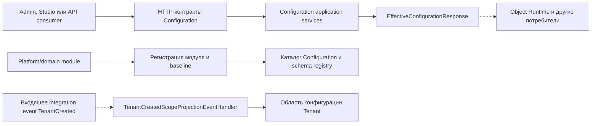

# Контракты — Configuration

[controller]: ../../../src/Platform/DMP.Platform.Configuration/Api/Controllers/ConfigurationController.cs
[content-controller]: ../../../src/Platform/DMP.Platform.Configuration/Api/Controllers/ConfigurationContentController.cs
[report-contract-controller]: ../../../src/Platform/DMP.Platform.Configuration/Api/Controllers/ReportContractController.cs
[report-design-controller]: ../../../src/Platform/DMP.Platform.Configuration/Api/Controllers/ReportDesignOperationsController.cs
[requests]: ../../../src/Platform/DMP.Platform.Contracts/Configuration/Requests/
[responses]: ../../../src/Platform/DMP.Platform.Contracts/Configuration/Responses/
[enums]: ../../../src/Platform/DMP.Platform.Contracts/Configuration/Enums/
[registration]: ../../../src/Platform/DMP.Platform.Contracts/Configuration/Registration/
[dataset-registration]: ../../../src/Platform/DMP.Platform.Contracts/Configuration/Registration/ConfigurationDatasetRegistration.cs
[module-registration]: ../../../src/Platform/DMP.Platform.Contracts/Configuration/Registration/ConfigurationModuleRegistration.cs
[baseline]: ../../../src/Platform/DMP.Platform.Contracts/Configuration/BaselinePackages/
[baseline-manifest]: ../../../src/Platform/DMP.Platform.Contracts/Configuration/BaselinePackages/IConfigurationBaselinePackageManifest.cs
[baseline-builder]: ../../../src/Platform/DMP.Platform.Contracts/Configuration/BaselinePackages/Authoring/ConfigurationBaselinePackageBuilder.cs
[baseline-import]: ../../../src/Platform/DMP.Platform.Configuration/Application/Import/Services/ConfigurationBaselineImportService.cs
[identity-strategy]: ../../../src/Platform/DMP.Platform.Configuration/Domain/Services/ArtifactIdentityStrategy.cs
[static-codes]: ../../../src/Platform/DMP.Platform.Contracts/Configuration/ConfigurationStaticValueCodes.cs
[platform-codes]: ../../../src/Platform/DMP.Platform.Contracts/Configuration/PlatformConfigurationCodes.cs
[artifact-type-codes]: ../../../src/Platform/DMP.Platform.Configuration/Domain/Schemas/ConfigurationArtifactTypeCodes.cs
[schemas]: ../../../src/Platform/DMP.Platform.Configuration/Domain/Schemas/
[editor-projector]: ../../../src/Platform/DMP.Platform.Configuration/Application/Services/Editor/CanonicalArtifactEditorReadProjectorBase.cs
[security]: ../../../src/Platform/DMP.Platform.Configuration/Infrastructure/Security/ConfigurationSecurityCatalogManifest.cs
[tenant-event-handler]: ../../../src/Platform/DMP.Platform.Configuration/Application/Services/Context/TenantCreatedScopeProjectionEventHandler.cs
[configuration-terms]: ../../11_glossary/configuration_terms.md
[foundation-contracts]: ../00_foundation/03_contracts.md

## 1. Назначение и границы

Документ фиксирует граничные контракты Configuration: HTTP API, запросы и ответы,
регистрацию модулей, baseline package, контракты редактора, report design-time,
стабильные коды и внешние зависимости. Подробные свойства конфигурационных
артефактов описываются в `artifact_types/`; исполнение этих артефактов принадлежит
соседним платформенным областям.

## 2. Источники истины и владельцы

| Источник или контрактный слой | Что подтверждает | Владелец |
| --- | --- | --- |
| Controllers Configuration | Маршруты, HTTP verbs и фактические результаты | Configuration |
| `DMP.Platform.Contracts/Configuration` | Request/response types, enum и registration types | Configuration |
| `artifact_types/` | Полные schema-контракты конфигурационных артефактов | Configuration |
| Editor projector и application services | Проекции редактора и фактические ограничения операций | Configuration |
| Configuration Security manifest | Ресурсы, permissions и системные роли Configuration | Configuration / Tenant Security |

Общие domain/application-контракты, контексты запроса, результаты и типы
`DMP.Platform.Contracts.Common` предоставляются слоем Foundation и описаны в
[контрактах Foundation][foundation-contracts]. Этот документ не
копирует их таблицы полей: здесь остаются только фактическое использование,
ограничения Configuration и area-specific контракты
`DMP.Platform.Contracts.Configuration`. Схемы артефактов и их persistence также
принадлежат Configuration.

## 3. Карта контрактов



Схема показывает основные контрактные границы Configuration: HTTP, регистрацию
поставок, эффективную конфигурацию и входящее событие. Пунктиром обозначены внешние
потребители и входящие контракты; Configuration не становится владельцем
исполнения runtime-артефактов или схемы события `TenantCreated`. ([controller][controller]; [registration][registration]; [tenant-event-handler][tenant-event-handler])

| Контракт | Вид | Владелец | Потребитель | Статус сведения | Подробное описание |
| --- | --- | --- | --- | --- | --- |
| Scope, context и version lifecycle API | HTTP | Configuration | Admin/Studio и API consumers | Подтверждено MVP | [HTTP-контракты](#4-http-контракты) |
| Explorer, catalog и editor API | HTTP | Configuration | Admin/Studio | Подтверждено MVP | [HTTP-контракты](#4-http-контракты) |
| Effective configuration и baseline package | HTTP/DTO | Configuration | Object Runtime и platform consumers | Подтверждено MVP с ограничениями | [Общие типы и DTO](#5-общие-типы-и-dto) |
| Module и dataset registration | C# | Configuration | Platform modules | Подтверждено MVP | [C#-контракты](#6-c-контракты-и-точки-расширения) |
| `TenantCreated` handler | Integration event | Configuration | Tenant Security / Configuration | Входящий контракт; схема принадлежит Integration Events | [События](#7-контракты-событий) |

## 4. HTTP-контракты

Все HTTP endpoints Configuration находятся под route `api/platform/configuration`.
Основной controller покрывает scope/version/context/explorer/editor/effective/catalog/
baseline operations; отдельные controllers обслуживают content blobs и report
design-time contracts. ([controller][controller]; [content-controller][content-controller]; [report-contract-controller][report-contract-controller]; [report-design-controller][report-design-controller])

| Группа HTTP endpoints | Назначение | Permission policy | Контрактные типы |
| --- | --- | --- | --- |
| Scopes and context | Просмотр и создание областей конфигурации, context bootstrap и context actions | `Configuration.Scope.View`, `Configuration.Scope.Edit`, `Configuration.Version.Publish` | `EnsureConfigurationScopeRequest`, `GetConfigurationContextBootstrapRequest`, `ExecuteConfigurationContextActionRequest`; ответы в [Configuration responses][responses] |
| Versions lifecycle | Создание draft, publish, archive, validate, compare, rebase preview/apply, upgrade compatibility | `Configuration.Version.Create`, `Configuration.Version.Publish`, `Configuration.Version.Archive`, `Configuration.Scope.View` | `CreateConfigurationDraftRequest`, `PublishConfigurationVersionRequest`, `ValidateConfigurationVersionRequest`, `CompareConfigurationVersionsRequest`, `PreviewConfigurationRebaseRequest`, `ApplyConfigurationRebaseRequest` |
| Explorer and catalog | Explorer, entry detail, kinds, modules, object types, languages и system enum items | `Configuration.Catalog.View`, `Configuration.Scope.View` | `GetConfigurationExplorerRequest`, `GetConfigurationLanguagesRequest`, `GetConfigurationSystemEnumItemsRequest` |
| Entry/property authoring | Upsert/delete/reset entry, property и localization inside draft | `Configuration.Entry.Edit` | `UpsertConfigurationEntryRequest`, `UpsertConfigurationPropertyRequest`, `UpsertConfigurationPropertyLocalizationRequest` и delete/reset requests |
| Artifact editor | Read/validate/options/save/discard/node actions для persisted entries и root artifact editor sessions | `Configuration.Entry.Edit` | `ConfigurationArtifactEditor*Request`, `ConfigurationArtifactEditor*Response`, `ConfigurationRootArtifactEditorSessionResponse` |
| Effective configuration | Resolve published/effective configuration for consumers | `Configuration.Effective.View` | `ResolveEffectiveConfigurationRequest`, `EffectiveConfigurationResponse` |
| Baseline and bootstrap | System baseline bootstrap и baseline package import | `Configuration.Version.Publish`, `Configuration.Entry.Edit` | `BootstrapSystemBaselineRequest`, `ImportConfigurationBaselinePackageRequest` |
| Content blobs | Put/get/delete binary content и metadata; report schema/sample XML helpers | `Configuration.Entry.Edit` | `ConfigurationContentBlobPutResponse`, `ConfigurationContentBlobMetadataResponse` |
| Report design-time contracts | Generate/publish report schema, sample XML, default design; import/export/validate design bundle; preview session | `Configuration.Entry.Edit` | `ReportContract*Response`, `ReportDesign*Response` |

`MultiSelect` в списке editor options для scalar/non-enum fallback подтверждён
кодом editor projector. Это расширение editor contract, а не новый тип значения и не
изменение schema-свойств артефакта. ([editor-projector][editor-projector])

Точная форма HTTP маршрутов и method signatures остаётся в controllers, а полные
request/response types — в [контрактах Configuration][requests] и [ответах Configuration][responses].

## 5. Общие типы и DTO

### 5.1. Регистрация возможностей модуля

`ConfigurationModuleRegistration` каталогизирует metadata и связанные регистрации.
`ConfigurationDatasetRegistration` подтверждён кодом только как `Code`/`Name`; он
не задаёт read query API, query language, фильтры, pagination или runtime data access.
([registration][registration]; [dataset-registration][dataset-registration]; [module-registration][module-registration])

| Контракт | Что фиксирует | Что не фиксирует |
| --- | --- | --- |
| `ConfigurationObjectTypeRegistration` | Object type code/name и признак workflow support | Runtime object contract и persistence бизнес-объекта |
| `ConfigurationActionRegistration` | Action code/name и связанный object type | Исполнение действия и transaction boundary |
| `ConfigurationDatasetRegistration` | Dataset code/name для каталога Configuration | Dataset / Read Query Capability, SQL/query model, runtime reading |
| `ConfigurationReportRegistration` | Report code/name | Выполнение отчёта |
| `ConfigurationOutputRegistration` | Output code/name | Delivery, background processing и output audit |
| `ConfigurationPermissionRegistration` | Permission code/name для каталога модуля | Каталог безопасности и grant policies |
| `ConfigurationRootArtifactRegistration` | Root artifact type/code/name и optional object/workflow binding | Подробную структуру артефакта |

Регистрация отвечает на вопрос, какие типы и возможности модуль предоставляет
Configuration. Она не является поставкой начальных записей. Начальные записи
передаются отдельным [baseline package](#52-контракт-baseline-package).

### 5.2. Контракт baseline package

Baseline package описывает начальную поставку конфигурационных артефактов модуля для
импорта в `SystemBaseline`. Manifest contract — `IConfigurationBaselinePackageManifest`,
payload — `ConfigurationBaselinePackage` с identity, compatibility и artifact groups.
([baseline][baseline]; [baseline-manifest][baseline-manifest])

| Контракт | Назначение |
| --- | --- |
| `ConfigurationBaselinePackageIdentity` | `PackageCode`, `ModuleCode`, `Version` |
| `ConfigurationBaselinePackageCompatibility` | Minimal platform version и supported module version range |
| `ConfigurationBaselineArtifactGroup` | Группа артефактов по `ConfigurationBaselineArtifactGroupType` |
| `ConfigurationBaselineArtifactEntry` | Entry с `OriginKey`, artifact code, optional object/workflow code, properties и parent origin |
| `ConfigurationBaselineArtifactProperty` | Property name/value/value type и optional localizations |
| `ConfigurationBaselineArtifactPropertyLocalization` | Localized value и explicit null |

Типы baseline groups включают `Data`, `Workflow`, `Rule`, `Ui`, `Reporting`, `Output`,
`ValueSet`, `SystemEnum`, `Action`, `Menu` и `ValueSetData`. Их runtime-семантика не
переносится в Configuration: исполнение Workflow, Rules, Value Sets и Report/Output
принадлежит соответствующим областям.

`ConfigurationBaselineArtifactProperty` является транспортным контейнером значения.
Он не определяет, разрешено ли такое свойство. Разрешённость имени и типа свойства
проверяется по schema соответствующего артефакта в `artifact_types/`.

`Baseline package` — это входной пакет поставки конфигурации. Он не является
`SystemBaseline`: пакет передаётся в Configuration, а `SystemBaseline` — scope,
в который после проверки и публикации попадает результат импорта.

Человекочитаемая структура пакета:

```text
BaselinePackage
├── Identity
│   ├── PackageCode
│   ├── ModuleCode
│   └── Version
├── Compatibility
│   ├── MinimalPlatformVersion
│   └── SupportedModuleVersionRange
└── ArtifactGroups[]
    ├── GroupType
    └── Entries[]
        ├── OriginKey
        ├── ArtifactCode
        ├── ObjectTypeCode / WorkflowCode
        ├── ParentOriginKey
        └── Properties[]
            ├── Name
            ├── Value
            ├── ValueType
            └── Localizations[]
```

| Элемент | Понятный смысл | Правило |
| --- | --- | --- |
| `Identity` | Кто и какую версию пакета поставляет | `PackageCode`, `ModuleCode` и `Version` идентифицируют пакет; это не свойства артефакта |
| `Compatibility` | С какими версиями платформы и модуля совместим пакет | Ограничения проверяются до или во время импорта; пустое ограничение допускается текущим контрактом |
| `ArtifactGroups[]` | Группы поставляемых конфигурационных данных | Каждая группа имеет `GroupType` и список entries; группа выбирает тип поставки, но не переносит в Configuration runtime-исполнение этой capability |
| `GroupType` | Технический тип группы поставки | Текущее перечисление: `Data`, `Workflow`, `Rule`, `Ui`, `Reporting`, `Output`, `ValueSet`, `SystemEnum`, `Action`, `Menu`, `ValueSetData` |
| `Entry` | Одна поставляемая запись артефакта | В текущем контракте тип группы задаётся родительским `GroupType`; отдельного поля `ArtifactTypeCode` в entry нет |
| `OriginKey` | Стабильная идентичность записи | Используется для сопоставления записей при импорте, сравнении, переопределении и обновлении; связь с родителем задаётся отдельно через `ParentOriginKey` |
| `ArtifactCode` | Код артефакта или записи, используемый её контрактом | Заполняется по правилам schema и регистрации соответствующего артефакта; это не persistence key |
| `ObjectTypeCode` / `WorkflowCode` | Необязательная связь entry с типом объекта или workflow | Заполняется только для тех групп и записей, где такая связь предусмотрена контрактом |
| `ParentOriginKey` | Ссылка на родительскую запись внутри поставки | Используется только для иерархической связи entries; пустое значение означает корневую запись |
| `Properties[]` | Значения schema-свойств конкретной записи | `Name` должен быть свойством, разрешённым schema соответствующего артефакта; package property не создаёт новое свойство |
| `Localizations[]` | Локализованные значения свойства | `LanguageCode` задаёт язык, а `IsExplicitNull` отличает явное отсутствие значения от отсутствия локализации |

Транспортная структура package не заменяет каноническую модель Configuration.
После импорта записи получают внутренние persistence-поля и участвуют в построении
канонического дерева. `EntryId`, `ArtifactNode.Code`, `ArtifactTypeCode` и
`OverridesEntryId` не являются полями текущего baseline entry contract.

Пример сопоставления одной поставляемой записи:

| Уровень | Представление |
| --- | --- |
| Package entry | `GroupType = Data`, `ArtifactCode = Product`, `OriginKey = ObjectType|Catalog|Product`, `ParentOriginKey = null` |
| Persistence entry | `KindCode = ObjectType`, `Code = Product`, `ModuleCode = Catalog`, тот же `OriginKey`, сгенерированный `EntryId`; `ParentEntryId` и `OverridesEntryId` пусты для корневой записи |
| Canonical node | `ArtifactTypeCode = ObjectType`, `Code = Product`, свойства и дочерние коллекции узла |

Это пример для корневого `ObjectType`, а не универсальный формат всех записей.
Для `View`, `Action`, `Workflow` и дочерних узлов `OriginKey` может дополнительно
включать контекст типа объекта, родительский payload или специальное правило.
Сама стратегия формирования ключа находится в [ArtifactIdentityStrategy][identity-strategy].

### 5.3. Формирование baseline package модулем

Пакет формируется модулем в следующем порядке:

1. Модуль регистрирует реализацию `IConfigurationBaselinePackageManifest` и
   возвращает один или несколько пакетов.
2. Пакет получает identity и compatibility, после чего в него добавляются группы
   и entries соответствующих артефактов.
3. Для каждого entry добавляются только свойства, разрешённые schema; значения
   перечислений, ссылки, локализации и иерархические связи задаются в формате,
   описанном в `artifact_types/<artifact>.md`.
4. Configuration принимает package, проверяет его структуру и импортирует entries
   через `ConfigurationBaselineImportService`.
5. После импорта выполняются validation и publication; только опубликованный
   результат становится частью effective `SystemBaseline`.

В этом разделе описаны структура и правила заполнения package. Подробный runtime
процесс импорта, построения канонического дерева, публикации, повторного запуска и
восстановления описан в [04_runtime.md](04_runtime.md) и
[08_operations.md](08_operations.md).

`ConfigurationBaselinePackageBuilder` — технический способ собрать этот контракт
в текущем коде. Он не является отдельным источником правил: допустимые свойства и
значения определяются schema конкретного артефакта, а смысл исполнения групп
остаётся у соответствующих платформенных областей. ([manifest][baseline-manifest];
[builder][baseline-builder]; [import service][baseline-import])

Не следует смешивать в baseline package следующие уровни:

- `ArtifactNode.Code`, `ArtifactTypeCode` и persistence keys — это identity и
  внутреннее хранение Configuration, а не произвольные package properties;
- наследование и разрешение эффективной конфигурации, цепочка родительских
  областей и cache — это результат runtime
  Configuration, а не формат поставляемого entry;
- исполнение `Workflow`, `Rule`, `Report`, `Output` и объектных операций — это
  ответственность соответствующих владельцев;
- начальные данные `ValueSetData` могут поставляться отдельной группой, но их
  чтение и изменение выполняет владелец Value Sets.

## 6. C#-контракты и точки расширения

`IConfigurationModuleManifest` и связанные registration-типы являются C#-контрактом
регистрации модулей. Они передают каталог кодов и метаданные в Configuration, но не
определяют runtime-исполнение бизнес-объектов, правил или workflow. ([registration][registration])

Коды типов конфигурационных артефактов задаются `ConfigurationArtifactTypeCodes`;
стабильные коды UI/action/view/report/output/value set semantics лежат в
`ConfigurationStaticValueCodes`. ([artifact-type-codes][artifact-type-codes]; [static-codes][static-codes]; [platform-codes][platform-codes])

| Группа типов | Корневые и связанные codes | Документ структуры | Runtime/соседний владелец |
| --- | --- | --- | --- |
| Object metadata | `ObjectType`, `ObjectMember`, `ObjectMemberBehavior`, `ObjectRuleBinding`, `NumberingRule` | [`object_type.md`](artifact_types/object_type.md), [`numbering_rule.md`](artifact_types/numbering_rule.md) | Object Runtime, Numbering |
| Workflow | `Workflow`, `WorkflowState`, `WorkflowCommand`, `WorkflowTransition`, `WorkflowRuleBinding`, `WorkflowExecutionPoint`, `WorkflowStatePolicy` | [`workflow.md`](artifact_types/workflow.md) | Workflow |
| Rules | `Rule`, `RuleParameter` | [`rule.md`](artifact_types/rule.md) | Rules |
| Value sets | `ValueSet` definition и `ValueSetData` seed group | [`value_set.md`](artifact_types/value_set.md) | Value Sets |
| System enums | `SystemEnum`, `SystemEnumValue` | [`system_enum.md`](artifact_types/system_enum.md) | Configuration / system provider |
| Actions | `Action`, `ActionResultBindings`, `ActionParameter`, `ActionLocalBehavior`, `ActionRuleBinding`, `ActionMessage` | [`action.md`](artifact_types/action.md) | Object Runtime |
| Views and navigation | `View`, `ViewFormElement`, `ViewColumn`, `ViewWidget`, `ViewLayoutNode`, `ViewQueryParameter`, `ViewFilter`, `ViewFilterPreset`, `ViewFilterPresetValue`, `ViewActionMenuSection`, `ViewActionPlacement`, `ViewLocalBehavior`, `Menu`, `NavigationItem` | [`view.md`](artifact_types/view.md), [`menu.md`](artifact_types/menu.md) | фронтенд-платформа |
| Reporting and output | `Report`, `ReportDesign`, `ReportField`, `ReportParameter`, `ReportFilter`, `Output`, `OutputLaunchBinding`, `OutputParameterMapping`, `OutputDeliveryChannel`, `OutputFileOptions`, `OutputExecutionOptions`, `OutputSecurityOptions` | [`report.md`](artifact_types/report.md), [`output.md`](artifact_types/output.md) | Reporting Output |

## 7. Контракты событий

Configuration регистрирует обработчик входящего integration event `TenantCreated`.
Он создаёт tenant configuration scope под corporate scope и не публикует собственное
domain event как публичный contract Configuration. ([tenant event handler][tenant-event-handler])

| Событие или результат | Направление | Назначение | Ограничение |
| --- | --- | --- | --- |
| `TenantCreated` | Входящее integration event | Создать `Tenant` область конфигурации при появлении tenant | Event schema принадлежит Integration Events / Tenant Security |
| `PublicationRecordResponse` | HTTP result | Вернуть факт публикации версии | Не является integration event |
| `EffectiveConfigurationResponse` | HTTP result | Отдать эффективную конфигурацию runtime-потребителю | Не описывает runtime execution потребителя |
| `ConfigurationBaselineImportResponse` | HTTP result | Вернуть результат baseline import | Не является import event |
| Report design-time responses | HTTP result | Вернуть generated schema/sample/default design или validation issues | Runtime выполнения отчёта остаётся у Reporting Output |

## 8. Ошибки и отказоустойчивость

Configuration не имеет единой формализованной error model внутри
`DMP.Platform.Contracts/Configuration`. Большинство ошибок проходят как стандартные
HTTP results, исключения application services или локальные error responses для
report contracts. ([controller][controller]; [report-contract-controller][report-contract-controller]; [report-design-controller][report-design-controller])

| Область ошибки | Текущий контракт | Ограничение |
| --- | --- | --- |
| Missing entity | `NotFound()` для отдельных read/editor/content сценариев | Единого `ConfigurationErrorResponse` нет |
| Invalid request/business rule | `BadRequest(...)` в report contract/design operations и отдельных editor scenarios; application service может бросить `InvalidOperationException` | Код ошибки не нормализован для всех endpoints |
| Report contract generation | `ReportContractGenerationErrorResponse` со списком `Code/Message` | Специализировано под report design-time |
| Authorization | ASP.NET policy `Permission:Configuration.*` | Детали authorization decision принадлежат Tenant Security |

## 9. Совместимость и изменение контрактов

| Уровень | Contract | Правило |
| --- | --- | --- |
| Module registration | `ModuleVersion`, `ContractsVersion` в `ConfigurationModuleRegistration` | Каталог отличает версию module manifest и версию contract shape |
| Baseline package | `ConfigurationBaselinePackageCompatibility` | Package может указать minimal platform version и supported module version range |
| Configuration version lineage | `ParentBaseVersionId`, `PreviousVersionId`, `UpgradeSourceVersionId`, `PreviousParentBaseVersionId` | Upgrade/rebase должны сохранять воспроизводимую parent chain |

Создание draft для non-root scope без опубликованной parent-base version блокируется
на уровне context action и authoring API. Для `Corporate` parent-base является
опубликованным `SystemBaseline`; для `Tenant` и `Site` — опубликованный parent-layer
соответствующей иерархии.

## 10. Границы с другими владельцами

| Потребитель или сосед | Что получает от Configuration | Что остаётся вне Configuration |
| --- | --- | --- |
| Studio/Admin frontend | Explorer, editor, options, content upload/download и report design-time endpoints | Shell, routing, shared UI packages и frontend application boundaries |
| Object Runtime | Effective configuration, object/view/action definitions и stable codes | Runtime object execution, mutation pipeline и transaction |
| Workflow | Workflow definitions как конфигурационные артефакты | State machine execution, history и transition runtime |
| Rules | Rule definitions и condition bindings | Rule evaluation gateway и result semantics |
| Value Sets | ValueSet definition, published metadata и publication/seed projection | Runtime values/items API |
| Reporting Output | Report/Output definitions, content refs, generated schema/sample/default design | Execute report/output, delivery и background processing |
| Tenant Security | Configuration security manifest, permissions и системные роли | Role assignments, grants и authorization decisions |
| Integration Events | Handler входящего `TenantCreated` | Event envelope, delivery, retry и outbox/inbox guarantees |

### 10.1. Перенос Configuration между окружениями

Общий перенос конфигурации между окружениями `dev`, `test`, `staging` и
`production` не является текущим HTTP-контрактом Configuration MVP. Наличие
baseline package или `Report design export/import` не означает наличия общего
экспорта и импорта конфигурационных версий.

Для будущего контракта потребуется отдельно определить:

- единицу переноса: scope, version, patch или effective configuration;
- формат пакета, его `source`/`target` metadata и совместимость версий;
- preview конфликтов и правила `merge`, `replace` или `rebase`;
- обработку identity, ссылок, localizations и секретных/окруженческих значений;
- права, аудит, идемпотентность, частичный отказ и rollback.

Пока эти требования не оформлены как публичные requests/responses и не должны
читаться как реализованная операция.

## 11. Источники и тесты

Источники структуры и поведения перечислены в ссылках этого документа: controllers,
contract packages, registration contracts, schemas, editor projector, security
manifest и tenant event handler. Проверки маршрутов, DTO и операций выполняются
соответствующими integration/architecture tests Configuration; конкретные наборы
тестов должны быть добавлены в этот раздел при формировании test inventory.

## 12. Метаданные файлов

Configuration описывает `DataType=File`, `FilePicker`, `Multiple` для параметра
action и политику файла для member объекта. Эти свойства являются метаданными;
их хранение и бинарное содержимое принадлежат [Platform Content Storage](../13_content_storage/03_contracts.md).

## История изменений

| Версия | Дата и время | Автор | Раздел | Изменение | Коммит/PR |
|---|---|---|---|---|---|
| 1.0 | 2026-09-03 14:49 +03:00 | Олег Юрьев (@axelprosoft) | YAML-шапка: review_status, status | Утверждение после merge PR #61: изменения в проектной документации ядра - новый модуль работы с файлами | [PR #61](https://github.com/axelprosoft/DMP.PlatformFoundation/pull/61) |
| 0.2 | 2026-09-03 13:00 +03:00 | Олег Юрьев (@axelprosoft) | Метаданные файлов | изменения в проектной документации ядра. основание - новый модуль по хранению и работе с файлами | [0f415f89](https://github.com/axelprosoft/DMP.PlatformFoundation/commit/0f415f89b977fa123e52411717a66f94c2d327a3) |
| 0.1 | 2026-08-27 15:04 +03:00 | Олег Юрьев (@axelprosoft) | Создание документа | подготовлен драфт новой проектной документации на ядро, прикладные модули, а так же термины и общие концептуальные документы | [5ecb26b1](https://github.com/axelprosoft/DMP.PlatformFoundation/commit/5ecb26b1c3ff3cfcdc13018e59526ae684ca6007) |
