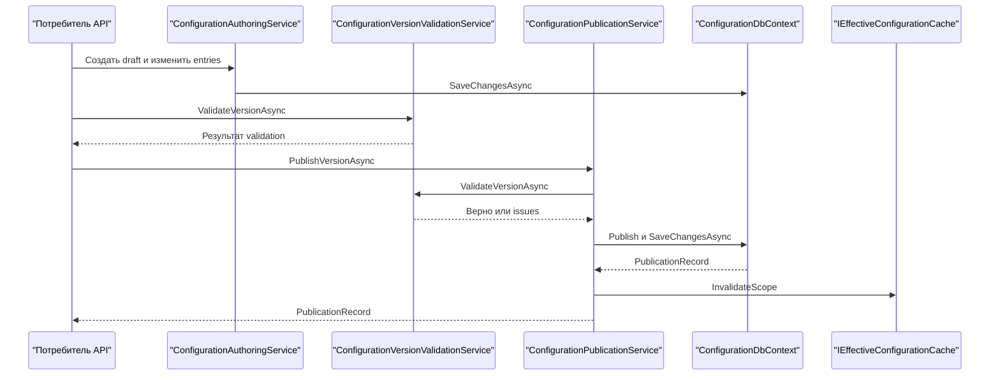
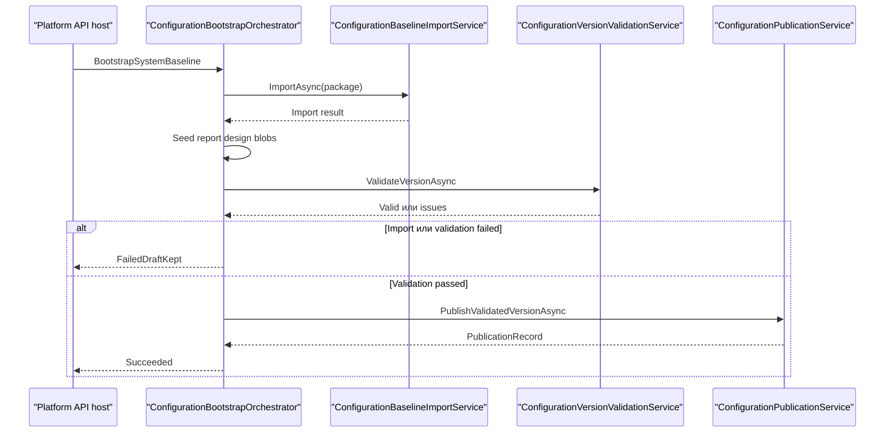
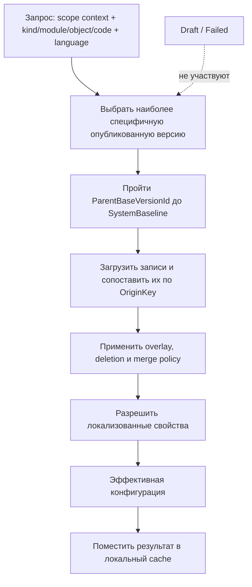
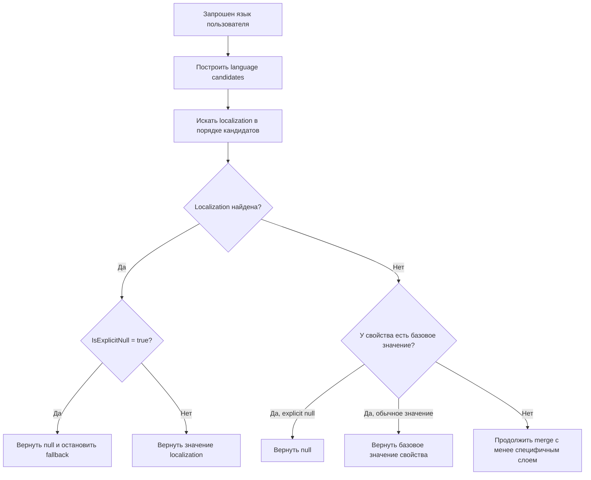
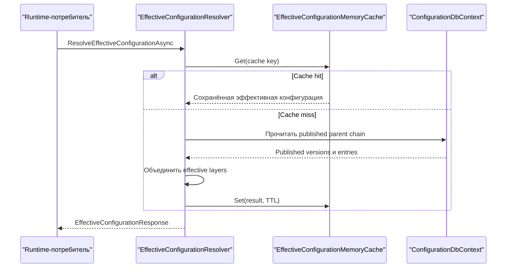

# Исполнение — Configuration

[project]: ../../../src/Platform/DMP.Platform.Configuration/
[publication-service]: ../../../src/Platform/DMP.Platform.Configuration/Application/Services/Core/ConfigurationPublicationService.cs
[configuration-service]: ../../../src/Platform/DMP.Platform.Configuration/Application/Services/Core/ConfigurationService.cs
[authoring-service]: ../../../src/Platform/DMP.Platform.Configuration/Application/Services/Authoring/ConfigurationAuthoringService.cs
[effective-resolver]: ../../../src/Platform/DMP.Platform.Configuration/Application/Services/Effective/EffectiveConfigurationResolver.cs
[effective-cache]: ../../../src/Platform/DMP.Platform.Configuration/Infrastructure/Persistence/EffectiveConfigurationMemoryCache.cs
[language-resolver]: ../../../src/Platform/DMP.Platform.Configuration/Application/Services/Core/ConfigurationLanguageCodeResolver.cs
[bootstrap-orchestrator]: ../../../src/Platform/DMP.Platform.Configuration/Application/Bootstrap/Services/ConfigurationBootstrapOrchestrator.cs
[baseline-import-service]: ../../../src/Platform/DMP.Platform.Configuration/Application/Import/Services/ConfigurationBaselineImportService.cs
[validation-service]: ../../../src/Platform/DMP.Platform.Configuration/Application/Validation/Services/ConfigurationVersionValidationService.cs
[tenant-created-handler]: ../../../src/Platform/DMP.Platform.Configuration/Application/Services/Context/TenantCreatedScopeProjectionEventHandler.cs
[db-context]: ../../../src/Platform/DMP.Platform.Configuration/Infrastructure/Persistence/ConfigurationDbContext.cs
[configuration-terms]: ../../11_glossary/configuration_terms.md
[scope]: 01_scope.md
[architecture]: 02_architecture.md
[contracts]: 03_contracts.md
[traceability]: 90_traceability.md
[foundation-runtime]: ../00_foundation/04_runtime.md
[validation-matrix]: 07_quality.md#51-матрица-проверок-перед-публикацией

## 1. Назначение документа

 Документ фиксирует runtime-поведение Configuration: создание и обновление версий, bootstrap `SystemBaseline`, импорт базовых пакетов конфигурации, публикацию, вычисление эффективной конфигурации (`effective configuration`), rebase, cache, транзакционные границы и поведение при сбоях. Контракты входов и выходов описаны в [контрактах][contracts]; архитектурные компоненты и данные описаны в [архитектуре][architecture]; здесь описывается порядок исполнения и гарантии. Термины ведутся в [глоссарии Configuration][configuration-terms].

Configuration исполняет только механизм конфигурации. Она не исполняет workflow, rules, object runtime, reporting/output, numbering, value set runtime и frontend shell; эти владельцы указаны в [границе области][scope].

Runtime Configuration фактически использует Foundation-типы `ITenantContext`,
`IRequestAccessContext`, `ICorrelationContext` и `IClock` в authoring, query,
publication, import, editor и bootstrap-сценариях. Их общая форма описана в
[runtime Foundation][foundation-runtime], а tenant-ограничения, права и
семантика конфигурационных версий остаются в этом документе.

## 2. Основные сценарии

Схема показывает самостоятельный сценарий публикации: draft редактируется и
проверяется, затем опубликованная версия сохраняется, после чего очищается локальный
effective cache. Ошибка validation останавливает публикацию до сохранения. ([authoring-service][authoring-service]; [validation-service][validation-service]; [publication-service][publication-service]; [effective-cache][effective-cache])

Схема показывает внутренний алгоритм bootstrap `SystemBaseline`: импорт и
подготовка выполняются до validation, а публикация запускается только после
успешной проверки. При ошибке сохраняется диагностическое failed draft; это не
означает автоматическое исправление. ([bootstrap-orchestrator][bootstrap-orchestrator]; [baseline-import-service][baseline-import-service]; [validation-service][validation-service]; [publication-service][publication-service])

| Сценарий | Предусловия | Последовательность | Результат | Подтверждение |
| --- | --- | --- | --- | --- |
| Bootstrap `SystemBaseline` | Есть baseline packages в catalog provider; системный scope создан или создаётся оркестратором. | Найти или создать `SystemBaseline` scope; найти published/draft/failed версию; при `ForceRebuild` очистить draft; импортировать packages; досеять report design blobs; выполнить validation; опубликовать draft. | Опубликованная системная базовая конфигурация и snapshot модулей/packages/settings на published version. | [bootstrap orchestrator][bootstrap-orchestrator]; [publication service][publication-service] |
| Создание draft-версии | Scope существует; для scope нет активного draft. | Определить `previousVersionId`; подобрать `ParentBaseVersionId`; создать draft; скопировать patch из последней published или upgrade source. | Новая draft-версия с номером `max + 1` и ссылкой на parent base, если она применима. | [authoring service][authoring-service]; [db context][db-context] |
| Редактирование draft | Версия находится в статусе `Draft`. | Команды authoring меняют entries/properties/localizations, проверяют parent/override cycles и применимость команд. | Изменения сохранены в draft; published runtime не меняется. | [authoring service][authoring-service] |
| Validation и publish | Версия находится в статусе `Draft`; validation не содержит blocking errors. | Выполнить validation; архивировать предыдущую published-версию того же scope; опубликовать draft; создать `PublicationRecord` и `ConfigurationChange`; сбросить effective cache по scope; синхронизировать projection опубликованных value sets. | Новый published слой становится доступен effective resolver; предыдущий published слой остаётся в `Archived`. | [publication service][publication-service]; [validation service][validation-service] |
| Чтение эффективной конфигурации | Переданы context scope ids и ключ артефакта; есть published слой на самом специфичном доступном уровне или `SystemBaseline`. | Выбрать самый специфичный published слой: `Site`, затем `Tenant`, затем `Corporate`, затем `SystemBaseline`; пройти по `ParentBaseVersionId` до `SystemBaseline`; собрать overlay и закешировать результат. | Возвращена эффективная конфигурация артефакта или `null`, если нет опубликованной цепочки. | [effective resolver][effective-resolver]; [effective cache][effective-cache] |
| Rebase/upgrade draft | Есть source version и target published base; source не совпадает с target base. | Сравнить source и target base; при конфликтах вернуть блокировку или требование ручного разрешения; для draft пересчитать overrides; для published source создать upgrade draft. | Draft переведён на новую parent base либо создан upgrade draft; конфликтные варианты не публикуются автоматически. | [configuration service][configuration-service] |
| Создание Tenant scope по событию | Получено событие `TenantCreated`; corporate scope уже создан. | Прочитать payload; найти corporate scope; создать или найти tenant scope с parent corporate scope. | Tenant получает configuration scope; конфигурационные версии при этом не публикуются автоматически. | [tenant created handler][tenant-created-handler] |

## 3. Операции и алгоритмы

| Операция | Вход | Алгоритм | Результат | Ошибки | Потребители |
| --- | --- | --- | --- | --- | --- |
| `BootstrapSystemBaseline` | `BootstrapSystemBaselineRequest` | Оркестратор пропускает уже опубликованный baseline без `ForceRebuild`; иначе создаёт/переиспользует draft, импортирует packages в транзакции, валидирует и публикует. Failed draft переоткрывается перед retry. | `BootstrapSystemBaselineResponse` с режимом исполнения, draft/published ids, summary и correlation id. | Нет packages; ошибка import/validation/publish; failed draft сохраняется с reason/correlation. | Operations, начальная поставка платформы |
| `ImportConfigurationBaselinePackage` | Version id, package code/version, import mode | Resolve package; validate package; построить canonical nodes для object/workflow/rule/value set/system enum/action/view/report/output/navigation; при `Replace` удалить данные package; сохранить canonical и passthrough entries; отдельно посеять value set data seeds. | Счётчики импортированных entries/properties и result code. | `ValidationFailed`, `PersistenceFailed`, `RolledBack`. | Bootstrap, ручной baseline import |
| `CreateDraftVersion` | Scope id, optional parent base, draft kind | Проверить отсутствие draft; определить latest published; подобрать parent base по цепочке областей; проверить тип и статус parent; создать draft и скопировать source patch. | Draft version в статусе `Draft`. | Duplicate draft; неверный parent scope/status; `SystemBaseline` с parent. | Authoring API, upgrade/rebase |
| `PublishVersion` | Version id | Выполнить validation; вызвать `PublishValidatedVersion`; сохранить publication record/change; invalidation cache; value set projection sync. | Published version и publication record. | Validation error; не draft; version not found. | Admin/Studio, bootstrap |
| `ResolveEffectiveVersionChain` | Corporate/Tenant/Site scope ids | Выбрать самый специфичный published слой; пройти parent chain; проверить отсутствие циклов, статус parent и допустимый тип parent scope. | Chain root-to-leaf: `SystemBaseline -> Corporate -> Tenant -> Site` в доступной глубине. | Нет published chain; missing parent; cycle; несовместимый parent; parent не published/archived. | Effective read endpoints, runtime consumers |
| `ResolveEffectiveEntry` | Scope context, language, kind/module/object/code | Построить cache key; проверить cache; загрузить entries по chain; применить overlay/delete/property merge/tree replacement; локализовать результат. | Effective entry result или `null`. | Ошибки целостности chain и некорректные references. | Runtime consumers, editor previews |
| `ApplyRebase` | Source version, target base version, `Force` | Проверить, что target base published; построить diff; заблокировать несовместимые structural conflicts; обновить draft или создать upgrade draft. | Rebase response с result code и draft id. | Target не published; source без parent; конфликты без разрешения. | Upgrade flow, администратор конфигурации |

При effective resolution и rebase Configuration сопоставляет логические записи по
`OriginKey`. Родительская связь восстанавливается через `ParentEntryId` в текущей
версии или через `ParentOriginKey` при переносе package, а связь с записью базового
слоя для override хранится отдельно в `OverridesEntryId`. Поэтому изменение
database `EntryId` между версиями не меняет идентичность артефакта.

## 4. Правила

| Правило | Условие | Результат | Исключение | Подтверждение |
| --- | --- | --- | --- | --- |
| `SystemBaseline` является корнем parent chain | Версия имеет scope type `SystemBaseline`. | `ParentBaseVersionId` должен быть пустым. | Нет. | [authoring service][authoring-service]; [effective resolver][effective-resolver] |
| Non-root draft требует parent-base | Создание draft для `Corporate`, `Tenant` или `Site`. | `ParentBaseVersionId` должен указывать на опубликованную parent-base version: `Corporate -> SystemBaseline`, `Tenant -> Corporate`, `Site -> Tenant`. | Нет. | [authoring service][authoring-service]; [трассировка][traceability] |
| Parent chain имеет фиксированный порядок | Non-root версия ссылается на parent base. | Допустимы только `Corporate -> SystemBaseline`, `Tenant -> Corporate`, `Site -> Tenant`. | Нет. | [authoring service][authoring-service]; [effective resolver][effective-resolver] |
| Effective runtime читает только опубликованные слои | Runtime resolver выбирает слой по scope. | Resolver берёт latest `Published`; допустимые статусы parent: `Published` или `Archived`, если parent входит в сохранённую lineage. | Draft/Failed не участвуют в эффективной конфигурации. | [effective resolver][effective-resolver] |
| В scope есть только одна активная версия каждого runtime-состояния | Создаётся или меняется версия. | Unique index ограничивает сочетание scope/status для `Draft`, `Published`, `Failed`. | Архивных версий допускается несколько. | [db context][db-context] |
| Publish атомарно заменяет published слой scope | Draft проходит validation. | Предыдущая published версия архивируется, новая публикуется в одной операции сохранения; после сохранения сбрасывается cache scope. | Ошибка после сохранения и до внешних side effects требует операционного контроля. | [publication service][publication-service] |
| Baseline import работает только с draft | Импорт вызывается для version id. | Import service проверяет, что version существует и находится в draft-состоянии. | Нет. | [baseline import service][baseline-import-service] |
| Событие `TenantCreated` не создаёт версию конфигурации | Получено событие Tenant/Security. | Создаётся только tenant configuration scope под corporate scope. | Если corporate scope не инициализирован, обработчик падает. | [tenant created handler][tenant-created-handler] |

Context API и authoring API блокируют создание draft без parent-base до публикации. Effective resolver дополнительно проверяет parent chain при runtime-чтении, но это защитная проверка целостности, а не основной пользовательский путь. Полная карта проверок на пути к публикации приведена в [матрице проверок][validation-matrix].

## 5. Жизненные циклы

### 5.1. Построение эффективной конфигурации

В эффективной конфигурации участвуют только опубликованные версии доступной цепочки.
Наиболее специфичная версия выбирается в порядке `Site`, `Tenant`, `Corporate`,
`SystemBaseline`; затем Configuration проходит lineage до базовой версии и
объединяет записи. Отсутствующее свойство может быть получено из менее
специфичного слоя, обычное значение заменяет базовое, а `IsExplicitNull` явно
очищает значение. Изменение или публикация нового `SystemBaseline` не изменяет
автоматически уже опубликованный snapshot Tenant: для перехода на новую базу
нужен отдельный rebase/upgrade flow. ([effective-resolver][effective-resolver]; [effective-cache][effective-cache])

### 5.2. Разрешение локализованного значения

`language candidates` формируются из зарегистрированного языка запроса: сначала
проверяется точный код или culture, затем нейтральный код и подходящий culture.
Первое найденное значение используется без перехода к следующему кандидату.
Если найденная локализация имеет `IsExplicitNull`, результатом является явное
отсутствие значения, а не fallback. Если локализации нет ни для одного кандидата,
проверяется базовое значение свойства текущего слоя; при его отсутствии поиск
продолжается в effective merge. ([language resolver][language-resolver]; [effective-resolver][effective-resolver])

Схема показывает только чтение эффективной конфигурации (`effective configuration`):
в цепочку попадают опубликованные версии, результат может быть взят из локального cache, а cache miss
завершает разрешением и записью результата. Схема не описывает выполнение
объектов-потребителей. ([effective-resolver][effective-resolver]; [effective-cache][effective-cache])

| Объект | Состояния | Переходы | Кто меняет | Примечание |
| --- | --- | --- | --- | --- |
| Configuration version | `Draft`, `Published`, `Archived`, `Failed` | `Draft -> Published`, previous `Published -> Archived`, bootstrap error `Draft -> Failed`, bootstrap retry `Failed -> Draft`. | Authoring, publication, bootstrap. | `Failed` используется для bootstrap diagnostics; ordinary publish блокируется validation exception. |
| Draft kind | `Regular`, `Upgrade` | Regular создаётся для текущего scope; Upgrade создаётся при upgrade/rebase flow. | Authoring/rebase. | Upgrade хранит source и previous parent metadata. |
| System baseline package | Catalog package, imported entries, published snapshot | Package catalog -> import into draft -> validation -> publish -> snapshot на baseline version. | Bootstrap/import/publication. | Snapshot включает modules/packages/settings catalog на момент публикации. |
| Эффективная конфигурация | Miss, resolved, cached, invalidated | Cache miss -> resolve chain -> set TTL 5 минут -> register keys by scopes -> invalidate on publish/archive affected scope. | Effective resolver, memory cache, publication/archive. | Cache in-memory; cross-instance invalidation не описана как реализованная гарантия. |
| Root artifact editor session | Created, edited/validated, saved/discarded, expired | Session создаётся для draft; хранит change set; validation/apply сохраняет изменения; TTL 4 часа. | Editor session service. | Это design-time механизм Configuration, не общий frontend runtime. |

## 6. Согласованность

| Изменение | Граница транзакции | Конкуренция | Идемпотентность | Побочные эффекты |
| --- | --- | --- | --- | --- |
| Baseline bootstrap | Import packages, report design seed, validation и publish выполняются внутри `ExecuteInTransactionAsync`. | Unique indexes защищают активные draft/published/failed по scope. | Повтор без `ForceRebuild` пропускает уже published baseline; retry failed draft переоткрывает его. | Логи/activity phases; при failure draft помечается `Failed` после rollback рабочей транзакции. |
| Baseline import | Persistence canonical/passthrough entries выполняется в transaction; value set data seeds пишутся после transaction. | Unique `VersionId + OriginKey` и command validation защищают дубли. | `Replace` удаляет данные package перед записью; append/upsert зависит от mapping pipeline. | Value set seed writer обновляет данные за пределами основной записи entries. |
| Publish | Архивация previous published, publish draft, publication record и change сохраняются одним `SaveChangesAsync`. | Unique active-status index ограничивает второй published/draft/failed в том же scope. | Повтор publish той же версии после успеха невозможен, потому что версия уже не `Draft`. | Cache invalidation и value set projection выполняются после сохранения. |
| Effective resolve | Только чтение; cache set выполняется вне database transaction. | Cache key включает контекст, язык и цепочку версий. | Повторные запросы с тем же key читают cache до TTL/invalidation. | In-memory cache не распространяет invalidation между процессами. |
| Rebase draft | Для draft изменения сохраняются после пересчёта overrides; для published source создаётся upgrade draft. | Конфликты структуры блокируют автоматическое применение. | Повтор rebase с тем же target base не нужен, если source уже на этой базе. | Пользователь получает result code и сообщение для ручного разрешения. |

## 7. Сбои и восстановление

| Сбой | Где возникает | Поведение сейчас | Восстановление | Статус и маршрут |
| --- | --- | --- | --- | --- |
| Нет baseline packages | Bootstrap `SystemBaseline`. | Оркестратор выбрасывает ошибку, baseline не публикуется. | Подключить packages и повторить bootstrap. | Текущее поведение; операционные шаги — `08_operations.md`. |
| Ошибка import/validation при bootstrap | Import, canonical validation, publish validation. | Рабочая транзакция откатывается; draft помечается `Failed` с reason и correlation id. | Retry переоткрывает failed draft; `ForceRebuild` очищает draft и строит заново. | Текущее поведение; production runbook — `08_operations.md`. |
| Validation блокирует publish | `PublishVersion`. | Publish не выполняется, ошибка возвращается вызывающему. | Исправить draft и повторить validation/publish. | Текущее поведение; матрица покрытия — `07_quality.md`. |
| Попытка создать non-root draft без parent-base | Context action или прямой create draft request. | Действие недоступно в context API; прямой authoring/API путь возвращает ошибку до создания draft. | Сначала опубликовать parent-base слой и повторить создание draft. | Подтверждённое правило; см. `02_architecture.md`. |
| Cache устарел после publish/archive | Effective cache содержит результат по затронутому scope. | Publication/archive вызывают `InvalidateScope`; связанные ключи удаляются из memory cache. | Повторное чтение строит результат заново. | Cross-instance invalidation и warm-up — quality/operations gap; см. `07_quality.md` и `08_operations.md`. |
| `TenantCreated` пришёл до corporate scope | Integration event handler. | Обработчик выбрасывает ошибку `Corporate configuration scope is not initialized.` | Сначала инициализировать corporate scope, затем повторить обработку события через механизм integration events. | Текущее ограничение порядка запуска; операционный порядок — `08_operations.md`. |

## 7. Конфигурация файлов

При материализации параметр action и свойство файла сохраняют тип `File` и
метаданные политики. Несовместимые настройки файлов блокируются правилами
схемы; обычные scalar/reference/collection-артефакты не меняют прежнее
поведение.

## История изменений

| Версия | Дата и время | Автор | Раздел | Изменение | Коммит/PR |
|---|---|---|---|---|---|
| 1.0 | 2026-09-03 14:49 +03:00 | Олег Юрьев (@axelprosoft) | YAML-шапка: review_status, status | Утверждение после merge PR #61: изменения в проектной документации ядра - новый модуль работы с файлами | [PR #61](https://github.com/axelprosoft/DMP.PlatformFoundation/pull/61) |
| 0.2 | 2026-09-03 13:00 +03:00 | Олег Юрьев (@axelprosoft) | Конфигурация файлов | изменения в проектной документации ядра. основание - новый модуль по хранению и работе с файлами | [0f415f89](https://github.com/axelprosoft/DMP.PlatformFoundation/commit/0f415f89b977fa123e52411717a66f94c2d327a3) |
| 0.1 | 2026-08-27 15:04 +03:00 | Олег Юрьев (@axelprosoft) | Создание документа | подготовлен драфт новой проектной документации на ядро, прикладные модули, а так же термины и общие концептуальные документы | [5ecb26b1](https://github.com/axelprosoft/DMP.PlatformFoundation/commit/5ecb26b1c3ff3cfcdc13018e59526ae684ca6007) |
