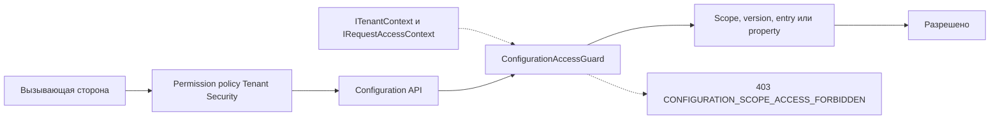

# Безопасность и аудит — Configuration

[manifest]: ../../../src/Platform/DMP.Platform.Configuration/Infrastructure/Security/ConfigurationSecurityCatalogManifest.cs
[guard]: ../../../src/Platform/DMP.Platform.Configuration/Application/Services/Core/ConfigurationAccessGuard.cs
[filter]: ../../../src/Platform/DMP.Platform.Configuration/Api/Controllers/ConfigurationForbiddenExceptionFilter.cs
[change]: ../../../src/Platform/DMP.Platform.Configuration/Domain/Entities/ConfigurationChange.cs
[publication]: ../../../src/Platform/DMP.Platform.Configuration/Domain/Entities/PublicationRecord.cs

## 1. Назначение документа

Документ описывает security controls и локальные записи изменений Configuration. Общий каталог безопасности, назначения ролей и механизм authorization decision принадлежат [Tenant/Security](../01_tenant_and_security/00_platform_overview.md). Общий Audit History и его хранение за пределами Configuration не входят в эту область.

## 2. Ресурсы и права

Configuration регистрирует capability `Configuration`, пять ресурсов и восемь permissions в [security manifest][manifest].

| Ресурс | Действие | Область действия | Политика или роль | Источник решения |
| --- | --- | --- | --- | --- |
| `Configuration.Scope` | `View`, `Edit` | Scope, доступный текущему контексту | Системные роли Configuration и локальная проверка scope | [security manifest][manifest], [access guard][guard] |
| `Configuration.Version` | `Create`, `Publish`, `Archive` | Corporate или Tenant scope с соответствующим контекстом | Permission policy; публикация дополнительно требует `Configuration.Version.Publish` | [security manifest][manifest], [access guard][guard] |
| `Configuration.Entry` | `Edit` | Entry в разрешённой версии и scope | `Configuration.Entry.Edit` | [security manifest][manifest], [access guard][guard] |
| `Configuration.Effective` | `View` | Эффективная конфигурация разрешённой цепочки | `Configuration.Effective.View` | [security manifest][manifest], [access guard][guard] |
| `Configuration.Catalog` | `View` | Каталоги, доступные Configuration | `Configuration.Catalog.View` | [security manifest][manifest] |

Для публикации используется module verb `Publish`; он не заменяет permission `Configuration.Version.Publish`.

## 3. Принятие решения и управление

Общая authorization policy и управление назначениями принадлежат Tenant/Security.
Configuration регистрирует свои ресурсы, permissions и capability-specific
системные роли, а затем применяет локальные ограничения scope.

Manifest содержит описания системных ролей для корпоративного и tenant-уровня. При регистрации Tenant Security создаёт их как `RoleCategory.System` с `ManagedByPlatform = true` и сохраняет `SourceModuleCode = Configuration`. Входной DTO называется `CapabilityRoleTemplateRequest`, но это только техническое имя структуры manifest.

| Системная роль | Назначение | Особенность |
| --- | --- | --- |
| `CorporateConfigurationAdmin` | Полное управление корпоративной конфигурацией. | Публикация и архивирование разрешены. |
| `CorporateConfigurationAnalyst` | Изменение корпоративных draft. | Нет прав публикации и архивирования. |
| `CorporateConfigurationPublisher` | Публикация и архивирование корпоративных версий. | Нет прав редактирования draft. |
| `CorporateConfigurationAuditor` | Чтение корпоративной конфигурации. | Только просмотр effective и каталога. |
| `TenantConfigurationAdmin` | Полное управление конфигурацией предприятия. | Назначение tenant admin разрешено manifest policy. |
| `TenantConfigurationAnalyst` | Изменение tenant draft. | Нет прав публикации и архивирования. |
| `TenantConfigurationPublisher` | Публикация и архивирование tenant-версий. | Нет прав редактирования draft. |

Перечень ролей является capability-specific набором системных ролей. Итоговое назначение роли пользователю и проверка membership остаются у Tenant/Security.

## 4. Контроли и риски

Схема разделяет общую проверку permission в Tenant Security и локальную проверку
владельца данных в `ConfigurationAccessGuard`. Configuration проверяет соответствие
scope текущему контексту и возвращает свой reason code, но не владеет выдачей ролей,
permission или общей authorization policy. ([guard][guard]; [filter][filter])

`ConfigurationAccessGuard` проверяет доступ к scope, version, entry и property:

- platform/global или corporate configuration assignment получает platform scope access;
- корпоративный scope недоступен обычному tenant-контексту;
- tenant scope должен совпадать с tenant из request context;
- site scope должен совпадать с текущим site, если site задан в request context;
- доступ к version, entry и property сначала разрешается до scope-владельца, затем проверяется тем же правилом.

Нарушение правила возвращается как HTTP 403 с reason code `CONFIGURATION_SCOPE_ACCESS_FORBIDDEN` через [forbidden exception filter][filter].

| Угроза | Контроль | Подтверждение | Остаточный риск |
| --- | --- | --- | --- |
| Чтение или изменение чужого scope | Проверка tenant/site контекста и принадлежности version, entry или property в `ConfigurationAccessGuard` | [access guard][guard], [forbidden filter][filter] | Общая политика назначения ролей остаётся у Tenant/Security |
| Публикация без права публикации | Permission `Configuration.Version.Publish` проверяется отдельно от module verb `Publish` | [security manifest][manifest], [access guard][guard] | Полная матрица ролей прикладных модулей не входит в Configuration |
| Потеря локальной истории изменения | `ConfigurationChange` и `PublicationRecord` создаются локально в authoring/publication pipeline | [change][change], [publication][publication] | Retention, export и интеграция с общим Audit History не закреплены |

## 5. Аудит

Configuration хранит две локальные сущности:

| Запись | Что фиксирует |
| --- | --- |
| `ConfigurationChange` | Версию, необязательный entry, тип изменения, UTC-время и `ChangedBy`. |
| `PublicationRecord` | Опубликованную версию, предыдущую версию, UTC-время и `PublishedBy`. |

Записи `ConfigurationChange` создаются при authoring, baseline import и editor operations. Они нужны для истории изменений конкретной конфигурации. Они не заменяют общий audit trail платформы. ([change][change]; [publication][publication])

| Событие аудита | Инициатор | Контекст | Запись | Покрытие | Подтверждение |
| --- | --- | --- | --- | --- | --- |
| Изменение draft или импорт baseline | Пользователь или bootstrap/import service | Scope, version, optional entry, UTC-время, `ChangedBy` | `ConfigurationChange` | Локальная история Configuration | [change][change] |
| Публикация версии | Пользователь или publication service | Scope, published version, previous version, UTC-время, `PublishedBy` | `PublicationRecord` | Локальная запись публикации | [publication][publication] |
| Общий platform audit event | Инициатор операции | Требуемая общая audit-модель | Вне текущей области | Не подтверждено текущим пакетом | [трассировка Configuration](90_traceability.md), `CFG-DEC-07` |

## 6. Покрытие и пробелы

- В текущем пакете не описаны единые retention/export правила для локальной истории Configuration.
- Не закреплён отдельный контракт выдачи истории изменений для внешнего Audit History.
- Семантика actor identity, correlation id и причин изменения должна быть согласована на уровне общей платформенной модели аудита.

Это ограничения текущего пакета, а не обещания MVP. См. [трассировку Configuration](90_traceability.md): `CFG-DEC-07` — Audit/change boundary. После решения результат переносится в документ-владелец.

### 6.1. Источники подтверждения

Основные подтверждения: [manifest][manifest], [access guard][guard], [forbidden filter][filter], `ConfigurationChange` и `PublicationRecord`.

## История изменений

| Версия | Дата и время | Автор | Раздел | Изменение | Коммит/PR |
|---|---|---|---|---|---|
| 0.1 | 2026-08-26 23:30 +03:00 | Олег Юрьев (@axelprosoft) | Создание документа | предварително готовые модули ядра и связанные изменения | [ca13b19b](https://github.com/axelprosoft/DMP.PlatformFoundation/commit/ca13b19bd17dd297927c1e66a97f95c29735b971) |
