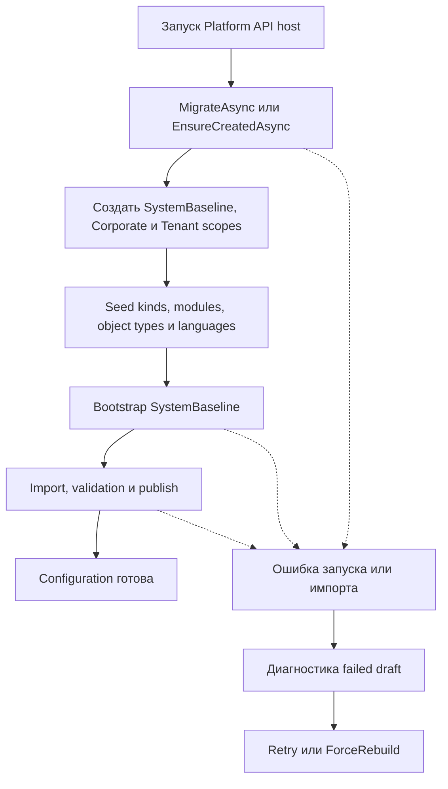

# Эксплуатация — Configuration

[initializer]: ../../../src/Platform/DMP.Platform.Configuration/Infrastructure/Persistence/ConfigurationDatabaseInitializer.cs
[options]: ../../../src/Platform/DMP.Platform.Configuration/Infrastructure/Persistence/ConfigurationBootstrapOptions.cs
[bootstrap]: ../../../src/Platform/DMP.Platform.Configuration/Application/Bootstrap/Services/ConfigurationBootstrapOrchestrator.cs
[migrations]: ../../../src/Platform/DMP.Platform.Configuration/Infrastructure/Persistence/Migrations/
[backlog]: ../../10_backlog/roadmap/preparation/platform_core_documentation_backlog.md

## 1. Назначение документа

Документ фиксирует startup, database initialization, bootstrap, migration и эксплуатационные ограничения Configuration. Полный runbook среды, deployment pipeline и recovery платформы находятся за пределами этой области.

## 2. Запуск и готовность

Схема показывает эксплуатационный путь от создания схемы до опубликованного
`SystemBaseline`. `Failed draft diagnostics` используется для разбора ошибки, а
повтор запускает штатный retry или `ForceRebuild`; схема не обещает автоматическое
восстановление после внешнего deployment. ([initializer][initializer]; [bootstrap][bootstrap]; [migrations][migrations])

При relational storage [database initializer][initializer] выполняет `Database.MigrateAsync`; для non-relational storage используется `EnsureCreatedAsync`. После этого initializer:

1. создаёт `SystemBaseline` и `Corporate` scopes, если их нет;
2. обеспечивает tenant scopes через `IConfigurationTenantCatalog`;
3. при включённом `SeedSystemCatalogs` создаёт kinds, module catalog snapshots, modules, object types и активные языки `en-US`/`ru-RU`;
4. проверяет downgrade contracts version и изменение catalog fingerprint без повышения contracts version.

Опция `Configuration:Bootstrap:SeedSystemCatalogs` управляет seed system catalogs через [bootstrap options][options].

| Шаг запуска | Условие | Идемпотентность | Критерий готовности | Откат |
| --- | --- | --- | --- | --- |
| Применить схему хранения | Запуск API и доступно хранилище | `MigrateAsync` для relational storage; `EnsureCreatedAsync` для non-relational storage | Схема Configuration создана или обновлена | Исправить миграцию или восстановить хранилище по процедуре среды |
| Создать scopes и системные каталоги | Отсутствуют требуемые записи | Повторный запуск не дублирует существующие scopes и catalogs | `SystemBaseline` и необходимые каталоги доступны | Устранить ошибку каталога и повторить запуск |
| Выполнить baseline bootstrap | Включён bootstrap и доступны packages | Published baseline повторно не перестраивается без `ForceRebuild` | Есть опубликованная версия `SystemBaseline` | Failed draft сохранить для диагностики; повторить или выполнить `ForceRebuild` |

### 2.1. Baseline bootstrap и импорт

`ConfigurationBootstrapOrchestrator` выполняет bootstrap SystemBaseline: создаёт или повторно использует draft, выполняет подготовку и import, затем validation и publish. Если published baseline уже существует, повторный запуск может завершиться режимом `SkippedPublished`; неуспешное выполнение сохраняет диагностическое состояние, которое должно быть разобрано до следующей операции. ([bootstrap][bootstrap])

Не-корневые области (`non-root scopes`) требуют опубликованную базовую версию
родительской области (`parent-base version`) при создании draft. Это правило
проверяется context API и authoring API. Effective resolver дополнительно
проверяет цепочку родительских версий при чтении.

## 3. Миграции

Структура Configuration хранится в Entity Framework migrations, включая scope/version lineage, baseline snapshot, settings snapshot, content blobs, failed draft diagnostics и root artifact editor sessions. ([migrations][migrations])

Понижение зарегистрированной `ContractsVersion` блокируется. Изменение стабильного catalog fingerprint без повышения `ContractsVersion` также блокируется initializer.

| Изменение | Порядок | Совместимость | Проверка | Откат |
| --- | --- | --- | --- | --- |
| Изменение схемы Configuration | Создать и применить EF Core migration до запуска новой версии | Определяется migration и сохранением существующих scope/version данных | Migration и запуск initializer | Откат migration по процедуре среды |
| Понижение `ContractsVersion` | Сначала согласовать совместимую версию контракта | Текущее поведение блокирует downgrade | Initializer проверяет зарегистрированную версию | Остановить запуск и вернуть совместимую сборку |
| Изменение catalog fingerprint | Повысить `ContractsVersion` и зарегистрировать новый стабильный каталог | Изменение без повышения версии блокируется | Initializer проверяет fingerprint | Вернуть прежний каталог или выпустить согласованную версию |

## 4. Диагностика

| Сигнал | Диагностика | Действие | Критерий восстановления | Эскалация |
| --- | --- | --- | --- | --- |
| Bootstrap успешно завершён | Проверить published SystemBaseline и correlation id операции | Завершить операцию без повторного rebuild | Published baseline доступен | Владелец Configuration bootstrap |
| Published baseline уже существует | Проверить состояние baseline и correlation id операции | Не выполнять повторный rebuild без явной операции; использовать результат skipped | Состояние baseline соответствует ожидаемому | Владелец Configuration bootstrap |
| Bootstrap/import завершился ошибкой | Проверить failed draft diagnostics, reason и correlation id | Исправить package, schema или validation issue; повторить bootstrap | Baseline validation и publish завершились успешно | Владелец Configuration bootstrap |
| Нет parent-base для non-root draft | Проверить опубликованный parent scope/version | Сначала опубликовать parent-base, затем повторить создание draft | Context и authoring API разрешают CreateDraft | Владелец Configuration authoring |
| Contracts downgrade или fingerprint mismatch | Сопоставить зарегистрированные версии и catalog fingerprint | Согласовать повышение версии или вернуть совместимый каталог | Initializer проходит проверки | Владелец регистрации платформенных каталогов |

## 5. Восстановление

Текущее восстановление после ошибки bootstrap/import состоит из сохранения
диагностического `Failed` draft, анализа `reason` и `correlation id`, а затем
повторного запуска. `ForceRebuild` применяется только как явная операция, когда
нужно очистить failed/draft состояние и построить baseline заново.

Следующие пункты имеют статус сведения `Будущая доработка`: это
отложенные эксплуатационные результаты, а не текущие гарантии MVP и не новые
открытые архитектурные вопросы. Маршрут ведётся в [общем backlog][backlog].

- Отдельный production runbook с командами, ролями, таймаутами и recovery steps ещё не оформлен.
- Не зафиксированы SLO bootstrap/import, политика повторов и требования к cache warm-up.
- Не описан единый health/metrics contract для Configuration.
- Recovery после частично применённого внешнего deployment требует отдельного сценария платформы.

Эти пункты являются эксплуатационным backlog, а не гарантированными возможностями текущего MVP.

## 6. Откат и эскалация

При ошибке bootstrap/import сначала сохраняется и анализируется failed draft;
повторный запуск выполняется после устранения причины. Откат внешнего deployment,
частично применившегося изменения и единая escalation policy не определены в
текущем Configuration MVP. Они относятся к будущему platform operations runbook.

### 6.1. Перенос между окружениями

Операция переноса Configuration между `dev`, `test`, `staging` и `production` не
имеет утверждённого текущего runbook или общего публичного контракта. В частности,
не определены выбор переносимой версии, проверка совместимости, preview конфликтов,
правила применения и rollback при частичном отказе.

Это не относится к переносу `.rptdesign` в рамках `Report design export/import` и
не описывает пользовательский `Output export`. До отдельного решения перенос
между окружениями следует считать будущей capability.

### 6.2. Источники подтверждения

Основные подтверждения: [database initializer][initializer], [bootstrap options][options], [bootstrap orchestrator][bootstrap] и [migrations][migrations].

## 7. Граница с Content Storage

Configuration baseline содержит только декларацию file metadata и не владеет
ресурсами. DB migration, limits и cleanup описаны в
[Content Storage operations](../13_content_storage/08_operations.md).

## История изменений

| Версия | Дата и время | Автор | Раздел | Изменение | Коммит/PR |
|---|---|---|---|---|---|
| 1.0 | 2026-09-03 14:49 +03:00 | Олег Юрьев (@axelprosoft) | YAML-шапка: review_status, status | Утверждение после merge PR #61: изменения в проектной документации ядра - новый модуль работы с файлами | [PR #61](https://github.com/axelprosoft/DMP.PlatformFoundation/pull/61) |
| 0.2 | 2026-09-03 13:00 +03:00 | Олег Юрьев (@axelprosoft) | Граница с Content Storage | изменения в проектной документации ядра. основание - новый модуль по хранению и работе с файлами | [0f415f89](https://github.com/axelprosoft/DMP.PlatformFoundation/commit/0f415f89b977fa123e52411717a66f94c2d327a3) |
| 0.1 | 2026-08-27 16:52 +03:00 | Олег Юрьев (@axelprosoft) | Создание документа | docs-new: синхронизировать типы документов со стандартом | [7c7ecbfb](https://github.com/axelprosoft/DMP.PlatformFoundation/commit/7c7ecbfb4036c9ce3c6304f9ee3e4a6e48f7828c) |
