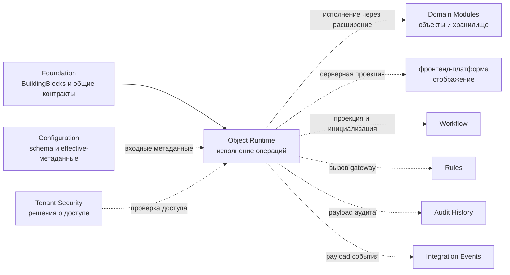

# Обзор платформенной области — Object Runtime

[runtime-project]: ../../../src/Platform/DMP.Platform.Runtime/
[contracts-project]: ../../../src/Platform/DMP.Platform.Contracts/Runtime/
[runtime-controller]: ../../../src/Platform/DMP.Platform.Runtime/Api/Controllers/ApplicationRuntimeController.cs
[object-runtime]: ../../../src/Platform/DMP.Platform.Runtime/Application/Services/Core/ObjectRuntime.cs
[generic-provider]: ../../../src/Platform/DMP.Platform.Runtime/Application/Services/Core/GenericRuntimeObjectProvider.cs
[mutation-pipeline]: ../../../src/Platform/DMP.Platform.Runtime/Application/Services/Core/ObjectMutationPipeline.cs
[generated-writer]: ../../../src/Platform/DMP.Platform.Runtime/Application/Services/Core/ObjectGeneratedRuntimeObjectMutationWriter.cs
[descriptor]: ../../../src/Platform/DMP.Platform.Runtime/Application/Abstractions/Objects/ObjectRuntimeDescriptor.cs
[business-contract]: ../../../src/Platform/DMP.Platform.Runtime/Application/Abstractions/Objects/BusinessObjectContract.cs
[application-runtime-service]: ../../../src/Platform/DMP.Platform.Runtime/Application/Services/Core/ApplicationRuntimeService.cs
[runtime-tests]: ../../../tests/DMP.Platform.IntegrationTests/Runtime/
[configuration-scope]: ../02_configuration/01_scope.md
[object-type]: ../02_configuration/artifact_types/object_type.md
[view-artifact]: ../02_configuration/artifact_types/view.md
[action-artifact]: ../02_configuration/artifact_types/action.md
[platform-terms]: ../../11_glossary/platform_terms.md
[configuration-terms]: ../../11_glossary/configuration_terms.md
[object-runtime-terms]: ../../11_glossary/object_runtime_terms.md
[foundation-overview]: ../00_foundation/00_platform_overview.md
[foundation-contracts]: ../00_foundation/03_contracts.md
[foundation-application]: ../../../src/BuildingBlocks/DMP.BuildingBlocks.Application/
[common-contracts]: ../../../src/Platform/DMP.Platform.Contracts/Common/
[workflow]: ../04_workflow/00_platform_overview.md

## 1. Назначение области

Object Runtime владеет единым серверным механизмом выполнения операций над бизнес-объектами. Он регистрирует контракты объектов, строит исполняемые описания, читает списки и карточки, подготавливает значения для создания, выполняет создание, изменение, удаление и действия объектов. В его область также входят проверки полиморфизма и иерархии, единый конвейер изменения, локальная граница транзакции и вызовы подключённых приёмников для аудита и интеграционных событий. ([runtime-project][runtime-project]; [object-runtime][object-runtime]; [generic-provider][generic-provider]; [mutation-pipeline][mutation-pipeline])

Object Runtime не владеет схемами конфигурационных артефактов, редактором Configuration, отображением в пользовательском интерфейсе и предметными инвариантами конкретного модуля. Он использует опубликованные метаданные и исполняемые контракты, а соседние области остаются источником истины для своих моделей. ([configuration-scope][configuration-scope]; [object-type][object-type]; [view-artifact][view-artifact]; [action-artifact][action-artifact])

## 2. Место в платформе

Object Runtime расположен в `DMP.Platform.Runtime` и вызывается через Runtime API `api/runtime`. Слой Runtime Facade (`ApplicationRuntimeService`) проверяет доступ, получает effective configuration и собирает ответ для потребителя: представление объекта, список, действия, значения выбора и состояние workflow. Это не передаёт Object Runtime владение схемами `View`, `Menu` или `Workflow`: он предоставляет только механизм выполнения операций над объектом. ([runtime-controller][runtime-controller]; [application-runtime-service][application-runtime-service])

Связи Object Runtime с Configuration, Tenant Security, Workflow, Value Sets,
Settings, Numbering, Audit History, Integration Events и внешним Report Service
сведены в [интеграционной архитектуре Platform Core](../../02_architecture/07_integration_architecture.md).
Ниже описываются только собственные runtime-контракты и сценарии.

Схема показывает место Object Runtime в платформе и владельцев соседних
границ. Пунктир обозначает межобластное использование или передачу результата,
а не передачу владения моделью.

Локальная таблица терминов повторяет ключевые понятия для чтения пакета и не является отдельным источником истины. Общие платформенные термины ведутся в [платформенном глоссарии][platform-terms], термины Configuration — в [глоссарии Configuration][configuration-terms], а термины Object Runtime — в [тематическом глоссарии Object Runtime][object-runtime-terms].

| Термин | Техническое имя | Значение | Источник |
| --- | --- | --- | --- |
| Исполняемый контракт объекта | `BusinessObjectContract<T>` | Кодовое декларативное описание объекта: его идентичность, поля, наборы данных, действия, проверки, обработчики жизненного цикла, хранилище и политики выполнения. | [контракт объекта][business-contract] |
| Исполняемое описание объекта | `ObjectRuntimeDescriptor` | Неизменяемое представление контракта, через которое runtime выполняет операции. | [описание][descriptor] |
| Точка входа Object Runtime | `IObjectRuntime`, `ObjectRuntime` | Интерфейс и реализация, принимающие стандартные операции и передающие их исполняемому описанию объекта. | [точка входа][object-runtime] |
| Конвейер изменения объекта | `ObjectMutationPipeline` | Единый порядок проверки, транзакции, обработчиков жизненного цикла, аудита и события завершения для create/update/delete/action. | [конвейер изменения][mutation-pipeline] |
| Набор данных объекта | `ObjectRuntimeDatasetDescriptor` | Описанный в контракте набор данных для `List` и `Lookup` конкретного типа объекта. Это не общий аналитический Dataset. | [описание][descriptor]; [универсальный исполнитель][generic-provider] |
| Фасад runtime | `ApplicationRuntimeService` | Слой API, который проверяет доступ, объединяет effective configuration с runtime-данными и формирует ответы для потребителей. | [служба runtime-приложения][application-runtime-service] |
| Опубликованная effective configuration | `EffectiveArtifactDocument` | Результат, который Configuration публикует для потребления runtime после применения версий и переопределений. Object Runtime только использует эти данные. | [configuration-scope][configuration-scope] |
| Адаптер хранилища | storage adapter | Адаптер, через который runtime получает запросы, читает данные или сохраняет объект в хранилище прикладного модуля. | [универсальный исполнитель][generic-provider] |
| Обработчик чтения | reader | Точка расширения модуля, возвращающая список, карточку или значения для создания. | [универсальный исполнитель][generic-provider] |
| Обработчик записи | writer | Точка расширения модуля, которая применяет изменение состояния объекта внутри конвейера. | [универсальный исполнитель][generic-provider] |
| Подключаемый приёмник | sink | Необязательная зависимость, принимающая результат изменения для записи аудита или публикации события. | [конвейер изменения][mutation-pipeline] |
| Дискриминатор типа | discriminator | Служебное значение, по которому runtime определяет конкретный тип объекта в TPH-иерархии; пользовательское изменение запрещено. | [описание][descriptor] |
| TPH-полиморфизм | table-per-hierarchy | Хранение нескольких конкретных типов объектов в одной иерархии с различением по дискриминатору. | [описание][descriptor] |
| Owned-коллекция | `SaveMode = WithOwner` | Коллекция, сохраняемая вместе с владельцем объекта в рамках одной операции. | [универсальный исполнитель][generic-provider] |
| Область запроса | runtime scope | Ограничение набора строк по tenant, удалению, архиву, полиморфизму или иерархии до фильтрации и выдачи. | [универсальный исполнитель][generic-provider] |

## 3. Основные возможности

| Возможность | Назначение | Статус | Основание |
| --- | --- | --- | --- |
| Реестр описаний | Находить объект по `ModuleCode` и `ObjectTypeCode`, включая нормализацию составного кода типа объекта. | Реализовано | [реестр описаний](../../../src/Platform/DMP.Platform.Runtime/Application/Services/Core/ObjectRuntimeDescriptorRegistry.cs); [runtime tests][runtime-tests] |
| Операции с объектом | Читать список, карточку и значения по умолчанию, а также выполнять создание, изменение и удаление через исполняемое описание. | Реализовано | [точка входа][object-runtime]; [универсальный исполнитель][generic-provider] |
| Конвейер изменения | Выполнять проверки, локальную транзакцию, обработчики жизненного цикла, аудит и событие в определённом порядке. | Реализовано | [конвейер][mutation-pipeline]; [runtime tests][runtime-tests] |
| Действия объектов | Выполнять обработчики команд и планировщики изменений через общий конвейер. | Реализовано | [универсальный исполнитель][generic-provider]; [Контракты](03_contracts.md) |
| Групповые действия | Выполнять действие по явному списку идентификаторов и возвращать общий и поэлементный результат. | Реализовано с ограничением | [Фасад runtime][application-runtime-service]; [Контракты](03_contracts.md) |
| Значения по умолчанию | Объединять значения контракта, поставщика значений и явные значения запроса; отсутствующие primitive-значения автоматически не добавляются. | Реализовано с ограничением | [разрешение значений](../../../src/Platform/DMP.Platform.Runtime/Application/Services/Core/ObjectRuntimeDefaultsResolver.cs); [runtime tests][runtime-tests] |
| Ссылки на абстрактный тип | Для lookup-ссылки на `AbstractReferenceOnly` объединять доступные конкретные описания (`concrete descriptors`), проверять право просмотра каждого типа и возвращать идентичность конкретного типа. | Реализовано с ограничением | [служба runtime-приложения][application-runtime-service]; [runtime tests][runtime-tests] |
| Каскадное удаление owned-коллекций | Для сгенерированного обработчика записи рекурсивно обрабатывать коллекции с `DeleteBehavior = Cascade`; дочерние записи мягко удаляются или физически удаляются согласно их политике. | Реализовано с ограничением | [сгенерированный обработчик записи][generated-writer]; [runtime tests][runtime-tests] |
| Создание на основании существующего | Подготавливать несохранённый объект на основе исходной записи с учётом политики переносимых полей. | Реализовано с ограничениями для корневых и owned-part объектов | [Фасад runtime][application-runtime-service]; [Исполнение](04_runtime.md) |
| Полиморфизм TPH и иерархия | Применять область дискриминатора, защищать его от изменения и проверять операции с деревом объектов. | Реализовано | [универсальный исполнитель][generic-provider]; [runtime tests][runtime-tests] |
| Запрос списка объектов | Применять фильтры, сортировку, постраничную выдачу и частичную группировку для `Object Dataset`. | Реализовано с ограничениями | [универсальный исполнитель][generic-provider]; [Качество](07_quality.md) |

## 4. Ключевые решения

| Решение | Суть | Документ-владелец |
| --- | --- | --- |
| `IObjectRuntime` является текущей точкой входа | Стандартный объект исполняется через реестр и исполнитель описаний, а не через отдельный ручной provider. | [Архитектура](02_architecture.md), [Исполнение](04_runtime.md) |
| `BusinessObjectContract<T>` не является конфигурационным артефактом | Контракт строит исполняемое описание и начальную оболочку baseline, а схема `ObjectType` принадлежит Configuration. | [Граница](01_scope.md), [Контракты](03_contracts.md) |
| Изменения проходят через единый конвейер | Create/update/delete/action проходят проверки, обработчики жизненного цикла, транзакцию, аудит и публикацию события по общему маршруту. | [Исполнение](04_runtime.md), [Безопасность и аудит](05_security_and_audit.md) |
| Фасад runtime отделён от Object Runtime | Разрешение `View`, меню, проекция workflow и формирование представления интерфейса являются интеграцией, а не моделью Object Runtime. | [Граница](01_scope.md), [Контракты](03_contracts.md) |
| Открытые решения ведутся в трассировке | Владелец общего Dataset, обновление кэша, групповые операции по фильтру и импорт не выдаются за закрытые решения; целевая Java/PostgreSQL-платформа отмечена как будущая доработка. | [Трассировка](90_traceability.md) |

## 5. Зависимости

| Зависимость | Как используется | Владелец |
| --- | --- | --- |
| Foundation | [`DMP.BuildingBlocks.Application`][foundation-application], [`DMP.Platform.Contracts.Common`][common-contracts], `ModuleExecutionContext`, общие результаты сценариев, порты application-слоя для платформенных сервисов, локализация и нормализация общих запросов. Полное описание находится в [Foundation][foundation-overview] и [его контрактном документе][foundation-contracts]. | `00_foundation` — определение общего механизма; Object Runtime — runtime-семантика использования |
| Configuration | Опубликованные `ObjectType`, `View`, `Action`, `Workflow`, `Menu` и метаданные источников значений для фасада runtime. | `02_configuration` |
| Tenant Security | Проверка прав на просмотр, создание, изменение, удаление, действие и технический просмотр удалённых строк. | `01_tenant_and_security` |
| Workflow | Проекция состояния и доступности изменения, команды и запрос инициализации после создания. | [Workflow][workflow] |
| Rules | Шлюз проверки доступности действия или правила, если он вызывается прикладным модулем или workflow. | `05_rules` |
| Value Sets | Значения выбора, проверка элементов набора значений и отображаемые значения. | `06_value_sets` |
| Audit History | Хранение записей аудита, переданных приёмником Object Runtime. | `09_audit_history` |
| Integration Events | Публикация `ObjectRuntime.MutationCompleted` и запроса инициализации workflow. | `10_integration_events` |
| Reporting Output | Вызов генерации report/output присутствует в том же runtime-проекте, но не является контрактом Object Runtime. | `11_reporting_output` |
| Numbering | Назначение номера и правила нумерации, если объект подключает нумерацию. | `08_numbering` |
| фронтенд-платформа | Компонент отображения, общие runtime-пакеты, компоновка списков и элементы интерфейса. | `12_frontend_platform` |
| Domain Modules | Доменные сущности, адаптеры хранилища, проверки, обработчики жизненного цикла и команд. | `04_domain_modules/*` |

## 6. Статус реализации

В коде подтверждены `BusinessObjectContract<T>`, `ObjectRuntimeDescriptor`,
`IObjectRuntime`, `GenericRuntimeObjectProvider`, `ObjectMutationPipeline`, DTO
объектного Runtime API, статические коды runtime-проекции, abstract-reference
lookup, каскадное удаление generated writer, приёмники аудита и outbox, а также
набор интеграционных тестов runtime. Endpoint `api/runtime/outputs/generate`
относится к Reporting Output, хотя его controller и сервисы находятся в том же
проекте. Отдельный Standalone Dataset, выбор объектов по фильтру для групповой
операции, предварительное заполнение кэша и отдельный импорт не входят в
текущий MVP и направлены как будущие доработки; код профиля `Import` существует,
но сам сценарий импорта в текущем контракте не реализован. Политика
отсутствующих промышленных приёмников и полный контракт наблюдаемости нужны
перед утверждением готовности промышленной эксплуатации; см.
[трассировку](90_traceability.md).

## 7. Состав документов

| Документ | Назначение | Состояние документа |
| --- | --- | --- |
| `00_platform_overview.md` | Карта области, решения, зависимости и статус. | Создан |
| `01_scope.md` | Граница Object Runtime и соседних владельцев. | Создан |
| `02_architecture.md` | Компоненты, модель исполняемых описаний, адаптеры хранилища, конвейер и зависимости. | Создан |
| `03_contracts.md` | C#/HTTP-контракты, события, использование configuration и точки расширения. | Создан |
| `04_runtime.md` | Выполнение операций и запросов, действия, иерархия, создание на основании существующего и поведение при сбоях. | Создан |
| `05_security_and_audit.md` | Использование прав, приёмник аудита, скрытие чувствительных значений и границы Audit/Events. | Создан |
| `06_user_experience.md` | Не создан: собственного интерфейса Object Runtime нет; компонент отображения принадлежит фронтенд-платформа. | Неприменимо |
| `07_quality.md` | Подтверждение тестами, надёжность, производительность и известные разрывы. | Создан |
| `08_operations.md` | DI, проверка при запуске, диагностика, граница миграции и эксплуатационные ограничения. | Создан |
| `90_traceability.md` | Маршрут старых материалов и открытые решения. | Создан |

## История изменений

| Версия | Дата и время | Автор | Раздел | Изменение | Коммит/PR |
|---|---|---|---|---|---|
| 0.1 | 2026-08-27 15:04 +03:00 | Олег Юрьев (@axelprosoft) | Создание документа | подготовлен драфт новой проектной документации на ядро, прикладные модули, а так же термины и общие концептуальные документы | [5ecb26b1](https://github.com/axelprosoft/DMP.PlatformFoundation/commit/5ecb26b1c3ff3cfcdc13018e59526ae684ca6007) |
