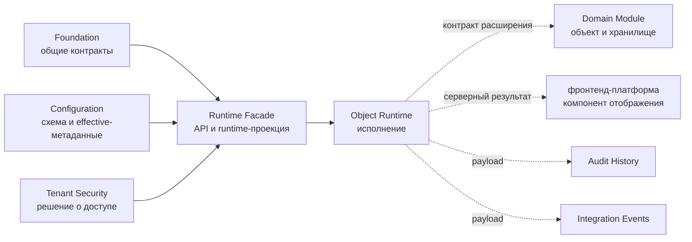

# Граница платформенной области — Object Runtime

[runtime-project]: ../../../src/Platform/DMP.Platform.Runtime/
[contracts-project]: ../../../src/Platform/DMP.Platform.Contracts/Runtime/
[application-runtime-service]: ../../../src/Platform/DMP.Platform.Runtime/Application/Services/Core/ApplicationRuntimeService.cs
[descriptor]: ../../../src/Platform/DMP.Platform.Runtime/Application/Abstractions/Objects/ObjectRuntimeDescriptor.cs
[business-contract]: ../../../src/Platform/DMP.Platform.Runtime/Application/Abstractions/Objects/BusinessObjectContract.cs
[mutation-contracts]: ../../../src/Platform/DMP.Platform.Runtime/Application/Abstractions/Objects/ObjectMutationContracts.cs
[configuration-scope]: ../02_configuration/01_scope.md
[configuration-object-type]: ../02_configuration/artifact_types/object_type.md
[configuration-view]: ../02_configuration/artifact_types/view.md
[configuration-action]: ../02_configuration/artifact_types/action.md

## 1. Назначение документа

Документ отделяет Object Runtime от Configuration, Runtime Facade, Workflow, Rules, Audit History, Integration Events, Numbering, фронтенд-платформы и прикладных модулей. Он фиксирует, какие факты можно описывать в этом пакете как текущее поведение серверного runtime. ([runtime-project][runtime-project]; [contracts-project][contracts-project])

Object Runtime не владеет самостоятельными экранами. Он предоставляет данные,
действия и runtime-проекции, которые отображаются во [фронтенд-платформе](../12_frontend_platform/06_user_experience.md); предметный экранный сценарий принадлежит области, чьи контракты используются.

## 2. Что входит

| Обязанность | Входит | Не входит | Соседний владелец | Основание |
| --- | --- | --- | --- | --- |
| Контракт объекта | `BusinessObjectContract<T>`, построитель, проверка определения контракта и преобразование в исполняемое описание. | Схема `ObjectType` как конфигурационного артефакта и свойства редактора. | Configuration | [контракт объекта][business-contract]; [описание][descriptor] |
| Исполняемое описание | `ObjectRuntimeDescriptor`, поля, наборы данных, действия, привязка хранилища, правила отображения, значения по умолчанию, управление, полиморфизм и иерархия. | Предметная модель конкретного объекта и физические таблицы модуля. | Domain Modules | [описание][descriptor] |
| Реестр и точка входа | Поиск описания по модулю и типу объекта, проверка неизвестных и дублирующихся записей, `IObjectRuntime` как точка входа. | Полная структура маршрутов Runtime API, если она не относится к операциям над объектами. | Runtime Facade / Foundation | [проект runtime][runtime-project] |
| Чтение объектов | Список, lookup, карточка, значения для создания, фильтры, сортировка, постраничная выдача, группировка, признаки удалённых и архивных строк, отображаемые значения. | Общий Dataset, аналитические/read-модели и их владелец. | Architecture / Object Runtime / Configuration; [трассировка](90_traceability.md): `ORT-DEC-01 — владелец Dataset / Read Query` | [служба runtime-приложения][application-runtime-service] |
| Изменение объектов | Create, update, delete, действие и групповое действие через `ObjectMutationRequest` и `ObjectMutationPipeline`. | Выполнение переходов workflow и самостоятельное выполнение правил. | Workflow / Rules | [контракты изменений][mutation-contracts] |
| Жизненный цикл и проверки | Платформенные и контрактные проверки, хуки предварительной проверки, обработчики жизненного цикла и проверка профиля выполнения. | Предметные правила модуля и тексты подсказок интерфейса. | Domain Modules / фронтенд-платформа | [проект runtime][runtime-project] |
| Общие политики объекта | Управляемые операции create/update/delete/archive, политика пустого изменения, сокрытие чувствительных значений, мягкое и физическое удаление. | Полная политика хранения аудита и истории, включая срок хранения. | Audit History / Operations | [runtime project][runtime-project] |
| Полиморфизм TPH и иерархия | Область дискриминатора, запрет изменения дискриминатора, области дерева и поведение полей parent/root/level/path/has-children. | Свойства схемы `Discriminator*` и `Hierarchy*` в `ObjectType`. | Configuration | [описание][descriptor]; [тип объекта Configuration][configuration-object-type] |
| Создание на основании существующего | Подготовка значений новой записи из исходного объекта и политика переноса. | Редактируемость полей схемы и кнопка/сценарий интерфейса. | Configuration / фронтенд-платформа | [служба runtime-приложения][application-runtime-service] |
| Интеграция аудита и событий | Передача сведений об изменении в аудит и публикация события завершения через подключённые приёмники. | Хранение, доставка, повторная отправка, поиск и срок хранения. | Audit History / Integration Events | [runtime project][runtime-project] |

## 3. Что не входит

За границей Object Runtime остаются следующие обязанности:

- каноническая модель `ArtifactDocument`, `ArtifactNode`, `ArtifactValue` и `EffectiveArtifactDocument`;
- контракт схемы `ObjectType`, `View`, `Action`, `Workflow`, `Rule`, `Report`, `Output`, `ValueSet`, `SystemEnum`, `Menu`;
- создание и редактирование, управление версиями, публикация, слияние effective-значений и редактор артефактов Configuration;
- общий компонент отображения, `@dmp/runtime-react`, `@dmp/runtime-contracts`, ограниченная компоновка списка и приложения Admin/Runtime/Studio;
- машина состояний Workflow, выполнение команд, владелец проверок переходов и история workflow;
- Rule Engine как самостоятельный вычислитель и классификация правил;
- хранение, поиск, срок хранения Audit History и общий контракт аудита;
- конверт Integration Events, повторная отправка outbox, inbox и политика dead-letter;
- счётчики Numbering, момент назначения и конкурентность номеров;
- предметные сущности, репозитории, проверки, обработчики жизненного цикла и команд модулей;
- Standalone Dataset, аналитические/read-модели и межмодульный контракт чтения.
- Схемы `Report` и `Output`, endpoint `api/runtime/outputs/generate` и службы
  формирования файлового или иного output-результата; их владелец — Reporting Output.

Логика вывода

Граница получена из текущего корня композиции `DMP.Platform.Runtime`, контрактов `DMP.Platform.Contracts/Runtime`, соседнего пакета Configuration и интеграционных тестов runtime. Если тема имеет отдельный проект, владельца схемы, владельца хранилища или владельца интерфейса, Object Runtime описывает только точку вызова и не переносит соседнюю модель в свои документы.

## 4. Граница с соседними областями и модулями

| Соседний владелец | Что использует Object Runtime | Что остаётся у соседа |
| --- | --- | --- |
| Configuration | Effective-метаданные объекта, представления, действия и меню, которые фасад runtime объединяет с данными объекта. | Каноническая схема, создание и редактирование, публикация, слияние effective-значений и серверный контракт редактора. |
| Tenant Security | Решения о доступе для просмотра, создания, изменения, удаления, действия и технического просмотра удалённых строк. | Каталог прав, назначения ролей, выдача прав и правила безопасности. |
| Workflow | Проекция состояния только для чтения, виртуальные поля workflow, команды и запрос инициализации после создания. | Хранилище состояния, переходы, история workflow и права на команды. |
| Rules | Возможность проверить доступность действия или правила через gateway. | Определения правил, вычислитель, полнота engine и смысл результата. |
| Value Sets | Значения выбора, отображение и проверка элементов набора значений. | Данные наборов, переопределения, жизненный цикл элементов и редактор. |
| Audit History | `IAuditHistoryWriter` как необязательный приёмник сведений об изменении. | Хранение, поиск, срок хранения, неизменяемость и API аудита. |
| Integration Events | `IIntegrationEventPublisher` как необязательный приёмник события завершения изменения. | Конверт, повторные попытки, обработка outbox/inbox и гарантии доставки. |
| Numbering | Метаданные полей и точки вызова runtime, если объект подключает нумерацию. | Счётчики, правила назначения и согласованность номеров. |
| Reporting Output | Runtime-проект предоставляет endpoint и службы формирования output. | Схемы `Report`/`Output`, параметры генерации, формат результата и эксплуатационная политика output. |
| фронтенд-платформа | Потребители получают контракты объекта, списка, действия и представления. | Компонент отображения, элементы управления, оболочка, маршрутизация, пакеты и границы приложений. |
| Domain Modules | Контракты объектов, репозитории, адаптеры хранилища, проверки, обработчики жизненного цикла, команд и доменные сущности. | Предметная модель, инварианты и документация конкретного модуля. |

Схема показывает границу ответственности: Object Runtime исполняет операцию,
но не становится владельцем схемы Configuration, доменной модели модуля,
компонента отображения, хранения аудита или доставки событий.

## 5. Соответствие требованиям

| Требование | Покрытие | Решение | Документ-владелец |
| --- | --- | --- | --- |
| Единый Object Runtime | Покрыто | `IObjectRuntime` и исполнитель описаний подтверждены кодом; старый маршрут provider не является целевой моделью. | [Архитектура](02_architecture.md), [Исполнение](04_runtime.md) |
| Единый контур чтения/записи/изменения | Покрыто частично | Операции CRUD и actions проходят через описание и конвейер; Standalone Dataset, групповые операции по фильтру и профиль импорта не закрыты. | [Исполнение](04_runtime.md), [Трассировка](90_traceability.md) |
| Исполняемое описание и реестр | Покрыто | Реестр описаний, проверка совместимости при запуске и граница миграции подтверждены. | [Архитектура](02_architecture.md), [Операции](08_operations.md) |
| Связь с Configuration | Покрыто в части использования | Object Runtime использует опубликованные effective-метаданные; свойства схемы остаются у Configuration. | Этот документ, [Контракты](03_contracts.md) |
| Жизненный цикл, проверки, действия и точки подключения Workflow | Покрыто частично | Конвейер, проверки, обработчики жизненного цикла, действия команд и проекция workflow подтверждены; полная машина состояний принадлежит Workflow. | [Исполнение](04_runtime.md), [Трассировка](90_traceability.md) |
| Транзакции, аудит, outbox и кэш | Покрыто частично | Локальная транзакция и приёмники аудита/событий подтверждены; производственная политика обновления кэша не закрыта. | [Безопасность и аудит](05_security_and_audit.md), [Операции](08_operations.md), [Трассировка](90_traceability.md) |

## 6. Ограничения версии

Документ фиксирует MVP удалённого `origin/master` на C#/EF Core/SQL Server и его Runtime API. Общий Dataset / Read Query, производственная стратегия кэширования, групповые операции по фильтру и профиль импорта остаются открытыми решениями в [трассировке](90_traceability.md). Java/PostgreSQL относится к будущему архитектурному этапу; его решение не требуется для понимания или проверки текущего MVP.

## История изменений

| Версия | Дата и время | Автор | Раздел | Изменение | Коммит/PR |
|---|---|---|---|---|---|
| 0.1 | 2026-08-27 16:52 +03:00 | Олег Юрьев (@axelprosoft) | Создание документа | docs-new: синхронизировать типы документов со стандартом | [7c7ecbfb](https://github.com/axelprosoft/DMP.PlatformFoundation/commit/7c7ecbfb4036c9ce3c6304f9ee3e4a6e48f7828c) |
