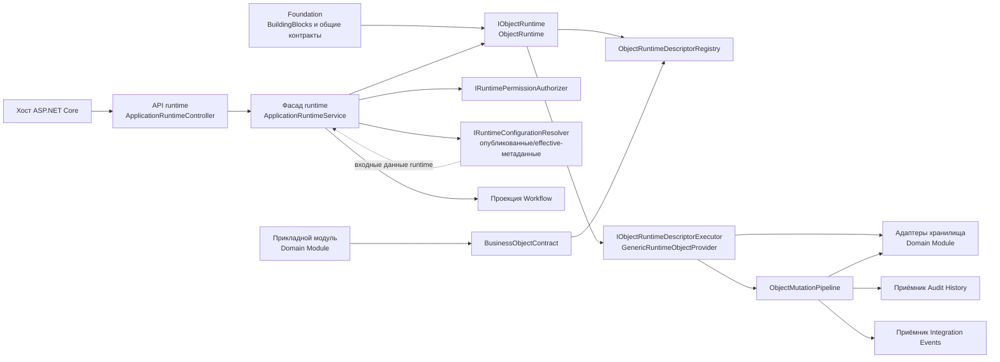
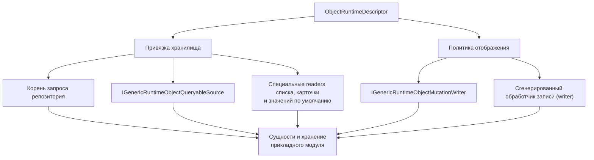

# Архитектура — Object Runtime

[di]: ../../../src/Platform/DMP.Platform.Runtime/DependencyInjection.cs
[controller]: ../../../src/Platform/DMP.Platform.Runtime/Api/Controllers/ApplicationRuntimeController.cs
[app-service]: ../../../src/Platform/DMP.Platform.Runtime/Application/Services/Core/ApplicationRuntimeService.cs
[object-runtime]: ../../../src/Platform/DMP.Platform.Runtime/Application/Services/Core/ObjectRuntime.cs
[descriptor-registry]: ../../../src/Platform/DMP.Platform.Runtime/Application/Services/Core/ObjectRuntimeDescriptorRegistry.cs
[startup-validator]: ../../../src/Platform/DMP.Platform.Runtime/Application/Services/Core/ObjectRuntimeDescriptorStartupValidator.cs
[business-contract]: ../../../src/Platform/DMP.Platform.Runtime/Application/Abstractions/Objects/BusinessObjectContract.cs
[builder]: ../../../src/Platform/DMP.Platform.Runtime/Application/Abstractions/Objects/BusinessObjectBuilder.cs
[contract-definition]: ../../../src/Platform/DMP.Platform.Runtime/Application/Abstractions/Objects/BusinessObjectContractDefinition.cs
[descriptor]: ../../../src/Platform/DMP.Platform.Runtime/Application/Abstractions/Objects/ObjectRuntimeDescriptor.cs
[runtime-contracts]: ../../../src/Platform/DMP.Platform.Contracts/Runtime/
[generic-provider]: ../../../src/Platform/DMP.Platform.Runtime/Application/Services/Core/GenericRuntimeObjectProvider.cs
[mutation-pipeline]: ../../../src/Platform/DMP.Platform.Runtime/Application/Services/Core/ObjectMutationPipeline.cs
[mutation-contracts]: ../../../src/Platform/DMP.Platform.Runtime/Application/Abstractions/Objects/ObjectMutationContracts.cs
[generated-writer]: ../../../src/Platform/DMP.Platform.Runtime/Application/Services/Core/ObjectGeneratedRuntimeObjectMutationWriter.cs
[generated-writer-executor]: ../../../src/Platform/DMP.Platform.Runtime/Application/Abstractions/Objects/ObjectGeneratedWriterMutationExecutor.cs
[defaults-resolver]: ../../../src/Platform/DMP.Platform.Runtime/Application/Services/Core/ObjectRuntimeDefaultsResolver.cs
[audit-sink]: ../../../src/Platform/DMP.Platform.Runtime/Application/Services/Core/ObjectRuntimeAuditSink.cs
[outbox-sink]: ../../../src/Platform/DMP.Platform.Runtime/Application/Services/Core/ObjectRuntimeIntegrationEventOutboxSink.cs
[foundation-overview]: ../00_foundation/00_platform_overview.md
[foundation-architecture]: ../00_foundation/02_architecture.md
[foundation-contracts]: ../00_foundation/03_contracts.md
[foundation-application]: ../../../src/BuildingBlocks/DMP.BuildingBlocks.Application/
[common-contracts]: ../../../src/Platform/DMP.Platform.Contracts/Common/

## 1. Назначение документа

Документ описывает устройство Object Runtime: его компоненты, модель исполняемого описания объекта, адаптеры хранилища, конвейер изменения, путь выполнения запросов, зависимости и технические ограничения. Публичные HTTP- и C#-контракты вынесены в `03_contracts.md`, а пошаговое выполнение операций — в `04_runtime.md`.

## 2. Граница и компоненты

Object Runtime подключается через `AddPlatformRuntime`. Корень композиции регистрирует компонент промежуточной обработки контекста запроса, средства формирования ответов Runtime Facade, резервные сервисы, реестр описаний, `IObjectRuntime`, исполнитель описаний, разрешение значений по умолчанию, конвейер изменения, проверки, обработчики жизненного цикла, приёмники аудита и событий, а также фоновую службу проверки при запуске. ([di][di])

| Компонент | Ответственность | Зависимости | Подтверждение |
| --- | --- | --- | --- |
| Runtime API | HTTP-маршрут `api/runtime` для начальной точки, разрешения представления, значений выбора, списка и карточки объекта, значений для создания, создания, изменения, удаления, действий и групповых действий. Маршрут `outputs/generate` находится в том же controller, но относится к Reporting Output. | Хост ASP.NET Core, Runtime Facade | [ApplicationRuntimeController][controller] |
| Фасад runtime | Проверка доступа, выбор языка, получение эффективной конфигурации (`effective configuration`) и формирование представлений объекта, действия, списка, меню и состояния workflow. | Tenant/Security, Configuration, Object Runtime, Workflow | [ApplicationRuntimeService][app-service] |
| Точка входа Object Runtime | Поиск исполняемого описания и передача ему операций над объектом. | Реестр описаний, исполнитель описаний | [ObjectRuntime][object-runtime] |
| Модель контракта объекта | Декларативный контракт и построитель, через которые прикладные модули публикуют исполняемые метаданные объекта. | Прикладные модули, реестр описаний | [BusinessObjectContract][business-contract], [BusinessObjectBuilder][builder], [определение контракта][contract-definition] |
| Реестр описаний | Каталог `ObjectRuntimeDescriptor` в памяти процесса, индексированный по модулю и типу объекта; для типа, доступного только для ссылок (`AbstractReferenceOnly`), он также возвращает зарегистрированные конкретные описания. | Контракты прикладных модулей, startup validation | [реестр описаний][descriptor-registry] |
| Проверка описаний при запуске | Проверка совместимости зарегистрированных описаний с опубликованными артефактами. | Реестр описаний, Configuration | [проверка при запуске][startup-validator] |
| Исполнитель описаний | Универсальная реализация стандартных операций чтения, значений для создания, изменений и действий объектов. | Описание (`descriptor`), адаптеры хранилища, конвейер изменений | [универсальный исполнитель][generic-provider] |
| Конвейер изменения | Общий порядок проверок, транзакции, жизненного цикла, аудита и события завершения. | Исполнитель, прикладной модуль (`Domain Module`), Audit History, Integration Events | [конвейер][mutation-pipeline], [контракты изменений][mutation-contracts] |
| Адаптеры хранилища | Корень запроса репозитория, источник запросов, средства чтения списка и карточки, чтения значений для создания, записи изменений и сгенерированный обработчик записи (`writer`). | Хранилище прикладного модуля, описание (`descriptor`) | [универсальный исполнитель][generic-provider], [сгенерированный обработчик записи][generated-writer] |

Схема показывает статические зависимости корня композиции и не означает, что каждая операция вызывает все показанные компоненты. `Configuration`, `Workflow`, `Audit History` и `Integration Events` остаются владельцами своих контрактов; Object Runtime использует их через адаптеры. ([DI][di]; [контракт объекта][business-contract]; [конвейер][mutation-pipeline])

## 3. Архитектурная модель и инварианты

Контракт объекта проходит последовательное преобразование:

`BusinessObjectContract<T>` — метаданные, которыми владеет код; они не сохраняются как конфигурационный артефакт. Сначала контракт превращается в `BusinessObjectContractDefinition`, затем в `ObjectRuntimeDescriptor`. Последний является неизменяемым исполняемым представлением, используемым реестром, проверкой при запуске, выполнением запросов и изменением объектов. ([business-contract][business-contract]; [descriptor][descriptor])

### 3.1. Классификация моделей

Архитектурно важно различать назначение моделей, а не перечислять все их
классы, свойства и методы:

| Понятие или архитектурный тип | Техническое имя | Владелец | Связи | Инвариант | Подтверждение |
| --- | --- | --- | --- | --- | --- |
| Каноническая модель конфигурации | `ArtifactDocument`, `ArtifactNode`, `ArtifactValue`, схемы `ObjectType`, `View`, `Action` | Configuration | Effective configuration передаётся в Runtime Facade | Object Runtime получает опубликованные/effective-метаданные, но не владеет их структурой | [Runtime DTO][runtime-contracts]; [канонический документ](../../../src/Platform/DMP.Platform.Configuration/Domain/Canonical/ArtifactDocument.cs) |
| Кодовый контракт объекта | `BusinessObjectContract<T>`, `BusinessObjectContractDefinition` | Прикладной модуль / граница Object Runtime | Регистрация прикладным модулем -> descriptor registry | Контракт не является persistence-моделью и не сохраняется как конфигурационный документ | [контракт объекта][business-contract]; [определение контракта][contract-definition] |
| Runtime-описание | `ObjectRuntimeDescriptor` и descriptor-типы возможностей | Object Runtime | Definition -> descriptor -> registry -> executor | Исполняемая форма неизменяема после регистрации | [описание][descriptor]; [реестр описаний][descriptor-registry] |
| Внешние DTO и межкомпонентные контракты | `RuntimeObject*Request`/`Response`, `IObjectRuntime`, данные событий (`payload`) | Object Runtime | HTTP, межмодульные вызовы, события | Детали внешней формы описываются в `03_contracts.md` | [Runtime DTO][runtime-contracts] |
| Внутренние типы исполнения | `ObjectMutationRequest`, `ObjectMutationContext`, `ObjectChangeSet`, `ObjectMutationResult` | Object Runtime | Исполнитель -> конвейер изменений (`mutation pipeline`) | Это внутренние типы; поведение описывается в `04_runtime.md` | [контракты изменений][mutation-contracts] |
| Граница хранения (`persistence`) | `DbContext`, репозитории и адаптеры хранилища прикладного модуля | Прикладной модуль | Описание -> адаптер -> хранилище модуля | Object Runtime не задаёт общую таблицу или общую схему хранения | [универсальный исполнитель][generic-provider] |

Полная карта методов и полей этих типов не является задачей архитектурного
документа. Имена приведены только там, где тип обозначает архитектурную
границу или помогает связать модель с публичным контрактом. ([Runtime DTO][runtime-contracts]; [контракт объекта][business-contract]; [описание][descriptor])

| Инвариант | Суть | Подтверждение |
| --- | --- | --- |
| Идентичность runtime определяется модулем и типом объекта | Ключ реестра строится из `ModuleCode` и нормализованного `ObjectTypeCode`; допускаются составные коды с разделителем точкой или двоеточием. | [реестр описаний][descriptor-registry] |
| Описание владеет исполняемой формой | Поля, наборы данных, действия, проверки, обработчики жизненного цикла, привязка состояния, хранилище, отображение, значения по умолчанию, управление, профиль возможностей, полиморфизм и иерархия являются данными описания. | [описание][descriptor] |
| Неизвестный набор данных или действие отклоняется до исполнения | `IObjectRuntime` проверяет обязательный набор данных или действие до передачи операции исполнителю. | [точка входа][object-runtime] |
| Изменение проходит единую нормализацию | Операции create/update/delete/action передаются в общий конвейер в нормализованной форме; детали внутренней команды и контекста описаны в `04_runtime.md`. | [конвейер][mutation-pipeline] |
| Значения коллекций отделяются до конвейера | Значения членов-коллекций отделяются от скалярных значений по виду члена, заданному в описании. | [контракты изменений][mutation-contracts] |
| Абстрактные объекты только для ссылок не являются целями изменения | Проверка полиморфизма отклоняет стандартные изменения для абстрактных описаний, доступных только для ссылок. | [описание][descriptor]; [универсальный исполнитель][generic-provider] |
| Тип, доступный только для ссылок, разрешается через конкретные описания | Lookup и отображение ссылки могут получить доступные конкретные описания через реестр; каждое concrete-описание проверяется отдельно. | [реестр описаний][descriptor-registry]; [точка входа][object-runtime] |
| Системные поля иерархии управляются runtime | Пользователь не может передать значения для полей root, level, path и has-children. | [универсальный исполнитель][generic-provider] |
| Каскад удаления определяется коллекцией | Сгенерированный обработчик записи рекурсивно обрабатывает `ObjectCollectionDeleteBehavior.Cascade`; для дочернего объекта выбирается мягкое или физическое удаление по его политике. | [исполнитель generated writer][generated-writer-executor]; [сгенерированный writer][generated-writer] |
| Аудит и outbox подключаются как необязательные приёмники | Приёмник ничего не делает, если соответствующая служба хранения или публикации не зарегистрирована. | [приёмник аудита][audit-sink]; [приёмник outbox][outbox-sink] |

## 4. Persistence-модель и хранение

Object Runtime не владеет единой базой бизнес-объектов. Прикладные модули владеют своими сущностями, `DbContext` и репозиториями. Runtime подключается к этим хранилищам через привязку хранилища в описании и интерфейсы адаптеров.

| Данные | Техническое представление | Владелец | Хранение | Ключ или ограничение | Подтверждение |
| --- | --- | --- | --- | --- | --- |
| Чтение через корень репозитория | Корень запроса репозитория | Прикладной модуль | Хранилище модуля | Runtime применяет фильтры tenant, удаления, архивации, полиморфизма и иерархии до выдачи | [универсальный исполнитель][generic-provider] |
| Обобщённое чтение | `IGenericRuntimeObjectQueryableSource` | Прикладной модуль | Хранилище модуля | Источник должен поддерживать согласованный план запроса в пределах своих возможностей | [универсальный исполнитель][generic-provider] |
| Чтение списка | `IGenericRuntimeObjectListReader` | Прикладной модуль | Хранилище модуля | Получает нормализованные параметры выдачи, фильтры, сортировку, группировку и запрошенные поля | [универсальный исполнитель][generic-provider] |
| Чтение карточки | `IGenericRuntimeObjectDetailsReader` | Прикладной модуль | Хранилище модуля | Возвращает объект; Runtime преобразует значения и отображаемые значения | [универсальный исполнитель][generic-provider] |
| Значения для создания | `IGenericRuntimeObjectCreateDefaultsReader` | Прикладной модуль | Хранилище модуля или вычисление модуля | Может дополнить платформенные значения по умолчанию; явные значения запроса имеют приоритет | [разрешитель значений по умолчанию][defaults-resolver] |
| Запись изменений | `IGenericRuntimeObjectMutationWriter` | Прикладной модуль | Хранилище модуля | Создание, обновление и удаление (`create/update/delete`) выполняются внутри общего конвейера изменений | [конвейер изменений][mutation-pipeline] |
| Сгенерированная запись | `ObjectGeneratedRuntimeObjectMutationWriter` и executor | Object Runtime + прикладной модуль | Хранилище модуля | Отображение связывает значения с доменным объектом; каскад owned-коллекций определяется политикой коллекции | [сгенерированный обработчик записи][generated-writer]; [executor][generated-writer-executor] |

Схема разделяет два решения: каким способом runtime читает данные и каким способом модуль сохраняет изменения. Она не вводит общей таблицы или общей базы Object Runtime. ([универсальный исполнитель][generic-provider]; [сгенерированный обработчик записи][generated-writer])

Состояние объекта остаётся в хранилище прикладного модуля. Object Runtime владеет контрактом и политиками выполнения, но не физическими таблицами всех бизнес-объектов.

## 5. Зависимости и точки расширения

Object Runtime использует общий технический слой Foundation, но не владеет его
определениями. [`DMP.BuildingBlocks.Application`][foundation-application],
`ModuleExecutionContext`, общие результаты сценариев,
порты application-слоя для платформенных сервисов и общие вспомогательные правила описаны в
[архитектуре Foundation][foundation-architecture] и [его контрактах][foundation-contracts].
Ниже фиксируется только применение этих компонентов Object Runtime.

| Компонент Foundation | Как используется Object Runtime | Владелец определения | Семантика Object Runtime |
| --- | --- | --- | --- |
| `ModuleExecutionContext` | Передаёт tenant, site, user, роли, идентификатор корреляции (`correlation id`), коды модуля/объекта/действия и время выполнения в обращения к платформенным сервисам. | Foundation | Runtime использует контекст для выполнения операции, но не определяет политику аутентификации или авторизации. |
| `UseCaseResult` и связанные результаты | Представляют общий результат сценария и структурированные проблемы на application-границе. | Foundation | Runtime сопоставляет ошибки проверки и выполнения со своими HTTP-ответами. |
| `IPlatformRuntimeServicesGateway` | Предоставляет порты обращения к Authorization, Workflow, Rules, Configuration, Reference Data, Audit и Events. | Foundation задаёт порт; capability владеет реализацией | Runtime вызывает только нужную capability и не переносит её внутреннюю семантику в Foundation. |
| Общие типы [`DMP.Platform.Contracts.Common`][common-contracts] | Используются там, где Runtime API принимает или возвращает общие типы списка, сообщений и локализации. | Foundation для общей части | Runtime определяет смысл применения в своей операции; DTO конкретной области остаются у её владельца. |

Полные определения общих компонентов не копируются в архитектуру Object Runtime.
`BusinessObjectContract<T>`, `ObjectRuntimeDescriptor`,
`IObjectRuntimeDescriptorRegistry`, `ObjectMutationRequest` и
`ObjectMutationPipeline` остаются контрактами и реализацией Object Runtime.

| Точка расширения | Как используется | Ограничение границы |
| --- | --- | --- |
| `BusinessObjectContract<T>` | Прикладной модуль объявляет идентичность объекта, поля, наборы данных, действия, проверки, жизненный цикл, хранилище и политики. | Контракт не заменяет схему Configuration и документацию модуля. |
| `IObjectValidator` | Проверки описания выполняются в порядке конвейера после платформенных проверок. | Предметные правила остаются у модуля. |
| `IObjectLifecycleHandler` | Обработчики жизненного цикла выполняются до и после успешной части изменения. | Обработчики не должны обходить writer и конвейер при изменении состояния объекта. |
| `IObjectCommandHandler` | Обработчик выполнения действия объекта. | Схема действия и его размещение остаются вопросами Configuration и View. |
| `IObjectActionMutationPlanner` | Преобразует параметры действия в ожидающие записи значения до проверок. | Это не отдельный маршрут сохранения. |
| `IObjectBulkActionHandler` | Выполняет групповое действие для явно выбранных объектов. | Выбор объектов по фильтру не входит в текущий MVP; будущая доработка направлена в [трассировку](90_traceability.md): `ORT-DEC-02 — групповые операции по фильтру и профиль импорта`. |
| `IObjectRuntimeDefaultsProvider` | Поставляет значения для создания с учётом контекста. | Действуют правила приоритета явных значений запроса и замещения пустых значений. |
| `IObjectDisplayTitleProvider` | Поставляет пользовательский заголовок, если правила описания недостаточно. | Интерфейс не становится источником смысла отображаемого значения. |
| `IObjectExtensionValueStore` | Хранит и читает настроенные дополнительные поля. | Схема дополнительных полей и политика модуля остаются у Configuration и модуля. |

## 6. Технические ограничения

| Ограничение | Что это значит | Где продолжить |
| --- | --- | --- |
| Агрегаты в ответе списка не выполняются | В Runtime Facade `SupportsAggregates` возвращает `false`; наличие `AggregateItems` в контракте не означает реализованную возможность Object Runtime. | [Трассировка](90_traceability.md): `ORT-DEC-01 — владелец Dataset / Read Query` |
| Standalone Dataset здесь не реализован | Текущий runtime поддерживает наборы данных, связанные с `ObjectRuntimeDescriptor`; у общего механизма чтения и запросов нет окончательного владельца. | [Трассировка](90_traceability.md): `ORT-DEC-01 — владелец Dataset / Read Query` |
| Выбор для группового действия выполняется по явным идентификаторам | Текущий `RuntimeObjectBulkActionSelection` содержит только `ObjectIds`; выбор по фильтру не входит в текущий MVP. | [Трассировка](90_traceability.md): `ORT-DEC-02 — групповые операции по фильтру и профиль импорта` |
| Стратегия кэша неполна для промышленной среды | Runtime использует effective configuration и опубликованные артефакты, но политика обновления и предварительного заполнения кэша ещё не закреплена. | [Трассировка](90_traceability.md): `ORT-DEC-03 — обновление и предварительное заполнение кэша runtime` |
| Java/PostgreSQL не являются текущим поведением | Документ описывает реализацию MVP на .NET; перенос сохраняемых контрактов и гарантий относится к будущему архитектурному этапу. | [Трассировка](90_traceability.md): `ORT-DEC-06 — семантика целевой Java/PostgreSQL-платформы` |

## История изменений

| Версия | Дата и время | Автор | Раздел | Изменение | Коммит/PR |
|---|---|---|---|---|---|
| 0.1 | 2026-08-26 23:30 +03:00 | Олег Юрьев (@axelprosoft) | Создание документа | предварително готовые модули ядра и связанные изменения | [ca13b19b](https://github.com/axelprosoft/DMP.PlatformFoundation/commit/ca13b19bd17dd297927c1e66a97f95c29735b971) |
