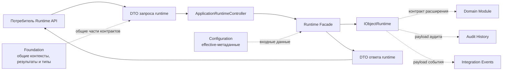

# Контракты — Object Runtime

[controller]: ../../../src/Platform/DMP.Platform.Runtime/Api/Controllers/ApplicationRuntimeController.cs
[requests]: ../../../src/Platform/DMP.Platform.Contracts/Runtime/Requests/
[responses]: ../../../src/Platform/DMP.Platform.Contracts/Runtime/Responses/
[entrypoint-response]: ../../../src/Platform/DMP.Platform.Contracts/Runtime/Responses/RuntimeEntryPointResponse.cs
[list-request]: ../../../src/Platform/DMP.Platform.Contracts/Runtime/Requests/RuntimeObjectListRequest.cs
[details-request]: ../../../src/Platform/DMP.Platform.Contracts/Runtime/Requests/RuntimeObjectDetailsRequest.cs
[create-defaults-request]: ../../../src/Platform/DMP.Platform.Contracts/Runtime/Requests/RuntimeObjectCreateDefaultsRequest.cs
[create-existing-request]: ../../../src/Platform/DMP.Platform.Contracts/Runtime/Requests/RuntimeObjectCreateFromExistingRequest.cs
[mutation-request]: ../../../src/Platform/DMP.Platform.Contracts/Runtime/Requests/RuntimeObjectMutationRequest.cs
[delete-request]: ../../../src/Platform/DMP.Platform.Contracts/Runtime/Requests/RuntimeObjectDeleteRequest.cs
[action-request]: ../../../src/Platform/DMP.Platform.Contracts/Runtime/Requests/RuntimeObjectActionRequest.cs
[bulk-request]: ../../../src/Platform/DMP.Platform.Contracts/Runtime/Requests/RuntimeObjectBulkActionRequest.cs
[lookup-request]: ../../../src/Platform/DMP.Platform.Contracts/Runtime/Requests/RuntimeLookupOptionsRequest.cs
[view-request]: ../../../src/Platform/DMP.Platform.Contracts/Runtime/Requests/ResolveRuntimeViewRequest.cs
[list-response]: ../../../src/Platform/DMP.Platform.Contracts/Runtime/Responses/RuntimeObjectListResponse.cs
[details-response]: ../../../src/Platform/DMP.Platform.Contracts/Runtime/Responses/RuntimeObjectDetailsResponse.cs
[mutation-response]: ../../../src/Platform/DMP.Platform.Contracts/Runtime/Responses/RuntimeObjectMutationResponse.cs
[action-response]: ../../../src/Platform/DMP.Platform.Contracts/Runtime/Responses/RuntimeObjectActionResponse.cs
[bulk-response]: ../../../src/Platform/DMP.Platform.Contracts/Runtime/Responses/RuntimeObjectBulkActionResponse.cs
[lookup-response]: ../../../src/Platform/DMP.Platform.Contracts/Runtime/Responses/RuntimeLookupOptionsResponse.cs
[view-response]: ../../../src/Platform/DMP.Platform.Contracts/Runtime/Responses/RuntimeViewResolveResponse.cs
[validation-response]: ../../../src/Platform/DMP.Platform.Contracts/Runtime/Responses/RuntimeValidationResponse.cs
[validation-issue]: ../../../src/Platform/DMP.Platform.Contracts/Runtime/Responses/RuntimeValidationIssueResponse.cs
[error-response]: ../../../src/Platform/DMP.Platform.Contracts/Runtime/Responses/RuntimeErrorResponse.cs
[filter-operators]: ../../../src/Platform/DMP.Platform.Contracts/Runtime/RuntimeListFilterOperators.cs
[execution-profiles]: ../../../src/Platform/DMP.Platform.Contracts/Runtime/RuntimeMutationExecutionProfiles.cs
[platform-headers]: ../../../src/Platform/DMP.Platform.Contracts/Runtime/PlatformHeaderNames.cs
[system-action-codes]: ../../../src/Platform/DMP.Platform.Contracts/Runtime/RuntimeSystemActionCodes.cs
[view-static-codes]: ../../../src/Platform/DMP.Platform.Contracts/Runtime/RuntimeViewStaticValueCodes.cs
[runtime-issue-codes]: ../../../src/Platform/DMP.Platform.Runtime/Application/Abstractions/Errors/RuntimeIssueCodes.cs
[descriptor]: ../../../src/Platform/DMP.Platform.Runtime/Application/Abstractions/Objects/ObjectRuntimeDescriptor.cs
[business-contract]: ../../../src/Platform/DMP.Platform.Runtime/Application/Abstractions/Objects/BusinessObjectContract.cs
[extension-store]: ../../../src/Platform/DMP.Platform.Runtime/Application/Abstractions/ObjectExtensions/IObjectExtensionValueStore.cs
[event-payload]: ../../../src/Platform/DMP.Platform.Contracts/IntegrationEvents/ObjectMutationCompletedIntegrationEventPayload.cs
[object-runtime]: ../../../src/Platform/DMP.Platform.Runtime/Application/Abstractions/Objects/IObjectRuntime.cs
[configuration-contracts]: ../02_configuration/03_contracts.md
[runtime-tests]: ../../../tests/DMP.Platform.IntegrationTests/Runtime/
[application-tests]: ../../../tests/DMP.Platform.IntegrationTests/Runtime/ApplicationRuntimeIntegrationTests.cs
[contract-tests]: ../../../tests/DMP.Platform.IntegrationTests/Runtime/ObjectMutationContractIntegrationTests.cs
[mutation-tests]: ../../../tests/DMP.Platform.IntegrationTests/Runtime/ObjectMutationPipelineIntegrationTests.cs
[foundation-overview]: ../00_foundation/00_platform_overview.md
[foundation-contracts]: ../00_foundation/03_contracts.md
[common-contracts]: ../../../src/Platform/DMP.Platform.Contracts/Common/
[message-resolver]: ../../../src/BuildingBlocks/DMP.BuildingBlocks.Application/Abstractions/IPlatformMessageResolver.cs
[message-implementation]: ../../../src/Platform/DMP.Platform.Runtime/Application/Services/Core/DefaultPlatformMessageResolver.cs

## 1. Назначение и границы

Документ описывает контракты, через которые потребитель обращается к Runtime API,
получает runtime-проекции и подключает стандартный Object Runtime. Единицей
подробного описания является один операционный, событийный или extension-контракт.

Документ не описывает schema `ObjectType`, `View` и `Action`. Configuration
владеет их канонической структурой и effective merge; здесь описано только то,
как runtime использует опубликованную конфигурацию и какие проекции возвращает.
фронтенд-платформа владеет компонентом отображения, состоянием интерфейса, подтверждением и
навигацией. Workflow, Rules, Audit History и Integration Events владеют своими
исполняемыми механизмами; Object Runtime описывает только передаваемый им
контракт и границу вызова.

`ApplicationRuntimeController` также содержит `POST api/runtime/outputs/generate`,
но этот endpoint и типы `GenerateOutputRequest`/`GenerateOutputResponse` относятся
к Reporting Output и в этот документ не входят.

## 2. Источники истины и владельцы

| Вид контракта | Источник структуры | Владелец | Потребитель |
| --- | --- | --- | --- |
| Общие контракты прикладного и транспортного слоя | [Foundation][foundation-contracts] и [`DMP.Platform.Contracts.Common`][common-contracts] | Foundation по общей форме; Object Runtime по применению | Runtime Facade, Object Runtime и его потребители |
| HTTP Runtime API | `ApplicationRuntimeController` и DTO Runtime Contracts | Object Runtime | Frontend Runtime и интеграционные клиенты |
| Runtime-проекция | `RuntimeViewResolveResponse` и типы ответа | Runtime Facade по форме; фронтенд-платформа по смыслу интерфейса | Frontend Runtime |
| Межкомпонентный C#-контракт исполнения | `IObjectRuntime` | Object Runtime | Runtime Facade, Rules, Reporting Output и компоненты формирования объектов |
| Данные события изменения (`payload`) | `ObjectMutationCompletedIntegrationEventPayload` | Object Runtime по форме; Integration Events по доставке | Потребители событий |
| Данные аудита (`payload`) | `ObjectMutationAuditDetails` | Object Runtime по форме; Audit History по хранению | Audit History |

Машинно читаемая форма находится в коде DTO и интерфейсов. Тесты подтверждают
маршруты, нормализацию, ошибки и поведение границ, но не заменяют объяснение
семантики полей. Общие контракты Foundation не переопределяются в этом
документе: здесь фиксируется только их использование в Object Runtime. ([контроллер][controller]; [requests][requests]; [responses][responses]; [foundation-contracts])

Object Runtime использует общий `IPlatformMessageResolver` для подготовки текста
runtime-проблем и проекций. Его форма и общее правило резервного текста описаны в [Foundation][foundation-contracts];
текущая реализация зарегистрирована в Runtime и приведена только как граница
использования, а не как новый общий контракт. ([порт разрешения сообщений][message-resolver];
[реализация разрешения сообщений][message-implementation])

## 3. Карта контрактов

| Контракт | Вид | Подробное описание |
| --- | --- | --- |
| `RuntimeEntryPointResponse` | HTTP-ответ | [4.1](#41-начальная-точка-runtime) |
| `RuntimeObjectListRequest` / `RuntimeObjectListResponse` | HTTP-операция | [4.2](#42-получение-списка-объектов) |
| `RuntimeObjectDetailsRequest` / `RuntimeObjectDetailsResponse` | HTTP-операция | [4.3](#43-получение-карточки-объекта) |
| `RuntimeObjectCreateDefaultsRequest` / `RuntimeObjectDetailsResponse` | HTTP-операция | [4.4](#44-начальные-значения-для-создания) |
| `RuntimeObjectCreateFromExistingRequest` / `RuntimeObjectCreateFromExistingResponse` | HTTP-операция | [4.5](#45-создание-на-основании-существующего-объекта) |
| `RuntimeObjectMutationRequest` / `RuntimeObjectMutationResponse` | HTTP-операция | [4.6](#46-создание-изменение-и-удаление) |
| `RuntimeObjectActionRequest` / `RuntimeObjectActionResponse` | HTTP-операция | [4.7](#47-действие-объекта) |
| `RuntimeObjectBulkActionRequest` / `RuntimeObjectBulkActionResponse` | HTTP-операция | [4.8](#48-групповое-действие) |
| `RuntimeLookupOptionsRequest` / `RuntimeLookupOptionsResponse` | HTTP-операция | [4.9](#49-значения-для-выбора) |
| `ResolveRuntimeViewRequest` / `RuntimeViewResolveResponse` | HTTP-операция | [4.10](#410-разрешение-представления) |
| `RuntimeValidationResponse` | Общий тип ответа | [5.1](#51-результат-проверки) |
| `RuntimeErrorResponse` | Ошибка HTTP API | [5.2](#52-ошибка-запроса) |
| `IObjectRuntime` | Контракт точки расширения C# | [6.1](#61-iobjectruntime) |
| `IObjectExtensionValueStore` | Контракт точки расширения C# | [6.3](#63-iobjectextensionvaluestore) |
| `ObjectMutationCompletedIntegrationEventPayload` | Данные события (`payload`) | [7.1](#71-событие-завершения-изменения) |



Схема показывает границы контрактов и их владельцев. Она не заменяет таблицы
полей запросов и ответов: их подробная структура остаётся в подразделах
операций и общих DTO.

## 4. HTTP-контракты

Единицей описания HTTP является операция: маршрут, запрос, ответ и ошибки
находятся в одном подразделе.

Для всех маршрутов `api/runtime` действует общий транспортный контекст:

| Заголовок | Формат и обязательность | Смысл |
| --- | --- | --- |
| `X-Tenant-Id` | `Guid`, обязателен | Идентификатор tenant, в границах которого выполняется запрос. |
| `X-User-Id` | `Guid`, обязателен | Идентификатор пользователя запроса. |
| `X-Site-Id` | `Guid`, необязателен | Дополнительная граница site. |
| `X-Role-Codes` | Строка кодов через запятую, необязателен | Коды ролей; значения обрезаются, дубли исключаются без учёта регистра. |
| `X-Correlation-Id` | Строка, необязателен | Идентификатор корреляции; если заголовок отсутствует, сервер создаёт его и возвращает в ответе. |
| `Accept-Language` | Стандартный заголовок, необязателен | Первый указанный язык запроса используется как резервный язык runtime. |

`X-Tenant-Id` и `X-User-Id` обязательны для runtime-маршрутов; middleware
отклоняет отсутствующие или некорректные значения до вызова controller.
Семантика tenant, пользователя и ролей принадлежит Tenant Security, а имена
транспортных заголовков и их передача в runtime-контекст подтверждены
`PlatformRequestContextMiddleware` и [`PlatformHeaderNames`][platform-headers].
([middleware](../../../src/Platform/DMP.Platform.Runtime/Context/PlatformRequestContextMiddleware.cs))

### 4.1. Начальная точка Runtime

#### Назначение и владелец

Начальная точка выбирается Runtime API из зарегистрированных точек входа.

#### Маршрут и запрос

`GET api/runtime/entry-point` не принимает тело запроса и возвращает первую
зарегистрированную начальную точку. Ответ [RuntimeEntryPointResponse][entrypoint-response]:

#### Ответ

| Поле | Тип | Nullable | Смысл |
| --- | --- | --- | --- |
| `ModuleCode` | `string` | Да | Модуль начального типа объекта |
| `ObjectTypeCode` | `string` | Да | Начальный тип объекта |
| `ViewCode` | `string` | Да | Начальное представление |
| `MenuCode` | `string` | Да | Меню открытия runtime |

Если начальная точка не зарегистрирована, коды объекта пусты, а `MenuCode` получает
стандартный runtime web menu. ([контроллер][controller]; [тесты][application-tests])

#### Ошибки и ограничения

Отсутствие зарегистрированной точки входа не считается ошибкой: controller возвращает
ответ с пустыми кодами объекта. Порядок зарегистрированных точек входа влияет на
выбранный ответ.

### 4.2. Получение списка объектов

#### Назначение и владелец

Операция возвращает страницу строк набора данных объекта. Контрактом владеет
Object Runtime; прикладной модуль владеет источником данных.

#### Маршрут и запрос

`POST api/runtime/objects/{objectTypeCode}/list` принимает
[RuntimeObjectListRequest][list-request] и возвращает
[RuntimeObjectListResponse][list-response].

| Поле запроса | Тип | Nullable | Default | Смысл и ограничения |
| --- | --- | --- | --- | --- |
| `ModuleCode` | `string` | Нет | — | Модуль-владелец |
| `ObjectTypeCode` | `string` | Нет | — | Тип объекта |
| `DatasetCode` | `string` | Нет | — | Набор данных списка |
| `ViewCode` | `string` | Да | `null` | Контекст представления |
| `LanguageCode` | `string` | Да | `null` | Язык отображаемых значений |
| `Page` / `PageSize` | `int` | Нет | `1` / `25` | Страница и её размер |
| `Filters` | `IReadOnlyCollection<RuntimeListFilterRequest>` | Да | `null` | Поддержанные фильтры |
| `GroupByItems` / `SortByItems` | Коллекции | Да | `null` | Группировка и сортировка |
| `AggregateItems` | Коллекция | Да | `null` | Запрошенные агрегаты |
| `RequestedFields` | `IReadOnlyCollection<string>` | Да | `null` | Ограничение полей |
| `ParentNodeId` / `HierarchyScope` | `string` / тип запроса | Да | `null` | Контекст иерархии |
| `WorkflowCode` / `EmbeddedCollectionContext` | `string` / тип запроса | Да | `null` | Контекст выполнения |
| `ReferenceLookupContext` | тип запроса | Да | `null` | Контекст ссылочного lookup |
| `IncludeDeleted` / `IncludeArchived` / `TreeRequested` | `bool` | Нет | `false` | Специальные режимы чтения |

#### Ответ

Ответ содержит `Items`, `TotalCount`, применённые `Page`/`PageSize`, а также
необязательные `GroupSummaries`, `AggregateResults`, `AppliedSort` и
`AppliedFilters`. Строка содержит `Id`, `ObjectTypeCode`, `Values`, необязательные
`DisplayValues`, `LookupDisplay` и `IsReadOnly`.

`RuntimeListFilterRequest` содержит код параметра, оператор, одно или несколько
значений, порядок, источник и поля поиска. Полный список операторов задаёт
`RuntimeListFilterOperators`; неподдержанные поле, оператор, сортировка,
группировка или агрегат отклоняются. ([list request][list-request]; [list response][list-response]; [filter-operators][filter-operators])

#### Ошибки и ограничения

Неизвестный объект или набор данных, неподдержанные поле, оператор, сортировка,
группировка или агрегат отклоняются с причиной, которую возвращает общая модель
ошибки runtime. Агрегаты присутствуют в форме запроса и ответа, но текущая
реализация их не выполняет.

Минимальный пример запроса и ответа показывает только обязательный контекст
операции и форму строки. Значения `TestModule`, `TestObject` и
`TestObject_List` являются поясняющими, а не общими кодами платформы:

```json
{
  "ModuleCode": "TestModule",
  "ObjectTypeCode": "TestObject",
  "DatasetCode": "TestObject_List",
  "Page": 1,
  "PageSize": 25
}
```

```json
{
  "Items": [
    {
      "Id": "42",
      "ObjectTypeCode": "TestObject",
      "Values": {
        "Code": "T-0042",
        "Name": "Пример объекта"
      },
      "IsReadOnly": false
    }
  ],
  "TotalCount": 1,
  "Page": 1,
  "PageSize": 25
}
```

### 4.3. Получение карточки объекта

#### Назначение и владелец

Операция возвращает значения одной записи и связанные runtime-проекции.

#### Маршрут и запрос

`POST api/runtime/objects/{objectTypeCode}/details` принимает
[RuntimeObjectDetailsRequest][details-request]. Маршрут `objectTypeCode` должен
совпадать с `request.ObjectTypeCode`; при несовпадении возвращается `BadRequest`.

| Поле запроса | Тип | Nullable | Default | Смысл |
| --- | --- | --- | --- | --- |
| `ModuleCode` / `ObjectTypeCode` / `Id` | `string` | Нет | — | Идентичность объекта |
| `ViewCode` / `LanguageCode` | `string` | Да | `null` | Контекст проекции |
| `RequestedFields` | `IReadOnlyCollection<string>` | Да | `null` | Запрошенные поля |
| `WorkflowCode` / `OperationMode` | `string` | Да | `null` | Контекст операции |
| `EmbeddedCollectionContext` | тип запроса | Да | `null` | Вложенная коллекция |
| `IncludeDeleted` / `IncludeArchived` | `bool` | Нет | `false` | Запрос специальных строк |

#### Ответ

`RuntimeObjectDetailsResponse` возвращает `Id`, `ObjectTypeCode`, `Values`,
`Display`, доступные `Actions`, необязательные `DisplayValues` и проекцию
workflow. Полная форма ответа задана [кодом][details-response].

#### Ошибки и ограничения

Несовпадение типа объекта в маршруте и запросе возвращает `BadRequest`; неизвестное
описание и ошибки источника обрабатываются общей моделью ошибок runtime.

### 4.4. Начальные значения для создания

#### Назначение и владелец

Операция подготавливает значения новой записи без сохранения.

#### Маршрут и запрос

`GET api/runtime/objects/{objectTypeCode}/create-defaults` и
`POST api/runtime/objects/{objectTypeCode}/create-defaults` возвращают
`RuntimeObjectDetailsResponse` без сохранения объекта. GET принимает параметры
в query, POST — [RuntimeObjectCreateDefaultsRequest][create-defaults-request].

| Поле | Тип | Nullable | Default | Смысл |
| --- | --- | --- | --- | --- |
| `ModuleCode` | `string` | Нет | — | Модуль-владелец |
| `ViewCode` / `LanguageCode` | `string` | Да | `null` | Контекст проекции |
| `RequestedFields` | `IReadOnlyCollection<string>` | Да | `null` | Ограничение полей |
| `EmbeddedCollectionContext` | тип запроса | Да | `null` | Контекст вложенной коллекции |

Начальные значения объединяются из контракта объекта, поставщика и явных
источников. Неявные примитивные значения, включая `false`, не добавляются.

#### Ответ, ошибки и ограничения

Ответом является карточка с подготовленными значениями и пустым `Id`. Неизвестное
описание или неподдерживаемое создание отклоняются общей моделью ошибок runtime.
Отсутствие значения не означает автоматическое добавление значения типа CLR.

### 4.5. Создание на основании существующего объекта

#### Назначение и владелец

Операция подготавливает новую несохранённую запись из исходной записи.

#### Маршрут и запрос

`POST api/runtime/objects/{objectTypeCode}/create-from-existing` принимает
[RuntimeObjectCreateFromExistingRequest][create-existing-request] с
`ModuleCode`, `SourceId`, необязательными `ViewCode`, `LanguageCode`,
`RequestedFields`, `WorkflowCode` и `EmbeddedCollectionContext`. Ответ содержит
`SourceId` и подготовленный
`RuntimeObjectDetailsResponse`.

#### Ответ, ошибки и ограничения

Ответ содержит исходный идентификатор и подготовленную карточку без сохранения.
Отключённый сценарий, неподдерживаемый перенос коллекции или отсутствие исходной
записи отклоняются. Специальная политика переопределения значений направлена как
будущая доработка в [трассировке](90_traceability.md): `ORT-DEC-05 — владелец
переопределений при создании на основании существующего`.

### 4.6. Создание, изменение и удаление

#### Назначение и владелец

Операции изменяют состояние объекта через общий контракт изменения.

#### Маршрут и запрос

Создание выполняется через `POST api/runtime/objects/{objectTypeCode}`,
изменение — через `PUT api/runtime/objects/{objectTypeCode}/{id}`, удаление —
через `DELETE api/runtime/objects/{objectTypeCode}/{id}`.

[RuntimeObjectMutationRequest][mutation-request] содержит `ModuleCode`,
`ObjectTypeCode`, `ViewCode`, `OperationMode`, `Values`, необязательными
`ConcurrencyToken`, `ExecutionProfileCode`, `WorkflowCode` и
`EmbeddedCollectionContext`. Runtime разделяет `Values` на скалярные значения и
значения коллекций.
Профили: `Standard`, `Bulk`, `Import`, `Maintenance`; неизвестный профиль
блокирует операцию. ([execution profiles][execution-profiles])

`RuntimeObjectDeleteRequest` использует контекст удаления, включая `ViewCode`,
маркер конкурентности, профиль выполнения и `WorkflowCode`. ([delete request][delete-request])

#### Ответ, ошибки и ограничения

Ответ [RuntimeObjectMutationResponse][mutation-response] содержит `Id`,
`RuntimeValidationResponse` и новый `ConcurrencyToken`; полная сохранённая
карточка в этом ответе не возвращается.

Неизвестный профиль, ошибка проверки, конфликт конкурентности или нарушение
ограничений объекта блокируют успешное изменение. Полная карточка после изменения
загружается отдельной операцией.

### 4.7. Действие объекта

#### Назначение и владелец

Операция запускает действие, объявленное исполняемым описанием объекта.

#### Маршрут и запрос

`POST api/runtime/objects/{objectTypeCode}/{id}/actions/{actionCode}` принимает
[RuntimeObjectActionRequest][action-request] с идентичностью объекта, `ActionCode`,
необязательными `ViewCode`, `Parameters`, профилем выполнения, контекстом workflow
и `EmbeddedCollectionContext`. Для action, размещённого во встроенной коллекции,
контекст содержит владельца и код коллекционного поля; его `OwnerObjectId` может
использоваться предметным handler для создания дочерних строк.
Ответ [RuntimeObjectActionResponse][action-response] содержит `ActionCode`,
результат проверки и необязательный `Result`. Форму результата определяют действие и
прикладной модуль.

#### Ответ, ошибки и ограничения

Форма `Result` определяется конкретным действием и не является общей схемой
Object Runtime. Неизвестное действие, неподдерживаемый режим или ошибка параметров
возвращаются как ошибка запроса или результат проверки.

### 4.8. Групповое действие

#### Назначение и владелец

Операция запускает одно действие для явно выбранных объектов.

#### Маршрут и запрос

`POST api/runtime/objects/{objectTypeCode}/bulk-actions/{actionCode}` принимает
[RuntimeObjectBulkActionRequest][bulk-request]. В текущем контракте
`Selection.ObjectIds` задаёт явный список объектов; выборка по фильтру не входит
в реализованный контракт.

Ответ [RuntimeObjectBulkActionResponse][bulk-response] содержит `ActionCode`,
статус `Succeeded`, `Rejected`, `PartiallySucceeded` или `Accepted`, результат проверки,
счётчики `RequestedCount`, `ProcessedCount`, `SucceededCount`, `FailedCount`,
результаты по объектам, общий `Result` и необязательный `OperationId`.

#### Ответ, ошибки и ограничения

Пустая выборка, обычное действие или отсутствие обработчика приводят к отклонённому
ответу. Текущий контракт поддерживает только явные `ObjectIds`; выборка по фильтру
и гарантии промышленного профиля импорта остаются в [трассировке](90_traceability.md).

### 4.9. Значения для выбора

#### Назначение и владелец

Операция возвращает варианты для ссылочных полей и наборов значений.

#### Маршрут и запрос

`POST api/runtime/lookups/options` принимает [RuntimeLookupOptionsRequest][lookup-request]
и возвращает [RuntimeLookupOptionsResponse][lookup-response]. Запрос выбирает
источник через `LookupSourceCode`, `ValueSetCode`, `LookupViewCode` или ссылочную
конфигурацию и может содержать `Query`, `ParentValue`, `LookupPrefilter`,
`ContextValues`, `Page` и `SelectedValues`.

Каждый `RuntimeLookupOptionResponse` содержит `Value`, `Label`, необязательные
`Code`, `Title`, `Subtitle`, `ParentValue`, `Path`, `Level`, `HasChildren`, а для
ссылочного объекта также `ModuleCode` и `ObjectTypeCode`. Для `AbstractReferenceOnly`
runtime находит concrete-описания и проверяет право просмотра каждого типа.

#### Ответ, ошибки и ограничения

Ответ содержит подпись и, для ссылки, тип целевого объекта. Неизвестный источник,
тип объекта или недоступный тип исключаются из результата либо приводят к ошибке
запроса согласно выбранному источнику. Для `AbstractReferenceOnly` абстрактное
описание не становится целью изменения.

### 4.10. Разрешение представления

#### Назначение и владелец

Операция собирает серверную runtime-проекцию представления из опубликованных
метаданных и исполняемого описания объекта.

#### Маршрут и запрос

`POST api/runtime/views/resolve` принимает [ResolveRuntimeViewRequest][view-request]
с модулем, типом объекта, `ViewCode`, необязательными `LanguageCode`,
`OperationMode`, tenant/site, `MenuCode`, `Parameters`, `WorkflowCode` и
`EmbeddedCollectionContext`.

Верхний уровень [RuntimeViewResolveResponse][view-response] содержит `View`,
`Object`, необязательный `List`, `Elements`, `Layout`, `DataRequirements`, `Actions`,
`OutputLaunchBindings`, `Lookups`, `ValueSets`, `LocalBehaviors`, `Permissions`,
необязательные `Menu`, `Workflow` и `ActionMenuSections`. Полный состав вложенных
response-типов задан исходным файлом; ниже фиксируется их контрактная роль:

#### Ответ

| Группа | Что описывает |
| --- | --- |
| `RuntimeViewDefinitionResponse` | Идентичность и тип представления |
| `RuntimeObjectDefinitionResponse` | Идентичность объекта, свойства, коллекции и проекция иерархии |
| `RuntimeListDefinitionResponse` | Набор данных, постраничная выдача, параметры запроса, колонки и поведение списка |
| `RuntimeActionDefinitionResponse` | Действие, видимость и доступность, запуск, подтверждение и обработка результата |
| `RuntimeLookupDefinitionResponse` / `RuntimeValueSetDefinitionResponse` | Источники ссылочных значений и наборы значений |
| `RuntimeLayoutNodeResponse` / `RuntimeViewElementResponse` | Структура размещения и элементы представления |
| `RuntimeWorkflowProjectionResponse` | Состояние, команды и ограничения workflow |
| `RuntimeOutputLaunchBindingResponse` | Доступная из представления команда формирования output и параметры её запуска; схема и генерация принадлежат Reporting Output, Object Runtime передаёт binding в runtime-проекции |
| `RuntimeLocalBehaviorResponse` / `RuntimeMemberBehaviorResponse` | Условия и эффекты локального поведения представления или члена; эффективные метаданные (`effective configuration`) принадлежат Configuration, применение в интерфейсе — фронтенд-платформа |
| `RuntimeMenuDefinitionResponse` / `RuntimeNavigationItemResponse` | Проекция меню и его пунктов; структура принадлежит Configuration, навигация — фронтенд-платформа |
| `RuntimeActionMenuSectionResponse` | Группа размещения действий; эффективные метаданные (`effective configuration`) принадлежат Configuration, отображение — фронтенд-платформа |

Поля `RuntimeActionDefinitionResponse` являются effective-проекцией configuration.
Схема `Action` принадлежит Configuration, а подтверждение,
навигация и состояние интерфейса — фронтенд-платформа.

#### Ошибки и ограничения

Неизвестное представление, объект или недоступная операция отклоняются фасадом
runtime. Это серверная проекция: она не заменяет схему `View`, компонент отображения
или состояние интерфейса.

## 5. Общие типы и DTO

### 5.1. Результат проверки

#### Назначение

`RuntimeValidationResponse` передаёт результат проверки запроса или операции.

#### Где используется

Тип входит в ответы изменения, действия и группового действия; его элементы
также могут использоваться при формировании ошибки запроса.

#### Структура

`RuntimeValidationResponse` содержит `IsValid` и `Issues`.

| Путь или поле | Тип | Nullable | Обязательность/default | Смысл |
| --- | --- | --- | --- | --- |
| `IsValid` | `bool` | Нет | Обязательное | Нет блокирующей проблемы |
| `Issues` | `IReadOnlyCollection<RuntimeValidationIssueResponse>` | Нет | Обязательное | Список проблем |

Поля каждого элемента `Issues[]` представлены типом
`RuntimeValidationIssueResponse`:

| Путь или поле | Тип | Nullable | Обязательность/default | Смысл |
| --- | --- | --- | --- | --- |
| `Severity` | `string` | Нет | Обязательное | Уровень проблемы |
| `Code` | `string` | Нет | Обязательное | Стабильный код проверки |
| `Message` | `string` | Нет | Обязательное | Текст проблемы |
| `FieldCode` / `Path` | `string` | Да | `null` | Поле или путь во вложенной структуре |
| `MessageTemplateCode` | `string` | Да | `null` | Код шаблона |
| `Args` | `IReadOnlyDictionary<string, object?>` | Да | `null` | Аргументы шаблона |
| `InvalidValue` | `object` | Да | `null` | Значение, не прошедшее проверку |
| `FallbackMessage` | `string` | Да | `null` | Резервный текст при отсутствии локализованного сообщения |

#### Ограничения и совместимость

`IsValid` остаётся `false`, если есть блокирующая проблема. Добавление необязательных
полей совместимо при сохранении смысла существующих полей и кодов.

### 5.2. Ошибка запроса

#### Назначение

`RuntimeErrorResponse` описывает отказ HTTP-операции, который не возвращается как
обычный результат проверки.

#### Где используется

Тип формируется из `RuntimeRequestException` и используется общей обработкой
исключений Runtime API.

#### Структура

| Путь или поле | Тип | Nullable | Обязательность/default | Смысл |
| --- | --- | --- | --- | --- |
| `Code` | `string` | Нет | Обязательное | Стабильный код ошибки |
| `Message` | `string` | Нет | Обязательное | Текст ошибки |
| `CorrelationId` | `string` | Нет | Обязательное | Идентификатор корреляции |
| `Field` | `string` | Да | `null` | Поле, к которому относится ошибка |
| `Details` | `IReadOnlyCollection<RuntimeErrorDetailResponse>` | Да | `null` | Дополнительные причины |
| `MessageTemplateCode` | `string` | Да | `null` | Код шаблона сообщения |
| `Args` | `IReadOnlyDictionary<string, object?>` | Да | `null` | Аргументы шаблона |
| `FallbackMessage` | `string` | Да | `null` | Резервный текст |

Поля каждого элемента `Details[]`:

| Путь или поле | Тип | Nullable | Обязательность/default | Смысл |
| --- | --- | --- | --- | --- |
| `Code` | `string` | Нет | Обязательное | Код дополнительной причины |
| `Message` | `string` | Нет | Обязательное | Текст дополнительной причины |
| `Field` / `Path` | `string` | Да | `null` | Поле или путь дополнительной причины |

#### Ограничения и совместимость

`RuntimeRequestException` является C#-источником этих значений. Неизвестный
объект, набор данных или действие, несоответствие маршрута и запроса,
неподдержанный фильтр, отсутствие права и конфликт конкурентности должны
различаться по причине. Удаление поля, изменение его обязательности или смысла
требует проверки потребителей.

`MessageTemplateCode`, `Args` и `FallbackMessage` передают данные для общего
механизма подготовки сообщения, но не переносят в Object Runtime каталог всех
платформенных шаблонов. Коды `RuntimeIssueCodes.MessageTemplates` и их смысл
принадлежат Object Runtime; общий resolver и типы шаблонов принадлежат Foundation.

### 5.3. Стабильные коды runtime-проекции и операций

Эти значения передаются внутри DTO и не являются отдельными объектами схемы.
Они перечислены здесь, потому что потребитель должен различать их по точному
коду. Компонент отображения и навигационное поведение остаются у Frontend
Platform.

| Группа | Коды |
| --- | --- |
| Вид привязки представления (`RuntimeViewBindingKindCodes`) | `ObjectProperty`, `Collection` |
| Семантическая роль привязки (`RuntimeViewSemanticRoleCodes`) | `ActorDisplay`, `TechnicalData`, `IncludeArchived` |
| Системные действия (`RuntimeSystemActionCodes`) | `__runtime_refresh`, `__runtime_create`, `__runtime_create_from_existing`, `__runtime_row_edit`, `__runtime_open_view`, `__runtime_back_to_list`, `__runtime_edit`, `__runtime_save_create`, `__runtime_save_create_and_close`, `__runtime_cancel_create`, `__runtime_save_edit`, `__runtime_save_edit_and_close`, `__runtime_cancel_edit`, `__runtime_delete`, `Archive`, `Restore`, `__runtime_collection_add`, `__runtime_collection_edit`, `__runtime_collection_delete`, `__runtime_collection_link`, `__runtime_collection_unlink` |

Стабильные коды фильтров и профилей изменения раскрыты в описаниях операций;
их источники — [`RuntimeListFilterOperators`][filter-operators] и
[`RuntimeMutationExecutionProfiles`][execution-profiles]. Коды ошибок и
шаблонов сообщений определены в [`RuntimeIssueCodes`][runtime-issue-codes];
документ фиксирует их семантические группы в разделе 8, а не дублирует полный
исходный каталог констант. Источник кодов привязки и семантических ролей —
[`RuntimeViewStaticValueCodes`][view-static-codes], источник системных действий —
[`RuntimeSystemActionCodes`][system-action-codes].

## 6. C#-контракты и точки расширения

Object Runtime использует общие application-контракты Foundation, но отдельным
контрактом этой области является только граница, которую реально потребляют
другие компоненты. `IObjectRuntime` описывается ниже как межкомпонентный
контракт Object Runtime. `IObjectRuntimeDescriptorRegistry`,
`ObjectMutationRequest`, `ObjectMutationContext` и `ObjectMutationPipeline` не
переносятся в Foundation: это внутренние типы и механизмы Object Runtime,
описанные в [исполнении](04_runtime.md).

### 6.1. `IObjectRuntime`

`IObjectRuntime` предоставляет регистрацию исполняемых описаний, разрешение
обычного и concrete-типа, чтение и операции изменения. Его потребители в
текущем коде — `ApplicationRuntimeService`, шлюз Rules, разрешение вложенных
коллекций и запрос набора данных для Reporting Output. Поэтому это
межкомпонентный контракт платформы: его семантика должна быть понятна
потребителям, хотя он не является внешним HTTP-форматом и не требует сохранения
C#-имён при переходе на Java.

| Функциональная группа | Члены контракта | Потребитель | Стабильное правило |
| --- | --- | --- | --- |
| Разрешение описаний | `GetRegisteredObjects`, `TryGetDescriptor`, `GetRequiredDescriptor`, `GetConcreteDescriptors` | Runtime Facade и внутренние сервисы runtime | Идентичность объекта разрешается единообразно; неизвестный объект не маскируется под найденный |
| Чтение | `LoadListAsync`, `LoadDetailsAsync`, `LoadCreateDefaultsAsync` | Runtime Facade, Rules, компоненты формирования объектов | Принимаются DTO runtime-контрактов и возвращаются соответствующие ответы runtime |
| Изменение | `CreateAsync`, `UpdateAsync`, `DeleteAsync`, `ExecuteActionAsync` | Runtime Facade и Reporting Output через запрос runtime | Ошибки проверки и выполнения сохраняют различимую семантику; изменение проходит общий runtime-конвейер |

Вызов `IObjectRuntime` не заменяет проверку доступа фасадом и не предоставляет
потребителю прямой доступ к хранилищу.

### 6.2. Структура `BusinessObjectContract<T>`

`BusinessObjectContract<T>` — кодовый контракт, через который Object Runtime
получает описание типа бизнес-объекта. В параметре `T` указывается тип
прикладного объекта, к которому привязаны чтение и изменение записи. Контракт
не является HTTP-форматом, таблицей хранения или конфигурационным артефактом.
Его `Build()` собирает `BusinessObjectContractDefinition`, а из этого
определения строится `ObjectRuntimeDescriptor`.

Ниже приведена компактная карта публичного регистрационного API. Она показывает
точные имена методов из `BusinessObjectBuilder<TBusinessObject>` и смысл их
параметров, но не является полным справочником всех вложенных builder-методов.
Русская первая колонка объясняет назначение группы, а технические имена и типы
во второй колонке сохраняются без перевода.

| Смысловая группа | Точные методы и типы кода | Ключевые параметры | Результат для определения и runtime | Ограничения | Состояние сведения |
| --- | --- | --- | --- | --- | --- |
| Жизненный цикл контракта | Свойство `BusinessObjectContract<T>.AggregateType`; `BusinessObjectContract<T>.Configure(...)`, `BusinessObjectContract<T>.Build()`, `BusinessObjectBuilder<TBusinessObject>.Build()` | Тип `TBusinessObject`, построитель конфигурации | Создаёт `BusinessObjectContractDefinition`, из которого строится `ObjectRuntimeDescriptor` | `Configure` только объявляет метаданные runtime; бизнес-логика здесь не выполняется | Подтверждено MVP |
| Идентичность | `Module(string)`, `ObjectType(string)` | Код модуля, код типа объекта | Формирует ключ регистрации описания | Коды нормализуются и проверяются при сборке | Подтверждено MVP |
| Ключ и область записи | `Key<TValue>(...)`, `InheritedKey<TValue>(...)`, `Tenant<TValue>(...)`, `ConcurrencyToken<TValue>(...)` | Код члена и `Expression<Func<TBusinessObject, TValue>>` | Определяет ключ записи, tenant-ограничение и маркер конкурентности | Ключевые и системные члены не задаются как обычные изменяемые поля | Подтверждено, но ограничено возможностями хранилища |
| Наследование | `BaseObjectType(...)`, `BaseObject<TBaseContract>()`, `StoredInBaseTable<TBaseContract>(...)`, `DisableInheritedAction(...)`, `DisableInheritedValidator<TValidator>()`, `DisableInheritedLifecycle<TLifecycleHandler>()`, `DisableInheritedDefaultValue(...)`, `DisableInheritedDefaultProvider<TProvider>()` | Код базового типа, базовый контракт, код дискриминатора | Добавляет унаследованные члены, действия, проверки и значения по умолчанию | Наследование runtime-описания не заменяет наследование схемы Configuration | Подтверждено MVP |
| Члены объекта | `Member<TValue>(...)`, `TimeAmountMember(...)`, `ComputedMember<TValue>(...)`, `VirtualMember<TValue>(...)` | Код члена, accessor, тип значения, настройки `ObjectMemberBuilder` | Формирует обычные, вычисляемые и виртуальные члены (`native`, `computed`, `virtual`) описания | CLR-доступ и производные значения не становятся свойствами артефакта Configuration | Подтверждено MVP |
| Ссылки и наборы значений | `ReferenceMember<TValue>(...)`, `ValueSetMember<TValue>(...)` | Код члена, accessor, целевые коды `module`, `object`, `key` или `valueSetCode`, настройки выбора | Формирует ссылочный член или член, связанный с набором значений | Ссылка на объект и привязка к набору значений имеют разную семантику | Подтверждено MVP |
| Коллекции | `AggregateCollection<TValue>(...)`, `AssociationCollection<TValue>(...)` и `ObjectCollectionMemberBuilder` | Код коллекции, accessor, `TargetObject(...)`, `ParentLinkMember(...)`, `SaveMode(...)`, `DeleteBehavior(...)`, `MissingItemBehavior(...)` | Определяет агрегированную или ассоциированную коллекцию и порядок её изменения | `Aggregate` и `Association` имеют разные правила владения и удаления | Подтверждено MVP |
| Наборы данных | `Dataset(...)` и `ObjectDatasetBuilder` | Код набора, `List()`, `Lookup()`, `Details()`, `Filtering()`, `Sorting()`, `Grouping()` | Определяет доступные режимы чтения объекта | Реализованные возможности набора данных ограничены текущим runtime | Подтверждено, но ограничено |
| Действия | `Action(...)` и `ObjectActionBuilder` | Код действия, область `Object()`, `Selection()` или `Bulk()`, `Handler(...)`, `Command(...)`, `MutationPlanner(...)` | Связывает действие с обработчиком, командой или планировщиком изменения | Схема действия принадлежит Configuration, исполнение — Object Runtime | Подтверждено MVP |
| Проверки и жизненный цикл | `Validator<TValidator>(int order = 0)`, `Lifecycle<TLifecycleHandler>(int order = 0)` | Тип обработчика, порядок выполнения | Подключает проверки и обработчики к конвейеру изменения | Предметная семантика проверки остаётся у прикладного модуля | Подтверждено MVP |
| Состояние и расширяемые поля | `Stateful(...)`, `SupportsExtensions(...)`, `ObjectStateBuilder`, `ObjectExtensionBuilder` | Код члена состояния, признак виртуального члена (`virtual`), фильтрация и сортировка расширяемых значений | Подключает привязку состояния Workflow (`state binding`) и механизм расширяемых значений | Реализация расширяемого хранилища принадлежит прикладному модулю | Подтверждено, но ограничено |
| Хранилище и сопоставление | `Repository<TRepository>(...)`, `WriteStorage<TStorageUnit>()`, `StorageAdapter<TAdapter>()`, `Mapping(...)` | Тип хранилища, корень запроса (`query root`), единица хранения (`storage unit`), адаптер (`adapter`) и политика сопоставления (`mapping policy`) | Связывает runtime-описание с чтением и записью прикладного модуля | Object Runtime не создаёт общей таблицы бизнес-объектов | Подтверждено MVP |
| Значения по умолчанию | `GenerateDefaults(...)` и `ObjectDefaultsBuilder` | `Value(memberCode, value)`, `Provider<TProvider>()` | Формирует значения новой записи до сохранения | Явные значения запроса имеют приоритет по правилам runtime | Подтверждено MVP |
| Создание на основании и представление | `CreateFromExisting(...)`, `Presentation(...)`, `ObjectPresentationBuilder` | Область переноса, поля отображения (`display fields`), формат (`format`) и способ хранения имени | Определяет перенос разрешённых значений и отображаемое имя | Отображение не требует физического поля; специальная политика переопределений ограничена | Подтверждено, но ограничено |
| Управление, полиморфизм и иерархия | `Management(...)`, `AbstractReferenceOnly()`, `Discriminator(...)`, `Hierarchy(...)` и `ObjectHierarchyBuilder` | Управление удалением/архивом, член дискриминатора (`discriminator member`), поля `parent`, `root`, `level`, `path`, `has-children`, `PreventCycles(...)` | Определяет системные операции, TPH и правила дерева | Runtime управляет системными полями и не принимает их как обычные значения запроса | Подтверждено MVP |

Некоторые блоки содержат только производные runtime-значения или технические
значения. Тип `T`, CLR-доступ, тип сервиса (`service type`), обработчик записи
(`writer`), поставщик (`provider`) и сопоставление (`mapping`) не становятся
свойствами конфигурационного артефакта и не должны переноситься в таблицы свойств
`ObjectType`. Аналогично, `ObjectRuntimeDescriptor` является производным
неизменяемым описанием, а не второй точкой объявления контракта.

Минимальная логическая схема контракта выглядит так:

```text
BusinessObjectContract<T>
  -> идентичность, базовый тип, ключ, tenant, конкурентность
  -> члены, ссылки, коллекции, наборы данных
  -> действия, проверки, обработчики жизненного цикла, привязка состояния
  -> хранилище, сопоставление, значения по умолчанию, создание на основании
  -> представление, управление, правила возможностей
  -> полиморфизм, иерархия
  -> BusinessObjectContractDefinition
  -> ObjectRuntimeDescriptor
```

Базовая конфигурация (`baseline`) и артефакт `ObjectType` находятся за пределами этого кодового
контракта. Object Runtime может сопоставлять опубликованные configuration
метаданные с `ObjectRuntimeDescriptor` и отклонять несовместимую комбинацию, но
свойства baseline не являются дополнительными полями `BusinessObjectContract<T>`.

### 6.3. `IObjectExtensionValueStore`

`IObjectExtensionValueStore` — межкомпонентный контракт между Object Runtime и
прикладным модулем, который хранит дополнительные значения объекта. Он нужен
только объектам, объявившим поддержку расширяемых полей. Object Runtime
вызывает этот контракт для чтения и записи, а прикладной модуль владеет
хранилищем, типизированными ограничениями и транзакционной реализацией.
([extension-store][extension-store])

| Метод или член | Параметры | Результат | Предусловия | Исключения | Побочные эффекты | Транзакция |
| --- | --- | --- | --- | --- | --- | --- |
| `Descriptor` | — | `ObjectExtensionValueStoreDescriptor` | Хранилище (`store`) зарегистрировано для пары module/object type | Ошибка регистрации или несовместимая пара кодов | Нет | Нет |
| `GetValuesAsync` | `ObjectExtensionValueQuery` | Коллекция `ObjectExtensionValue` | Запрос относится к зарегистрированному объекту | Ошибка чтения хранилища | Нет изменения данных | В пределах реализации хранилища |
| `QueryListAsync` | `ObjectExtensionValueListQuery` с фильтрами, сортировкой и группировкой | `ObjectExtensionValueListQueryResult` с идентификаторами владельцев (`owner ids`) и сводками | Хранилище объявляет поддержку соответствующих полей и операторов | Неподдержанный оператор или ошибка чтения | Нет изменения данных | В пределах реализации хранилища |
| `ApplyValuesAsync` | `ObjectExtensionValueWriteRequest` с идентификатором владельца (`owner id`) и значениями | Применённые `ObjectExtensionValue` | Хранилище зарегистрировано; значения прошли подготовку runtime | Ошибка проверки или записи | Создание, обновление или удаление расширяемых значений | В общей границе обработчика записи (`mutation writer`), если она настроена |

`ObjectExtensionValue` содержит owner id, код атрибута, тип значения и значение.
Поддерживаемые типы `String`, `Number`, `Boolean`, `Date`, `DateTime`,
`Reference` и `Json` являются техническими значениями runtime-контракта.
Коды атрибутов и правила их применения приходят из опубликованной
Configuration, но сами значения не становятся свойствами её канонической
схемы.

Для списка store может вернуть идентификаторы владельцев после фильтрации,
порядок владельцев после сортировки и сводки групп. Это позволяет Runtime
объединить дополнительные значения с основным запросом объекта. Контракт не
определяет таблицу хранения, формат миграций или предметный смысл атрибута;
эти сведения принадлежат Domain Module.

## 7. Контракты событий

### 7.1. `ObjectMutationCompletedIntegrationEventPayload`

[ObjectMutationCompletedIntegrationEventPayload][event-payload] передаётся после
успешного изменения, если зарегистрирован приёмник outbox.

| Свойство | Значение |
| --- | --- |
| Техническое имя | `ObjectMutationCompletedIntegrationEventPayload`; envelope получает код `ObjectRuntime.MutationCompleted` |
| Отправитель | `ObjectRuntimeIntegrationEventOutboxSink` |
| Получатели | Потребители Integration Events |
| Условие публикации | Изменение успешно завершено и зарегистрирован `IIntegrationEventPublisher` |
| Доставка | Через `IIntegrationEventPublisher`; повторная доставка и порядок принадлежат Integration Events |
| Идемпотентность | В этом payload отдельный ключ идемпотентности не задаётся; политика повторной обработки принадлежит Integration Events |
| Версия | Текущая форма определяется типом payload в Runtime Contracts |

| Поле | Тип | Nullable | Смысл |
| --- | --- | --- | --- |
| `ModuleCode` / `ObjectTypeCode` / `ObjectId` | `string` | Нет | Идентичность объекта |
| `MutationKind` | `string` | Нет | Вид изменения |
| `ExecutionProfileCode` | `string` | Нет | Профиль выполнения |
| `ActionCode` / `ViewCode` / `WorkflowCode` | `string` | Да | Контекст изменения |
| `PreviousConcurrencyToken` / `NewConcurrencyToken` | `string` | Да | Маркеры конкурентности |
| `ChangedFields` | коллекция | Нет | `FieldCode` и `Kind` изменённых полей |

Значения предметных полей в полезной нагрузке не передаются. Конверт, доставка,
повторная обработка и идемпотентность принадлежат Integration Events.

`WorkflowInstanceInitializationRequestedPayload` используется
для инициализации workflow; машина состояний принадлежит Workflow.

### 7.2. `ObjectMutationAuditDetails`

#### Назначение и потребитель

`ObjectMutationAuditDetails` передаёт Audit History сведения о завершённом
изменении. Object Runtime формирует форму сведений, а Audit History владеет их
хранением, поиском и сроком хранения.

#### Условие передачи и ограничения

Сведения передаются после успешного предметного выполнения через
`IAuditHistoryWriter`. Если writer не зарегистрирован, текущий sink пропускает
запись; значения чувствительных полей заменяются на `[REDACTED]`.

#### Структура

| Поле | Тип | Nullable | Default | Смысл |
| --- | --- | --- | --- | --- |
| `ModuleCode` / `ObjectTypeCode` / `ObjectId` | `string` | Нет | — | Идентичность объекта |
| `MutationKind` / `ExecutionProfileCode` | `string` | Нет | — | Вид изменения и профиль выполнения |
| `ActionCode` / `ViewCode` / `WorkflowCode` | `string` | Да | `null` | Контекст операции |
| `PreviousConcurrencyToken` / `NewConcurrencyToken` | `string` | Да | `null` | Маркеры конкурентности |
| `ChangedFields` | `IReadOnlyCollection<ObjectMutationAuditChangedField>` | Нет | — | Изменённые поля и значения до/после |
| `WorkflowTransitionCode` | `string` | Да | `null` | Код перехода workflow |
| `ChangedFields[].FieldCode` / `Kind` | `string` | Нет | — | Код и вид изменения поля |
| `ChangedFields[].OldValue` / `NewValue` | `object` | Да | `null` | Старое и новое значение после маскирования |

Техническая форма `ObjectMutationAuditDetails` является внутренним C#-контрактом
между Object Runtime и Audit History; общий envelope аудита описывается владельцем
Audit History.

## 8. Ошибки и отказоустойчивость

| Ситуация | Контрактное правило |
| --- | --- |
| Неизвестный descriptor, dataset или action | Запрос отклоняется до выполнения |
| Несовпадение маршрута и идентичности запроса | Возвращается `BadRequest` |
| Неверное поле, фильтр или профиль | Запрос отклоняется с различимой причиной |
| Ошибка проверки объекта | Возвращается `RuntimeValidationResponse` с issues |
| Конфликт конкурентности | Изменение не считается успешным |

Правила конвейера изменения, аудита и outbox описаны в
`04_runtime.md` и `05_security_and_audit.md`; они не дублируются как отдельные
HTTP-ошибки этого документа.

## 9. Совместимость и изменение контрактов

Добавление необязательного поля ответа обычно совместимо назад. Удаление поля,
изменение смысла, обязательности, формата ошибки или значения enum требует
проверки потребителей и решения о совместимости. При переходе на Java должны
сохраняться формат передачи и семантические гарантии; C#-имена могут измениться.

## 10. Границы с другими владельцами

Object Runtime использует опубликованную и effective configuration, но не
определяет её schema:

| Вход | Использование в runtime | Владелец |
| --- | --- | --- |
| Общие контракты application- и транспортного слоя Foundation | Контекст выполнения, общие результаты, порты платформенных сервисов и общие типы запросов/сообщений; определения находятся в [Foundation][foundation-contracts] | Foundation по общей форме; Object Runtime по применению |
| `ObjectType` | Проверка идентичности и effective capabilities, например `DeleteCapability` | Configuration |
| `View` | Проверка ссылок на dataset, поля и действия; построение runtime-проекции | Configuration / фронтенд-платформа |
| `Action` | Проверка кода и выполнение действия | Configuration по schema; Object Runtime по execution |
| `Workflow` | Проверка stateful binding и передача workflow context | Workflow / Configuration |

Исполняемым источником объектных метаданных остаются `BusinessObjectContract<T>`,
`BusinessObjectContractDefinition`, `ObjectRuntimeDescriptor`,
`ObjectRuntimeDatasetDescriptor`, `ObjectRuntimeActionDescriptor` и
`ObjectRuntimeHierarchyDescriptor`. ([descriptor][descriptor]; [business contract][business-contract]; [Configuration contracts][configuration-contracts])

| Потребитель | Получает | Не входит в Object Runtime |
| --- | --- | --- |
| Frontend Runtime | Runtime API и runtime-проекции | Компонент отображения и состояние интерфейса |
| Domain Modules | Точки расширения C# и выполнение объекта | Доменная модель и инварианты |
| Workflow | Проекция workflow и контекст | Машина состояний и история |
| Audit History | Payload аудита | Хранение и поиск аудита |
| Integration Events | Payload события изменения | Политика доставки outbox/inbox |

## 11. Источники и тесты

- Контроллер и маршруты: [ApplicationRuntimeController][controller].
- Типы запросов: [Runtime Contracts Requests][requests].
- Типы ответов: [Runtime Contracts Responses][responses].
- Межкомпонентный C#-контракт: [IObjectRuntime][object-runtime].
- Проверки границ: [ApplicationRuntimeIntegrationTests][application-tests], [ObjectMutationContractIntegrationTests][contract-tests], [ObjectMutationPipelineIntegrationTests][mutation-tests], [Runtime tests][runtime-tests].
- Граница Configuration: [контракты Configuration][configuration-contracts].

## 12. Файловые значения

Object Runtime использует [Platform Content Storage](../13_content_storage/03_contracts.md)
для `File` property и file action parameters. В object payload возвращается
descriptor, а не binary; mutation принимает только finalized `ContentRef`.
Потребитель обязан зарегистрировать owner access policy.

## История изменений

| Версия | Дата и время | Автор | Раздел | Изменение | Коммит/PR |
|---|---|---|---|---|---|
| 1.1 | 2026-09-03 16:04 +03:00 | Олег Юрьев (@axelprosoft) | 7. Действие объекта | docs: document content capability and document management module | [3b55ce83](https://github.com/axelprosoft/DMP.PlatformFoundation/commit/3b55ce83518e455f26704720e6dbf40ba8db6170) |
| 1.0 | 2026-09-03 14:49 +03:00 | Олег Юрьев (@axelprosoft) | YAML-шапка: review_status, status | Утверждение после merge PR #61: изменения в проектной документации ядра - новый модуль работы с файлами | [PR #61](https://github.com/axelprosoft/DMP.PlatformFoundation/pull/61) |
| 0.2 | 2026-09-03 13:00 +03:00 | Олег Юрьев (@axelprosoft) | Файловые значения | изменения в проектной документации ядра. основание - новый модуль по хранению и работе с файлами | [0f415f89](https://github.com/axelprosoft/DMP.PlatformFoundation/commit/0f415f89b977fa123e52411717a66f94c2d327a3) |
| 0.1 | 2026-08-27 15:04 +03:00 | Олег Юрьев (@axelprosoft) | Создание документа | подготовлен драфт новой проектной документации на ядро, прикладные модули, а так же термины и общие концептуальные документы | [5ecb26b1](https://github.com/axelprosoft/DMP.PlatformFoundation/commit/5ecb26b1c3ff3cfcdc13018e59526ae684ca6007) |
