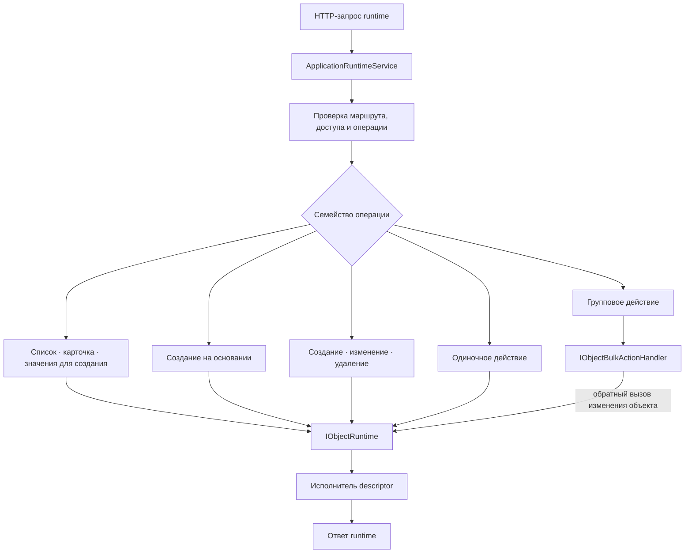
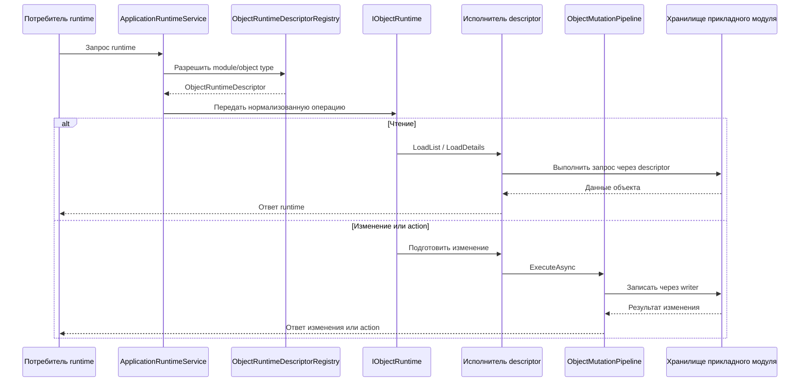
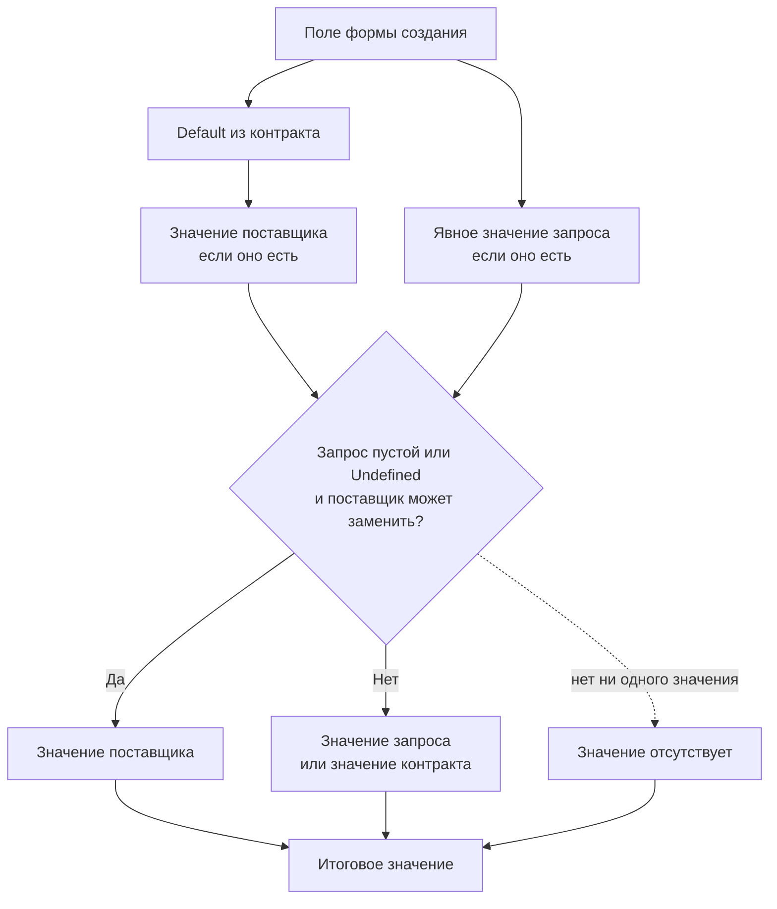
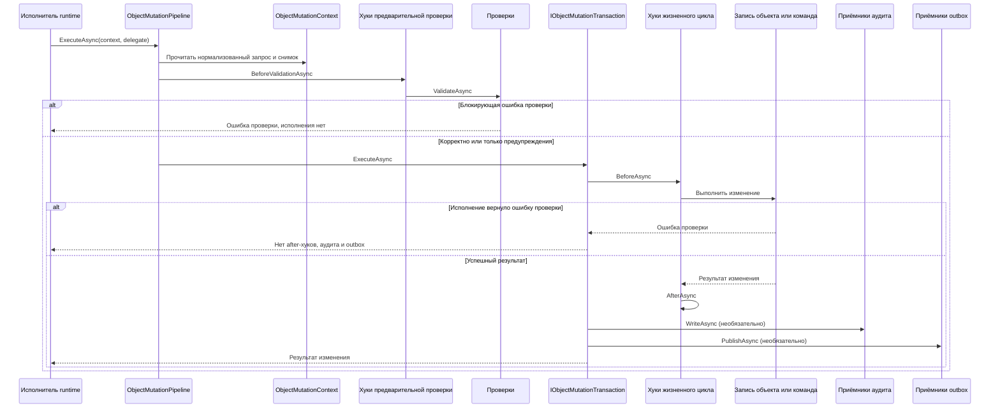
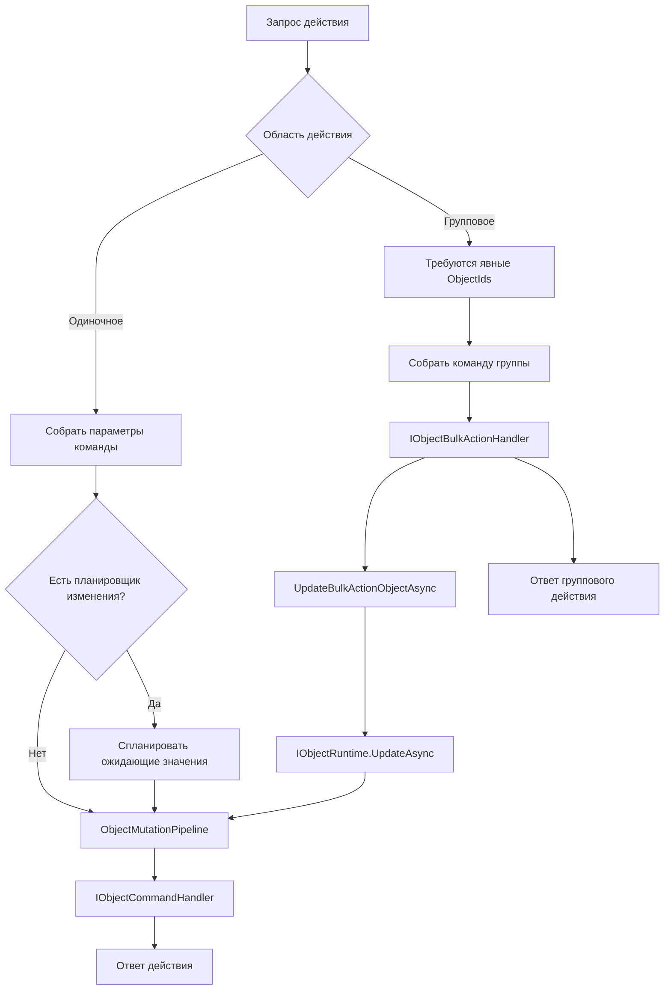
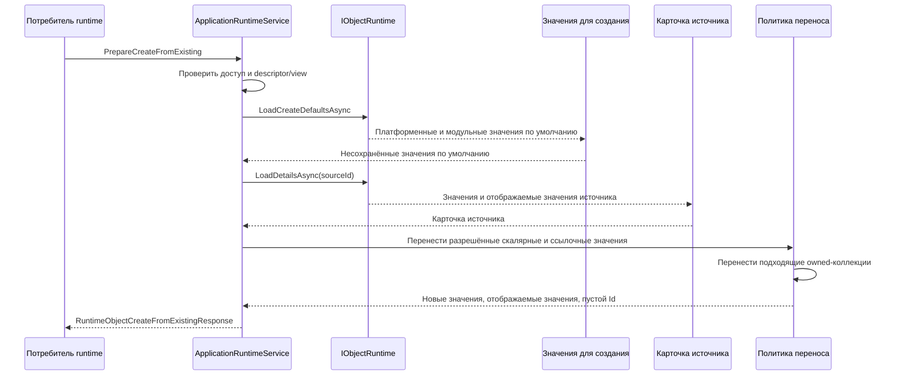
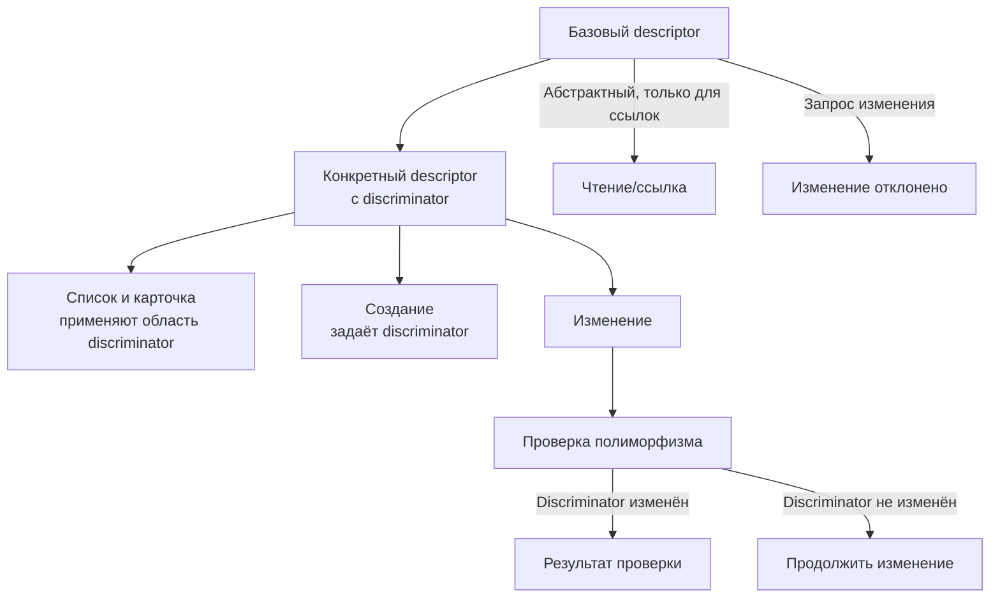
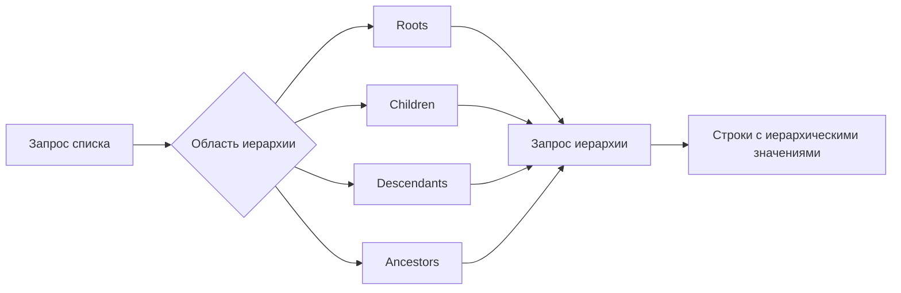
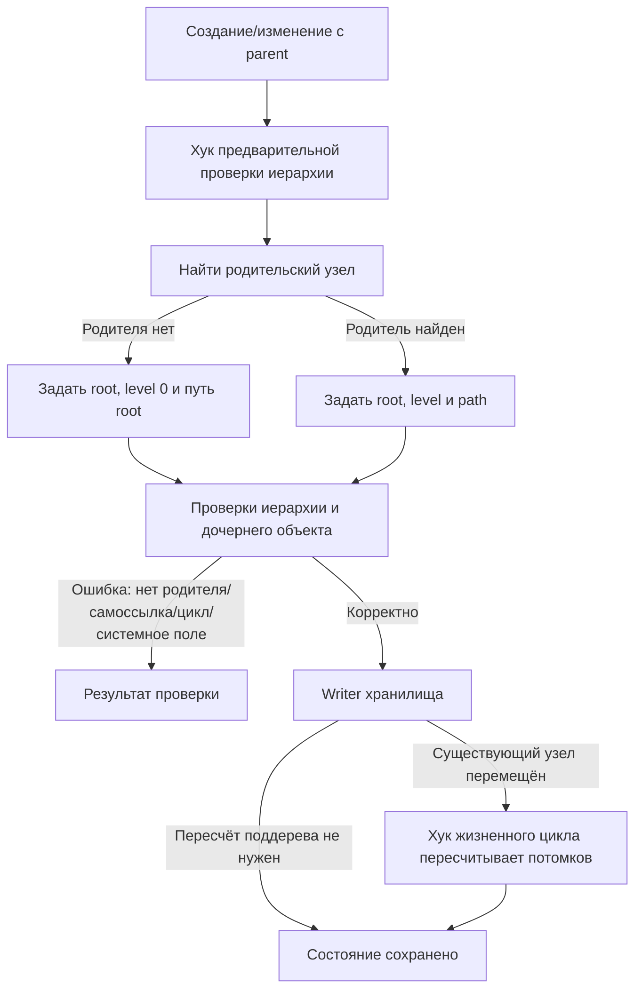

# Исполнение — Object Runtime

[object-runtime]: ../../../src/Platform/DMP.Platform.Runtime/Application/Services/Core/ObjectRuntime.cs
[generic-provider]: ../../../src/Platform/DMP.Platform.Runtime/Application/Services/Core/GenericRuntimeObjectProvider.cs
[app-service]: ../../../src/Platform/DMP.Platform.Runtime/Application/Services/Core/ApplicationRuntimeService.cs
[mutation-pipeline]: ../../../src/Platform/DMP.Platform.Runtime/Application/Services/Core/ObjectMutationPipeline.cs
[mutation-contracts]: ../../../src/Platform/DMP.Platform.Runtime/Application/Abstractions/Objects/ObjectMutationContracts.cs
[registry]: ../../../src/Platform/DMP.Platform.Runtime/Application/Abstractions/Objects/IObjectRuntimeDescriptorRegistry.cs
[defaults-resolver]: ../../../src/Platform/DMP.Platform.Runtime/Application/Services/Core/ObjectRuntimeDefaultsResolver.cs
[required-validator]: ../../../src/Platform/DMP.Platform.Runtime/Application/Services/Core/ObjectRequiredMemberMutationValidator.cs
[polymorphism-validator]: ../../../src/Platform/DMP.Platform.Runtime/Application/Services/Core/ObjectPolymorphismMutationValidator.cs
[hierarchy-validator]: ../../../src/Platform/DMP.Platform.Runtime/Application/Services/Core/ObjectHierarchyMutationValidator.cs
[hierarchy-prehook]: ../../../src/Platform/DMP.Platform.Runtime/Application/Services/Core/ObjectHierarchyMutationPreValidationHook.cs
[hierarchy-lifecycle]: ../../../src/Platform/DMP.Platform.Runtime/Application/Services/Core/ObjectHierarchySubtreeMutationLifecycleHook.cs
[generated-writer]: ../../../src/Platform/DMP.Platform.Runtime/Application/Services/Core/ObjectGeneratedRuntimeObjectMutationWriter.cs
[collection-definition]: ../../../src/Platform/DMP.Platform.Runtime/Application/Abstractions/Objects/BusinessObjectContractDefinition.cs
[extension-store]: ../../../src/Platform/DMP.Platform.Runtime/Application/Abstractions/ObjectExtensions/IObjectExtensionValueStore.cs
[contracts]: ../../../src/Platform/DMP.Platform.Contracts/Runtime/
[foundation-contracts]: ../00_foundation/03_contracts.md
[message-resolver]: ../../../src/BuildingBlocks/DMP.BuildingBlocks.Application/Abstractions/IPlatformMessageResolver.cs
[message-implementation]: ../../../src/Platform/DMP.Platform.Runtime/Application/Services/Core/DefaultPlatformMessageResolver.cs

## 1. Назначение документа

Документ описывает поведение Object Runtime во время выполнения: чтение списков и карточек, ссылочные lookup-ы, значения по умолчанию, создание на основании существующего объекта, создание, изменение и удаление, каскадное удаление owned-коллекций, действия, групповые действия, конвейер изменения, TPH, иерархию, обработку сбоев и ограничения текущего MVP. Публичные DTO и точки расширения перечислены в `03_contracts.md`.

Сценарии используют общие контексты, результаты и порты application-слоя,
описанные в [контрактах Foundation][foundation-contracts]. Этот документ
описывает только runtime-семантику Object Runtime: порядок вызовов, проверки,
изменение состояния и обработку сбоев; определения общих контрактов здесь не
повторяются.

## 2. Основные сценарии исполнения

| Сценарий | Путь выполнения | Результат | Поведение при сбое |
| --- | --- | --- | --- |
| Список и lookup (выбор значения) | Фасад runtime проверяет право на представление, нормализует запрос списка, затем `IObjectRuntime.LoadListAsync` передаёт его исполнителю описания. | `RuntimeObjectListResponse` со строками, параметрами выдачи, применёнными фильтрами и сортировкой, а также сводками групп. | Неизвестное описание или набор данных, неподдерживаемая возможность, неверный путь поля или отсутствующий tenant приводят к ошибке до запроса или во время него. |
| Карточка | Фасад runtime проверяет право на представление, загружает описание и вызывает `IObjectRuntime.LoadDetailsAsync`; затем добавляются отображаемые значения и проекция workflow. | `RuntimeObjectDetailsResponse` со значениями, отображаемыми значениями, действиями и необязательным workflow. | Если объект не найден, обработчик возвращает предсказуемый результат «не найдено». |
| Значения для создания | Runtime разрешает значения по умолчанию из контракта и поставщиков, учитывает явные значения запроса и не добавляет отсутствующие значения простых типов автоматически. | Ответ карточки с `Id = ""`. | Неподдерживаемое создание или отсутствие описания приводят к ошибке. |
| Создание на основании существующего | Runtime загружает значения для создания и исходную карточку, переносит разрешённые поля и возвращает несохранённую форму. | `RuntimeObjectCreateFromExistingResponse`. | Отключённый сценарий, неподдерживаемый перенос отдельной коллекции или отсутствие исходного объекта приводят к ошибке. |
| Создание, изменение и удаление | Runtime проверяет право на изменение, для update/delete проверяет состояние workflow только для чтения и передаёт операцию в `IObjectRuntime`. | `RuntimeObjectMutationResponse`. | Ошибки проверки возвращаются в ответе; ошибки формы запроса или описания являются детерминированными исключениями. |
| Действие объекта | Runtime проверяет право, значения маршрута, не допускает групповое действие на одиночном маршруте и выполняет команду через конвейер. | `RuntimeObjectActionResponse`. | Отсутствующее действие, неподдерживаемая область или неверные параметры возвращают ошибку или результат проверки. |
| Групповое действие | Runtime проверяет право, требует область bulk и явные идентификаторы, строит команду и вызывает `IObjectBulkActionHandler`. | `RuntimeObjectBulkActionResponse`. | Пустой список, обычное действие или отсутствующий обработчик приводят к отклонённому ответу. |

Схема показывает общую маршрутизацию операций. Групповое действие имеет отдельный обработчик, но изменение выбранного объекта возвращается в обычный путь `IObjectRuntime` и его конвейер. ([служба runtime][app-service]; [точка входа Object Runtime][object-runtime]; [универсальный исполнитель][generic-provider])

### 2.1. Подготовка текста runtime-проблем

При проверке операции Object Runtime формирует проблему с кодом, полем или
путём, кодом шаблона, аргументами и резервным текстом. Затем передаёт эти данные
в общий `IPlatformMessageResolver`. В `RuntimeValidationResponse` сохраняется
исходный код проблемы и остальные машинные поля, а `Message` получает текст,
выбранный для языка запроса. Определение общего контракта средства разрешения
сообщений и правила
резервного текста находятся в [Foundation][foundation-contracts]; Runtime
описывает только это применение. ([порт сообщений][message-resolver];
[текущая реализация][message-implementation])

### 2.2. Сквозной путь стандартной операции

Для стандартного типа объекта потребитель не обращается к хранилищу и не
вызывает предметную сущность напрямую. Runtime использует зарегистрированный
контракт объекта и выбирает путь чтения или изменения:

Схема показывает логический путь, а не обязательный набор вызовов для каждой
операции. Effective `View`, права, workflow projection и обогащение
отображаемых значений добавляются фасадом в тех сценариях, где они нужны.
Предметная модель и persistence остаются у Domain Module; контракт и descriptor
только связывают их с общим runtime-путём. ([служба runtime][app-service]; [реестр][registry]; [точка входа Object Runtime][object-runtime]; [конвейер изменения][mutation-pipeline])

## 3. Выполнение запроса списка

Для источников репозитория и запросов `GenericRuntimeObjectProvider` применяет платформенные области в следующем порядке: tenant, удаление, архив, полиморфизм, владелец вложенной коллекции и иерархия. Затем он строит план фильтрации, группировки и сортировки до постраничной выдачи и проекции. ([универсальный исполнитель][generic-provider])

```mermaid
flowchart LR
    Request["Запрос списка"] --> Facade["Проверить доступ, определить язык\nи нормализовать запрос"]
    Facade --> Runtime["IObjectRuntime"]
    Runtime --> Descriptor["Descriptor + dataset"]
    Descriptor --> Source{"Путь чтения"}
    Source --> Query["Корень запроса репозитория\nили IQueryable-источник"]
    Source --> Reader["Специальный обработчик чтения списка"]
    Query --> Scope["tenant · удаление · архив\nвладелец вложенной коллекции · полиморфизм · иерархия"]
    Scope --> Plan["Фильтры · группировка · сортировка"]
    Plan --> Page["Постраничная выдача и проекция"]
    Reader --> Page
    Page --> Enrich["Дополнительные и иерархические значения"]
    Enrich --> Post["Обогащение Workflow, ссылками и заголовками"]
    Post --> Response["RuntimeObjectListResponse"]
    Post -. "поиск/виртуальное поле workflow" .-> Reprocess["Загрузить ограниченную страницу\nи применить постфильтрацию/постсортировку"]
```

Для источника запросов (`IQueryable`) области применяются до построения плана запроса; специальный обработчик чтения получает нормализованные параметры через свой контракт. Поиск и сортировка виртуальных полей workflow могут потребовать ограниченную постобработку фасада. ([универсальный исполнитель][generic-provider]; [служба runtime][app-service])

Для поля-ссылки фасад может передать в список `RuntimeReferenceLookupContextRequest` с исходным модулем, типом объекта, кодом поля и контекстными значениями. Runtime строит дополнительные фильтры для целевого набора данных. Для цели с `AbstractReferenceOnly` фасад обращается к конкретным описаниям, пропускает недоступные по праву или неподдерживаемые типы, объединяет варианты, сортирует их по подписи и возвращает страницу с идентичностью конкретного типа. Такой lookup остаётся чтением и не делает абстрактный descriptor целью изменения. ([служба runtime][app-service]; [контракты](03_contracts.md))

| Возможность | Текущее поведение | Ограничение |
| --- | --- | --- |
| Постраничная выдача | Номер страницы не меньше `1`, размер страницы ограничивается диапазоном от `1` до `500`. | Производственные пределы зашиты в текущем runtime. |
| Фильтрация | Используются `RuntimeListFilterRequest` и известные операторы: равенство, вхождение, диапазон, проверка null и операторы битовых масок (`flags`). | Автономный набор данных (`Standalone Dataset`) и расширенный общий механизм сложных предикатов не входят в текущий MVP; будущая граница владельцев указана в [трассировке](90_traceability.md): `ORT-DEC-01 — владелец Dataset / Read Query`. |
| Сортировка | Используется `ListSortFieldRequest`, запрос сортировки передаётся обработчику хранилища. | Вложенные пути ограничены возможностями конкретного источника. |
| Группировка | Для репозитория и источника запросов строятся сводки групп; смешивание встроенной и дополнительной группировки отклоняется. | Object Runtime не выполняет агрегаты. |
| Перечисление flags | Для битовых полей поддерживаются `HasFlag`, `FlagsAny`, `FlagsAll`, `FlagsExact`. | Строковое вхождение не является смыслом битовой маски. |
| Виртуальные поля workflow | Фасад runtime может дополнить строки текущим состоянием workflow после основного запроса. | Смысл состояния принадлежит Workflow. |
| Просмотр удалённых и архивных строк | По умолчанию удалённые и архивные строки скрыты; технические признаки требуют права или поддержки runtime. | Срок хранения и политика архива принадлежат другим областям. |

### 3.1. Формирование карточки, lookup и отображаемых значений

При чтении карточки или списка runtime разделяет значение поля и его
отображение. Основные данные приходят из descriptor и хранилища объекта, а
подписи ссылок, элементов `ValueSet`, системных enum и инициаторов могут быть
добавлены фасадом по effective-конфигурации и зарегистрированным resolver-ам.
Клиент не собирает такие подписи из случайных полей ответа.

| Этап | Текущее поведение | Владелец смысла |
| --- | --- | --- |
| Основные значения | Descriptor определяет допустимые поля, набор данных и путь чтения. | Object Runtime / Domain Module |
| Значения ссылок | Runtime строит lookup по типу целевого объекта, контексту поля и доступным конкретным описаниям (`descriptor`). | Object Runtime; тип целевого объекта принадлежит прикладному модулю (`Domain Module`) |
| Отображаемые значения | Сервер возвращает отображаемое значение (`display value`) для ссылки, набора значений, системного enum или actor. | Resolver соответствующей платформенной возможности |
| Проекция Workflow | Состояние и доступные команды добавляются как runtime-проекция, а не как сохранённые поля объекта. | Workflow |
| Ответ | DTO содержит значения и отдельные разделы отображаемых значений и проекций. | Контракты runtime (`Runtime Contracts`) |

Эта граница объясняет, почему `DisplayValue`, `WorkflowState` и другие
производные значения не являются свойствами схемы `ObjectType`. Сложное раскрытие
графа объектов и общий контракт аналитического чтения в текущий MVP не входят.
([служба runtime][app-service]; [универсальный исполнитель][generic-provider])

### 3.2. Вложенные коллекции

Для вложенной коллекции запрос передаёт `EmbeddedCollectionContext`. Фасад
проверяет, что целевой тип и поле действительно принадлежат владельцу, после
чего runtime применяет правила коллекции из `ObjectRuntimeDescriptor`.

| Режим | Чтение и изменение | Поведение удаления |
| --- | --- | --- |
| `WithOwner` | Строки читаются в контексте карточки владельца; значения коллекции входят в mutation payload владельца и обрабатываются сгенерированным writer. | Отсутствующие строки обрабатываются по `MissingItemBehavior`; `Cascade` может рекурсивно удалить owned-строки. |
| `Separate` | Строка является отдельным объектом; запрос сохраняет контекст владельца и проходит отдельную проверку принадлежности и прав. | Применяется политика самостоятельного целевого объекта и заданное поведение связи; автоматическое удаление владельца не следует из самого режима. |

`Aggregation`, `SaveMode`, `DeleteBehavior` и `MissingItemBehavior` задаются
контрактом объекта. Они не превращают дочернюю строку в свойство Configuration
schema и не разрешают обходить mutation pipeline. ([контракты коллекций][collection-definition]; [служба runtime][app-service]; [универсальный исполнитель][generic-provider])

Action дочернего объекта может быть размещён в toolbar встроенной коллекции.
Для такого вызова представление action использует размещение
`EmbeddedCollectionToolbar`, а запрос передаёт тот же
`EmbeddedCollectionContext`, что и чтение коллекции. Runtime передаёт контекст
в общий `ObjectMutationContext`; предметный handler может получить
`OwnerObjectId` из контекста и создать одну или несколько строк дочерней
коллекции. Это общий механизм runtime и не содержит ветвей для конкретного
модуля.

### 3.3. Расширяемые значения

Расширяемые значения подключаются только для типа объекта, который объявил
поддержку extensions и зарегистрировал `IObjectExtensionValueStore`. Runtime
использует это хранилище как дополнительный источник данных, но не владеет его
таблицами.

| Операция | Текущее поведение |
| --- | --- |
| Чтение карточки или списка | Runtime запрашивает значения для запрошенных расширяемых полей и добавляет их в ответ. |
| Фильтрация и сортировка | Хранилище получает отдельный запрос списка; возможность действует только для явно поддержанных полей и операторов. |
| Создание или изменение | Сгенерированный writer передаёт значения в `ApplyValuesAsync` внутри общего mutation-сценария. |
| Тип значения | Resolver сопоставляет значение с `String`, `Number`, `Boolean`, `Date`, `DateTime`, `Reference` или `Json`. |
| Хранение и схема поля | Таблицы и предметные ограничения принадлежат прикладному модулю; определение поля и его UI-настройки принадлежат Configuration. |

Extension value не является отдельным `ObjectType` и не превращает DTO или
табличную колонку хранения в свойство артефакта. ([extension-store][extension-store]; [generic-provider][generic-provider]; [generated-writer][generated-writer])

## 4. Значения по умолчанию и обязательность

Значения для создания разрешаются через `ObjectRuntimeDefaultsResolver`. Приоритет источников имеет следующий порядок:

`ObjectRuntimeDefaultsResolver` не добавляет неявные primitive-значения, в том числе `false` для `bool`. Значение появляется только из default в контракте, поставщика или явного запроса; явное `false` сохраняется, а отсутствие обязательного Boolean или числового значения отклоняется `ObjectRequiredMemberMutationValidator`. Для nullable Boolean отсутствие значения остаётся `null`, если другой источник не задал default. ([разрешение значений по умолчанию][defaults-resolver]; [проверка обязательности][required-validator])

## 5. Конвейер изменения

`ObjectMutationPipeline` выполняет один нормализованный `ObjectMutationContext` для create, update, delete и action. Порядок такой:

Если проверки возвращают блокирующие ошибки, предметное выполнение не вызывается. Если само выполнение возвращает ошибку проверки, обработчики после операции, аудит и outbox не выполняются. Предупреждения и информационные сообщения изменение не блокируют. ([конвейер изменения][mutation-pipeline])

`ObjectMutationContext` содержит запрос, описание, идентификатор tenant, исходный снимок, effective-значения и предполагаемый набор изменений. Обработчик до операции может вызвать `SetValue`, чтобы добавить ожидающие записи значения; перед выполнением набор изменений строится заново. ([контракты изменений][mutation-contracts])

### 5.1. Внутренние контракты исполнения

`IObjectRuntimeDescriptorRegistry` — внутренний контракт каталога исполняемых
описаний. Его потребители — `ObjectRuntime`, универсальный исполнитель,
проверка совместимости при запуске, синхронизация состояния архивирования и
сгенерированный обработчик записи. Реестр разрешает identity объекта,
возвращает concrete-описания и отклоняет неизвестные или дублирующиеся записи.
Это соглашение между внутренними службами Object Runtime, а не контракт,
который должен стабилизироваться для HTTP-клиента или отдельного доменного
модуля. ([реестр описаний][registry])

`ObjectMutationRequest` — внутренняя нормализованная команда для
`ObjectMutationPipeline`, проверок, обработчиков жизненного цикла, обработчиков
записи, аудита и outbox. Она строится из DTO Runtime API фабриками
`FromCreate`, `FromUpdate`, `ForDelete` и `FromAction`; после этого исполнители
работают с единой формой операции `Create`, `Update`, `Delete` или `Action`.
Команда содержит разрешённое описание, идентичность объекта, значения,
параметры, контекст представления/workflow, профиль выполнения и маркер
конкурентности. Это внутренняя форма передачи, поэтому её поля и фабрики не
являются самостоятельным внешним контрактом и могут изменяться вместе с
реализацией конвейера. ([контракты изменений][mutation-contracts])

При удалении через сгенерированный обработчик записи runtime дополнительно обрабатывает owned-коллекции, у которых в контракте указано `ObjectCollectionDeleteBehavior.Cascade`. Обработка выполняется рекурсивно: дочерние записи с политикой мягкого удаления получают системные значения удаления, а записи без такой возможности физически удаляются из хранилища. Это поведение относится к сгенерированному обработчику записи и не заменяет отдельную политику удаления для собственного `IGenericRuntimeObjectMutationWriter`. ([универсальный исполнитель][generic-provider]; [контракты](03_contracts.md))

## 6. Действия и групповые действия

Действие объекта выполняется по исполняемому описанию. Параметры команды сопоставляются с конструктором команды по имени; параметры идентификатора с именами `Id`, `ObjectId` или `<ObjectTypeCode>Id` заполняются из идентификатора маршрута или запроса. Неверные и отсутствующие параметры возвращаются как ошибки проверки. Если действие объявляет планировщик изменения, планировщик обновляет ожидающие записи значения до проверок и обработчика записи. ([универсальный исполнитель][generic-provider])

Групповое действие отделено от действия одного объекта:

- маршрут одного объекта отклоняет действия с `ObjectActionScope.Bulk`;
- маршрут группового действия требует `ObjectActionScope.Bulk`;
- текущий контракт выбора поддерживает только явные `ObjectIds`;
- обработчики, изменяющие объекты, возвращаются в маршрут изменения Object Runtime через `ObjectBulkActionContext`.

Одиночное действие проходит общий конвейер; групповая команда сама является обработчиком выбора, а изменения отдельных объектов снова выполняются через `IObjectRuntime.UpdateAsync`. ([универсальный исполнитель][generic-provider]; [служба runtime][app-service]; [конвейер изменения][mutation-pipeline])

## 7. Создание на основании существующего

Создание на основании существующего объекта подготавливает значения новой несохранённой записи. Оно не создаёт постоянный идентификатор и не записывает аудит или outbox как новое создание. Runtime загружает значения по умолчанию, читает исходную карточку и переносит только разрешённые значения. ([служба приложения][app-service])

Значение не переносится, если член системный, доступен только для чтения, недоступен для записи, вычисляемый/виртуальный/коллекционный или помечен `Exclude`. Обычные, ссылочные члены и члены наборов значений переносимы. Строки owned-коллекции копируются только для членов с `SaveMode = WithOwner` и `CreateFromExisting = Include`; отдельные коллекции для этого сценария отклоняются. ([служба приложения][app-service])

Для членов, подключённых к нумерации, effective-политика create-from-existing получает `Exclude`, если это явно не переопределено метаданными контракта. Поведение счётчика нумерации принадлежит области Numbering.

В этом сценарии `ObjectMutationPipeline` не вызывается: результат является несохранённой формой, поэтому новое создание не порождает аудит или outbox. ([служба runtime][app-service])

## 8. TPH и иерархия

Для TPH и полиморфизма действуют правила:

- абстрактное описание только для ссылок не может выполнять стандартные операции изменения;
- конкретное описание применяет значение дискриминатора при подготовке и выполнении создания;
- запрос изменения не может изменить дискриминатор;
- список и карточка применяют область дискриминатора конкретного типа объекта. ([проверка полиморфизма][polymorphism-validator]; [универсальный исполнитель][generic-provider])

Схема показывает только подтверждённые ограничения TPH: runtime использует конкретный дискриминатор для чтения и создания, но не разрешает менять его запросом. ([проверка полиморфизма][polymorphism-validator]; [универсальный исполнитель][generic-provider])

Для иерархии действуют правила:

- члены parent/root/level/path/has-children являются метаданными описания;
- create/update вычисляет root, level и path через цепочку предварительной проверки, обработчика записи и обработчика жизненного цикла;
- системные поля иерархии доступны только для чтения в пользовательском запросе;
- родитель должен существовать, не может совпадать с самим объектом и находиться внутри его текущего поддерева;
- после перемещения пересчитываются потомки;
- удаление или прямое архивирование отклоняется, если у узла есть активные непосредственные потомки;
- список поддерживает области иерархии `Roots`, `Children`, `Descendants`, `Ancestors`. ([проверка иерархии][hierarchy-validator]; [предварительная проверка иерархии][hierarchy-prehook]; [обработчик жизненного цикла иерархии][hierarchy-lifecycle])

Первая схема описывает области чтения, вторая — вычисление и изменение системных полей иерархии. Они не объявляют отдельную closure table: текущий код использует поля объекта и запросы иерархии. ([универсальный исполнитель][generic-provider]; [предварительная проверка иерархии][hierarchy-prehook]; [обработчик жизненного цикла иерархии][hierarchy-lifecycle])

## 9. Согласованность и сбои

| Область | Текущее правило | Открытый вопрос |
| --- | --- | --- |
| Транзакция | Часть изменения обёрнута в `IObjectMutationTransaction`; реализация общего контекста транзакции находится в runtime-сервисах. | Распределённая транзакция между возможностями платформы не гарантируется. |
| Аудит и outbox | Выполняются после успешного предметного действия внутри конвейера. | Доставка, повторные попытки и срок хранения принадлежат соседним областям. |
| Конкурентность | Запрос и ответ изменения могут содержать маркер конкурентности; набор изменений может включать прежний и новый маркеры. Сгенерированный обработчик записи проверяет совпадение маркера с текущей записью. | Для собственного обработчика записи политика конфликта определяется контрактом и хранилищем прикладного модуля. |
| Кэш | Runtime использует эффективную конфигурацию (`effective configuration`) и опубликованные артефакты; реестр описаний создаётся в памяти при запуске. | Промышленное обновление и предварительное заполнение кэша не входят в текущий MVP; маршрут будущей доработки указан в [трассировке](90_traceability.md): `ORT-DEC-03 — обновление и предварительное заполнение кэша runtime`. |
| Набор данных (`Dataset`) | Наборы данных объекта связаны с исполняемым описанием. | Автономный набор данных (`Standalone Dataset`) и агрегаты не входят в текущий MVP; маршрут будущей доработки указан в [трассировке](90_traceability.md): `ORT-DEC-01 — владелец Dataset / Read Query`. |

## 10. Жизненный цикл файлового ресурса

Свойство файла проходит через общий mutation validator и lifecycle hook: ссылка
проверяется до записи, новый ресурс прикрепляется после успешной mutation, а
старая ссылка освобождается только после замены или очистки. File action получает
ссылки и метаданные descriptor; бинарное содержимое читается через отдельную
конечную точку Content Storage.

Подробный контракт: [Platform Content Storage](../13_content_storage/04_runtime.md).

## История изменений

| Версия | Дата и время | Автор | Раздел | Изменение | Коммит/PR |
|---|---|---|---|---|---|
| 1.1 | 2026-09-03 16:04 +03:00 | Олег Юрьев (@axelprosoft) | 2. Вложенные коллекции | docs: document content capability and document management module | [3b55ce83](https://github.com/axelprosoft/DMP.PlatformFoundation/commit/3b55ce83518e455f26704720e6dbf40ba8db6170) |
| 1.0 | 2026-09-03 14:49 +03:00 | Олег Юрьев (@axelprosoft) | YAML-шапка: review_status, status | Утверждение после merge PR #61: изменения в проектной документации ядра - новый модуль работы с файлами | [PR #61](https://github.com/axelprosoft/DMP.PlatformFoundation/pull/61) |
| 0.2 | 2026-09-03 13:00 +03:00 | Олег Юрьев (@axelprosoft) | Жизненный цикл файлового ресурса | изменения в проектной документации ядра. основание - новый модуль по хранению и работе с файлами | [0f415f89](https://github.com/axelprosoft/DMP.PlatformFoundation/commit/0f415f89b977fa123e52411717a66f94c2d327a3) |
| 0.1 | 2026-08-27 15:04 +03:00 | Олег Юрьев (@axelprosoft) | Создание документа | подготовлен драфт новой проектной документации на ядро, прикладные модули, а так же термины и общие концептуальные документы | [5ecb26b1](https://github.com/axelprosoft/DMP.PlatformFoundation/commit/5ecb26b1c3ff3cfcdc13018e59526ae684ca6007) |
