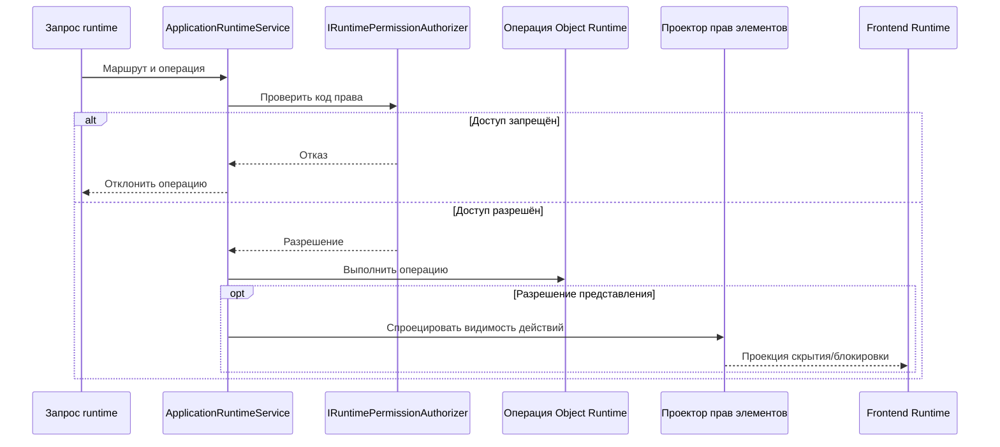
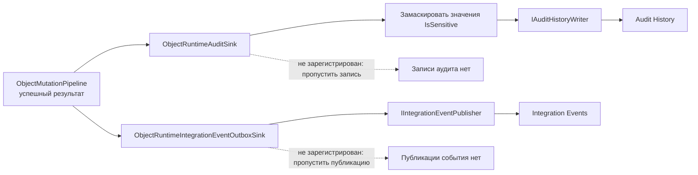

# Безопасность и аудит — Object Runtime

[app-service]: ../../../src/Platform/DMP.Platform.Runtime/Application/Services/Core/ApplicationRuntimeService.cs
[permission-authorizer]: ../../../src/Platform/DMP.Platform.Runtime/Application/Abstractions/Core/IRuntimePermissionAuthorizer.cs
[audit-sink]: ../../../src/Platform/DMP.Platform.Runtime/Application/Services/Core/ObjectRuntimeAuditSink.cs
[outbox-sink]: ../../../src/Platform/DMP.Platform.Runtime/Application/Services/Core/ObjectRuntimeIntegrationEventOutboxSink.cs
[mutation-pipeline]: ../../../src/Platform/DMP.Platform.Runtime/Application/Services/Core/ObjectMutationPipeline.cs
[audit-contract]: ../../../src/Platform/DMP.Platform.Runtime/Application/Abstractions/Objects/ObjectMutationAuditDetails.cs
[event-payload]: ../../../src/Platform/DMP.Platform.Contracts/IntegrationEvents/ObjectMutationCompletedIntegrationEventPayload.cs
[request-context]: ../../../src/Platform/DMP.Platform.Runtime/Context/PlatformRequestContext.cs

## 1. Назначение документа

Документ фиксирует, какие меры защиты, вызовы проверки доступа, сведения аудита и выходные события относятся к Object Runtime. Tenant Security владеет правами и решениями о доступе; Audit History владеет хранением аудита; Integration Events владеет доставкой outbox-событий.

## 2. Проверка доступа

Фасад runtime проверяет права до выполнения операций над объектом. Код права строится по соглашению «модуль / тип объекта / действие» в `ApplicationRuntimeService`. ([служба приложения][app-service]; [авторизатор прав][permission-authorizer])

| Операция | Соглашение для кода права | Пояснение |
| --- | --- | --- |
| Просмотр списка, карточки и значений для создания | `<ModuleCode>.<ObjectTypeCode>.View` | Для вложенной коллекции дополнительно проверяется объявление представления владельца. |
| Создание | `<ModuleCode>.<ObjectTypeCode>.Create` | Для создания на основании существующего объекта также требуется право создания. |
| Изменение | `<ModuleCode>.<ObjectTypeCode>.Edit` | Перед изменением проверяется состояние workflow только для чтения. |
| Удаление | `<ModuleCode>.<ObjectTypeCode>.Delete` | Effective `DeleteCapability` может сделать операцию недоступной. |
| Действие | `<ModuleCode>.<ObjectTypeCode>.<ActionSegment>` | Если сегмент содержит префикс типа объекта, он удаляется при построении кода права. |
| Просмотр удалённых | `Platform.Runtime.IncludeDeleted` | Техническое право на чтение удалённых строк. |
| Технический раздел данных | `<ModuleCode>.<ObjectTypeCode>.ViewTechnicalData` | Используется фасадом runtime при добавлении административного раздела. |

Проверка доступа выполняется на сервере. Видимость действия в интерфейсе является удобной проекцией, но не источником контроля доступа.

Контроль доступа остаётся серверным. `Element permission projector` только формирует проекцию для интерфейса и не заменяет повторную проверку при выполнении операции. ([служба runtime][app-service]; [авторизатор прав][permission-authorizer])

## 3. Защита данных объекта

| Мера защиты | Текущее поведение | Источник |
| --- | --- | --- |
| Область tenant | Для списка и карточки репозиторий или источник запросов применяет фильтр по члену tenant, если он задан в описании. | `GenericRuntimeObjectProvider` |
| Удалённые и архивные строки | По умолчанию удалённые и архивные строки скрыты, если технические признаки не разрешены. | `GenericRuntimeObjectProvider`, `ApplicationRuntimeService` |
| Состояние workflow только для чтения | Фасад runtime блокирует update/delete, если проекция workflow помечает объект доступным только для чтения. | `ApplicationRuntimeService` |
| Владение вложенной коллекцией | Для отдельного изменения вложенной коллекции проверяются объявление представления владельца и принадлежность строки. | `ApplicationRuntimeService` |
| Неизменяемость дискриминатора | Дискриминатор конкретного TPH-объекта нельзя изменить запросом update. | `ObjectPolymorphismMutationValidator` |
| Защищённые поля иерархии | Runtime отклоняет пользовательские значения системных полей иерархии. | `ObjectHierarchyMutationValidator` |
| Чувствительные значения | Приёмник аудита скрывает прежнее и новое значения членов, помеченных `IsSensitive`. | [приёмник аудита][audit-sink] |

## 4. Аудит

`ObjectRuntimeAuditSink` записывает сведения аудита через `IAuditHistoryWriter` после успешного выполнения конвейера изменения. Если `IAuditHistoryWriter` не зарегистрирован, приёмник завершает работу без записи. ([приёмник аудита][audit-sink]; [конвейер изменения][mutation-pipeline])

Код действия аудита определяется видом изменения и системным действием:

| Случай runtime | Код действия аудита |
| --- | --- |
| Создание | `ObjectRuntime.Create` |
| Изменение | `ObjectRuntime.Update` |
| Удаление с возможностью мягкого удаления | `ObjectRuntime.SoftDelete` |
| Иное удаление | `ObjectRuntime.HardDelete` |
| Архивирование | `ObjectRuntime.Archive` |
| Восстановление | `ObjectRuntime.Restore` |
| Другое действие | `ObjectRuntime.Action` |

Сведения аудита включают код модуля, код типа объекта, идентификатор объекта, вид изменения, профиль выполнения, коды действия/представления/workflow, маркеры конкурентности, изменённые поля и необязательный код перехода workflow. Идентификатор корреляции передаётся не внутри `ObjectMutationAuditDetails`, а в окружающем `AuditRecord`, который строит sink. Чувствительные изменённые значения записываются как `[REDACTED]`. ([audit contract][audit-contract])

## 5. Outbox и интеграционные события

`ObjectRuntimeIntegrationEventOutboxSink` публикует `ObjectRuntime.MutationCompleted` через `IIntegrationEventPublisher` после успешного изменения. Если издатель не зарегистрирован, приёмник завершает работу без публикации. ([приёмник outbox][outbox-sink]; [полезная нагрузка события][event-payload])

Полезная нагрузка включает:

- `ModuleCode`, `ObjectTypeCode`, `ObjectId`;
- вид изменения и профиль выполнения;
- контекст действия, представления и workflow;
- прежний и новый маркеры конкурентности;
- коды изменённых полей и виды изменений.

Поля конверта, например политика повторных попыток, состояние хранения и гарантии доставки, находятся за пределами Object Runtime и принадлежат Integration Events.

В ветке аудита runtime передаёт прежние и новые значения изменённых полей с маскированием чувствительных данных. В ветке outbox передаются сведения об изменении и коды полей, но не значения полей. Оба приёмника вызываются только после успешного предметного результата; их промышленная доставка и хранение принадлежат соседним областям. ([приёмник аудита][audit-sink]; [приёмник outbox][outbox-sink]; [конвейер изменения][mutation-pipeline])

## 6. Риски и ограничения

| Тема | Текущее состояние | Владелец / маршрут |
| --- | --- | --- |
| Каталог прав | Object Runtime строит коды прав операций, но не владеет их выдачей. | Tenant Security |
| Срок хранения и поиск аудита | Runtime передаёт только сведения аудита. | Audit History |
| Доставка и повторная отправка событий | Runtime публикует событие только через абстракцию. | Integration Events |
| Транзакция между возможностями платформы | Конвейер имеет локальную границу транзакции; гарантия распределённой транзакции не заявляется. | Architecture / Operations |
| Аутентификация и доверие к токену | Runtime использует контекст запроса и сервис проверки доступа. | Tenant Security / Foundation |

## 7. Доступ к файловым ресурсам

Знание `ContentRef` не заменяет право на объект-владелец. Для чтения,
прикрепления и отвязки Object Runtime передаёт owner policy предприятие,
пользователя, operation и owner reference; замена и очистка в MVP выражаются
последовательностью прикрепления и отвязки. Content Storage не содержит
доменных правил модуля 05.

## История изменений

| Версия | Дата и время | Автор | Раздел | Изменение | Коммит/PR |
|---|---|---|---|---|---|
| 1.0 | 2026-09-03 14:49 +03:00 | Олег Юрьев (@axelprosoft) | YAML-шапка: review_status, status | Утверждение после merge PR #61: изменения в проектной документации ядра - новый модуль работы с файлами | [PR #61](https://github.com/axelprosoft/DMP.PlatformFoundation/pull/61) |
| 0.2 | 2026-09-03 13:00 +03:00 | Олег Юрьев (@axelprosoft) | Доступ к файловым ресурсам | изменения в проектной документации ядра. основание - новый модуль по хранению и работе с файлами | [0f415f89](https://github.com/axelprosoft/DMP.PlatformFoundation/commit/0f415f89b977fa123e52411717a66f94c2d327a3) |
| 0.1 | 2026-08-26 20:09 +03:00 | Олег Юрьев (@axelprosoft) | Создание документа | более мение готовые модули и связанные с ними изменения | [09373981](https://github.com/axelprosoft/DMP.PlatformFoundation/commit/09373981332b775cb15ad9e10a36e6587714e257) |
