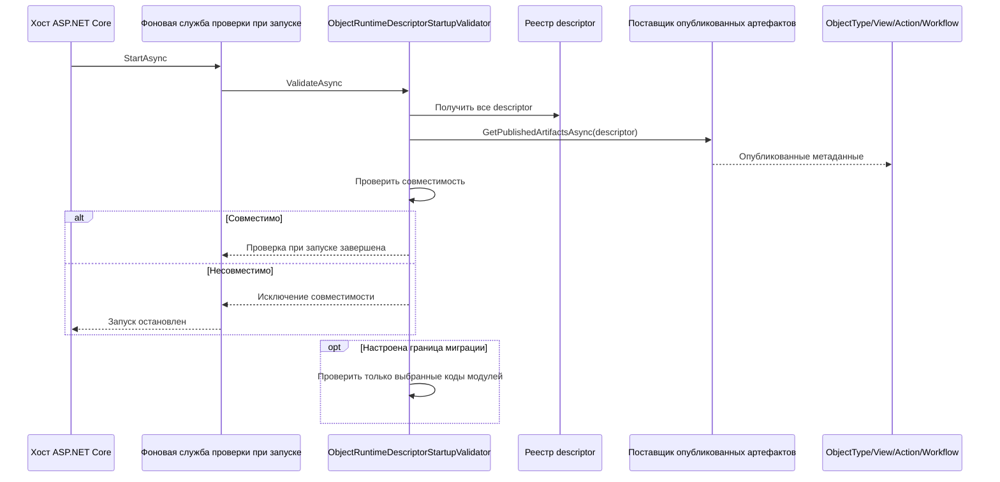
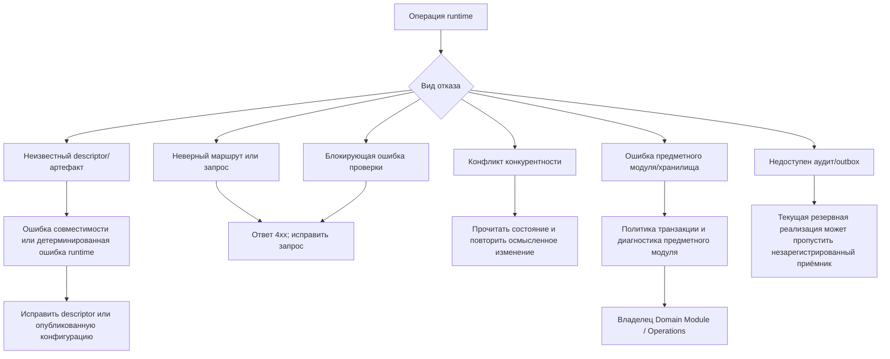

# Операции — Object Runtime

[di]: ../../../src/Platform/DMP.Platform.Runtime/DependencyInjection.cs
[startup-validator]: ../../../src/Platform/DMP.Platform.Runtime/Application/Services/Core/ObjectRuntimeDescriptorStartupValidator.cs
[startup-hosted-service]: ../../../src/Platform/DMP.Platform.Runtime/Application/Services/Core/ObjectRuntimeDescriptorStartupValidationHostedService.cs
[published-provider]: ../../../src/Platform/DMP.Platform.Runtime/Application/Abstractions/Objects/IObjectRuntimePublishedArtifactProvider.cs
[manifest-provider]: ../../../src/Platform/DMP.Platform.Runtime/Application/Services/Core/ManifestObjectRuntimePublishedArtifactProvider.cs
[empty-provider]: ../../../src/Platform/DMP.Platform.Runtime/Application/Services/Core/EmptyObjectRuntimePublishedArtifactProvider.cs
[migration-module]: ../../../src/Platform/DMP.Platform.Runtime/Application/Abstractions/Objects/ObjectRuntimeDescriptorMigrationModule.cs
[request-context]: ../../../src/Platform/DMP.Platform.Runtime/Context/PlatformRequestContextMiddleware.cs
[options]: ../../../src/Platform/DMP.Platform.Runtime/Application/Options/

## 1. Назначение документа

Документ фиксирует запуск, диагностику, границу миграции, резервное поведение и эксплуатационные ограничения Object Runtime. Он не определяет эксплуатационное руководство для Audit History, Integration Events, Workflow, SQL Server или будущего развёртывания Java/PostgreSQL.

## 2. Запуск и корень композиции

`AddPlatformRuntime` регистрирует службы Object Runtime в корне композиции приложения. В неё входят контекст запроса, средства формирования ответов Runtime Facade, реестр описаний, `IObjectRuntime`, исполнитель описаний, конвейер изменения, проверки, обработчики жизненного цикла, разрешение значений по умолчанию, приёмники аудита и outbox, а также резервные реализации. В той же регистрации присутствуют службы report/output, но они принадлежат Reporting Output и здесь упомянуты только как граница состава проекта. ([di][di])

Регистрации, важные для эксплуатации:

| Регистрация | Эксплуатационный смысл |
| --- | --- |
| `PlatformRequestContextMiddleware` | Формирует контекст запроса и передаёт runtime-службам сведения о tenant, user, site и идентификаторе корреляции. |
| `ObjectRuntimeDescriptorRegistry` | Каталог исполняемых описаний в памяти, построенный при композиции службы. |
| `ObjectRuntimeDescriptorStartupValidationHostedService` | Запускает проверку совместимости описаний при старте приложения. |
| `ObjectRuntimeDescriptorMigrationModule` | Ограничивает проверку при запуске выбранными кодами модулей, если задана граница миграции. |
| `IObjectRuntimePublishedArtifactProvider` | Предоставляет опубликованные метаданные `ObjectType`, `View`, `Action`, `Workflow` для проверки при запуске. |
| Резервные службы | Позволяют локальной или тестовой композиции запуститься, когда соседние возможности платформы не подключены. |

## 3. Проверка при запуске

Проверка при запуске сопоставляет зарегистрированные описания с опубликованными runtime-артефактами. Она проверяет наличие `ObjectType`, коды наборов данных, ссылки `View` на наборы данных, поля и действия, а также совместимость привязки workflow. ([проверка описаний][startup-validator]; [фоновая служба проверки][startup-hosted-service])

| Ситуация | Результат |
| --- | --- |
| Нет артефакта `ObjectType` | Описание считается несовместимым, проверка при запуске завершается ошибкой. |
| `View` ссылается на неизвестный набор данных | Формируется ошибка совместимости описания. |
| `View` ссылается на неизвестное поле | Формируется ошибка совместимости описания. |
| `View` или опубликованное действие ссылается на неизвестное действие | Формируется ошибка совместимости описания. |
| Для stateful-описания нет workflow | Формируется ошибка совместимости описания. |
| Workflow привязан к описанию без состояния | Формируется ошибка совместимости описания. |

Если настроены модули миграции, описания за пределами этой границы пропускаются при проверке. Это инструмент миграции, а не смысловое исключение из промышленного контракта. ([модуль миграции][migration-module])

Схема показывает фактическую границу проверки при запуске. `ObjectRuntimeDescriptorMigrationModule` ограничивает набор проверяемых модулей во время миграции, но не меняет сам контракт совместимости. ([фоновая служба проверки][startup-hosted-service]; [проверка описаний][startup-validator]; [поставщик опубликованных артефактов][published-provider]; [модуль миграции][migration-module])

## 4. Миграции и хранение

Сам Object Runtime не владеет общей схемой бизнес-объектов. Прикладные модули владеют миграциями своих данных. Адаптеры хранилища связывают выполнение описания с репозиториями, обработчиками чтения и обработчиками записи (`writer`) модуля.

| Класс данных | Владелец |
| --- | --- |
| Таблицы бизнес-объектов | Прикладной модуль |
| Конфигурационные артефакты, используемые runtime | Configuration |
| Записи аудита | Audit History |
| Записи outbox интеграционных событий | Integration Events |
| Состояние и история workflow | Workflow |
| Исполняемые описания runtime | В памяти процесса, из регистраций модулей |

## 5. Диагностика

| Ситуация | Технический объект или идентификатор | Что проверить |
| --- | --- | --- |
| Проверка совместимости завершилась исключением | Исключение совместимости описания | Модуль, тип объекта и список проблем с артефактами, полями, наборами данных, действиями и workflow. |
| Ответ проверки runtime содержит проблему | `RuntimeValidationIssueResponse` и его `code` | Уровень важности, код, поле или путь, код шаблона и аргументы ответа. |
| Нужно проверить результат изменения | Запись аудита | Вид изменения, контекст действия/представления/workflow, изменённые поля и маркеры конкурентности. |
| Нужно проследить интеграционное событие | `ObjectRuntime.MutationCompleted`; `CorrelationId` | Полезную нагрузку события и идентификатор корреляции конверта. |
| Нужно проверить контекст запроса | `PlatformRequestContext` | Значения tenant, user, site, идентификатор корреляции и язык, полученные компонентом контекста запроса. |

Текущий пакет не определяет метрики, имена трассировочных интервалов или проверки работоспособности Object Runtime. Эти вопросы составляют решение `ORT-DEC-08 — контракт наблюдаемости Object Runtime` совместно с владельцем наблюдаемости платформы.

Схема не обещает автоматическое повторение или промышленную гарантию доставки. Она связывает подтверждённый тип отказа с текущей реакцией и владельцем дальнейшего решения. ([проверка описаний][startup-validator]; [контекст запроса][request-context]; [DI][di])

## 6. Восстановление и откат

| Ситуация | Текущая эксплуатационная реакция | Владелец |
| --- | --- | --- |
| Проверка при запуске завершилась ошибкой | Исправить опубликованную конфигурацию или регистрацию описания; границу миграции использовать только для контролируемой миграции. | Object Runtime / Configuration / Domain Module |
| Проверка изменения завершилась ошибкой | Вернуть ответ проверки; при блокирующей ошибке не выполнять запись, аудит и outbox. | Object Runtime / Domain Module |
| Ошибка предметного выполнения | Исключение передаётся стандартной обработке Runtime API; обёртка транзакции должна предотвращать частичную запись в пределах настроенной границы. | Object Runtime / Domain Module |
| Приёмник аудита не зарегистрирован | Изменение может завершиться успешно; запись аудита пропускается, если обработчик записи не зарегистрирован. Ошибка уже зарегистрированного обработчика не превращается в пропуск. | Решение `ORT-DEC-04 — поведение промышленной среды при отсутствии приёмников аудита и outbox` |
| Издатель outbox не зарегистрирован | Изменение может завершиться успешно; публикация события пропускается, если издатель не зарегистрирован. Ошибка уже зарегистрированного издателя не превращается в пропуск. | Решение `ORT-DEC-04 — поведение промышленной среды при отсутствии приёмников аудита и outbox` |
| Кэш effective configuration устарел | В этом пакете поведение полностью не определено. | Решение `ORT-DEC-03 — обновление и предварительное заполнение кэша runtime` |

## 7. Конфигурация и параметры

Параметры runtime для report/output находятся в `Application/Options`, но выполнение report/output не входит в документацию Object Runtime. Специальные эксплуатационные параметры Object Runtime для ограничения размера страницы, политики проверки при запуске и стратегии кэширования пока не оформлены как настройки. ([options][options])

## 8. Эксплуатационные вопросы и будущие доработки

| Статус сведения | Тема | Почему важно | Когда потребуется решение | Маршрут |
| --- | --- | --- | --- | --- |
| Открытый вопрос | Поведение промышленной среды при отсутствии приёмников аудита или outbox | Текущее необязательное подключение подтверждено, но промышленная политика отказа или допуска ещё не выбрана. | Перед утверждением готовности промышленной эксплуатации и политики аудита/outbox. | [Трассировка](90_traceability.md): `ORT-DEC-04 — поведение промышленной среды при отсутствии приёмников аудита и outbox` |
| Будущая доработка | Обновление и предварительное заполнение кэша | Runtime использует effective/опубликованные метаданные и реестр описаний; промышленное предварительное заполнение не входит в MVP. | Перед заявлением промышленной гарантии обновления кэша или включением предварительного заполнения. | [Трассировка](90_traceability.md): `ORT-DEC-03 — обновление и предварительное заполнение кэша runtime` |
| Открытый вопрос | Контракт наблюдаемости | Метрики, трассировки, журналы и проверки работоспособности здесь не стандартизированы. | Перед утверждением готовности промышленной эксплуатации и общих эксплуатационных требований. | [Трассировка](90_traceability.md): `ORT-DEC-08 — контракт наблюдаемости Object Runtime` |
| Будущая доработка | Целевая Java/PostgreSQL-платформа | Текущая эксплуатация и документация относятся к MVP на .NET; перенос не является текущим эксплуатационным решением. | При запуске отдельного этапа целевой Java/PostgreSQL-архитектуры. | Архитектурный backlog; [трассировка](90_traceability.md): `ORT-DEC-06 — семантика целевой Java/PostgreSQL-платформы` |

## 9. Граница с Content Storage

Бинарное хранилище и его миграции принадлежат отдельной capability
[Platform Content Storage](../13_content_storage/08_operations.md). Миграция
модуля или Object Runtime не должна обращаться к таблицам `platform_content`.

## История изменений

| Версия | Дата и время | Автор | Раздел | Изменение | Коммит/PR |
|---|---|---|---|---|---|
| 1.0 | 2026-09-03 14:49 +03:00 | Олег Юрьев (@axelprosoft) | YAML-шапка: review_status, status | Утверждение после merge PR #61: изменения в проектной документации ядра - новый модуль работы с файлами | [PR #61](https://github.com/axelprosoft/DMP.PlatformFoundation/pull/61) |
| 0.2 | 2026-09-03 13:00 +03:00 | Олег Юрьев (@axelprosoft) | Граница с Content Storage | изменения в проектной документации ядра. основание - новый модуль по хранению и работе с файлами | [0f415f89](https://github.com/axelprosoft/DMP.PlatformFoundation/commit/0f415f89b977fa123e52411717a66f94c2d327a3) |
| 0.1 | 2026-08-27 16:52 +03:00 | Олег Юрьев (@axelprosoft) | Создание документа | docs-new: синхронизировать типы документов со стандартом | [7c7ecbfb](https://github.com/axelprosoft/DMP.PlatformFoundation/commit/7c7ecbfb4036c9ce3c6304f9ee3e4a6e48f7828c) |
