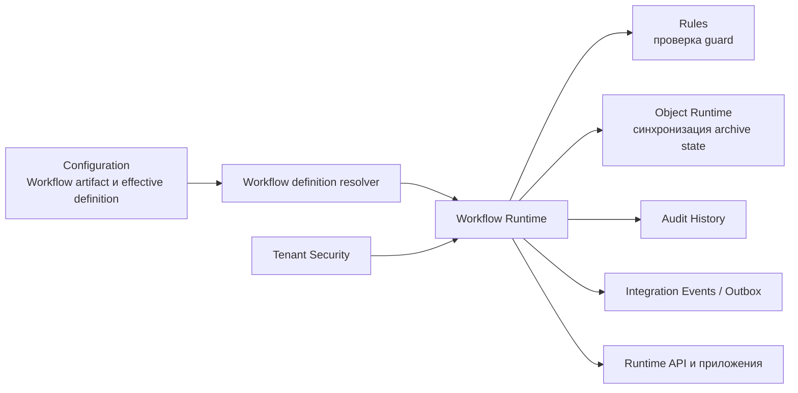

# Обзор платформенной области — Workflow

## 1. Назначение области

Документ даёт карту платформенной области Workflow. Workflow исполняет
состояния, команды и переходы для экземпляра workflow, закрепляет выбранную
ревизию определения, сохраняет состояние и историю и возвращает серверные
контракты для приложений и других платформенных компонентов.

Схема и часть артефакта `Workflow`, отвечающая за его создание и редактирование,
принадлежат Configuration и
описана в [спецификации артефакта Workflow][configuration-workflow].
Предметный смысл объекта и его жизненного цикла остаётся у прикладного
модуля. Эта область не является владельцем бизнес-операций, Rule Engine,
редактора Configuration или рендерер фронтенда.

Сквозные связи Workflow с Object Runtime, Configuration, Rules, Tenant Security,
Audit History и Integration Events показаны в [интеграционной архитектуре
Platform Core](../../02_architecture/07_integration_architecture.md). Этот
пакет раскрывает только собственное исполнение Workflow и его контракты.

## 2. Место в платформе

Workflow получает эффективное определение через host adapter к Configuration,
а не читает таблицы Configuration напрямую. Tenant Security принимает решение
по правам через host adapter. Правила, аудит, доставка событий и изменение
состояния бизнес-объекта принадлежат соответствующим областям.

## 3. Основные возможности

| Возможность | Назначение | Статус | Основание |
| --- | --- | --- | --- |
| Инициализация экземпляра | Создать состояние объекта в начальном состоянии выбранного workflow | Подтверждено, но ограничено | `WorkflowRuntimeService.InitializeInstanceAsync` |
| Просмотр состояния | Вернуть текущее состояние, ревизию определения и маркер конкурентности | Подтверждено MVP | `GetWorkflowState` |
| Доступные команды | Вычислить команды для текущего состояния с учётом права выполнения и guard | Подтверждено, но ограничено | `GetAvailableCommands` |
| Выполнение команды | Выбрать переход, проверить состояние, concurrency и guard, сохранить новое состояние | Подтверждено MVP | `ExecuteCommand` |
| История workflow | Вернуть историю команд для объекта с постраничными параметрами | Подтверждено, но ограничено | `GetWorkflowHistory` |
| Переназначение workflow | Инициализировать другой workflow для того же объекта и записать результат | Подтверждено, но ограничено | `ReassignWorkflowInstance` |
| Закрепление ревизии | Использовать неизменяемый снимок определения для экземпляра | Подтверждено MVP | `IWorkflowDefinitionRevisionStore` |
| Инициализация после создания объекта | Обработать запрос через Integration Events и runtime projection | Подтверждено, но ограничено | `WorkflowInstanceInitializationRequestedPayload` |

## 4. Ключевые решения

| Решение | Смысл |
| --- | --- |
| `CommandCode` не равен `ActionCode` | Публичная команда запускает маршрутизацию workflow; бизнес-действие остаётся отдельным контрактом |
| `Transition` выбирается сервером | Клиент передаёт команду, а Workflow Runtime выбирает переход по состоянию, команде и порядку |
| Экземпляр связан с `WorkflowDefinitionRevision` | Публикация нового определения не должна молча изменить уже начатый экземпляр |
| Состояние индексируется tenant/object/workflow | Один экземпляр состояния определяется комбинацией области, типа объекта, объекта и `WorkflowCode` |
| Изменение archive-состояния синхронизируется с Object Runtime | Workflow передаёт изменение через `IWorkflowArchiveStateSynchronizer`, но не владеет объектным хранилищем |

## 5. Зависимости

| Зависимость | Роль в Workflow | Владелец подробного описания |
| --- | --- | --- |
| Foundation | Общие контексты, корреляция, часы и технические результаты | [Foundation][foundation] |
| Configuration | Effective definition и schema артефакта `Workflow` | [Configuration][configuration] и [спецификация артефакта Workflow][configuration-workflow] |
| Tenant Security | Проверка `Workflow.View` и `Workflow.Execute` | [Tenant Security][tenant-security] |
| Rules | Проверка перехода через guard gateway | `05_rules` |
| Object Runtime | Синхронизация archive state и объектный mutation flow | [Object Runtime][object-runtime] |
| Audit History | Долговременное хранение аудита выполнения | `09_audit_history` |
| Integration Events | Envelope, outbox и доставка событий | `10_integration_events` |
| фронтенд-платформа | Отображение runtime-состояния, оболочка редактора и клиентские пакеты | `12_frontend_platform` |

## 6. Статус реализации

Основная backend-реализация находится в `DMP.Platform.Workflow` и подключена в host.
Текущий MVP использует .NET, EF Core и SQL Server, имеет отдельные таблицы
состояния, истории и ревизий и покрыт интеграционными тестами. Guard evaluation,
выбор нескольких workflows, production-наблюдаемость и часть сценариев
инициализации ограничены текущей реализацией и не должны описываться как
полная BPMN или универсальная workflow-платформа.

У Workflow нет отдельного `06_user_experience.md`: editor Workflow относится к
Configuration UX, а runtime-представление состояния и команд — к Frontend
Platform. В Workflow остаются только серверные контракты и ограничения,
которые нужны этим потребителям.

## 7. Состав документов

| Документ | Содержание |
| --- | --- |
| `01_scope.md` | Границы Workflow и владельцы соседних механизмов |
| `02_architecture.md` | Техническая модель runtime, компоненты, данные и зависимости |
| `03_contracts.md` | HTTP, DTO, события и межкомпонентные порты |
| `04_runtime.md` | Сценарии, выбор переходов, закрепление ревизий и сбои |
| `05_security_and_audit.md` | Права, аудит и границы контроля |
| `07_quality.md` | Проверяемые гарантии и ограничения тестов |
| `08_operations.md` | Запуск, хранение, диагностика и восстановление |
| `90_traceability.md` | Источники, расхождения, открытые вопросы и маршрут обновлений |
[configuration-workflow]: ../02_configuration/artifact_types/workflow.md
[foundation]: ../00_foundation/00_platform_overview.md
[configuration]: ../02_configuration/00_platform_overview.md
[tenant-security]: ../01_tenant_and_security/00_platform_overview.md
[object-runtime]: ../03_object_runtime/00_platform_overview.md

## История изменений

| Версия | Дата и время | Автор | Раздел | Изменение | Коммит/PR |
|---|---|---|---|---|---|
| 0.1 | 2026-08-27 15:04 +03:00 | Олег Юрьев (@axelprosoft) | Создание документа | подготовлен драфт новой проектной документации на ядро, прикладные модули, а так же термины и общие концептуальные документы | [5ecb26b1](https://github.com/axelprosoft/DMP.PlatformFoundation/commit/5ecb26b1c3ff3cfcdc13018e59526ae684ca6007) |
