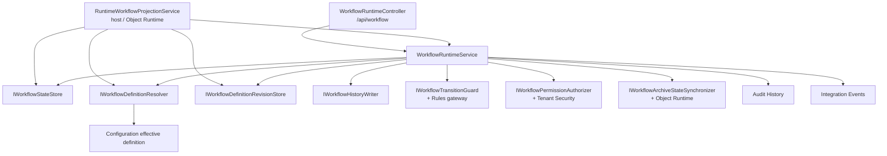

# Архитектура — Workflow

## 1. Назначение документа

Документ описывает техническую архитектуру Workflow Runtime: компоненты,
которые разрешают definition, хранят экземпляры и ревизии, выбирают переходы,
проверяют внешние условия и передают результаты соседним областям. Поля
конфигурационного артефакта описаны в [документе Configuration][workflow-schema],
а пошаговое исполнение разобрано в `04_runtime.md`.

## 2. Граница и компоненты

| Компонент | Ответственность | Граница |
| --- | --- | --- |
| `WorkflowRuntimeController` | Публикует HTTP-маршруты Workflow Runtime | Внешний HTTP-контракт |
| `WorkflowRuntimeService` | Координирует разрешение definition, проверки, переход и записи результата | Координация прикладного сценария |
| `IWorkflowDefinitionResolver` | Получает текущее effective definition из host composition | Адаптер Configuration |
| `IWorkflowDefinitionRevisionStore` | Создаёт и читает неизменяемый снимок definition по хэшу revision | Граница хранения и runtime |
| `IWorkflowStateStore` | Читает и обновляет состояние экземпляра с concurrency token | Граница хранения |
| `IWorkflowHistoryWriter` | Записывает и читает историю команд | Граница хранения |
| `IWorkflowTransitionGuard` | Подключает специализированные проверки перехода | Точка расширения |
| `IWorkflowPermissionAuthorizer` | Проверяет право просмотра и выполнения | Адаптер Tenant Security |
| `IWorkflowArchiveStateSynchronizer` | Сообщает Object Runtime о входе или выходе из archive state | Межобластной порт |

Помимо HTTP-контроллера, host-композиция использует `IWorkflowRuntimeService` и
часть портов Workflow через `RuntimeWorkflowProjectionService` для runtime-проекции
и идемпотентной инициализации. Этот потребитель
находится на границе host/Object Runtime; он не становится компонентом,
владельцем схемы или исполнителем Workflow.

## 3. Архитектурная модель и инварианты

Архитектура разделяет три уровня:

1. опубликованное effective definition, которое приходит из Configuration;
2. неизменяемая `WorkflowDefinitionRevision`, сохранённая для повторного выполнения;
3. экземпляр, идентифицируемый tenant, object type, object id и `WorkflowCode`.

Основные инварианты:

- `WorkflowCode` определяет логическую модель, а revision — конкретную
  эффективную структуру;
- один ключ tenant/object type/object/workflow имеет не более одного состояния;
- `CommandCode` является внешним trigger, `TransitionCode` используется только
  внутри backend-маршрутизации;
- переход выбирается по текущему state и command, затем сортируется по `Order`
  и стабильному `TransitionCode`;
- state change не выполняется при несовпадении ожидаемого state или concurrency
  token;
- переход между archive и non-archive state передаётся Object Runtime;
- новая публикация definition не переключает существующие экземпляры молча;
- текущая модель не исполняет inline business handlers или workflow steps.

## 4. Persistence-модель и хранение

Текущая реализация использует `WorkflowDbContext` с SQL Server-схемой
`workflow`; при отсутствии connection string используется EF Core InMemory для
локальной композиции.

| Таблица | Смысл | Архитектурно значимые данные |
| --- | --- | --- |
| `workflow.workflow_states` | Текущее состояние экземпляра | `TenantId`, `ObjectTypeCode`, `ObjectId`, `WorkflowCode`, `WorkflowDefinitionRevision`, `CurrentStateCode`, `ConcurrencyToken`, `UpdatedBy`, `UpdatedAtUtc` |
| `workflow.workflow_history` | Результаты команд и переназначений | workflow/object identity, `CommandCode`, from/to state, result, tenant/user, `CorrelationId`, UTC time, JSON details |
| `workflow.workflow_definition_revisions` | Неизменяемые снимки definition | module/object/workflow identity, `Revision`, `SourceVersion`, `DefinitionJson`, время создания |

Для `workflow_states` задан уникальный индекс по tenant, object type, object id
и workflow. Revision строится как `sha256:` плюс lower-case SHA-256 от
нормализованного JSON snapshot. Это техническая реализация текущего MVP, а не
принятое решение о целевой PostgreSQL-схеме.

## 5. Зависимости и точки расширения

| Зависимость или порт | Как используется | Владелец семантики |
| --- | --- | --- |
| `IWorkflowDefinitionResolver` | Получает effective definition и язык | Configuration / host composition |
| `IWorkflowTransitionGuard` | Может разрешить или отклонить transition | Координация Workflow; Rules вычисляет правила |
| `IRuleEvaluationGateway` | Используется текущим адаптером guard для оценки binding | Rules |
| `IWorkflowPermissionAuthorizer` | Формирует решение по `Workflow.View` и `Workflow.Execute` | Tenant Security |
| `IWorkflowArchiveStateSynchronizer` | Синхронизирует archive state объекта | Object Runtime |
| `IAuditHistoryWriter` | Записывает аудит успешных execute/reassign | Audit History |
| `IIntegrationEventPublisher` | Публикует события результата | Integration Events |
| `IWorkflowExecutionTransaction` | Оборачивает выполнение команды в локальную границу транзакции | Инфраструктура Workflow |

В host-композиции обязательные адаптеры заменяют резервные сервисы: resolver
подключается к Configuration, permission authorizer — к Tenant Security,
archive synchronizer — к Object Runtime. Fallback `EmptyWorkflowDefinitionResolver`,
`MissingWorkflowPermissionAuthorizer` и no-op synchronizer предназначены для
неполной или тестовой композиции и не являются production-гарантией.

## 6. Технические ограничения

- текущая реализация хранения зависит от .NET 9, EF Core 9 и SQL Server;
- SQL Server initialization содержит ручную совместимость с прежним именем
  `WorkflowVersion`, поэтому миграцию нужно проверять отдельно;
- Чтение истории использует текущий `IWorkflowHistoryWriter.GetSnapshot`, а не
  отдельный оптимизированный контракт чтения;
- guard может вернуть `NotEvaluated`, после чего команда отклоняется;
- `ReassignInstance` не обёрнут в `IWorkflowExecutionTransaction`; согласованность
  записи target state, history, audit и event между владельцами не является
  гарантией текущего MVP;
- детальная политика доставки outbox и повторов принадлежит Integration Events;
- полноценные workflow steps, assignments и универсальный selector несколькими
  definition не являются гарантией текущего MVP;
- Java/PostgreSQL mapping не входит в этот документ и оформляется отдельной
  migration-задачей, когда будет принято соответствующее целевое решение.
[workflow-schema]: ../02_configuration/artifact_types/workflow.md

## История изменений

| Версия | Дата и время | Автор | Раздел | Изменение | Коммит/PR |
|---|---|---|---|---|---|
| 0.1 | 2026-08-27 15:04 +03:00 | Олег Юрьев (@axelprosoft) | Создание документа | подготовлен драфт новой проектной документации на ядро, прикладные модули, а так же термины и общие концептуальные документы | [5ecb26b1](https://github.com/axelprosoft/DMP.PlatformFoundation/commit/5ecb26b1c3ff3cfcdc13018e59526ae684ca6007) |
