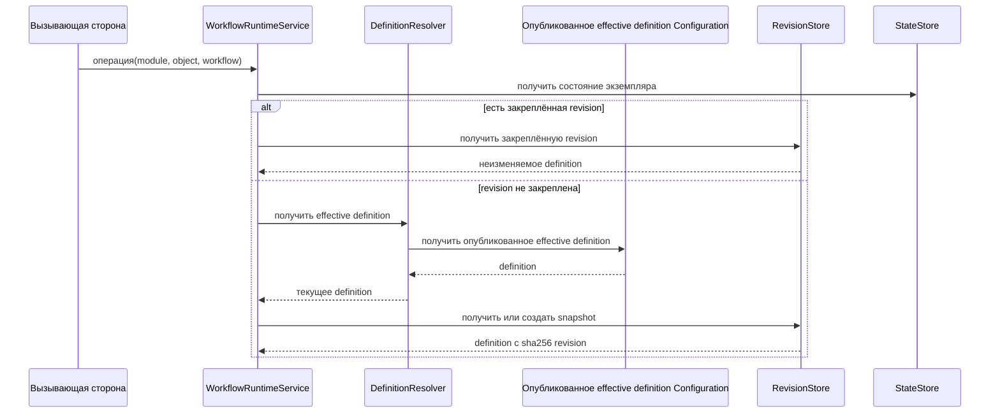
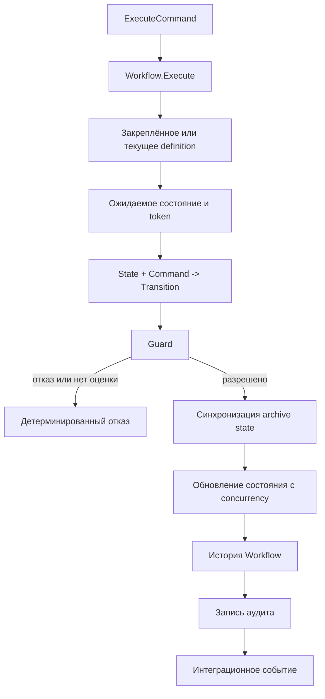
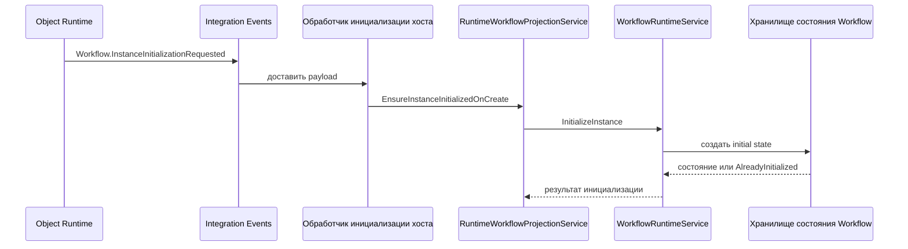

# Исполнение — Workflow

[workflow-service]: ../../../src/Platform/DMP.Platform.Workflow/Application/Services/WorkflowRuntimeService.cs
[config-resolver]: ../../../src/Platform/DMP.Platform.Workflow/Application/Abstractions/IWorkflowDefinitionResolver.cs
[revision-store]: ../../../src/Platform/DMP.Platform.Workflow/Application/Abstractions/IWorkflowDefinitionResolver.cs
[state-store]: ../../../src/Platform/DMP.Platform.Workflow/Abstractions/IWorkflowStateStore.cs
[initialization-handler]: ../../../src/Hosts/DMP.Platform.Api/Composition/WorkflowInstanceInitializationRequestedEventHandler.cs
[runtime-projection]: ../../../src/Hosts/DMP.Platform.Api/Composition/RuntimeWorkflowProjectionService.cs
[runtime-service]: ../../../src/Platform/DMP.Platform.Runtime/Application/Services/Core/ApplicationRuntimeService.cs

## 1. Назначение документа

Документ описывает фактическое выполнение Workflow Runtime: инициализацию,
получение состояния и истории, вычисление доступных команд, выбор transition,
проверку guard и concurrency, запись результата и интеграцию с соседними
областями.

## 2. Основные сценарии

| Сценарий | Результат | Ограничение |
| --- | --- | --- |
| `InitializeInstance` | Состояние создаётся в указанном или definition initial state | Повтор возвращает `AlreadyInitialized` |
| `GetState` | Возвращаются state, title, revision и concurrency token | При отсутствии состояния часть полей пуста |
| `GetHistory` | Возвращается страница истории команд, включая зафиксированные отказы | `Take` ограничен 200; чтение использует снимок |
| `GetAvailableCommands` | Для команд возвращается availability и причина блокировки | Guard должен быть оценён; право выполнения проверяется отдельно |
| `ExecuteCommand` | Состояние переводится в целевое состояние, записываются history/audit/event | Состояние не меняется при отказе проверки; согласованность с archive sync ограничена границей владельцев |
| `ReassignInstance` | Создаётся target workflow для объекта | Source остаётся; target не должен существовать |
| Инициализация после create | Событие outbox передаётся в runtime projection | Доставка и повторы принадлежат Integration Events |

## 3. Операции и алгоритмы

### 3.1. Разрешение definition

Для нового экземпляра resolver получает effective definition из Configuration.
Workflow создаёт или находит её неизменяемый снимок в
`IWorkflowDefinitionRevisionStore`. Для существующего экземпляра сначала
используется `WorkflowDefinitionRevision` из состояния.



Схема разделяет три разных объекта: опубликованное effective definition из
Configuration, неизменяемый snapshot `WorkflowDefinitionRevision` и состояние
конкретного экземпляра. Публикация Configuration не изменяет уже закреплённую
revision автоматически. ([resolver][config-resolver]; [revision store][revision-store]; [state store][state-store])

### 3.2. Вычисление доступных команд

Runtime выбирает transitions, у которых `FromStateCode` совпадает с текущим
state, группирует их по `CommandCode` и сопоставляет с definition commands.
Для первой подходящей transition оценивается guard. `IsAvailable` становится
`true` только при наличии transition, праве выполнения и удовлетворённом guard.
Недоступная команда остаётся в ответе с `DisabledReasonCode`, если она есть в
definition.

### 3.3. Выполнение команды

`ExecuteCommand` оборачивается в `IWorkflowExecutionTransaction` и выполняется
в следующем порядке:

1. Удаляются внешние пробелы из module, object, workflow и command codes.
2. Проверяется `Workflow.Execute`.
3. Загружается состояние или, при отсутствии состояния, разрешается initial
   state и создаётся запись экземпляра.
4. Разрешается закреплённая definition revision.
5. Проверяются `ExpectedStateCode` и `ExpectedConcurrencyToken`.
6. Выбирается первая transition по state и command, сначала по `Order`, затем
   по `TransitionCode`.
7. Выполняется guard.
8. При изменении archive-признака вызывается
   `IWorkflowArchiveStateSynchronizer`.
9. Состояние обновляется с проверкой concurrency.
10. Записываются история workflow и аудит, после чего публикуется событие
    `Workflow.CommandExecuted`.



Текущий `WorkflowDefinition` не содержит исполняемых transition steps или
вызовов `ActionCode`. Поэтому старые описания автоматических шагов не являются
частью этого MVP-сценария.

### 3.4. Инициализация и переназначение

`InitializeInstance` проверяет существующее состояние, разрешает definition,
выбирает `InitialStateCode` из запроса или definition и сохраняет новое
состояние. Отдельная инициализация не записывает переход history сама по себе.

`ReassignInstance` требует существующее source state, выбирает target definition
и создаёт target state. Затем записывает history, audit и
`Workflow.InstanceReassigned`. Source state сохраняется.

Инициализация после создания объекта проходит через межобластное событие. Сам
`ApplicationRuntimeService` публикует событие только после успешного создания
объекта; host handler принимает payload и передаёт его в
`RuntimeWorkflowProjectionService`, который подготавливает и сохраняет
начальное состояние через [WorkflowRuntimeService][workflow-service]. ([runtime-service][runtime-service]; [initialization-handler][initialization-handler]; [runtime-projection][runtime-projection])



Схема показывает направление вызовов, подтверждённое текущей host-композицией.
Гарантии доставки, повторной обработки и outbox принадлежат Integration Events;
сама инициализация идемпотентна на уровне проверки существующего состояния.

## 4. Правила

- Все обязательные identity codes нормализуются обрезкой внешних пробелов и не
  могут быть пустыми.
- Для stateful объекта текущая state identity хранится отдельно от object data.
- State code должен присутствовать в выбранной definition; переход на неизвестное
  состояние не выполняется.
- Одно состояние на tenant/object type/object/workflow обеспечивается уникальным
  индексом persistence.
- Guard failure и отсутствие оценки guard не должны трактоваться как успех.
- Клиентский список доступных команд не является источником права: execute
  повторяет server-side проверку.

## 5. Жизненные циклы

```text
Не инициализирован
  -> Инициализирован в InitialStateCode
  -> Переход по CommandCode
  -> Новое состояние
  -> Переходы до IsFinal или archive state
```

Workflow Runtime не навязывает конкретные названия state и не переводит объект
в final state автоматически. `IsFinal` и `IsArchiveState` приходят из
definition; бизнес-смысл завершения остаётся у владельца объекта.

## 6. Согласованность

Выполнение команды использует локальную границу транзакции через
`IWorkflowExecutionTransaction`. Запись состояния и history выполняется в
сценарии сервиса; вызовы audit, Integration Events и archive synchronizer
пересекают границы других владельцев. Распределённая атомарность и действия
после фиксации транзакции не являются гарантией текущего MVP.

Workflow state закрепляет revision definition. При чтении состояние с потерянной
revision может быть восстановлено через текущую definition и пере-закреплено;
при execute отсутствие pinned revision приводит к детерминированному отказу.
Это различие является ограничением текущей реализации и требует отдельной
политики промышленного восстановления.

## 7. Сбои и восстановление

| Сбой | Поведение |
| --- | --- |
| Definition не найдена | Операция отклоняется с `WORKFLOW_DEFINITION_NOT_FOUND` |
| Pinned revision не найдена при execute | Операция отклоняется с `WORKFLOW_DEFINITION_REVISION_NOT_FOUND` |
| State или concurrency token изменился | Операция отклоняется с `WORKFLOW_STATE_MISMATCH` или `WORKFLOW_CONCURRENCY_MISMATCH` |
| Command не имеет перехода | Операция отклоняется с `WORKFLOW_COMMAND_NOT_AVAILABLE` |
| Guard отклонён | Операция отклоняется с `WORKFLOW_GUARD_REJECTED` |
| Guard не оценён | Операция отклоняется с `WORKFLOW_GUARDS_NOT_EVALUATED` |
| Collision при обновлении state | Store повторяет локальную попытку или возвращает concurrency rejection |
| Ошибка publisher/audit или archive synchronizer после начала сценария | Обработка зависит от локальной границы транзакции и политики соседнего владельца; общий контракт восстановления не закреплён |

## История изменений

| Версия | Дата и время | Автор | Раздел | Изменение | Коммит/PR |
|---|---|---|---|---|---|
| 0.1 | 2026-08-26 23:30 +03:00 | Олег Юрьев (@axelprosoft) | Создание документа | предварително готовые модули ядра и связанные изменения | [ca13b19b](https://github.com/axelprosoft/DMP.PlatformFoundation/commit/ca13b19bd17dd297927c1e66a97f95c29735b971) |
