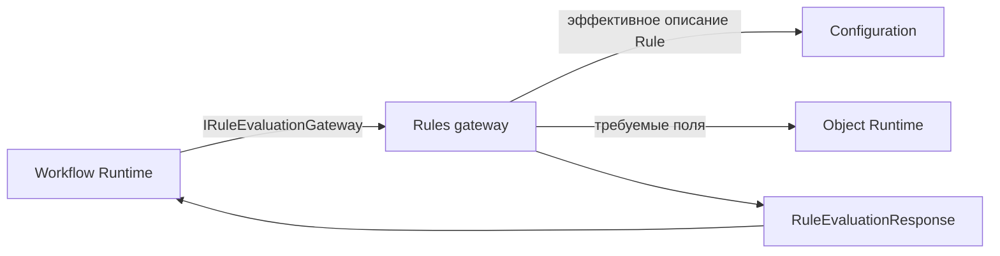

# Обзор платформенной области - Rules

## 1. Назначение документа

Документ даёт карту платформенной области Rules. В текущем MVP область
предоставляет межкомпонентный C#-контракт оценки привязанных правил и его
реализацию в составе host-приложения (`composition root`). Основной потребитель этого контракта - Workflow.

Область не является владельцем схемы конфигурационного артефакта `Rule`,
редактора правил, предметных инвариантов или UI.

## 2. Роль в Platform Core

Rules получает запрос на проверку привязок, при необходимости читает effective
`Rule` из Configuration и значения объекта через Object Runtime, затем возвращает
результат оценки. В текущем MVP поддерживается ограниченная проверка выражений
с булевым результатом.

## 3. Граница и владельцы

| Тема | Входит в Rules | Владелец подробностей |
| --- | --- | --- |
| Контракт оценки | `IRuleEvaluationGateway` и его типы запроса и ответа | Rules |
| Получение схемы `Rule` | Использование эффективной конфигурации | Configuration |
| Чтение значений объекта | Запрос нужных полей через `IObjectRuntime` | Object Runtime |
| Guard перехода | Вызов Rules и обработка результата | Workflow |
| Обязательный инвариант объекта | Не входит | Domain Modules |
| Редактор и отображение правил | Не входит | Configuration / фронтенд-платформа |

## 4. Текущий статус сведений

| Сведение | Статус сведения | Основание |
| --- | --- | --- |
| `IRuleEvaluationGateway` существует как C#-контракт | Подтверждено MVP | Интерфейс и контракты в `DMP.Platform.Rules` |
| Host подключает `RuntimeRuleEvaluationGateway` | Подтверждено MVP | Composition root `DMP.Platform.Api` |
| Встроенный fallback возвращает `NotEvaluated` | Подтверждено MVP | `NotConfiguredRuleEvaluationGateway` |
| Runtime оценивает только `Expression` с `Boolean` результатом | Подтверждено, но ограничено | Реализация адаптера host-приложения |
| Полный Rule Engine с таблицами, скриптами и DSL | Будущая доработка | В текущем коде не реализован |

## 5. Основной поток взаимодействия

Общая карта сквозных взаимодействий находится в
[`07_integration_architecture.md`](../../02_architecture/07_integration_architecture.md).
Здесь показана только локальная связь Rules с непосредственными потребителями и
зависимостями.

## 6. Состав пакета

| Документ | Содержание |
| --- | --- |
| `01_scope.md` | Граница Rules и владельцы соседних обязанностей |
| `02_architecture.md` | Компоненты gateway, адаптер host-приложения и зависимости |
| `03_contracts.md` | `IRuleEvaluationGateway` и типы его запроса и ответа |
| `04_runtime.md` | Фактический порядок разрешения и оценки правила |
| `07_quality.md` | Тестовые свидетельства и ограничения покрытия |
| `08_operations.md` | DI-регистрация, host override и fallback |
| `90_traceability.md` | Источники, расхождения и будущие решения |

Документы `05_security_and_audit.md` и `06_user_experience.md` не создаются:
в Rules нет собственной модели безопасности, аудита или пользовательского
интерфейса.

## История изменений

| Версия | Дата и время | Автор | Раздел | Изменение | Коммит/PR |
|---|---|---|---|---|---|
| 0.1 | 2026-08-27 15:04 +03:00 | Олег Юрьев (@axelprosoft) | Создание документа | подготовлен драфт новой проектной документации на ядро, прикладные модули, а так же термины и общие концептуальные документы | [5ecb26b1](https://github.com/axelprosoft/DMP.PlatformFoundation/commit/5ecb26b1c3ff3cfcdc13018e59526ae684ca6007) |
