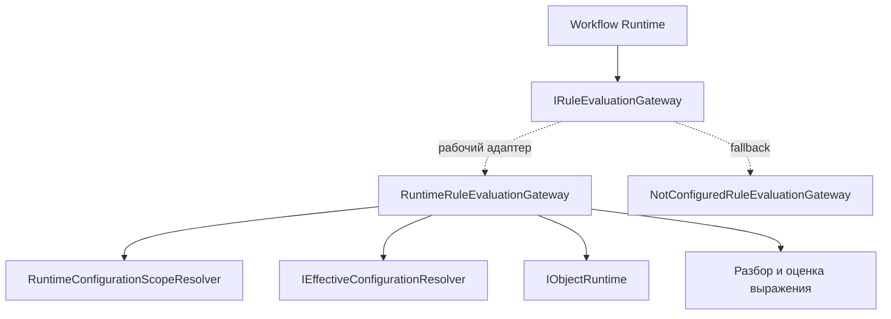

# Архитектура - Rules

## 1. Назначение документа

Документ описывает техническую архитектуру Rules: публичный gateway, host
реализацию оценки и границы с Configuration, Object Runtime и Workflow.

## 2. Граница и компоненты

| Компонент | Ответственность | Зависимости | Подтверждение |
| --- | --- | --- | --- |
| `IRuleEvaluationGateway` | Межкомпонентная точка вызова оценки | `RuleEvaluationRequest`, `RuleEvaluationResponse` | [interface][gateway] |
| `NotConfiguredRuleEvaluationGateway` | Fallback при отсутствии рабочей регистрации | `IRuleEvaluationGateway` | [fallback][fallback] |
| `RuntimeRuleEvaluationGateway` | Получает эффективное описание `Rule`, читает объект и оценивает выражение | Служба разрешения Configuration, Object Runtime, определитель текущего scope | [host gateway][host-gateway] |
| Workflow Runtime | Передаёт guard bindings и принимает результат | Rules gateway | [workflow][workflow] |

`RuntimeRuleEvaluationGateway` находится в составе host-приложения
(`composition root`), потому что для
оценки ему нужны конкретные адаптеры Configuration и Object Runtime. Это не
переносит владение этими областями в Rules.

## 3. Архитектурная модель и инварианты

Rules построен как порт и адаптер:

| Понятие или архитектурный тип | Техническое имя | Владелец | Связи | Инвариант | Подтверждение |
| --- | --- | --- | --- | --- | --- |
| Порт оценки | `IRuleEvaluationGateway` | Rules | Используется Workflow | Результат имеет один из трёх кодов | [interface][gateway] |
| Эффективное описание правила | `RuleDefinition` | Адаптер host-приложения / источник предоставляет Configuration | Читается через effective resolver | Не является схемой или сущностью хранения Rules | [host gateway][host-gateway] |
| Значения объекта | `RuntimeObjectDetailsResponse.Values` | Object Runtime | Передаются механизму оценки | Rules читает значения и не сохраняет объект | [host gateway][host-gateway] |
| Результат оценки | `RuleEvaluationResponse` | Rules | Возвращается потребителю | `Rejected` содержит диагностические записи; `NotEvaluated` не означает успех | [interface][gateway] |

Главные инварианты:

- Rules не выбирает репозиторий и не открывает транзакцию;
- Rules не изменяет объект и не публикует события напрямую;
- отсутствующий descriptor, Rule или неподдерживаемая форма выражения дают
  `NotEvaluated`;
- отсутствие bindings даёт `Satisfied`;
- обязательные доменные проверки не заменяются Rule evaluation.

## 4. Persistence-модель и хранение

| Данные | Техническое представление | Владелец | Хранение | Ключ или ограничение | Подтверждение |
| --- | --- | --- | --- | --- | --- |
| Описание правила | Запись эффективной конфигурации | Configuration | Хранилище Configuration | Идентификация задаётся Configuration | [resolver][config-resolver] |
| Значения объекта | Ответ загрузки деталей runtime | Object Runtime / domain module | Хранилище прикладного объекта | Читаются только требуемые поля | [host gateway][host-gateway] |
| Результат оценки | Ответ в памяти | Rules | Не хранится Rules | Передаётся вызывающему компоненту | [interface][gateway] |

У Rules нет собственной persistence-модели в текущем MVP.

## 5. Зависимости и точки расширения

| Зависимость или точка расширения | Как используется | Владелец |
| --- | --- | --- |
| `IEffectiveConfigurationResolver` | Разрешает effective `Rule` по scope и object context | Configuration |
| `IObjectRuntime` | Проверяет descriptor и загружает значения объекта | Object Runtime |
| `RuntimeConfigurationScopeResolver` | Определяет текущие Corporate/Tenant/Site scope | Configuration / host |
| Регистрация `IRuleEvaluationGateway` | Позволяет host заменить fallback рабочим адаптером | Состав host-приложения |

## 6. Технические ограничения

В текущем MVP механизм оценки поддерживает только:

- `LogicEngineType = Expression`;
- `LogicReturnKind = Boolean`;
- простой путь свойства, оператор `==` или `!=` и литерал `null`, boolean,
  number или string;
- оценку по значениям одного загруженного объекта.

Не подтверждены текущим кодом параметры с подстановкой значений, вычисления,
эффекты, decision tables, scripts, DSL, произвольные вызовы сервисов и
собственная транзакционная обработка Rules.
[gateway]: ../../../src/Platform/DMP.Platform.Rules/Abstractions/IRuleEvaluationGateway.cs
[fallback]: ../../../src/Platform/DMP.Platform.Rules/Services/NotConfiguredRuleEvaluationGateway.cs
[host-gateway]: ../../../src/Hosts/DMP.Platform.Api/Composition/RuntimeRuleEvaluationGateway.cs
[workflow]: ../../../src/Platform/DMP.Platform.Workflow/Application/Services/WorkflowRuntimeService.cs
[config-resolver]: ../../../src/Platform/DMP.Platform.Configuration/Application/Abstractions/Effective/IEffectiveConfigurationResolver.cs

## История изменений

| Версия | Дата и время | Автор | Раздел | Изменение | Коммит/PR |
|---|---|---|---|---|---|
| 0.1 | 2026-08-27 15:04 +03:00 | Олег Юрьев (@axelprosoft) | Создание документа | подготовлен драфт новой проектной документации на ядро, прикладные модули, а так же термины и общие концептуальные документы | [5ecb26b1](https://github.com/axelprosoft/DMP.PlatformFoundation/commit/5ecb26b1c3ff3cfcdc13018e59526ae684ca6007) |
