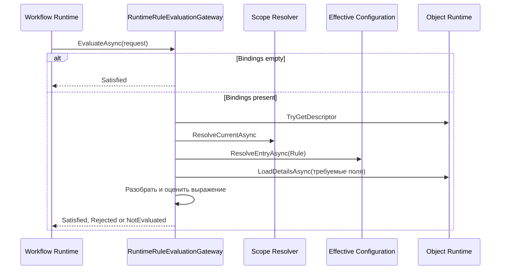

# Исполнение - Rules

## 1. Назначение документа

Документ описывает фактический порядок оценки привязок через
`RuntimeRuleEvaluationGateway`. Он не описывает схему Configuration и не
выбирает переход Workflow.

## 2. Сквозной сценарий



## 3. Порядок выполнения

1. Gateway проверяет, что запрос не равен `null`.
2. При пустом `Bindings` сразу возвращается `Satisfied` с пустым `Issues`.
3. `ObjectTypeCode` нормализуется: префикс, совпадающий с `ModuleCode`,
   удаляется.
4. Через `IObjectRuntime.TryGetDescriptor` проверяется descriptor объекта.
   При отсутствии descriptor возвращается `NotEvaluated` с кодом
   `RUNTIME_OBJECT_DESCRIPTOR_NOT_FOUND`.
5. Через `RuntimeConfigurationScopeResolver` определяется текущий scope.
6. Для каждой привязки разрешается эффективное описание `Rule` через
   `IEffectiveConfigurationResolver` с типом `ConfigurationArtifactTypeCodes.Rule`.
7. Если отсутствует `RuleCode`, Rule или поддержанная форма Rule, обработка
   возвращает `NotEvaluated` с соответствующим issue.
8. Отключённое правило не создаёт отказ и не оценивается.
9. Для поддержанного выражения в набор требуемых полей добавляется путь
   выражения и коды параметров Rule.
10. Через Object Runtime загружаются детали объекта только для требуемых полей.
11. Выражение сравнивается со значением пути объекта. Поддержаны `==` и `!=`.
12. Если хотя бы одно выражение вернуло false, возвращается `Rejected` с
   `RULE_REJECTED`; иначе возвращается `Satisfied`.

## 4. Поддержанный синтаксис выражения

Текущий разборщик принимает форму:

```text
<PropertyPath> == <Literal>
<PropertyPath> != <Literal>
```

Путь начинается с буквы или `_` и может содержать точки. Литерал может быть
`null`, `true`, `false`, числом, строкой в одинарных или двойных кавычках либо
непробельным текстом.

Сравнение выполняется с учётом преобразования boolean и decimal. Отсутствующее
значение трактуется как `null`; пустая строка также считается пустым значением
при сравнении с `null`.

## 5. Результаты сценария

| Условие | Результат | Что делает потребитель |
| --- | --- | --- |
| Нет bindings | `Satisfied` | Продолжает сценарий |
| Все включённые поддержанные Rules истинны | `Satisfied` | Продолжает сценарий |
| Поддержанное Rule ложно | `Rejected` и `RULE_REJECTED` | Отказывает в операции по своей политике |
| Rule нельзя найти или оценить | `NotEvaluated` | Не считает проверку успешной |
| Gateway не настроен | `NotEvaluated` и `RULE_GATEWAY_NOT_CONFIGURED` | Применяет политику Workflow |

Workflow самостоятельно преобразует результат gateway в доступность команды и
отказ выполнения. Rules не возвращает HTTP status и не изменяет состояние
workflow.

## 6. Ограничения текущего MVP

- `Context` запроса не используется как таблица подстановки параметров;
- `RuleEvaluationBinding` не содержит значений параметров;
- коды параметров добавляются в набор требуемых полей, но отдельная семантика
  привязки параметров не реализована;
- поддержан только возвращаемый тип `Boolean`;
- evaluator не применяет эффекты и не вызывает внешние сервисы;
- Rules не хранит результат и не управляет транзакцией;
- отсутствие рабочей регистрации не трактуется как `Satisfied`.

## 7. Владение поведением

| Поведение | Владелец |
| --- | --- |
| Отбор guard bindings для перехода | Workflow |
| Получение эффективного описания `Rule` | Configuration |
| Чтение деталей объекта | Object Runtime |
| Оценка поддержанного выражения | Адаптер host-приложения Rules |
| Обязательный доменный инвариант | Domain Module |
| Реакция на `Rejected` или `NotEvaluated` | Workflow или другой потребитель |

## 8. Источники

- [host evaluator][host-gateway];
- [Rules contract][gateway];
- [Процесс проверки guard в Workflow][workflow].
[host-gateway]: ../../../src/Hosts/DMP.Platform.Api/Composition/RuntimeRuleEvaluationGateway.cs
[gateway]: ../../../src/Platform/DMP.Platform.Rules/Abstractions/IRuleEvaluationGateway.cs
[workflow]: ../../../src/Platform/DMP.Platform.Workflow/Application/Services/WorkflowRuntimeService.cs

## История изменений

| Версия | Дата и время | Автор | Раздел | Изменение | Коммит/PR |
|---|---|---|---|---|---|
| 0.1 | 2026-08-27 15:04 +03:00 | Олег Юрьев (@axelprosoft) | Создание документа | подготовлен драфт новой проектной документации на ядро, прикладные модули, а так же термины и общие концептуальные документы | [5ecb26b1](https://github.com/axelprosoft/DMP.PlatformFoundation/commit/5ecb26b1c3ff3cfcdc13018e59526ae684ca6007) |
