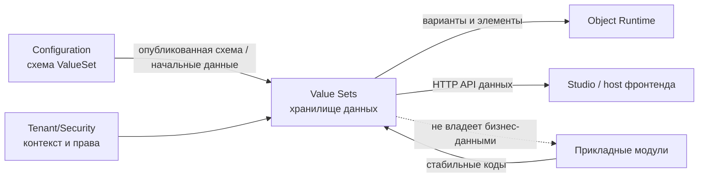

# Граница платформенной области — Value Sets

## 1. Назначение документа

Документ фиксирует, какие данные и операции принадлежат Value Sets, а какие
остаются у Configuration, Object Runtime, Tenant/Security, фронтенд-платформа
или прикладных модулей.

## 2. Что входит

| Обязанность | Входит | Не входит | Соседний владелец | Основание |
| --- | --- | --- | --- | --- |
| Хранение фактических элементов | `ValueSetDataSet` и `ValueSetItem` | Схема Configuration | — | Модель Value Sets |
| Области данных элементов | `Global`, `Tenant`, `Site` | Общая модель Tenant/Site | Tenant/Security | Поля элемента и проверки области данных |
| Эффективный набор | Выбор строки по приоритету `Site` > `Tenant` > `Global` | Предметная валидация бизнес-справочника | Domain Module | Исполнение Value Sets |
| Иерархия элементов | `Flat` и `Hierarchical`, родительская связь и проверка циклов | Общая модель объектов | Configuration / Object Runtime | Контракт и проверки исполнения |
| API исполнения | Чтение элементов и вариантов | Материализация объекта или представления | Object Runtime | HTTP и контракт разрешения значений |
| API редактора данных | Просмотр, создание, изменение, активация и деактивация через backend API и интеграцию редактора Studio | Общая оболочка, маршрутизация и базовые средства отображения | фронтенд-платформа для общих средств; Value Sets для feature provider и настроенных представлений | `03_contracts.md`, `06_user_experience.md` |
| Отображаемые значения | Подготовленные подписи Tenant/Site и родителя | Владение справочниками сущностей | Foundation / Tenant/Security | Контракт отображаемых ссылок |

## 3. Что не входит

| Тема | Почему не входит | Владелец |
| --- | --- | --- |
| Схема и редактирование `ValueSet` | Это конфигурационный артефакт | [Configuration](../02_configuration/00_platform_overview.md) |
| Кодовые значения `SystemEnum` | Значения задаются кодом или системным поставщиком значений | [Configuration](../02_configuration/artifact_types/system_enum.md) и системный поставщик |
| Общие сущности Tenant/Site и права | Value Sets только использует контекст и проверки прав | [Tenant/Security](../01_tenant_and_security/00_platform_overview.md) |
| Материализация объекта или представления | Это результат исполнения другого владельца | [Object Runtime](../03_object_runtime/00_platform_overview.md) |
| Общая оболочка фронтенда и базовые средства отображения | Не являются частью Value Sets | фронтенд-платформа; интеграция редактора Studio описана в `06_user_experience.md` |
| Бизнесовые справочники и нормативно-справочные данные | Value Sets предоставляет механизм, но не предметные данные | Соответствующий Domain Module |
| Согласование, управление нормативными данными и ответственность хранителя | В текущем MVP отдельный контракт не подтверждён | Будущий отдельный владелец |
| Общий аудит изменений | Собственный контракт аудита Value Sets не подтверждён | Audit History |

## 4. Граница с соседними областями и модулями

### 4.1. Ответственность по данным

`ValueSetCode` связывает схему Configuration с набором данных Value Sets.
`ValueSetDataSetId` и `ValueSetItem.Id` являются внутренними ключами хранения.
`ValueSetItem.Code` является стабильным кодом элемента внутри набора и области данных.

Область данных Tenant/Site хранится у `ValueSetItem`, а не у `ValueSetDataSet`. Поэтому
один набор данных может содержать строки `Global`, `Tenant` и `Site` одного набора.

## 5. Соответствие требованиям

| Требование | Покрытие | Решение | Документ-владелец |
| --- | --- | --- | --- |
| Хранить элементы набора значений | Полное для текущего MVP | Используются `ValueSetDataSet` и `ValueSetItem` | `02_architecture.md` |
| Поддерживать области `Global`/`Tenant`/`Site` | Подтверждено | Scope хранится на элементе, приоритет — `Site` > `Tenant` > `Global` | `04_runtime.md` |
| Поддерживать плоские и иерархические наборы | Подтверждено | `Structure` определяет наличие parent-связи | `03_contracts.md`, `04_runtime.md` |
| Редактировать фактические элементы | Ограничено текущим API | Создание, изменение, активация и деактивация; удаления нет | `03_contracts.md` |
| Отображать связанные Tenant/Site | Подтверждено в интеграции Studio с ограничениями API | Используется контракт отображаемых ссылок; общие средства отображения принадлежат фронтенд-платформа | `03_contracts.md`, `06_user_experience.md` |

## 6. Ограничения версии

Потребитель не обращается к таблицам Value Sets напрямую и не сохраняет
`ValueSetDataSetId` как внешний идентификатор. Для списка вариантов он использует
публичный API или средство разрешения значений. Неизвестный и неактивный код должен быть
обработан потребителем явно; Value Sets не подменяет бизнес-валидацию доменного
модуля.

В текущий MVP не входят удаление элементов, метка удаления (tombstone) для скрытия
унаследованных строк, отдельная локализация элементов, export/import между
окружениями и интеграция редактора в Admin или другие приложения. Интеграция
редактора в Studio описана в `06_user_experience.md`.

## История изменений

| Версия | Дата и время | Автор | Раздел | Изменение | Коммит/PR |
|---|---|---|---|---|---|
| 0.1 | 2026-08-27 16:52 +03:00 | Олег Юрьев (@axelprosoft) | Создание документа | docs-new: синхронизировать типы документов со стандартом | [7c7ecbfb](https://github.com/axelprosoft/DMP.PlatformFoundation/commit/7c7ecbfb4036c9ce3c6304f9ee3e4a6e48f7828c) |
