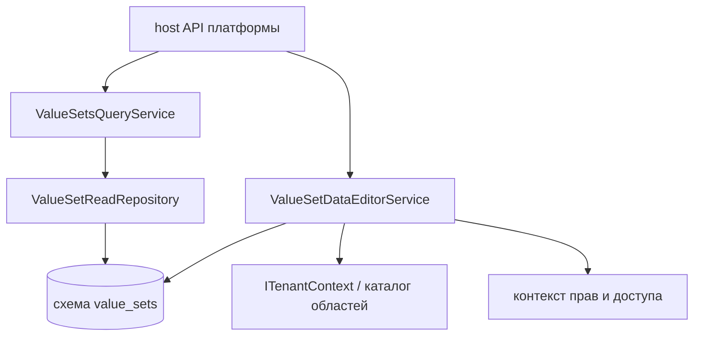

# Архитектура — Value Sets

## 1. Назначение документа

Документ описывает архитектурно значимые компоненты Value Sets, модель данных,
зависимости и ограничения. Он не является каталогом всех C# классов и методов.

## 2. Граница и компоненты

| Компонент | Ответственность | Зависимости | Подтверждение |
| --- | --- | --- | --- |
| `ValueSetsController` | HTTP API чтения элементов и вариантов | Контракты Value Sets, контекст и права host-приложения | [`ValueSetsController`][values-controller] |
| `ValueSetDataController` | HTTP API редактора данных | Контракты Value Sets, контекст и права host-приложения | [`ValueSetDataController`][data-controller] |
| `ValueSetsQueryService` | Эффективные элементы и варианты | Репозиторий, `ITenantContext`, проверки области | [`ValueSetsQueryService`][query-service] |
| `ValueSetDataEditorService` | Операции с областью данных и проверка иерархии | Репозиторий, права, каталог областей | [`ValueSetDataEditorService`][editor-service] |
| `ValueSetDataSet` / `ValueSetItem` | Модель данных и хранения Value Sets | Отображение EF и схема базы данных | [`ValueSetDataSet`][data-set], [`ValueSetItem`][item] |
| `IValueSetsQueryService` | Application-порт чтения для других компонентов | Адаптер Runtime/API host-приложения | `03_contracts.md` |
| `RuntimeValueSetResolver` | Адаптер Runtime к Value Sets | Композиция host-приложения и runtime-контракт | `03_contracts.md`, `04_runtime.md` |



## 3. Архитектурная модель и инварианты

```text
ValueSetDataSet
└── ValueSetItem[]
    ├── Code
    ├── Title
    ├── TenantId?
    ├── SiteId?
    ├── IsActive
    ├── Order?
    └── ParentItemId?
```

`ValueSetDataSet.ValueSetCode` уникален. `ValueSetItem` связан с набором данных по
`ValueSetDataSetId`. Для item действует правило: `SiteId` нельзя задавать без
`TenantId`. В одном наборе данных один код может иметь несколько строк, если их области данных
различаются; одинаковый code в одном и том же scope запрещён уникальным индексом.

Построение эффективного набора применяет приоритет `Site` > `Tenant` > `Global` и выбирает
одну строку для каждого `Code`. Для иерархического набора родитель хранится через
`ParentItemId`; эффективное представление может переназначить родителя на выбранную
строку с тем же кодом в более узкой области, не переписывая физическую связь.

| Понятие или архитектурный тип | Техническое имя | Владелец | Связи | Инвариант | Подтверждение |
| --- | --- | --- | --- | --- | --- |
| Набор данных | `ValueSetDataSet` | Value Sets | Содержит `ValueSetItem`; связан с опубликованным `ValueSetCode` | `ValueSetCode` уникален | [`ValueSetDataSet`][data-set] |
| Элемент набора | `ValueSetItem` | Value Sets | Принадлежит `ValueSetDataSet`; может иметь `TenantId`, `SiteId`, `ParentItemId` | Один `Code` не повторяется в одной области данных | [`ValueSetItem`][item] |
| Область данных | `Global`, `Tenant`, `Site` | Value Sets; контекст — Tenant/Security | Определяет строку-кандидат для effective merge | `Site` требует `TenantId` | `04_runtime.md` |
| Эффективный элемент | Строка, выбранная query service | Value Sets | Формируется из Global/Tenant/Site rows | Приоритет `Site` > `Tenant` > `Global` | `04_runtime.md` |
| Иерархический родитель | `ParentItemId` | Value Sets | Связывает элемент с родителем | Циклы запрещены; для `Flat` родитель недопустим | `03_contracts.md`, `04_runtime.md` |

## 4. Persistence-модель и хранение

| Данные | Техническое представление | Владелец | Хранение | Ключ или ограничение | Подтверждение |
| --- | --- | --- | --- | --- | --- |
| Набор данных | `value_sets.ValueSetDataSets` | Value Sets | Таблица базы данных | `Id`; unique `ValueSetCode` | [`ValueSetsDbContext`][db-context] |
| Элементы набора | `value_sets.ValueSetItems` | Value Sets | Таблица базы данных | `Id`; unique `(ValueSetDataSetId, Code, TenantId, SiteId)` | [`ValueSetsDbContext`][db-context] |
| Эффективный результат | Результат запроса, формируемый в памяти | Value Sets | Не сохраняется отдельно | Строится по приоритету областей и фильтрам | `04_runtime.md` |

`ValueSetDataSet` хранит снимок метаданных, но не становится источником схемы
`ValueSet`. `ValueSetItem` хранит фактические строки. Удаление набора данных каскадно
удаляет его items; удаление parent row ограничено `Restrict`.

## 5. Зависимости и точки расширения

### 5.1. Общие компоненты Foundation

| Общий компонент | Как используется областью | Владелец определения | Владелец предметной семантики | Документ Foundation |
| --- | --- | --- | --- | --- |
| `ITenantContext` | Передаёт текущий контекст Tenant/Site для чтения и изменения данных | Foundation | Value Sets использует контекст для выбора строк | [Foundation](../00_foundation/02_architecture.md) |
| `IReferenceDisplayResolverRegistry` | Возвращает читаемые подписи ссылок Tenant/Site и parent | Foundation | Value Sets формирует набор display values | [Foundation](../00_foundation/03_contracts.md) |

### 5.2. Зависимости области

| Зависимость | Использование | Владелец определения |
| --- | --- | --- |
| `IPlatformPermissionAuthorizer` | `ValueSets.Data.View`, `.Edit`, `.ManageScope` | Tenant/Security |
| `IRequestAccessContext` | Проверка назначенной области для явно выбранной области данных | Tenant/Security |
| `IPlatformScopeCatalog` | Проверка существования Tenant и принадлежности Site | Tenant/Security |
| `IValueSetsQueryService` | Порт чтения для Runtime и адаптера host | Value Sets |
| Configuration projection/seed writer | Передача опубликованной схемы и начальных элементов | Configuration вызывает, Value Sets принимает |

Корень композиции API host заменяет NoOp-реализации writer-ов Configuration на
адаптеры host, которые записывают проекцию и начальные данные в хранилище Value Sets.

Фактические точки регистрации и реализации: [`DependencyInjection`][di],
[`ValueSetDataSet`][data-set], [`ValueSetItem`][item],
[`ValueSetsDbContext`][db-context], [`ValueSetsQueryService`][query-service],
[`ValueSetDataEditorService`][editor-service] и оба API controller-а
[`ValueSetsController`][values-controller] и [`ValueSetDataController`][data-controller].

## 6. Технические ограничения

- Value Sets не владеет `ValueSet` schema и не редактирует Configuration version.
- В текущем API нет удаления элемента; доступны создание, изменение, активация и деактивация.
- Изменение области данных существующей строки не поддерживается; создаётся новая строка в целевой области.
- Унаследованную строку нельзя изменить напрямую без переопределения в целевой области.
- Tombstone/delete marker для скрытия унаследованной строки не входит в текущий API.
- Внутренние GUID не являются контрактным стабильным кодом потребителя.
- Политики `Configurable`, `Overrideable` и `Fixed` приходят из snapshot; отдельная
  runtime-семантика различия первых двух пока ограничена фактическими checks.

[di]: ../../../src/Platform/DMP.Platform.ValueSets/DependencyInjection.cs
[data-set]: ../../../src/Platform/DMP.Platform.ValueSets/Domain/Entities/ValueSetDataSet.cs
[item]: ../../../src/Platform/DMP.Platform.ValueSets/Domain/Entities/ValueSetItem.cs
[db-context]: ../../../src/Platform/DMP.Platform.ValueSets/Infrastructure/Persistence/ValueSetsDbContext.cs
[query-service]: ../../../src/Platform/DMP.Platform.ValueSets/Application/Services/ValueSetsQueryService.cs
[editor-service]: ../../../src/Platform/DMP.Platform.ValueSets/Application/Services/ValueSetDataEditorService.cs
[values-controller]: ../../../src/Platform/DMP.Platform.ValueSets/Api/Controllers/ValueSetsController.cs
[data-controller]: ../../../src/Platform/DMP.Platform.ValueSets/Api/Controllers/ValueSetDataController.cs

## История изменений

| Версия | Дата и время | Автор | Раздел | Изменение | Коммит/PR |
|---|---|---|---|---|---|
| 0.1 | 2026-08-27 01:17 +03:00 | Олег Юрьев (@axelprosoft) | Создание документа | модули ядра 05, 06 подготовлены для передачи на ревью. изменения в связанных документах. | [6f7684b3](https://github.com/axelprosoft/DMP.PlatformFoundation/commit/6f7684b3dff526120cfead5984de36e0427a18d1) |
