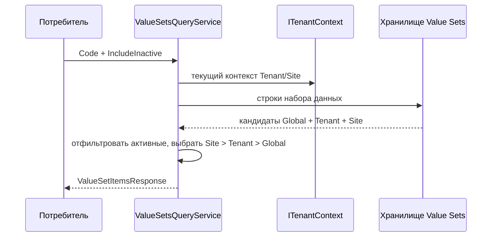

# Исполнение — Value Sets

## 1. Назначение документа

Документ описывает чтение, построение эффективного набора, иерархию и операции
для фактических элементов. Он не описывает публикацию Configuration целиком и
не заменяет Object Runtime.

## 2. Основные сценарии

| Сценарий | Предусловия | Последовательность | Результат | Подтверждение |
| --- | --- | --- | --- | --- |
| Получить эффективные элементы | Доступен `ValueSetCode` и текущий контекст | Запросить строки, определить доступные области, выбрать наиболее специфичную строку, применить фильтры и сортировку | `ValueSetItemsResponse` | `ValueSetsQueryService`, `ValueSetItemsResponse` |
| Получить варианты для выбора | Доступен `ValueSetCode` и параметры страницы | Запросить эффективные элементы, применить выбранные значения и сформировать варианты | `ValueSetOptionsResponse` | `ValueSetsQueryService`, `ValueSetOptionsResponse` |
| Изменить данные редактора | Есть право `ValueSets.Data.Edit` и допустимая область | Проверить политику, область и родителя, затем создать или изменить строку | Ответ редактора или код ошибки | `ValueSetDataEditorService` |




Если один code присутствует в нескольких доступных областях, выбирается наиболее
специфичная строка. Сортировка по умолчанию: `Order`, затем `Code`; `null Order`
идёт после заданного порядка.

## 3. Операции и алгоритмы

| Операция | Вход | Алгоритм | Результат | Ошибки | Потребители |
| --- | --- | --- | --- | --- | --- |
| Чтение эффективного набора | `ValueSetCode`, текущий контекст | Выбрать строки по приоритету `Site` > `Tenant` > `Global`, отфильтровать активные и отсортировать | Эффективные строки | Пустой результат или ошибка чтения | Runtime и API-потребители |
| Чтение строк редактора | `ValueSetCode`, `Mode`, область и фильтры | Выбрать эффективные или физические строки, проверить доступ к явно выбранной области | Страница строк редактора | `VALUE_SET_*` ошибки области | Studio/API |
| Проверка родителя | Родитель и `Structure` | Проверить иерархию, область родителя и отсутствие цикла | Допустимый родитель либо отказ | `VALUE_SET_PARENT_*` | Редактор данных |

### 3.1. Режимы редактора данных

| Режим | Результат |
| --- | --- |
| `EffectiveCurrent` | Эффективные строки текущего контекста Tenant/Site |
| `ExactRows` | Физические строки выбранной области данных |
| `EffectiveSelectedScope` | Эффективные строки явно выбранной области данных |

Явно выбранную область нельзя передавать в `EffectiveCurrent`. Для расширенного
просмотра нужны `ValueSets.Data.ManageScope` и назначенная область `Global`/`Corporate`.
Site без Tenant недействителен; координаты проверяются через каталог областей.

## 4. Правила

```text
Эффективные строки
└── Корневой элемент (`ParentItemId = null`)
    └── Дочерний элемент (`ParentItemId` -> эффективный родитель)
        └── Потомок
```

Иерархия включается только при `Structure = Hierarchical`. В эффективной проекции
родитель может быть переназначен на переопределение с той же бизнес-идентичностью;
физический `ParentItemId` в хранилище при этом не переписывается. При выборе
родителя сервер исключает текущий элемент и его потомков, чтобы не создать цикл.

## 5. Жизненные циклы

```text
Создать строку -> активна/неактивна -> изменить заголовок/порядок/родителя -> деактивировать/активировать
```

Удаление элемента и метка удаления (tombstone) для скрытия унаследованной строки в текущем публичном API не
предоставлены. Чтобы изменить унаследованную строку, создаётся переопределение
в целевой области с тем же кодом.

## 6. Согласованность

```text
Опубликованная схема ValueSet
       + необязательные начальные данные
                    |
                    v
        ValueSetDataSet / ValueSetItem
                    |
                    v
 IValueSetsQueryService / RuntimeValueSetResolver
                    |
                    v
   options и отображаемые значения Object Runtime
```

Проекция и начальные данные передают метаданные схемы и начальные строки. Изменение
фактических элементов через API данных не является публикацией новой Configuration
version. Реальная семантика event-инвалидации кэша текущим контрактом не
подтверждена.

### 6.1. Отображаемые значения и ссылки

Сервер формирует `DisplayValues` для `Tenant`, `Site` и родителя, а также
`LookupDisplay` для выбора элемента. Фронтенд использует готовый контракт
отображения и не собирает подписи из внутренних GUID.

## 7. Сбои и восстановление

Ошибки проверки возвращаются как `PlatformInvalidRequestException` с техническим
кодом. При отказе запрос не изменяет строку; перечень кодов и порядок проверки
описаны в [контрактах](03_contracts.md#8-ошибки-и-отказоустойчивость), а действия
оператора — в `08_operations.md`.

### 7.1. Ограничения выполнения

- `Fixed` запрещает изменение данных.
- При контексте `Tenant` значение `AllowTenantOverrides = false` запрещает изменение данных.
- Пользователь без `ManageScope` не изменяет чужую область Tenant/Site.
- Область существующей строки нельзя поменять через операцию обновления.
- Метка удаления (tombstone) для скрытия унаследованной строки не входит в текущий API.

## История изменений

| Версия | Дата и время | Автор | Раздел | Изменение | Коммит/PR |
|---|---|---|---|---|---|
| 0.1 | 2026-08-27 01:17 +03:00 | Олег Юрьев (@axelprosoft) | Создание документа | модули ядра 05, 06 подготовлены для передачи на ревью. изменения в связанных документах. | [6f7684b3](https://github.com/axelprosoft/DMP.PlatformFoundation/commit/6f7684b3dff526120cfead5984de36e0427a18d1) |
