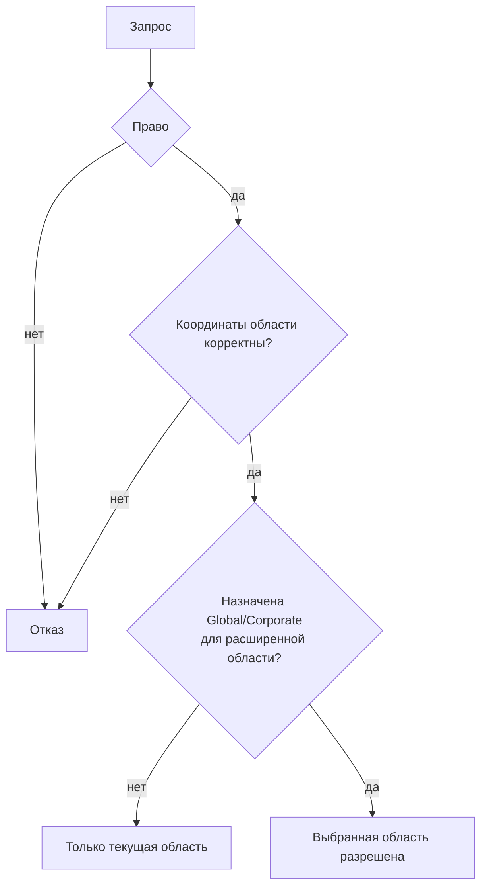

# Безопасность и аудит — Value Sets

## 1. Назначение документа

Документ описывает проверки доступа и области данных, встроенные в API Value Sets.
Общая модель пользователей, ролей и прав принадлежит Tenant/Security.

## 2. Ресурсы и права

| Ресурс | Действие | Область действия | Политика или роль | Источник решения |
| --- | --- | --- | --- | --- |
| Элементы набора | `Configuration.Scope.View` | Текущий контекст чтения | Правило доступа Configuration | Авторизация контроллера |
| Данные наборов | `ValueSets.Data.View` | Разрешённая область данных | `CorporateValueSetsDataViewer`, `CorporateValueSetsDataAdmin`, `TenantValueSetsDataViewer` или `TenantValueSetsDataAdmin` | `ValueSetsSecurityCatalogManifest` |
| Данные наборов | `ValueSets.Data.Edit` | Текущая область и доступное переопределение | `CorporateValueSetsDataAdmin` или `TenantValueSetsDataAdmin` | `ValueSetsSecurityCatalogManifest` |
| Данные наборов | `ValueSets.Data.ManageScope` | Явно выбранный `Tenant` или `Site` | Назначение права для управления областью | `ValueSetsSecurityCatalogManifest` и сервис редактора |

## 3. Принятие решения и управление

Область `Site` требует `Tenant`. Без `ManageScope` пользователь не может читать или
изменять чужую область Tenant/Site; текущий контекст ограничивает операцию.

## 4. Контроли и риски

| Угроза | Контроль | Подтверждение | Остаточный риск |
| --- | --- | --- | --- |
| Чтение или изменение недоступной области | Проверка права, координат `Tenant`/`Site` и назначенной области | `ValueSetDataEditorService` | Контракт общего аудита операций Value Sets не подтверждён |
| Изменение фиксированного набора | Проверка `Policy = Fixed` | Сервис редактора и коды ошибок | Полная матрица политик остаётся ограниченной текущими проверками |
| Цикл в иерархии | Проверка структуры, родителя и циклических связей | Сервис редактора и средство начальных данных | Отдельное удаление и метка удаления отсутствуют |

Перед изменением проверяются политика набора данных, `AllowTenantOverrides`, право,
область данных и допустимость родителя. `Fixed` запрещает изменение. Унаследованную
строку нельзя обновить напрямую: для `Tenant`/`Site` создаётся переопределение.

## 5. Аудит

В текущем коде Value Sets отдельная публикация записи аудита или интеграционного
события для операций с элементом не подтверждена. Поэтому этот документ не
объявляет собственный контракт аудита. Трассируемость изменений должна быть обеспечена владельцем
общей области Audit History, если такая интеграция будет принята.

## 6. Покрытие и пробелы

| Область контроля | Текущее покрытие | Пробел |
| --- | --- | --- |
| Права и область данных | Проверяются API и сервисом редактора | Полная сквозная проверка безопасности не входит в Value Sets |
| Аудит изменений | Собственная запись Value Sets не подтверждена | Интеграция с Audit History не объявлена контрактом |
| Скрытие унаследованных строк | Прямое изменение запрещается без переопределения | Метка удаления отсутствует |

Каталог прав и назначение прав находятся вне Value Sets. Value Sets фиксирует только
собственные проверки и их ограничения. Удаление и метка удаления унаследованного
элемента не реализованы в публичном API; отдельный контракт события для сброса кэша
также не подтверждён.

## История изменений

| Версия | Дата и время | Автор | Раздел | Изменение | Коммит/PR |
|---|---|---|---|---|---|
| 0.1 | 2026-08-27 01:17 +03:00 | Олег Юрьев (@axelprosoft) | Создание документа | модули ядра 05, 06 подготовлены для передачи на ревью. изменения в связанных документах. | [6f7684b3](https://github.com/axelprosoft/DMP.PlatformFoundation/commit/6f7684b3dff526120cfead5984de36e0427a18d1) |
