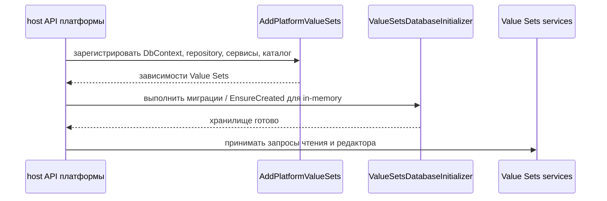

# Эксплуатация — Value Sets

## 1. Назначение документа

Документ описывает регистрацию Value Sets, подготовку хранилища и базовый путь
восстановления. Операции приложения и эксплуатационная инструкция шире этого документа.

## 2. Запуск и готовность

| Шаг запуска | Условие | Идемпотентность | Критерий готовности | Откат |
| --- | --- | --- | --- | --- |
| Зарегистрировать Value Sets | Host подключает `AddPlatformValueSets` | Повторная регистрация не должна дублировать зависимости | Сервисы и контроллеры доступны | Удалить регистрацию из host-конфигурации |
| Подготовить хранилище | Доступна база или in-memory store | Миграции выполняются по истории | Схема `value_sets` готова | Остановить запуск и устранить ошибку миграции |



`ValueSetsDbContext` использует схему `value_sets`. Для SQL Server выполняются
миграции, для среды in-memory — `EnsureCreated`.

Это подтверждено [регистрацией области][di],
[инициализатором базы][initializer] и [DbContext][db-context].

## 3. Миграции

| Изменение | Порядок | Совместимость | Проверка | Откат |
| --- | --- | --- | --- | --- |
| Создание или обновление схемы хранения | Инициализатор после регистрации DbContext | SQL Server migrations; in-memory `EnsureCreated` | История миграций и readiness host | Откат выполняется средствами выбранной БД |
| Проекция схемы и начальные данные | После публикации/импорта Configuration через адаптеры host-приложения | NoOp-адаптеры по умолчанию не создают рабочую проекцию | Проверить `ValueSetDataSet` и `ValueSetItem` | Политика отката начальных данных текущим контрактом не определена |

```text
Публикация и импорт Configuration
  -> адаптер проекции / адаптер начальных данных host-приложения
  -> хранилище ValueSetDataSet и ValueSetItem
  -> API чтения и редактора Value Sets
```

В платформенном Configuration по умолчанию существуют NoOp-адаптеры; host API
регистрирует рабочие адаптеры. Поэтому порядок импорта и состав транзакции
зависят от композиции host-приложения и должны проверяться в интеграционной
среде.

## 4. Диагностика

Диагностика связывает наблюдаемую ситуацию с кодом ошибки, если он есть, и с
проверкой, которую нужно выполнить. Полное описание кодов находится в разделе
[ошибок и отказоустойчивости](03_contracts.md#8-ошибки-и-отказоустойчивость).

| Ситуация | Технический код или сигнал | Что проверить | Действие | Критерий восстановления | Эскалация |
| --- | --- | --- | --- | --- | --- |
| Набор данных не найден | `VALUE_SET_DATASET_NOT_FOUND` | Опубликованную проекцию, начальные данные и `ValueSetCode` | Повторить импорт или исправить код | Набор доступен через API | Configuration/host owner |
| Runtime вернул пустой список | — | `ValueSetCode`, активность элементов, текущую область и регистрацию resolver | Проверить данные и контекст | Ожидаемые активные элементы возвращаются | Value Sets owner |
| Доступ к области отклонён | `VALUE_SET_SCOPE_ACCESS_FORBIDDEN`, `VALUE_SET_FOREIGN_SCOPE_FORBIDDEN`, `VALUE_SET_MANAGE_SCOPE_REQUIRED` | Право, назначение и принадлежность `Tenant`/`Site` | Исправить контекст или назначение | Запрос проходит проверку доступа | Tenant/Security owner |
| Строку нельзя изменить | `VALUE_SET_POLICY_FIXED`, `VALUE_SET_TENANT_OVERRIDE_FORBIDDEN`, `VALUE_SET_EDIT_FORBIDDEN`, `VALUE_SET_OVERRIDE_REQUIRED`, `VALUE_SET_INHERITED_ROW_MUTATION_REJECTED` | Политику, `AllowTenantOverrides`, статус наследования и целевую область | Использовать допустимый override или оставить строку без изменения | Изменение разрешено сервером | Value Sets owner |
| Иерархия отклонена | `VALUE_SET_PARENT_NOT_ALLOWED`, `VALUE_SET_PARENT_NOT_FOUND`, `VALUE_SET_PARENT_MISMATCH`, `VALUE_SET_PARENT_SCOPE_INCOMPATIBLE`, `VALUE_SET_PARENT_CYCLE` | Структуру, кандидата в родителя и циклические связи | Исправить родителя и повторить запрос | Строка сохранена без цикла | Value Sets owner |

## 5. Восстановление

Миграция должна быть идемпотентной на уровне истории миграций базы данных.
Повторная публикация схемы обновляет снимок набора данных через адаптер host-приложения;
повторная загрузка начальных данных должна следовать собственной политике идемпотентности.
Точный конфликт seed с уже изменёнными пользовательскими строками текущим общим
контрактом не определён.

## 6. Откат и эскалация

Откат схемы хранения выполняется средствами выбранной базы данных. Откат
проекции и начальных данных между версиями в текущем общем контракте не задан;
при конфликте требуется эскалация владельцу host-композиции и Configuration.

- Нельзя диагностировать Value Sets только по таблицам Configuration: фактические
  элементы находятся в хранилище `value_sets`.
- Нельзя использовать внутренний GUID как внешний диагностический или бизнес-код.
- Изменение области данных требует проверки каталога Tenant/Site.

[di]: ../../../src/Platform/DMP.Platform.ValueSets/DependencyInjection.cs
[initializer]: ../../../src/Platform/DMP.Platform.ValueSets/Infrastructure/Persistence/ValueSetsDatabaseInitializer.cs
[db-context]: ../../../src/Platform/DMP.Platform.ValueSets/Infrastructure/Persistence/ValueSetsDbContext.cs

## История изменений

| Версия | Дата и время | Автор | Раздел | Изменение | Коммит/PR |
|---|---|---|---|---|---|
| 0.1 | 2026-08-27 16:52 +03:00 | Олег Юрьев (@axelprosoft) | Создание документа | docs-new: синхронизировать типы документов со стандартом | [7c7ecbfb](https://github.com/axelprosoft/DMP.PlatformFoundation/commit/7c7ecbfb4036c9ce3c6304f9ee3e4a6e48f7828c) |
