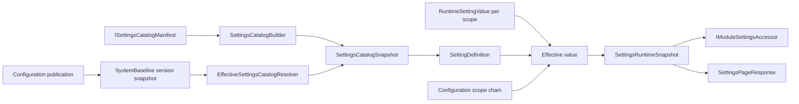

# Архитектура - Settings

## 1. Назначение документа

Документ описывает техническую runtime-модель Settings: каталог определений,
хранилище значений, разрешение scope chain, snapshot, cache и границы с
Configuration. Состав всех C#-классов и алгоритмы операций вынесены в
`03_contracts.md` и `04_runtime.md`.

## 2. Граница и компоненты

Settings подключается через `AddPlatformSettings`. Компоненты области
разделены по ответственности:

| Компонент | Ответственность | Зависимости | Подтверждение |
| --- | --- | --- | --- |
| `SettingsCatalogSnapshot` | Представляет зафиксированную иерархию module/section/group/setting | Публикация Configuration | [snapshot contract][snapshot-contract] |
| `EffectiveSettingsCatalogResolver` | Находит каталог из effective `SystemBaseline` version | Configuration scopes и versions, `IMemoryCache` | [catalog resolver][catalog-resolver] |
| `SettingsValueService` | Проверяет и сохраняет/сбрасывает runtime override | Settings DB, Configuration resolver, Audit History, tenant context | [value service][value-service] |
| `SettingsRuntimeSnapshotProvider` | Строит effective values для scope и получает их из cache | Settings DB, Configuration scope chain, catalog resolver | [snapshot provider][snapshot-provider] |
| `ModuleSettingsAccessor` | Даёт серверному потребителю typed read через `ModuleSettingKey<T>` | Snapshot provider | [accessor][accessor] |
| `SettingsPageService` | Собирает navigation, definitions, local/inherited/effective values и permissions | API contracts, resolver, services, Configuration | [page service][page-service] |
| `SettingsController` | Публикует HTTP boundary для Settings и preferences | Page service, access guard, tenant context | [controller][controller] |
| `SettingsDbContext` | Хранит runtime overrides и user preferences в schema `settings` | EF Core provider | [db context][db-context] |
| `SettingsRuntimeMemoryCache` | Кэширует snapshots по scope и catalog fingerprint | `IMemoryCache` | [cache][cache] |

## 3. Архитектурная модель и инварианты

Settings имеет две модели данных и один производный runtime-результат:

| Понятие или архитектурный тип | Техническое имя | Владелец | Связи | Инвариант | Подтверждение |
| --- | --- | --- | --- | --- | --- |
| Каталог настроек | `SettingsCatalogSnapshot` | Settings contract; baseline version - Configuration | Содержит modules, sections, groups и definitions | `SchemaVersion`, fingerprint и уникальный `ModuleCode + SettingCode` | [snapshot contract][snapshot-contract], [catalog tests][catalog-tests] |
| Определение настройки | `SettingDefinition` | Манифест зарегистрировавшего модуля | Содержит тип, значение по умолчанию, правила проверки, жизненный цикл и политику переопределения | Значение по умолчанию должно соответствовать `SettingValueType` и правилам проверки | [builder][builder] |
| Технический ключ | `ModuleSettingKey<T>` | Контракт Settings | Используется manifest и потребителем runtime-контракта | Ключ содержит `ModuleCode`, `SettingCode` и `ValueType`, но не содержит UI metadata | [key contract][key-contract] |
| Локальное значение | `RuntimeSettingValue` | Settings | Ссылается на scope и технический ключ | Для активного значения уникальна комбинация scope/key; value хранится как JSON | [runtime-value][runtime-value] |
| Effective runtime snapshot | `SettingsRuntimeSnapshot` | Settings runtime | Производится из catalog, defaults и scope values | Snapshot соответствует fingerprint каталога и выбранному scope | [snapshot provider][snapshot-provider] |
| Пользовательское предпочтение | `UserPreferenceValue` | Settings | Связано с tenant, user, preference и разделом интерфейса | Значение принадлежит текущему tenant/user и не входит в runtime snapshot | [preference-value][preference-value] |

`SettingsRuntimeSnapshot` и `SettingsPageResponse` являются производными
представлениями. Они не являются дополнительными schema properties каталога и не
создают новую каноническую модель настройки.

## 4. Persistence-модель и хранение

| Данные | Техническое представление | Владелец | Хранение | Ключ или ограничение | Подтверждение |
| --- | --- | --- | --- | --- | --- |
| Runtime override | `settings.RuntimeSettingValues` | Settings | EF Core `SettingsDbContext` | Unique filtered index по `ScopeId + ModuleCode + SettingCode` для active row | [db context][db-context], [migration][settings-migration] |
| Runtime value metadata | `ScopeType`, `TenantId`, `SiteId`, `ValueTypeSnapshot`, `UpdatedBy`, `ConcurrencyToken` | Settings | Колонки `RuntimeSettingValues` | SQL Server types и max length заданы mapping | [db context][db-context] |
| Общая оболочка, маршрутизация и рендерер frontend | фронтенд-платформа; отдельный Numbering UI не подтверждён |
| Catalog snapshot | `ConfigurationVersion.SettingsCatalogSnapshotJson` и fingerprint | Configuration | Хранится в Configuration version только для baseline | Settings читает snapshot, но не владеет Configuration version persistence | [configuration migration][configuration-migration] |
| Runtime snapshot | `SettingsRuntimeSnapshot` | Settings runtime | In-memory cache, TTL 10 минут | Cache key содержит scope id и catalog fingerprint | [cache][cache] |

Settings не хранит отдельную таблицу определений каталога. Источник структуры
для effective runtime - snapshot, сохранённый Configuration при публикации
`SystemBaseline`.

## 5. Зависимости и точки расширения

| Зависимость или точка расширения | Использование | Владелец определения | Владелец семантики | Документ Foundation или соседней области |
| --- | --- | --- | --- | --- |
| `ISettingsCatalogManifest` | Модуль регистрирует свои definitions | Settings contracts | Регистрирующий модуль | [contracts](03_contracts.md) |
| `IModuleSettingsAccessor` | Потребитель runtime-контракта читает типизированное значение или snapshot | Settings | Потребитель определяет смысл значения | [contracts](03_contracts.md) |
| `IEffectiveSettingsCatalogResolver` | Settings получает effective catalog | Configuration | Configuration | [Configuration runtime](../02_configuration/04_runtime.md) |
| `IConfigurationDbContext` | Settings читает scopes, versions и system enum definitions | Configuration | Configuration | [Configuration architecture](../02_configuration/02_architecture.md) |
| `ISettingsPermissionAuthorizer` | Settings page получает решение по permission code | Settings; host supplies adapter | Tenant/Security policy | [security](05_security_and_audit.md) |
| `IAuditHistoryWriter` | Settings передаёт audit record изменения override | Audit History | Audit History | Владелец ещё не оформленного пакета `09_audit_history` |
| `ITenantContext` | Определяет tenant/user для preferences и audit | Foundation/host | Tenant/Security context | [Foundation](../00_foundation/03_contracts.md) |

Общий контракт не копируется в Settings: здесь фиксируется только фактический
способ его использования.

## 6. Технические ограничения

- текущая реализация использует .NET 9, EF Core 9 и SQL Server либо InMemory
  provider в зависимости от connection string;
- runtime snapshot является локальным к экземпляру приложения memory cache;
- `SettingApplyPolicy` описывает значение политики в каталоге, но Settings не
  выполняет restart/reload;
- `CustomValidatorCodes` сохраняются в definition, но отдельный runtime-вызов
  пользовательских validators не подтверждён текущей реализацией;
- `ConcurrencyToken` хранится и возвращается, однако request update не содержит
  expected token для optimistic concurrency check;
- Settings не публикует собственные integration events и не владеет outbox.

## Источники

- [Settings dependency injection][settings-di];
- [Settings contracts][settings-contracts];
- [Settings persistence][settings-persistence];
- [Settings tests][settings-tests].
[settings-contracts]: ../../../src/Platform/DMP.Platform.Contracts/Settings/
[settings-tests]: ../../../tests/DMP.Platform.IntegrationTests/Settings/
[snapshot-contract]: ../../../src/Platform/DMP.Platform.Contracts/Settings/Registration/SettingsCatalogSnapshot.cs
[catalog-resolver]: ../../../src/Platform/DMP.Platform.Configuration/Application/Services/Catalog/EffectiveSettingsCatalogResolver.cs
[value-service]: ../../../src/Platform/DMP.Platform.Settings/Application/Services/SettingsValueService.cs
[snapshot-provider]: ../../../src/Platform/DMP.Platform.Settings/Application/Services/SettingsRuntimeSnapshotProvider.cs
[accessor]: ../../../src/Platform/DMP.Platform.Settings/Application/Services/ModuleSettingsAccessor.cs
[page-service]: ../../../src/Platform/DMP.Platform.Settings/Application/Services/SettingsPageService.cs
[controller]: ../../../src/Platform/DMP.Platform.Settings/Api/Controllers/SettingsController.cs
[db-context]: ../../../src/Platform/DMP.Platform.Settings/Infrastructure/Persistence/SettingsDbContext.cs
[cache]: ../../../src/Platform/DMP.Platform.Settings/Infrastructure/Persistence/SettingsRuntimeMemoryCache.cs
[runtime-value]: ../../../src/Platform/DMP.Platform.Settings/Domain/Entities/RuntimeSettingValue.cs
[preference-value]: ../../../src/Platform/DMP.Platform.Settings/Domain/Entities/UserPreferenceValue.cs
[builder]: ../../../src/Platform/DMP.Platform.Contracts/Settings/Registration/SettingsCatalogBuilder.cs
[key-contract]: ../../../src/Platform/DMP.Platform.Contracts/Settings/Registration/ModuleSettingKey.cs
[catalog-tests]: ../../../tests/DMP.Platform.IntegrationTests/Settings/SettingsCatalogContractTests.cs
[settings-migration]: ../../../src/Platform/DMP.Platform.Settings/Infrastructure/Persistence/Migrations/20260709151555_InitialSettingsStorage.cs
[preference-migration]: ../../../src/Platform/DMP.Platform.Settings/Infrastructure/Persistence/Migrations/20260713123425_AddUserPreferenceValues.cs
[configuration-migration]: ../../../src/Platform/DMP.Platform.Configuration/Infrastructure/Persistence/Migrations/20260709120000_AddSettingsCatalogSnapshotToVersions.cs
[settings-di]: ../../../src/Platform/DMP.Platform.Settings/DependencyInjection.cs
[settings-persistence]: ../../../src/Platform/DMP.Platform.Settings/Infrastructure/Persistence/SettingsDbContext.cs

## История изменений

| Версия | Дата и время | Автор | Раздел | Изменение | Коммит/PR |
|---|---|---|---|---|---|
| 0.1 | 2026-08-27 15:04 +03:00 | Олег Юрьев (@axelprosoft) | Создание документа | подготовлен драфт новой проектной документации на ядро, прикладные модули, а так же термины и общие концептуальные документы | [5ecb26b1](https://github.com/axelprosoft/DMP.PlatformFoundation/commit/5ecb26b1c3ff3cfcdc13018e59526ae684ca6007) |
