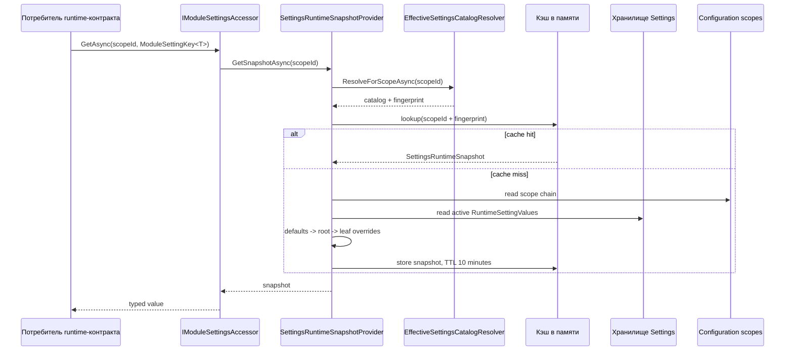
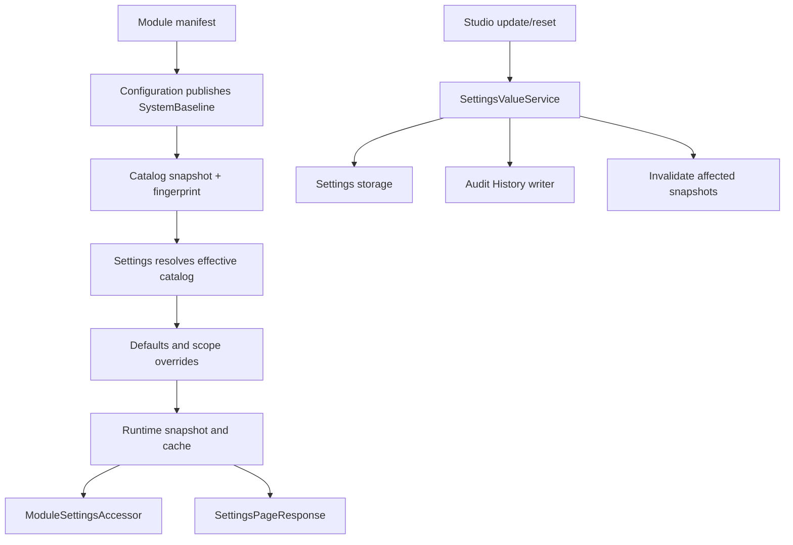

# Исполнение - Settings

## 1. Назначение документа

Документ описывает порядок выполнения Settings: получение effective catalog,
построение значения по scope chain, runtime access, изменение и сброс override,
инвалидацию cache и работу user preferences.

## 2. Получение effective каталога

Для выбранного scope `EffectiveSettingsCatalogResolver`:

1. получает цепочку scope от выбранного scope к корню;
2. ищет наиболее специфичную опубликованную version;
3. проходит `ParentBaseVersionId` до `SystemBaseline`;
4. читает `SettingsCatalogSnapshotJson` и fingerprint из baseline version;
5. десериализует snapshot и кэширует его на 30 минут по fingerprint.

Если цепочка публикаций, baseline или snapshot отсутствуют, возвращается
диагностика `PublishedVersionNotFound`, `SystemBaselineNotFound`,
`SettingsCatalogSnapshotMissing` или `SettingsCatalogSnapshotInvalid`.

## 3. Построение effective runtime snapshot

Провайдер сначала создаёт значения из definitions со статусом `Active` или
`Deprecated` и их `DefaultValueJson`. Затем проходит scope chain от корня к
выбранному scope. Активное значение более специфичного scope заменяет значение
предка. Значение с неизвестным для каталога ключом пропускается.

## 4. Разрешение scope и override policy

Поддержанная цепочка scope в текущем коде имеет вид:
`SystemBaseline -> Corporate -> Tenant -> Site`.
Для локального переопределения `SettingOverridePolicy` определяет допустимые типы scope:

| Policy | Разрешённые локальные scope |
| --- | --- |
| `CorporateOnly` | `Corporate` |
| `CorporateTenant` | `Corporate`, `Tenant` |
| `CorporateTenantSite` | `Corporate`, `Tenant`, `Site` |
| `TenantSite` | `Tenant`, `Site` |
| `SiteOnly` | `Site` |

Цепочка должна быть ацикличной. Отсутствующий parent scope является ошибкой
runtime. Settings не создаёт и не исправляет configuration scopes.

## 5. Изменение runtime override

Порядок `PUT /runtime-values`:

1. нормализуются `ModuleCode` и `SettingCode`;
2. проверяются `ScopeId` и `UpdatedBy`;
3. находится scope в Configuration;
4. из effective catalog находится `SettingDefinition`;
5. проверяется `OverridePolicy` и `LifecycleStatus`;
6. `valueJson` проверяется как JSON нужного типа и по встроенным validation rules;
7. создаётся или обновляется `RuntimeSettingValue`;
8. изменения сохраняются в `settings.RuntimeSettingValues`;
9. записывается audit record с correlation id;
10. удаляются cache entries для изменённого scope и всех его descendants;
11. строится новый effective snapshot и возвращается effective value.

`Active` разрешает редактирование. `Deprecated` разрешает его только при
`DeprecatedEditAllowed`. `Disabled` и `Removed` не редактируются. Сброс
проверяет definition и policy, удаляет local row, пишет audit record и затем
пересчитывает effective value.

## 6. Жизненный цикл definition

| Статус | В каталоге | В обычном runtime snapshot | В редактировании |
| --- | --- | --- | --- |
| `Active` | Видим | Используется | Разрешён при permission и scope policy |
| `Deprecated` | Видим для диагностики | Используется | Только если `DeprecatedEditAllowed` |
| `Disabled` | Может быть видим на странице | Не попадает в обычный runtime snapshot | Запрещён |
| `Removed` | Не показывается в page response | Не попадает в snapshot | Запрещён |

Смена lifecycle не мигрирует и не удаляет старые `RuntimeSettingValue` сама по
себе. Автоматического переноса значения между разными technical keys нет.

## 7. Проверка значения

Проверяются:

- корректность JSON;
- соответствие `Boolean`, `String`, `Int32`, `Decimal`, `Enum` или `Json`;
- `AllowedValues`;
- числовой диапазон `MinNumber`/`MaxNumber`;
- длина строки `MinLength`/`MaxLength`;
- `RegexPattern`.

`CustomValidatorCodes` присутствуют в структуре validation, но текущий Settings
runtime не вызывает внешний registry validators. Это ограничение MVP, а не
скрытая гарантия выполнения custom validators.

## 8. User preferences

Для preferences сервис использует `TenantId` и `UserId` из `ITenantContext`.
`surfaceCode` нормализуется в пустую строку, если не задан. `valueJson` должен
быть корректным JSON, но отдельная schema validation preference по коду не
реализована. Upsert создаёт или обновляет запись, reset удаляет её физически.

Preferences не участвуют в scope inheritance и не попадают в
`SettingsRuntimeSnapshot`.

## 9. Согласованность и сбои

Изменение override сначала сохраняется, затем передаётся в Audit History и
после этого инвалидирует локальные snapshots. Если audit writer или последующая
инвалидация завершается ошибкой, операция может завершиться ошибкой после
изменения storage; распределённый outbox или compensating transaction не
подтверждены текущим кодом.

`ConcurrencyToken` обновляется при изменении записи, но входной API не принимает
ожидаемый token. Поэтому полноценная защита от lost update в текущем контракте
не заявляется.

## 10. Основной сквозной путь

## 11. Источники

- [catalog resolver][catalog-resolver];
- [snapshot provider][snapshot-provider];
- [value service][value-service];
- [page service][page-service];
- [user preference service][preference-service];
- [runtime tests][runtime-tests].

Проверенная ревизия исходников: `origin/master@3e2037ac37683eef331d70223c6babfc61aa0539`.
[catalog-resolver]: ../../../src/Platform/DMP.Platform.Configuration/Application/Services/Catalog/EffectiveSettingsCatalogResolver.cs
[snapshot-provider]: ../../../src/Platform/DMP.Platform.Settings/Application/Services/SettingsRuntimeSnapshotProvider.cs
[value-service]: ../../../src/Platform/DMP.Platform.Settings/Application/Services/SettingsValueService.cs
[page-service]: ../../../src/Platform/DMP.Platform.Settings/Application/Services/SettingsPageService.cs
[preference-service]: ../../../src/Platform/DMP.Platform.Settings/Application/Services/UserPreferenceService.cs
[runtime-tests]: ../../../tests/DMP.Platform.IntegrationTests/Settings/SettingsStorageIntegrationTests.cs

## История изменений

| Версия | Дата и время | Автор | Раздел | Изменение | Коммит/PR |
|---|---|---|---|---|---|
| 0.1 | 2026-08-27 15:04 +03:00 | Олег Юрьев (@axelprosoft) | Создание документа | подготовлен драфт новой проектной документации на ядро, прикладные модули, а так же термины и общие концептуальные документы | [5ecb26b1](https://github.com/axelprosoft/DMP.PlatformFoundation/commit/5ecb26b1c3ff3cfcdc13018e59526ae684ca6007) |
