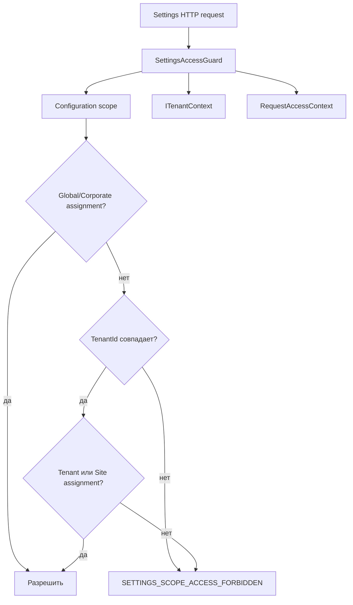

# Безопасность и аудит - Settings

## 1. Назначение документа

Документ описывает собственные security boundary Settings и передачу сведений
об изменении runtime overrides в Audit History. Политика ролей и каноническое
хранение audit history принадлежат соседним областям.

## 2. Capability и permissions

Settings регистрирует capability `Settings` и permission codes:

| Permission code | Назначение | Операция |
| --- | --- | --- |
| `Settings.Catalog.View` | Просмотр структуры runtime settings | Зарегистрирован в manifest; page controller отдельно не требует этот code напрямую |
| `Settings.Value.View` | Просмотр effective values | `POST /api/platform/settings/page` |
| `Settings.Value.Edit` | Изменение локального переопределения | `PUT /api/platform/settings/runtime-values` |
| `Settings.Value.Reset` | Сброс локального переопределения | `POST /api/platform/settings/runtime-values/reset` |

Источником capability metadata является `SettingsSecurityCatalogManifest`. В
основном API окончательное решение делегируется Tenant/Security через host
`SettingsPermissionAuthorizer`.

## 3. Scope access

`SettingsAccessGuard` проверяет существование scope, tenant isolation и site
assignment. Решение по permission code выполняется отдельным
`ISettingsPermissionAuthorizer`; это две разные проверки и они обе нужны для
защищённых операций runtime value.

## 4. Аудит

При создании, изменении или сбросе `RuntimeSettingValue` Settings вызывает
`IAuditHistoryWriter`.

| Событие операции | Audit action code | Передаваемые сведения | Владелец хранения |
| --- | --- | --- | --- |
| Создано локальное переопределение | `Settings.Value.Created` | scope, scope type, tenant/site, module/setting, old/new JSON, actor, correlation | Audit History |
| Изменено значение | `Settings.Value.Changed` | Те же сведения с прежним и новым JSON | Audit History |
| Сброшено локальное переопределение | `Settings.Value.Reset` | scope, identity, прежнее значение и actor | Audit History |

Настройки не владеют retention, audit query execution или outbox доставки.
`SettingsAuditQueryDescriptorResponse` только сообщает клиенту параметры запроса
истории для сущности `RuntimeSettingValue`.

## 5. Ограничения и риски

- User preferences читаются и изменяются в контексте текущего tenant/user, но
  отдельный controller permission policy для них не задан;
- fallback `MissingSettingsPermissionAuthorizer` возвращает `false`, поэтому
  отдельный host без рабочего authorization adapter не получает edit/reset
  permissions;
- audit запись отправляется после сохранения Settings DB и не защищена общей
  транзакцией или outbox в Settings;
- секреты подключения и защищённые host settings не являются
  `RuntimeSettingValue` и не возвращаются Settings API.

## 6. Источники и тесты

- [security manifest][security-manifest];
- [scope guard][scope-guard];
- [host authorizer][host-authorizer];
- [audit call][value-service];
- [security tests][security-tests].
[security-manifest]: ../../../src/Platform/DMP.Platform.Settings/Infrastructure/Security/SettingsSecurityCatalogManifest.cs
[scope-guard]: ../../../src/Platform/DMP.Platform.Settings/Application/Services/SettingsAccessGuard.cs
[host-authorizer]: ../../../src/Hosts/DMP.Platform.Api/Composition/SettingsPermissionAuthorizer.cs
[value-service]: ../../../src/Platform/DMP.Platform.Settings/Application/Services/SettingsValueService.cs
[security-tests]: ../../../tests/DMP.Platform.IntegrationTests/Settings/SettingsSecurityIntegrationTests.cs

## История изменений

| Версия | Дата и время | Автор | Раздел | Изменение | Коммит/PR |
|---|---|---|---|---|---|
| 0.1 | 2026-08-27 15:04 +03:00 | Олег Юрьев (@axelprosoft) | Создание документа | подготовлен драфт новой проектной документации на ядро, прикладные модули, а так же термины и общие концептуальные документы | [5ecb26b1](https://github.com/axelprosoft/DMP.PlatformFoundation/commit/5ecb26b1c3ff3cfcdc13018e59526ae684ca6007) |
