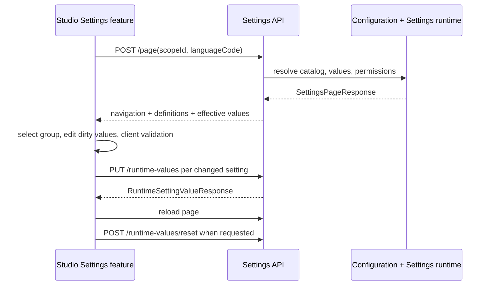

# Пользовательский слой - Settings

## 1. Назначение документа

Документ описывает собственный frontend-сценарий Settings в Studio: получение
страницы, навигацию по каталогу, редактирование значений, validation, reset и
локализацию. Общий shell, route host и UI controls принадлежат [фронтенд-платформе](../12_frontend_platform/06_user_experience.md).

## 2. Frontend-компоненты и границы

| Компонент | Ответственность Settings | Владелец общей инфраструктуры | Источник |
| --- | --- | --- | --- |
| `settingsFeatureProviderDefinition` | Регистрирует feature provider и связывает Settings с configured runtime | фронтенд-платформа feature host | [provider][provider] |
| `SettingsRuntimeView` | Загружает page response, хранит selection/dirty/error state и вызывает API | Settings feature | [view][view] |
| `settingsValueEditorAdapter` | Преобразует JSON value в editor model и выполняет клиентскую validation | Settings feature; controls - фронтенд-платформа | [adapter][adapter] |
| `studio.settings.runtime.view` | Описывает runtime view для Settings feature | Configuration/runtime frontend infrastructure | [runtime view][runtime-view] |
| `studio.settings.runtime.texts` | Содержит локализуемые тексты Settings feature | Frontend localization package | [texts][texts] |

## 3. Основной сценарий

## 4. Состояния интерфейса

| Состояние | Условие | Отображение или действие |
| --- | --- | --- |
| Scope не выбран | Нет `scopeId` в request parameters | Empty state с предложением выбрать scope в контексте Studio |
| Загрузка | API page ещё не вернул ответ | Loading state |
| Каталог недоступен | Ошибка page request без загруженной страницы | Error state и retry |
| Каталог загружен | Есть `navigation` и `settings` | Tree navigation и property grid выбранной группы |
| Есть несохранённые изменения | Dirty values не пусты | Save action активен; при сохранении выполняется validation |
| Значение read-only | `CanEdit`/permission/lifecycle/scope policy запрещают edit | Показывается значение и причина readonly |
| Сброс | Для настройки есть `CanReset` | Reset action удаляет local override и перезагружает страницу |

## 5. Формы и типы значения

Frontend выбирает editor model по `SettingValueType` и получает options для
`SystemEnum` или allowed values из `SettingsPageResponse`. Boolean отображается
как switch/checkbox, enum - как select, JSON - как text area, числовые значения
и строки - как соответствующие controls. Каноническая проверка всё равно
выполняется сервером Settings; клиентская validation улучшает обратную связь и
не является отдельным источником допустимых значений.

## 6. Локализация

API получает `languageCode`, а frontend по умолчанию использует текущую локаль
Studio. Заголовки и descriptions каталога выбираются из `SettingLocalizedText`
через fallback candidates. Тексты самого feature provider находятся в
`studio.settings.runtime.texts`.

## 7. Границы с фронтенд-платформа

Settings не владеет общим Studio shell, маршрутизацией приложения, базовыми
компонентами `TreeView`, `ActionBar`, `LoadingState`, `ErrorState`,
`EmptyState`, общим runtime host и общими правилами CSS. Settings владеет тем,
какие данные передать этим компонентам, как трактовать `CanEdit`/`CanReset` и
какие endpoint вызвать.

## 8. Источники

- [Settings feature provider][provider];
- [Settings view][view];
- [Settings editor adapter][adapter];
- [runtime texts][texts].
[provider]: ../../../src/Frontend/apps/studio/src/features/settings/model/settingsFeatureProviderDefinition.tsx
[view]: ../../../src/Frontend/apps/studio/src/features/settings/model/settingsFeatureProviderDefinition.tsx
[adapter]: ../../../src/Frontend/apps/studio/src/features/settings/model/settingsValueEditorAdapter.tsx
[runtime-view]: ../../../src/Frontend/apps/studio/src/features/settings/runtime/studio.settings.runtime.view.ts
[texts]: ../../../src/Frontend/apps/studio/src/features/settings/runtime/studio.settings.runtime.texts.ts

## История изменений

| Версия | Дата и время | Автор | Раздел | Изменение | Коммит/PR |
|---|---|---|---|---|---|
| 0.1 | 2026-08-27 15:04 +03:00 | Олег Юрьев (@axelprosoft) | Создание документа | подготовлен драфт новой проектной документации на ядро, прикладные модули, а так же термины и общие концептуальные документы | [5ecb26b1](https://github.com/axelprosoft/DMP.PlatformFoundation/commit/5ecb26b1c3ff3cfcdc13018e59526ae684ca6007) |
