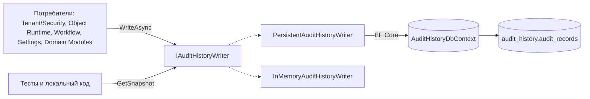

# Архитектура платформенной области - Audit History

## 1. Назначение документа

Документ описывает техническую архитектуру Audit History: прикладной порт,
провайдеры записи, модель хранения и границы с потребителями. Он не является
каталогом всех классов, кодов операций или бизнес-событий.

## 2. Граница и компоненты

`DependencyInjection.AddPlatformAuditHistory` регистрирует `AuditHistoryDbContext`
и `PersistentAuditHistoryWriter`. Средство записи в памяти существует как отдельная
реализация интерфейса для тестовой композиции и напрямую не регистрируется этим
методом.

| Компонент | Ответственность | Зависимости | Подтверждение |
| --- | --- | --- | --- |
| `IAuditHistoryWriter` | Граница записи и чтения снимка для потребителей | `AuditRecord`, выбранная реализация | [`IAuditHistoryWriter`][writer] |
| `PersistentAuditHistoryWriter` | Сериализация и сохранение записи в SQL Server | `AuditHistoryDbContext`, `AuditRecordEntry`, `JsonSerializerOptions` | [`PersistentAuditHistoryWriter`][persistent] |
| `InMemoryAuditHistoryWriter` | Запись в памяти для тестовой или локальной композиции | Список записей и блокировка | [`InMemoryAuditHistoryWriter`][memory] |
| `AuditHistoryDbContext` | Доступ EF Core к таблице записей | SQL Server или EF Core InMemory | [`AuditHistoryDbContext`][db-context] |

## 3. Архитектурная модель и инварианты

| Понятие или архитектурный тип | Техническое имя | Владелец | Связи | Инвариант | Подтверждение |
| --- | --- | --- | --- | --- | --- |
| Общая запись аудита | `AuditRecord` | Audit History | Формируется потребителем и передаётся в `IAuditHistoryWriter` | Содержит обязательные `ActionCode` и `CorrelationId`, а контекст tenant/user может отсутствовать | [`AuditRecord`][record] |
| Детали операции | `AuditRecord.Details` | Потребитель операции | Сериализуются постоянным средством записи в `DetailsJson` | Смысл и структура принадлежат потребителю; общей схемы нет | [`PersistentAuditHistoryWriter`][persistent] |
| Запись хранения | `AuditRecordEntry` | Audit History | Отображает `AuditRecord` в таблицу `audit_records` | Получает новый `Guid`; отдельный межмодульный контракт отсутствует | [`AuditRecordEntry`][record-entry] |

Внутренняя `AuditRecordEntry` добавляет идентификатор хранения `Id` и хранит
`Details` как `DetailsJson`. Она не является межмодульным контрактом.

### 3.2 Инварианты текущего кода

- `ActionCode` и `CorrelationId` нормализуются как обязательные непустые строки;
- `OccurredAtUtc` приводится к `DateTimeKind.Utc` при создании записи хранения;
- пустые `detailsJson` заменяются на `{}`;
- каждый вызов постоянного средства записи создаёт новую запись с новым `Guid`;
- прикладной контракт не задаёт реестр `ActionCode` и схему `Details`;
- код не устанавливает запрет на UPDATE/DELETE на уровне базы данных и не задаёт политику хранения.

## 4. Persistence-модель и хранение

| Данные | Техническое представление | Владелец | Хранение | Ключ или ограничение | Подтверждение |
| --- | --- | --- | --- | --- | --- |
| Запись аудита | `AuditRecordEntry` | Audit History | `audit_history.audit_records` | Первичный ключ `Id uniqueidentifier` | [`AuditRecordEntry`][record-entry] |
| Код операции | `ActionCode` | Потребитель операции | `nvarchar(256)` | Обязательное значение; индекс `ActionCode` | [`AuditHistoryDbContext`][db-context] |
| Контекст tenant и пользователя | `TenantId`, `UserId` | Потребитель контекста | Допускают `NULL`, `uniqueidentifier` | Индекс `(TenantId, OccurredAtUtc)` | [`AuditHistoryDbContext`][db-context] |
| Корреляция и время | `CorrelationId`, `OccurredAtUtc` | Потребитель операции | `nvarchar(128)`, `datetime2` | Оба значения обязательны; индекс `CorrelationId` | [`AuditHistoryDbContext`][db-context] |
| Детали | `DetailsJson` | Потребитель операции | Обязательное `nvarchar(max)` | JSON формируется средством записи; общей схемы нет | [`PersistentAuditHistoryWriter`][persistent] |

При наличии строки подключения `Platform` используется SQL Server. При её
отсутствии `AddPlatformAuditHistory` использует базу EF Core InMemory с
именем из `AuditHistory:InMemoryDatabaseName` или `audit-history` по умолчанию.

## 5. Зависимости и точки расширения

| Зависимость или точка расширения | Назначение | Владелец |
| --- | --- | --- |
| `IAuditHistoryWriter` | Стабильная граница потребителя | Audit History |
| `AuditRecord.Details` | Данные конкретной операции | Потребитель операции |
| `ITenantContext`, `ICorrelationContext`, `IClock` | Контекст, который потребитель передаёт при формировании записи | Foundation / Platform Runtime и потребитель |
| Провайдер EF Core | Реализация хранения | Audit History / композиция host |
| HTTP API чтения и экран просмотра | Расширение, отсутствующее в MVP | Владелец не назначен |

Область не должна получать бизнес-объект или знать его схему. Добавление нового
потребителя требует только формирования `AuditRecord` и регистрации средства записи в
composition root; отдельная запись в Audit History для каждого класса не нужна.

## 6. Технические ограничения

- контракты используют текущую .NET 9 / EF Core реализацию;
- постоянное средство записи выполняет запись и чтение в рамках собственного
  `DbContext`, но не образует общую транзакцию с состоянием потребителя;
- `GetSnapshot` возвращает всю доступную коллекцию, отсортированную по
  `OccurredAtUtc`, без фильтра, пагинации и ограничения размера;
- структура `Details` не проверяется общей схемой;
- отдельные права на чтение записей аудита, политика хранения, архивирование и
  политика неизменяемости на уровне базы данных не реализованы;
- технические журналы и распределённая трассировка не заменяются записями аудита.

### 6.1 Источники

- [проект Audit History][project];
- [модель записи][record-entry];
- [реализация постоянной записи][persistent];
- [DI и выбор провайдера][di];
- [инициализация базы][initializer].

[project]: ../../../src/Platform/DMP.Platform.AuditHistory/
[record]: ../../../src/Platform/DMP.Platform.AuditHistory/Abstractions/AuditRecord.cs
[writer]: ../../../src/Platform/DMP.Platform.AuditHistory/Abstractions/IAuditHistoryWriter.cs
[record-entry]: ../../../src/Platform/DMP.Platform.AuditHistory/Domain/Entities/AuditRecordEntry.cs
[persistent]: ../../../src/Platform/DMP.Platform.AuditHistory/Infrastructure/Persistence/PersistentAuditHistoryWriter.cs
[memory]: ../../../src/Platform/DMP.Platform.AuditHistory/InMemory/InMemoryAuditHistoryWriter.cs
[db-context]: ../../../src/Platform/DMP.Platform.AuditHistory/Infrastructure/Persistence/AuditHistoryDbContext.cs
[di]: ../../../src/Platform/DMP.Platform.AuditHistory/DependencyInjection.cs
[initializer]: ../../../src/Platform/DMP.Platform.AuditHistory/Infrastructure/Persistence/AuditHistoryDatabaseInitializer.cs

## История изменений

| Версия | Дата и время | Автор | Раздел | Изменение | Коммит/PR |
|---|---|---|---|---|---|
| 0.1 | 2026-08-27 15:04 +03:00 | Олег Юрьев (@axelprosoft) | Создание документа | подготовлен драфт новой проектной документации на ядро, прикладные модули, а так же термины и общие концептуальные документы | [5ecb26b1](https://github.com/axelprosoft/DMP.PlatformFoundation/commit/5ecb26b1c3ff3cfcdc13018e59526ae684ca6007) |
