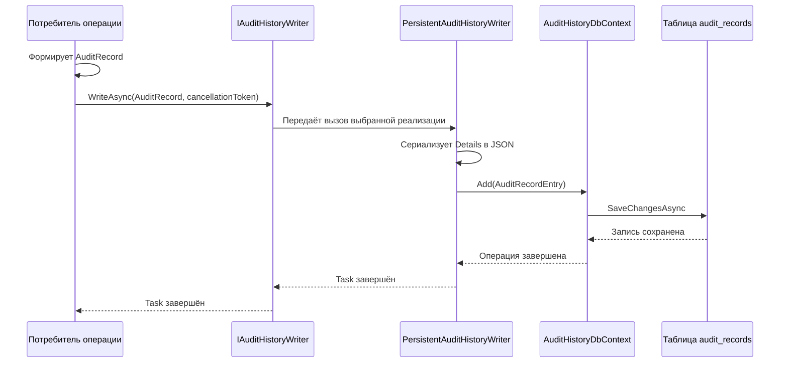

# Поведение во время выполнения - Audit History

## 1. Назначение документа

Документ описывает порядок передачи и сохранения `AuditRecord` во время работы
приложения. Он не определяет, какие бизнес-операции являются значимыми: это
решает вызывающая область.

## 2. Основные сценарии

| Сценарий | Предусловия | Последовательность | Результат | Подтверждение |
| --- | --- | --- | --- | --- |
| Запись в SQL Server | Зарегистрирован `IAuditHistoryWriter`; задана строка подключения `Platform` | Потребитель формирует `AuditRecord`, средство записи сериализует `Details`, создаёт `AuditRecordEntry` и вызывает `SaveChangesAsync` | Запись добавлена в `audit_history.audit_records` | `PersistentAuditHistoryWriter`, `AuditRecordEntry`, `AuditHistoryDatabaseInitializer` |
| Запись в памяти | В композиции зарегистрирован `InMemoryAuditHistoryWriter` | Потребитель передаёт `AuditRecord`; реализация добавляет его в защищённый список | Запись доступна через `GetSnapshot` | `InMemoryAuditHistoryWriter` |
| Чтение снимка | Доступно средство записи с записями | Вызывается `GetSnapshot`; реализация постоянного хранения читает и сортирует строки, реализация хранения в памяти возвращает копию списка | Возвращается коллекция `AuditRecord`; HTTP-представление отсутствует | `IAuditHistoryWriter` и реализации |

Вызов может идти из Tenant/Security, Object Runtime, Workflow, Settings или
прикладного обработчика. Audit History не запускает операцию потребителя и не
вызывает обратно его бизнес-логику.

### 2.1 Реализованные сценарии потребителей

| Потребитель | Подтверждённый сценарий | Пример деталей |
| --- | --- | --- |
| Object Runtime | Успешная операция изменения | объект, тип операции, изменённые поля, маркеры конкурентности; чувствительные значения маскируются по дескриптору |
| Tenant/Security | Часть команд tenant/security/user/role | код операции, tenant/user и детали команды |
| Workflow | Выполнение команды и переназначение экземпляра | идентичность object/workflow, состояние/ревизия и результат |
| Settings | Изменение или сброс настройки времени выполнения | область действия, код модуля/настройки и JSON старого/нового значения |
| General Master Data | Синхронизация базовой единицы номенклатуры | идентичность module/object/record и источник изменения |

Таблица перечисляет найденных потребителей, а не обязательный глобальный
перечень всех операций, которые система должна аудировать.

## 3. Операции и алгоритмы

Потребитель самостоятельно выбирает:

- `ActionCode`;
- tenant и user, если они известны;
- `CorrelationId`;
- время операции;
- объект `Details`.

Например, Object Runtime формирует коды `ObjectRuntime.Create`,
`ObjectRuntime.Update`, `ObjectRuntime.SoftDelete`, `ObjectRuntime.HardDelete`,
`ObjectRuntime.Archive`, `ObjectRuntime.Restore` и `ObjectRuntime.Action`.
Workflow и Settings используют собственные коды. Audit History не проверяет
согласованность этих кодов с каталогом другой области.

| Операция | Вход | Алгоритм | Результат | Ошибки | Потребители |
| --- | --- | --- | --- | --- | --- |
| Формирование записи | Контекст операции и объект `Details` | Потребитель выбирает `ActionCode`, tenant, user, `CorrelationId`, время и детали | Создан `AuditRecord` | При сохранении пустая обязательная строка отклоняется | Tenant/Security, Object Runtime, Workflow, Settings и другие потребители |
| Запись в SQL Server | `AuditRecord` и `CancellationToken` | Сериализовать `Details`, создать `AuditRecordEntry`, вызвать `SaveChangesAsync` | Запись сохранена в `audit_history.audit_records` | `ArgumentException`, ошибка сериализации или БД | `PersistentAuditHistoryWriter` |
| Запись в памяти | `AuditRecord` | Добавить запись в защищённый список | Запись доступна в `GetSnapshot` | `ArgumentNullException` для null-записи | `InMemoryAuditHistoryWriter` |
| Чтение снимка | Доступное средство записи | Прочитать, отсортировать и десериализовать записи | Коллекция `AuditRecord` | Ошибка чтения или десериализации | Тесты и локальный код |

### 3.1 Запись в SQL Server

`PersistentAuditHistoryWriter` сериализует `record.Details` с параметрами
`JsonSerializerDefaults.Web`, создаёт `AuditRecordEntry` с новым `Guid` и вызывает
`SaveChangesAsync`. `AuditRecordEntry.Create` проверяет обязательные строки,
приводит время к UTC и заменяет пустое JSON на `{}`.

Запись выполняется в собственном `AuditHistoryDbContext`. Текущий код не
показывает общей транзакции между этой записью и изменением состояния
потребителя. Если потребитель пишет аудит после сохранения своего состояния,
ошибка записи аудита может возникнуть отдельным шагом.

### 3.2 Чтение снимка

`GetSnapshot` в провайдере постоянного хранения:

1. читает `audit_records` без отслеживания EF Core;
2. сортирует записи по `OccurredAtUtc` по возрастанию;
3. десериализует `DetailsJson` в `JsonElement`;
4. возвращает коллекцию `AuditRecord`.

Провайдер хранения в памяти возвращает копию списка, защищённую от изменения
исходной коллекции. Текущий контракт не задаёт фильтры, пагинацию, limit или
HTTP-представление этого снимка.

## 4. Правила

| Правило | Условие | Результат | Исключение | Подтверждение |
| --- | --- | --- | --- | --- |
| `ActionCode` и `CorrelationId` обязательны | Строка пустая или состоит из пробелов | Создание записи хранения прекращается | `ArgumentException` | `AuditRecordEntry.Create` |
| Время записи нормализуется к UTC | Создаётся `AuditRecordEntry` | `OccurredAtUtc` получает `DateTimeKind.Utc` | Нет отдельного исключения | `AuditRecordEntry.Create` |
| Пустые JSON-детали заменяются | `detailsJson` пуст или состоит из пробелов | В хранение записывается `{}` | Нет отдельного исключения | `AuditRecordEntry.Create` |
| Чувствительные значения Object Runtime маскируются | Элемент дескриптора имеет `IsSensitive = true` | Старое и новое значение заменяются на `[REDACTED]` | Правило не применяется к произвольным деталям других потребителей | `ObjectRuntimeAuditSink` |

## 5. Жизненные циклы

`AuditRecord` проходит односторонний цикл: потребитель формирует запись,
реализация средства записи принимает её, реализация постоянного хранения создаёт
`AuditRecordEntry`, а `GetSnapshot` возвращает представление записи для чтения.
В текущем коде нет операций изменения или удаления записи, но отдельный запрет
на уровне базы данных не установлен.

| Состояние | Переход | Результат |
| --- | --- | --- |
| Запись сформирована потребителем | `WriteAsync` принимает `AuditRecord` | Начинается сохранение выбранной реализацией |
| Запись сохранена | `SaveChangesAsync` завершён или запись добавлена в память | Запись доступна через `GetSnapshot` |
| Ошибка записи | Ошибка сериализации или хранения | Ошибка возвращается потребителю; автоматическое восстановление не выполняется |

## 6. Согласованность

| Изменение | Граница транзакции | Конкуренция | Идемпотентность | Побочные эффекты |
| --- | --- | --- | --- | --- |
| Добавление записи аудита | Собственный `AuditHistoryDbContext`; общей транзакции с состоянием потребителя нет | Отдельная запись получает новый `Guid`; специальная политика конкуренции отсутствует | Повторный вызов создаёт новую запись | Сериализация `Details` и запись в хранилище |
| Чтение снимка | Отдельное чтение из собственного контекста | Читаются доступные на момент запроса записи | Повторное чтение не изменяет хранилище | Возвращается полная коллекция без фильтрации |

## 7. Сбои и восстановление

`ObjectRuntimeAuditSink` получает средство записи через необязательное разрешение
сервиса. Если средство записи отсутствует, sink завершает вызов без записи. Это
не общая политика Audit History и не означает, что аудит обязателен или
необязателен для каждой области: требование определяется владельцем операции и
композицией host.

Автоматическое восстановление после ошибки не реализовано. В текущем MVP не
выполняются:

- автоматическое построение пользовательской временной шкалы;
- создание отдельного хранилища Workflow History из записи аудита;
- публикация интеграционного события на каждую запись;
- повторные попытки/outbox и восстановление записи после сбоя;
- срок хранения, архивирование и удаление по сроку;
- HTTP API чтения, поиск, фильтрация и пагинация.

### 7.1 Источники

- [постоянное средство записи][persistent];
- [средство записи в памяти][memory];
- [Object Runtime sink][runtime-sink];
- [потребитель Workflow][workflow];
- [потребитель Settings][settings].

[persistent]: ../../../src/Platform/DMP.Platform.AuditHistory/Infrastructure/Persistence/PersistentAuditHistoryWriter.cs
[memory]: ../../../src/Platform/DMP.Platform.AuditHistory/InMemory/InMemoryAuditHistoryWriter.cs
[runtime-sink]: ../../../src/Platform/DMP.Platform.Runtime/Application/Services/Core/ObjectRuntimeAuditSink.cs
[workflow]: ../../../src/Platform/DMP.Platform.Workflow/Application/Services/WorkflowRuntimeService.cs
[settings]: ../../../src/Platform/DMP.Platform.Settings/Application/Services/SettingsValueService.cs

## История изменений

| Версия | Дата и время | Автор | Раздел | Изменение | Коммит/PR |
|---|---|---|---|---|---|
| 0.1 | 2026-08-27 15:04 +03:00 | Олег Юрьев (@axelprosoft) | Создание документа | подготовлен драфт новой проектной документации на ядро, прикладные модули, а так же термины и общие концептуальные документы | [5ecb26b1](https://github.com/axelprosoft/DMP.PlatformFoundation/commit/5ecb26b1c3ff3cfcdc13018e59526ae684ca6007) |
