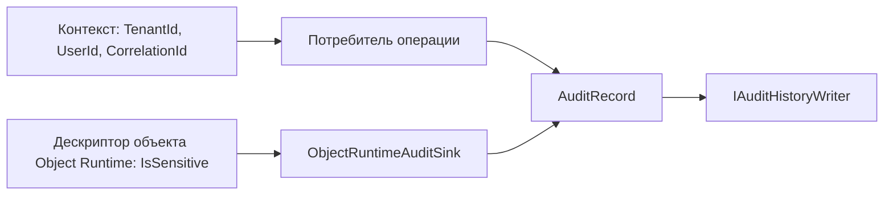

# Безопасность и аудит платформенной области - Audit History

## 1. Назначение документа

Документ описывает, какие контекстные и защитные свойства записи подтверждены
в текущем коде. Audit History принимает уже сформированное решение о праве на
операцию; он не заменяет Tenant/Security и не вводит собственную политику
авторизации для чтения записей.

## 2. Ресурсы и права

`TenantId`, `UserId` и `CorrelationId` помещаются в `AuditRecord` потребителем.
Audit History не извлекает пользователя из HTTP-заголовков и не объявляет
переданное значение доверенным без контекста вызывающей области.

| Ресурс | Действие | Область действия | Политика или роль | Источник решения |
| --- | --- | --- | --- | --- |
| Исходная операция потребителя | Разрешить или отклонить выполнение | Область-потребитель | Политика владельца операции | Tenant/Security или владелец операции |
| `AuditRecord` | Передать для записи | Контекст операции | Audit History принимает переданную запись | `IAuditHistoryWriter` |
| `GetSnapshot` | Прочитать записи | Весь доступный реализации хранения снимок | Отдельное право чтения текущим кодом не задано | `IAuditHistoryWriter`, реализация хранения |
| Значение поля с `IsSensitive = true` | Скрыть в деталях mutation | Object Runtime | `[REDACTED]` вместо старого и нового значения | `ObjectRuntimeAuditSink` |

## 3. Принятие решения и управление

| Вопрос | Подтверждённое состояние |
| --- | --- |
| Кто решает, можно ли выполнить исходную операцию | Tenant/Security или владелец операции |
| Есть ли отдельная HTTP-конечная точка чтения записей аудита | Нет в текущем коде |
| Есть ли отдельное право доступа к чтению записей | Не подтверждено |
| Фильтруются ли записи автоматически по tenant при `GetSnapshot` | Нет; текущий метод возвращает полный снимок провайдера |
| Есть ли политика хранения и запрет удаления по юридическим основаниям (`legal hold`) | Не реализовано и не определено |
| Можно ли считать базу неизменяемой на уровне СУБД | Нет подтверждённого ограничения; средство записи не предоставляет операций обновления и удаления |

Отсутствие API чтения не является разрешением выдавать полный снимок наружу.
Если такой API будет создан, для него потребуются отдельный контракт и политика
владельца доступа.

## 4. Контроли и риски

Для Object Runtime `ObjectRuntimeAuditSink` проверяет `IsSensitive` у элемента
дескриптора объекта и заменяет старое и новое значение на `[REDACTED]`. Это
правило относится к деталям операции изменения Object Runtime. Audit History не может автоматически
очищать произвольный `Details` от Tenant/Security, Workflow, Settings или
Domain Module.

Потребитель отвечает за то, чтобы не передавать в `Details` секреты, пароли,
токены или данные, которые не должны храниться в журнале.

| Угроза | Контроль | Подтверждение | Остаточный риск |
| --- | --- | --- | --- |
| Секрет или пароль попадает в детали mutation | Проверка `IsSensitive` и замена значения на `[REDACTED]` | `ObjectRuntimeAuditSink` | Произвольные `Details` других потребителей автоматически не очищаются |
| Полный снимок выдаётся без ограничения tenant | HTTP API чтения отсутствует; `GetSnapshot` не фильтрует записи | `IAuditHistoryWriter.GetSnapshot` | Будущий API должен определить право и область фильтрации |
| Запись воспринимается как доказательство неизменяемого журнала | Документы явно фиксируют отсутствие DB-политики неизменяемости | `AuditRecordEntry` и схема БД | Требуется отдельная политика защиты хранения |

## 5. Аудит

| Вид данных | Назначение | Владелец |
| --- | --- | --- |
| Запись аудита | Контроль значимой операции и расследование | Audit History хранит; потребитель задаёт смысл |
| История Workflow | История переходов и команд Workflow | Workflow |
| История бизнес-объекта | Понятная пользователю история объекта | Domain Module или отдельный владелец функции |
| Техническая трассировка | Диагностика выполнения и производительности | Observability / Platform Operations |
| Интеграционное событие | Передача факта между компонентами | Integration Events |

| Операция, создающая запись аудита | Инициатор | Контекст | Запись | Покрытие | Подтверждение |
| --- | --- | --- | --- | --- | --- |
| Изменение объекта Object Runtime | Object Runtime | tenant, пользователь, `CorrelationId`, дескриптор | `AuditRecord` с `ObjectMutationAuditDetails` | Подтверждено для проверенного сценария | `ObjectRuntimeAuditSink`, интеграционный тест Object Runtime |
| Команда Tenant/Security | Tenant/Security | Контекст вызывающей команды | `AuditRecord` | Подтверждено для проверенных команд | Интеграционные тесты Tenant/Security |
| Команда Workflow или изменение Settings | Workflow или Settings | Контекст соответствующей области | `AuditRecord` | Подтверждено для проверенных сценариев | Интеграционные тесты Workflow и Settings |
| Пользовательский просмотр аудита | Не найден | Нет | Запись не формируется отдельным экраном просмотра | Не подтверждено | Контроллер, маршрут и интерфейс не найдены |

## 6. Покрытие и пробелы

- не описывать записи аудита как полный неизменяемый журнал соответствия требованиям;
- не объявлять наличие записи гарантированным для каждой команды системы;
- не использовать `AuditRecord` как замену решению о доступе или интеграционному
  событию;
- не публиковать `Details` через новый канал без отдельной проверки доступа и
  маскирования.

### 6.1 Источники

- [запись аудита][record];
- [маскирование Object Runtime][runtime-sink];
- [потребитель Tenant/Security][tenant];
- [интеграционные тесты][tests].

[record]: ../../../src/Platform/DMP.Platform.AuditHistory/Abstractions/AuditRecord.cs
[runtime-sink]: ../../../src/Platform/DMP.Platform.Runtime/Application/Services/Core/ObjectRuntimeAuditSink.cs
[tenant]: ../../../src/Platform/DMP.Platform.TenantSecurity/Application/Services/TenantSecurityService.cs
[tests]: ../../../tests/DMP.Platform.IntegrationTests/

## История изменений

| Версия | Дата и время | Автор | Раздел | Изменение | Коммит/PR |
|---|---|---|---|---|---|
| 0.1 | 2026-08-27 15:04 +03:00 | Олег Юрьев (@axelprosoft) | Создание документа | подготовлен драфт новой проектной документации на ядро, прикладные модули, а так же термины и общие концептуальные документы | [5ecb26b1](https://github.com/axelprosoft/DMP.PlatformFoundation/commit/5ecb26b1c3ff3cfcdc13018e59526ae684ca6007) |
