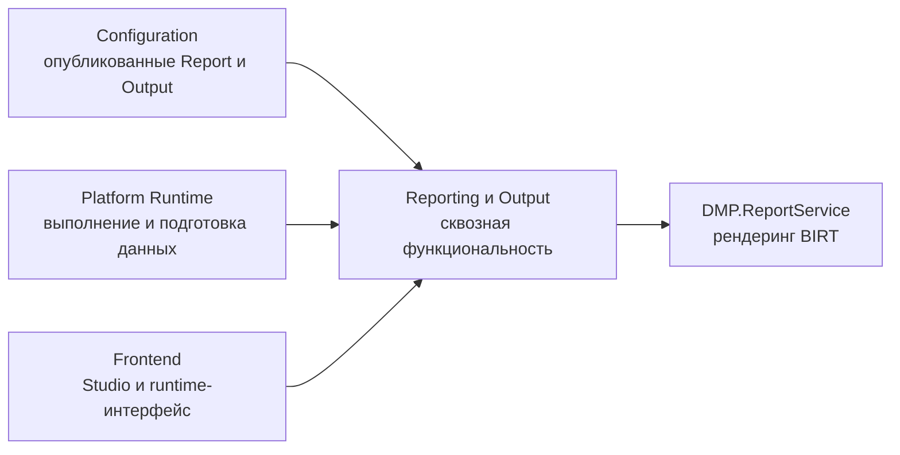

# Обзор платформенной области — Reporting и Output

## 1. Назначение области

Эта область описывает сквозную функциональность формирования отчётного результата:
получение опубликованных определений, выполнение набора данных, подготовку
входных файлов и рендеринг результата. В исходниках нет отдельной сборки
`DMP.Platform.ReportingOutput`; функциональность распределена между
Configuration, Runtime, Java-сервисом `DMP.ReportService` и frontend.

Область не владеет схемами конфигурационных артефактов `Report` и `Output`.
Они описаны в [Configuration report](../02_configuration/artifact_types/report.md)
и [Configuration output](../02_configuration/artifact_types/output.md).

Русские и английские термины этой области собраны в
[тематическом глоссарии](../../11_glossary/reporting_output_terms.md).

## 2. Место в платформе

Общая карта межмодульных взаимодействий находится в
[интеграционной архитектуре](../../02_architecture/07_integration_architecture.md).
Здесь приведена только локальная схема ответственности.

## 3. Основные возможности

| Возможность | Что делает | Текущая граница |
| --- | --- | --- |
| Операции подготовки отчёта | Генерируют схему (`schema`), пример XML (`sample XML`) и design по умолчанию (`default design`) для `Report` | Операции выполняются в Configuration и здесь только маршрутизируются |
| Импорт и экспорт design | Импортируют и экспортируют пакет design (`design bundle`), проверяют design и создают сеанс preview (`preview session`) | Контракт принадлежит Configuration; preview обслуживает `DMP.ReportService` |
| Формирование runtime-результата | Разрешает опубликованный `Output`, выполняет связанный `Report` и возвращает результат | Текущий путь поддерживает `SourceType = Report` |
| Рендеринг | Преобразует подготовленные файлы `design`, `schema` и `data` в результат | Подтверждены `Pdf` и `Excel` на пути исполнения; Java-сервис также знает `Html`, но это не означает поддержку полного пути |
| Выдача результата | Возвращает бинарный результат вызывающему клиенту | Подтверждены `Download` и `Inline`; внешняя доставка не подтверждена |

## 4. Ключевые решения

| Решение | Правило |
| --- | --- |
| Владелец схем | `Report` и `Output` остаются конфигурационными артефактами Configuration |
| Владелец исполнения | Формирование runtime-результата описывается в этой области; объектный runtime не владеет моделью отчёта |
| Источник данных | Runtime получает данные через application-порт набора данных; конкретная семантика Dataset не определяется этой областью |
| Публикация | Runtime использует опубликованные определения; draft не является входом обычной генерации |
| Сервис рендеринга | `DMP.ReportService` принимает файлы design, schema и data и возвращает бинарный результат |

## 5. Зависимости

| Область или компонент | Назначение зависимости | Владелец определения |
| --- | --- | --- |
| [Configuration](../02_configuration/00_platform_overview.md) | Схемы `Report`/`Output`, ссылки на содержимое (`ContentRef`), публикация и операции подготовки design | Configuration |
| [Object Runtime](../03_object_runtime/00_platform_overview.md) | Контекст объекта и runtime-представление launch binding | Object Runtime; исполнение output — эта область |
| [Tenant/Security](../01_tenant_and_security/00_platform_overview.md) | Tenant/Site context и проверка permission | Tenant/Security |
| [Frontend Platform](../12_frontend_platform/00_platform_overview.md) | Общая оболочка, маршрутизация и инфраструктура рендеринга | Frontend Platform |
| `DMP.ReportService` | HTTP API рендеринга BIRT и preview | Report Service |

## 6. Статус реализации

| Функциональность | Состояние по текущим исходникам |
| --- | --- |
| Операции подготовки Configuration | Подтверждены генерация, публикация контракта, импорт/экспорт, проверка design и сеанс preview |
| Формирование runtime-результата | Подтверждён путь `GenerateOutput` для опубликованных `Report`/`Output` |
| Форматы | В полном runtime-пути подтверждены `Pdf` и `Excel` |
| Внешняя доставка, расписание и фоновые задания | Не подтверждены текущим контрактом |

## 7. Состав документов

| Документ | Назначение |
| --- | --- |
| [`01_scope.md`](01_scope.md) | Границы и владельцы |
| [`02_architecture.md`](02_architecture.md) | Компоненты, модели и хранение |
| [`03_contracts.md`](03_contracts.md) | HTTP, DTO, application-порты и контракт рендеринга |
| [`04_runtime.md`](04_runtime.md) | Операции подготовки design и runtime-сценарии |
| [`05_security_and_audit.md`](05_security_and_audit.md) | Права, контекст и аудит |
| [`06_user_experience.md`](06_user_experience.md) | Studio и runtime-интерфейс в части Reporting/Output |
| [`07_quality.md`](07_quality.md) | Проверки, надёжность и пробелы |
| [`08_operations.md`](08_operations.md) | Запуск, диагностика и восстановление |
| [`90_traceability.md`](90_traceability.md) | Источники, решения и маршруты будущих работ |

## История изменений

| Версия | Дата и время | Автор | Раздел | Изменение | Коммит/PR |
|---|---|---|---|---|---|
| 0.1 | 2026-08-27 15:04 +03:00 | Олег Юрьев (@axelprosoft) | Создание документа | подготовлен драфт новой проектной документации на ядро, прикладные модули, а так же термины и общие концептуальные документы | [5ecb26b1](https://github.com/axelprosoft/DMP.PlatformFoundation/commit/5ecb26b1c3ff3cfcdc13018e59526ae684ca6007) |
