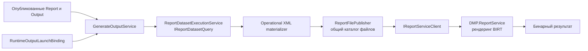

# Архитектура платформенной области — Reporting и Output

## 1. Назначение документа

Документ описывает архитектурно значимые компоненты функциональности Reporting/Output,
их связи, данные и ограничения. Каталог всех C#-классов и методов сюда не входит.

## 2. Граница и компоненты

| Компонент | Ответственность | Зависимости | Подтверждение |
| --- | --- | --- | --- |
| `RuntimeReportDefinitionProvider` | Возвращает опубликованные `Report`/`Output` и содержимое design | Опубликованные и effective-данные Configuration | [RuntimeReportDefinitionProvider.cs](../../../src/Hosts/DMP.Platform.Api/Composition/RuntimeReportDefinitionProvider.cs) |
| `GenerateOutputService` | Проверяет вход, permission, определение, формат и способ выдачи; координирует выполнение | Контекст Tenant, провайдер определений, исполнение запроса данных, сервис рендеринга | [GenerateOutputService.cs](../../../src/Platform/DMP.Platform.Runtime/Application/Services/Reports/GenerateOutputService.cs) |
| `ReportDatasetExecutionService` | Получает строки через `IReportDatasetQuery` | Провайдер набора данных и запроса чтения | [ReportDatasetExecutionService.cs](../../../src/Platform/DMP.Platform.Runtime/Application/Services/Reports/ReportDatasetExecutionService.cs), [IReportDatasetExecution.cs](../../../src/Platform/DMP.Platform.Runtime/Application/Abstractions/Reports/IReportDatasetExecution.cs) |
| `ReportOperationalXmlMaterializer` | Преобразует результат набора данных в операционный XML | Поля отчёта, identity XML, контекст запроса | [ReportOperationalXmlMaterializer.cs](../../../src/Platform/DMP.Platform.Runtime/Application/Services/Reports/ReportOperationalXmlMaterializer.cs) |
| `ReportFilePublisher` | Размещает файлы `design`, `schema` и `data` в общем каталоге | `ReportFilesRootOptions` | [ReportFilePublisher.cs](../../../src/Platform/DMP.Platform.Runtime/Application/Services/Reports/ReportFilePublisher.cs) |
| `ReportServiceClient` | Вызывает Java-сервис рендеринга и сопоставляет ответы и ошибки | `IReportServiceClient`, `ReportServiceOptions` | [ReportServiceClient.cs](../../../src/Platform/DMP.Platform.Runtime/Application/Services/Reports/ReportServiceClient.cs) |
| `DMP.ReportService` | Читает файлы, выполняет рендеринг BIRT и preview | Общий каталог файлов отчётов, token preview | [Report Service](../../../src/Services/DMP.ReportService/) |

## 3. Архитектурная модель и инварианты

| Понятие или архитектурный тип | Техническое имя | Владелец | Связи | Инвариант | Подтверждение |
| --- | --- | --- | --- | --- | --- |
| Определение отчёта | `Report` | Configuration | Используется `Output` и runtime provider | Для обычного runtime-пути выбирается опубликованное определение | [GenerateOutputService.cs](../../../src/Platform/DMP.Platform.Runtime/Application/Services/Reports/GenerateOutputService.cs), [схема Report](../../../src/Platform/DMP.Platform.Configuration/Domain/Schemas/ReportArtifactSchemas.cs) |
| Определение результата | `Output` | Configuration | Ссылается на `Report` через `SourceCode` | В текущем пути поддерживается только `SourceType = Report` | [GenerateOutputService.cs](../../../src/Platform/DMP.Platform.Runtime/Application/Services/Reports/GenerateOutputService.cs) |
| Контекст выполнения | `GenerateOutputContext` | Runtime contracts | Содержит контекст модуля, объекта, представления, фильтра, языка и запроса | `ModuleCode` и `ObjectTypeCode` обязательны для запуска | [GenerateOutputRequest.cs](../../../src/Platform/DMP.Platform.Contracts/Runtime/Requests/GenerateOutputRequest.cs) |
| Подготовленные данные | Operational XML | Reporting/Output runtime | Формируется из выполнения запроса набора данных и передаётся сервису рендеринга | Для известного кода отчёта должна быть определена XML identity | [ExecuteReportService.cs](../../../src/Platform/DMP.Platform.Runtime/Application/Services/Reports/ExecuteReportService.cs) |
| Рендеринг | `RenderReportRequest` | `DMP.ReportService` | Получает имена файлов `design`, `schema`, `data` и формат | Имена файлов проверяются по допустимому расширению и не содержат путь | [RenderReportRequest.java](../../../src/Services/DMP.ReportService/src/main/java/com/dmp/reportservice/api/dto/RenderReportRequest.java) |
| Результат | `GenerateOutputResponse` / двоичный HTTP-ответ | Runtime / Report Service | Возвращается клиенту с типом содержимого, именем файла и идентификатором запроса | Пустой результат сервиса рендеринга считается ошибкой | [GenerateOutputResponse.cs](../../../src/Platform/DMP.Platform.Contracts/Runtime/Responses/GenerateOutputResponse.cs), [ReportServiceClient.cs](../../../src/Platform/DMP.Platform.Runtime/Application/Services/Reports/ReportServiceClient.cs) |

Каноническая модель `Report`/`Output`, их свойства схемы и записи хранения
остаётся в [Configuration](../02_configuration/02_architecture.md). Здесь описывается
только использование этой модели для исполнения.

## 4. Persistence-модель и хранение

| Данные | Техническое представление | Владелец | Хранение | Ключ или ограничение | Подтверждение |
| --- | --- | --- | --- | --- | --- |
| Опубликованные определения | Проекция провайдера runtime | Configuration | Хранилище Configuration | По `ModuleCode`, `ObjectTypeCode`, `ReportCode`/`OutputCode`, Tenant/Site context | [RuntimeReportDefinitionProvider.cs](../../../src/Hosts/DMP.Platform.Api/Composition/RuntimeReportDefinitionProvider.cs) |
| Содержимое design и schema | Ссылки на содержимое blob | Configuration | Хранилище содержимого Configuration | Ссылка на содержимое и hash; `design`/`schema` не являются свойствами runtime | [Операции design Configuration](../../../src/Platform/DMP.Platform.Configuration/Application/Services/Reports/ReportDesignOperationsApplicationService.cs) |
| Операционный XML | Временный файл данных | Reporting/Output runtime | Общий `ReportFilesRootOptions.RootPath` | Удаляется по TTL; файлы `design` и `schema` не удаляются этой очисткой | [ReportFilesRootOptions.cs](../../../src/Platform/DMP.Platform.Runtime/Application/Options/ReportFilesRootOptions.cs), [ReportFilePublisher.cs](../../../src/Platform/DMP.Platform.Runtime/Application/Services/Reports/ReportFilePublisher.cs) |
| Сформированный результат | Байты в HTTP-ответе | Report Service / Runtime | В постоянное хранилище области не записывается | Возвращается с `Content-Type`, именем файла и идентификатором запроса | [ReportController.java](../../../src/Services/DMP.ReportService/src/main/java/com/dmp/reportservice/api/ReportController.java), [GenerateOutputResponse.cs](../../../src/Platform/DMP.Platform.Contracts/Runtime/Responses/GenerateOutputResponse.cs) |

Эта область не вводит отдельную таблицу Reporting/Output. Физическое размещение
Configuration entries и content blobs описывается владельцем Configuration.

## 5. Зависимости и точки расширения

| Порт или зависимость | Назначение | Кто предоставляет | Ограничение |
| --- | --- | --- | --- |
| `IRuntimeReportDefinitionProvider` | Получение опубликованных определений и содержимого | Адаптер host/runtime | Не должен возвращать draft для обычной генерации |
| `IReportDatasetQuery` | Получение данных для отчёта | Runtime или владелец Dataset | Семантика набора данных не определяется Reporting/Output |
| `IRuntimeOutputLaunchBindingMaterializer` | Проекция launch binding для View/context | Адаптер host/Object Runtime | Binding не является схемой `Output` |
| `IReportServiceClient` | Синхронный рендеринг через HTTP | Runtime | Текущий контракт возвращает один бинарный результат |
| `IReportFilePublisher` | Доступ сервиса рендеринга к подготовленным файлам | Runtime | Каталог должен быть доступен Java Report Service |
| `ReportServiceOptions` | URL, секрет preview, TTL и timeout | Конфигурация host | Timeout runtime должен согласовываться с Report Service |

## 6. Технические ограничения

- В исходниках нет отдельной сборки Reporting/Output; компоненты находятся в
  Configuration, Runtime, `DMP.ReportService` и frontend.
- Полный маршрут исполнения подтверждает `Pdf` и `Excel`. Enum `Html` в Java-сервисе
  нельзя считать гарантией поддержки HTML через `GenerateOutput`.
- Operational XML identity сейчас разрешается только для зарегистрированных
  report codes; неизвестный code останавливает выполнение.
- Синхронный рендеринг зависит от доступности Java-сервиса и общего каталога файлов.
- Стратегия retry, replay, фонового выполнения и внешней доставки не установлена
  этим документом; она отражена в трассировке как будущая работа.

## История изменений

| Версия | Дата и время | Автор | Раздел | Изменение | Коммит/PR |
|---|---|---|---|---|---|
| 0.1 | 2026-08-27 15:04 +03:00 | Олег Юрьев (@axelprosoft) | Создание документа | подготовлен драфт новой проектной документации на ядро, прикладные модули, а так же термины и общие концептуальные документы | [5ecb26b1](https://github.com/axelprosoft/DMP.PlatformFoundation/commit/5ecb26b1c3ff3cfcdc13018e59526ae684ca6007) |
