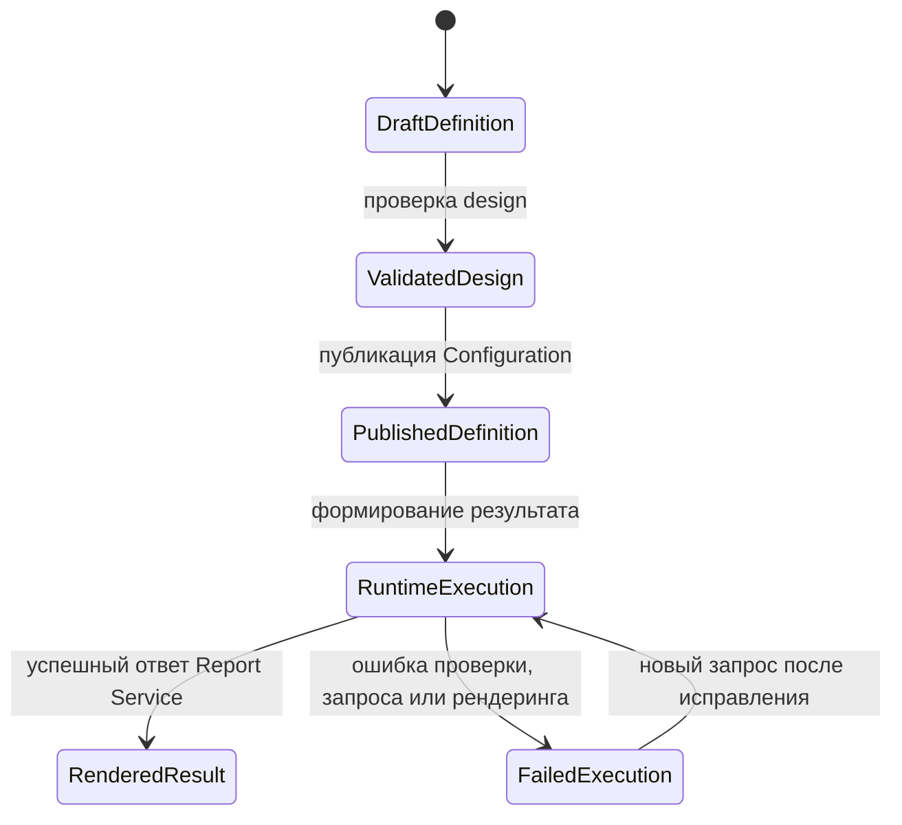

# Runtime и сценарии — Reporting и Output

## 1. Назначение документа

Документ описывает порядок операций подготовки design и исполнения. Поля схемы `Report`
и `Output` остаются в [типах артефактов Configuration](../02_configuration/artifact_types/).

## 2. Основные сценарии

| Сценарий | Предусловия | Последовательность | Результат | Подтверждение |
| --- | --- | --- | --- | --- |
| Генерация контракта отчёта | `Report` и его поля доступны в версии конфигурации | Configuration строит schema/sample | Артефакт и issues | [ReportContractController](../../../src/Platform/DMP.Platform.Configuration/Api/Controllers/ReportContractController.cs) |
| Импорт design | Есть `Report.Design` и содержимое XML | Проверить XML → при наследовании создать local override → сохранить ссылку и hash содержимого | Design связан с текущим draft | [ReportDesignOperationsApplicationService](../../../src/Platform/DMP.Platform.Configuration/Application/Services/Reports/ReportDesignOperationsApplicationService.cs) |
| Preview design | Содержимое design и секрет preview настроены | Создать session → вернуть URL/expiry → Report Service отдаёт HTML по session/token | Временный preview | Configuration и Java API preview |
| Формирование runtime-результата | Доступны опубликованные Output/Report, Dataset и Report Service | Разрешить → проверить права → запросить данные → создать XML → разместить файлы → выполнить рендеринг → выдать результат | Ответ PDF/Excel | `GenerateOutputService` |

## 3. Операции и алгоритмы

### 3.1. Формирование runtime-результата

1. Получить `OutputCode` и обязательные `ModuleCode`/`ObjectTypeCode`.
2. Разрешить язык и найти опубликованный `Output` с контекстом Tenant/Site.
3. Если задан `PermissionCode`, выполнить проверку прав.
4. Проверить `SourceType = Report` и найти опубликованный `Report`.
5. Объединить значения параметров из сопоставлений и `manualParameters`.
6. Выполнить запрос Dataset с полями отчёта и effective-фильтрами.
7. Материализовать операционный XML.
8. Разместить файлы `design`, `schema` и XML в общем каталоге файлов.
9. Вызвать `POST /api/reports/render`.
10. Вернуть содержимое, тип содержимого, имя файла, способ выдачи и идентификатор запроса.

### 3.2. Операции подготовки design

Configuration генерирует schema, sample XML и default design для текущей
версии конфигурации. Design можно импортировать или экспортировать пакетом,
проверить и использовать для preview. Эти операции изменяют содержимое
конфигурации только через application-сервисы Configuration; формирование
runtime-результата использует их результат после публикации.

## 4. Правила

| Правило | Условие | Результат | Исключение | Подтверждение |
| --- | --- | --- | --- | --- |
| Использовать опубликованные определения | Обычное исполнение | Берётся опубликованный Output и Report | Не найдено опубликованное определение | [IRuntimeReportDefinitionProvider](../../../src/Platform/DMP.Platform.Runtime/Application/Abstractions/Reports/RuntimeOutputEngineModels.cs) |
| Разрешать только Report source | `Output.SourceType` задан | Выполняется связанный Report | Другое значение → `OutputSourceNotSupported` | [GenerateOutputService](../../../src/Platform/DMP.Platform.Runtime/Application/Services/Reports/GenerateOutputService.cs) |
| Поддерживать форматы MVP | `Output.Format` задан | `Pdf` или `Excel` передаются сервису рендеринга | Другой формат → `OutputFormatUnsupported` | [ReportOutputFormatMapper](../../../src/Platform/DMP.Platform.Runtime/Application/Services/Reports/ReportOutputFormatMapper.cs) |
| Ограничивать способ выдачи | `DeliveryMode` пуст или равен `Download`/`Inline` | Результат возвращается HTTP-клиенту | Другое значение → `OutputDeliveryModeUnsupported` | `GenerateOutputService` |
| Требовать identity операционного XML | Исполняется код отчёта | Материализуется известный XML-контракт | Неизвестный код → `ReportOperationalXmlIdentityUnknown` | [ExecuteReportService](../../../src/Platform/DMP.Platform.Runtime/Application/Services/Reports/ExecuteReportService.cs) |

## 5. Жизненные циклы

Публикация конфигурации и выполнение output — разные операции. Создание или
изменение draft не делает его доступным для обычного runtime-пути.

## 6. Согласованность

| Изменение | Граница транзакции | Конкуренция | Идемпотентность | Побочные эффекты |
| --- | --- | --- | --- | --- |
| Сохранение design и ссылок на содержимое | Граница application-сервиса Configuration | Определяется Configuration | Повторный импорт зависит от hash содержимого | Создание или обновление blob |
| Формирование runtime-результата | Несколько чтений и HTTP-вызов | Общая транзакция не распространяется на сервис рендеринга | Повтор может повторно выполнить запрос и рендеринг | Временный файл данных и внешний HTTP |
| Удаление временных файлов данных | Очистка `FilePublisher` | Очистка по TTL | Повторная очистка допустима | Файлы `design` и `schema` не удаляются этим правилом |

## 7. Сбои и восстановление

Ошибки определения исправляются публикацией корректной конфигурации. Ошибки
файлового каталога требуют восстановления общего доступа. Ошибка доступности
Java-сервиса требует проверки readiness и настроек `BaseUrl`; автоматическая
повторная отправка запроса этим контрактом не гарантируется.

## История изменений

| Версия | Дата и время | Автор | Раздел | Изменение | Коммит/PR |
|---|---|---|---|---|---|
| 0.1 | 2026-08-27 15:04 +03:00 | Олег Юрьев (@axelprosoft) | Создание документа | подготовлен драфт новой проектной документации на ядро, прикладные модули, а так же термины и общие концептуальные документы | [5ecb26b1](https://github.com/axelprosoft/DMP.PlatformFoundation/commit/5ecb26b1c3ff3cfcdc13018e59526ae684ca6007) |
